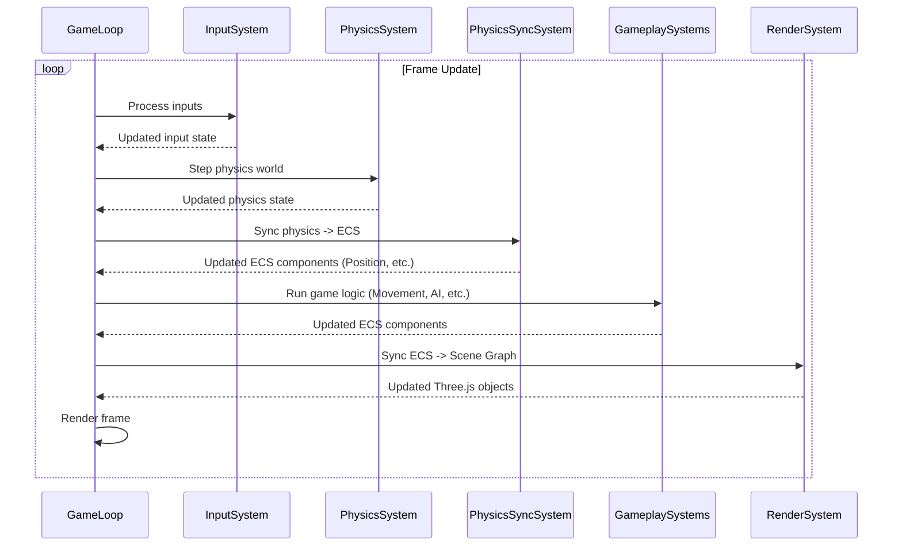

# ECS Integration (bitecs)

This document explains the integration and usage of the `bitecs` Entity Component System (ECS) library in the Vibe Coder 3D core framework.

## Overview

- **Library:** Uses the `bitecs` library for high-performance ECS.
- **World Setup:** A single `bitecs` world instance is created and managed, initialized in `src/core/lib/ecs.ts`.
- **Philosophy:** Aims for data-oriented design, separating data (components) from logic (systems).

## Core Components

- **Location:** Core components are defined in `src/core/lib/ecs.ts`, including:

  - `Transform`: Stores position, rotation, scale, and a needsUpdate flag
  - `Velocity`: Stores linear and angular velocity, plus damping factors

- **Additional Components:** Some systems define their own components, like `PhysicsBodyRef` in `src/core/systems/PhysicsSyncSystem.ts` which links ECS entities to physics bodies.

- **Schema:** Components are defined using `bitecs` schema (e.g., `Transform = defineComponent({ position: [Types.f32, 3], rotation: [Types.f32, 4], scale: [Types.f32, 3], needsUpdate: Types.ui8 })`).

- **Usage:** Components can be added, removed, and checked using functions in `useECS` hook or directly from `bitecs` (e.g., `addComponent`, `removeComponent`, `hasComponent`).

## Core Systems

- **Location:** Implemented as functions in `src/core/systems`.
- **Examples:**
  - `PhysicsSyncSystem`: Synchronizes Rapier physics bodies with ECS components
  - Other systems might include `MovementSystem` (updates `Position` based on `Velocity`), `RenderSystem` (updates Three.js object transforms based on ECS components)
- **Execution:** Systems are executed in a defined order within the game loop, managed by a central function.

## Core Hooks

- **Location:** Defined in `src/core/hooks/useECS.ts`.
- **Main Hook:** `useECS()`: Provides access to the ECS world and helper functions:
  - Entity management: `createEntity`, `destroyEntity`
  - Component operations: `addComponent`, `removeComponent`, `hasComponent`
  - Query management: `createQuery`, `findEntities`
- **Additional Hooks:**
  - `useECSQuery`: For querying entities with specific components
  - `useEntityComponent`: For accessing component data for a specific entity

## Usage Patterns

- **Queries:** Use `defineQuery` from `bitecs` to efficiently retrieve entities possessing specific components.
- **Game Logic:** Game-specific logic should primarily reside in custom systems. Game-specific components extend the core set.
- **React Components:** React components like `PhysicsTrigger` can integrate with the ECS by creating entities and registering with relevant systems.

## Debugging

- **Utilities:** Plan to add utilities to inspect entity components and system performance. Potentially integrate with browser dev tools or an in-game console.

## System Execution Order

Systems are executed in a defined order within the game loop to ensure correct data flow (e.g., process input, update physics, sync physics state to ECS, update game logic, render).

