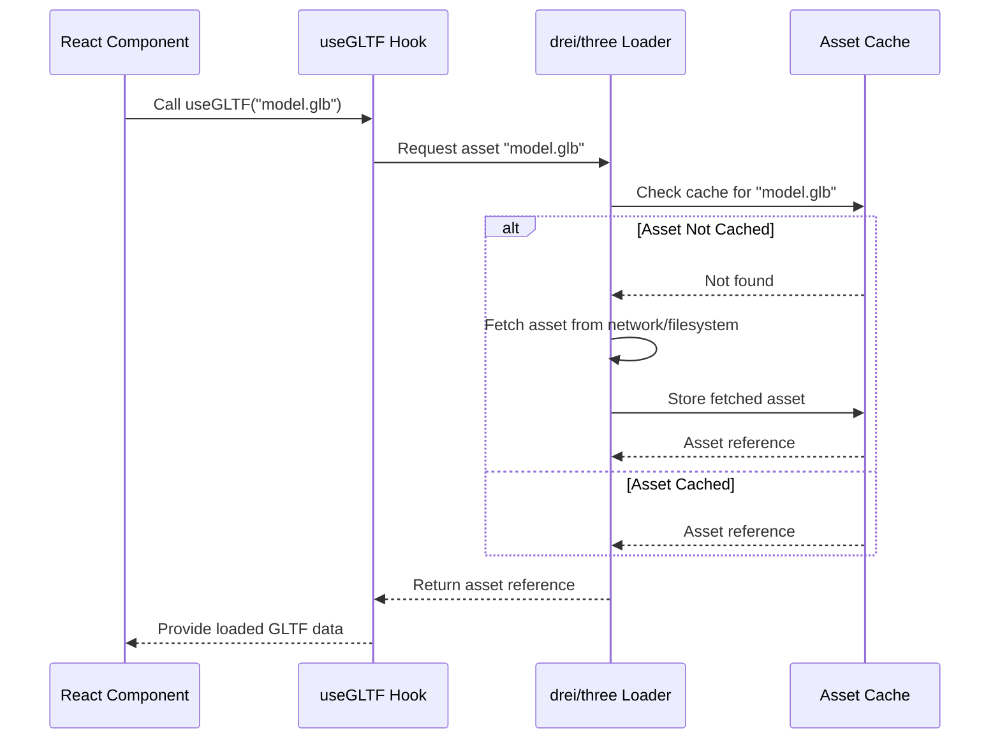

# Asset Management

This document outlines the approach for loading and managing game assets.

## Overview

- **Goal:** Provide a consistent way to load various asset types (3D models, textures, audio files, etc.).
- **Implementation:** Primarily leverages helpers from `@react-three/drei` and potentially custom utilities in `src/core/lib/assets.ts`.

## Supported Formats

- **Models:** GLTF (`.gltf`, `.glb`) is the preferred format. Mention DRACO compression support via `drei`.
- **Textures:** Standard web formats (JPG, PNG, WebP). Mention support for KTX2/Basis Universal via `drei`.
- **Audio:** Formats supported by `howler.js` (MP3, OGG, WAV, etc.).
- **Other:** JSON, etc.

## Loading Mechanisms

- **`useGLTF`, `useTexture`, etc.:** Describe the usage of `drei` hooks for declarative asset loading within components.
- **Preloading:** Explain the strategy for preloading critical assets (e.g., using `drei`'s `<Loader />` or a custom preloading scene).
- **Asset Cache:** Mention that `drei` and `three` handle caching internally.

## Asset Organization

- **Location:** Recommend a standard directory structure (e.g., `public/assets/models`, `public/assets/textures`).

## Usage

- Provide examples of loading and using models and textures in R3F components.

## Loading Sequence Example (using drei hook)

