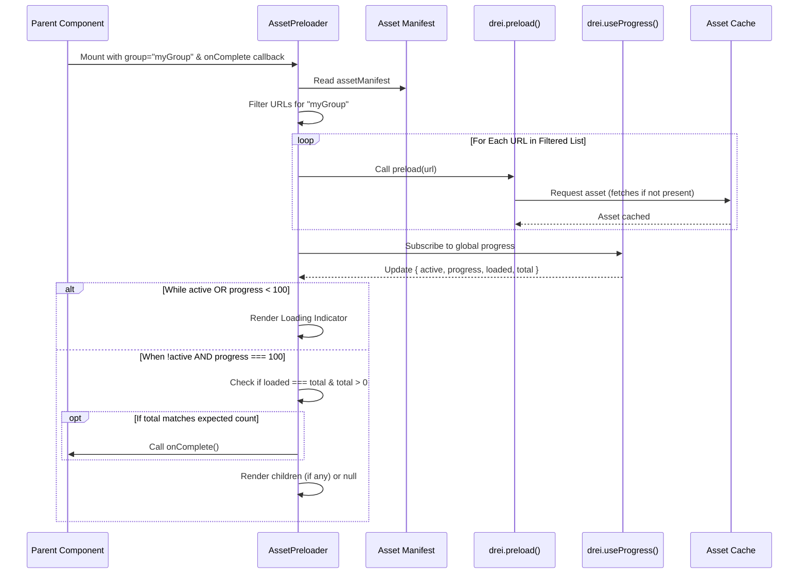
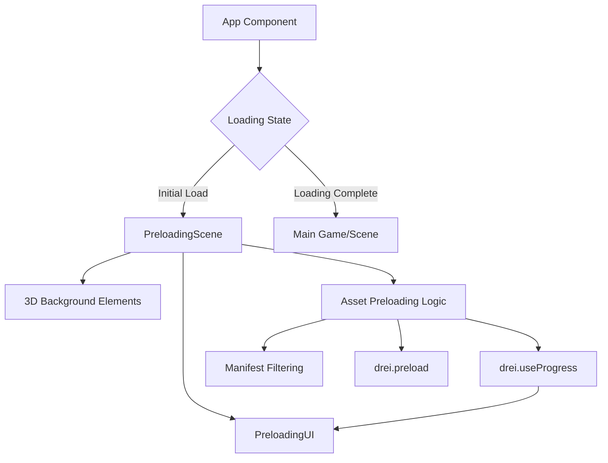
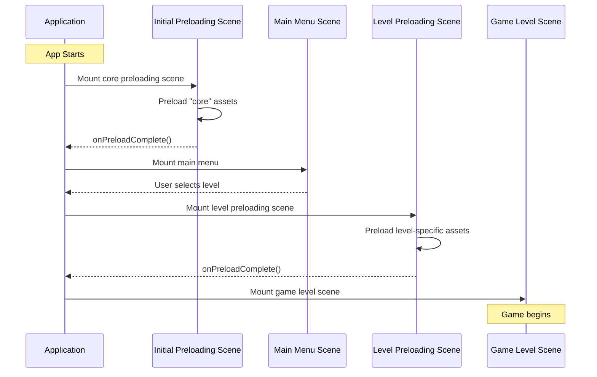

# Asset Preloading System

This document outlines the proposed system for preloading game assets to improve loading times and user experience.

## Findings from Codebase Exploration

1.  **Asset Manifest:** Assets are centrally defined in `src/config/assets/index.ts` using an `AssetKeys` enum and a typed `AssetManifest` (`src/core/types/assets.ts`). Each entry contains the asset's `key`, `type`, `url` (pointing to `public/assets/`), and optional `config`.
2.  **Loading Hook:** Assets are primarily loaded via the `useAsset(key)` hook (`src/core/hooks/useAsset.ts`), which utilizes `@react-three/drei`'s `useGLTF` and `useTexture` based on the manifest `type`. It relies on `<Suspense>`.
3.  **Caching:** `@react-three/drei`'s hooks provide built-in caching based on asset URLs. The `useAsset` hook leverages this implicitly.
4.  **Existing Preload Mention:** `docs/architecture/assets/assets-overview.md` suggests using `drei`'s preloading capabilities (`<Loader />` or other methods) by feeding URLs from the manifest.
5.  **Asset Locations:** Processed assets reside in `public/assets/`, organized by type (models, textures). Source assets are in `source_models/`.
6.  **Preparation Script:** `yarn prepare-models` handles copying textures and potentially optimizing models from source locations to the public directory.

## Proposed Preloading System

The proposed system leverages the existing asset manifest and `@react-three/drei`'s preloading utilities.

### 1. Asset Grouping

- **Goal:** Categorize assets based on when they should be preloaded.
- **Implementation:**
  - Add an optional `preloadGroup?: string | string[]` field to the `IBaseAssetMetadata` interface in `src/core/types/assets.ts`.
  - Assign assets to relevant groups in their metadata definition files (e.g., in `src/config/assets/`).
  - **Example Groups:** `"core"` (essential UI, common assets), `"scene:mainMenu"`, `"scene:level1"`, `"playerCharacter"`.

```typescript
// src/core/types/assets.ts
export interface IBaseAssetMetadata {
  key: AssetKeys;
  type: AssetType;
  url: string;
  config?: IAssetConfig;
  preloadGroup?: string | string[]; // Added for preloading
}

// src/config/assets/someAssetMetadata.ts
export const someCoreAssetMetadata: ITextureAssetMetadata = {
  key: AssetKeys.UICoreTexture,
  type: 'texture',
  url: '/assets/textures/ui/core.png',
  preloadGroup: 'core', // Assign to core group
  // ...config
};

export const level1TerrainMetadata: IModelAssetMetadata = {
  key: AssetKeys.Level1Terrain,
  type: 'gltf',
  url: '/assets/models/levels/level1_terrain.glb',
  preloadGroup: 'scene:level1', // Assign to level 1 scene group
  // ...config
};
```

### 2. Preloading Mechanism (`@react-three/drei`)

- **Goal:** Fetch and cache assets belonging to specific groups.
- **Implementation:**
  - Utilize `preload` and `useProgress` from `@react-three/drei`.
  - Create a reusable React component, e.g., `AssetPreloader.tsx`.



```typescript
// src/core/components/AssetPreloader.tsx (Example)
import { useEffect } from 'react';
import { useProgress, preload } from '@react-three/drei';
import { assets as assetManifest } from '@/config/assets'; // Import the manifest

interface IAssetPreloaderProps {
  group: string | string[]; // Group(s) to preload
  onComplete?: () => void; // Optional callback when loading is done
  children?: React.ReactNode; // Optional: Render children only when complete
}

export function AssetPreloader({ group, onComplete, children }: IAssetPreloaderProps) {
  const groupsToLoad = Array.isArray(group) ? group : [group];

  // 1. Get URLs for the specified group(s) from the manifest
  const urlsToPreload = Object.values(assetManifest)
    .filter(metadata =>
      metadata.preloadGroup &&
      (Array.isArray(metadata.preloadGroup)
        ? metadata.preloadGroup.some(g => groupsToLoad.includes(g))
        : groupsToLoad.includes(metadata.preloadGroup))
    )
    .map(metadata => metadata.url);

  // 2. Trigger preloading for these URLs
  useEffect(() => {
    urlsToPreload.forEach(url => preload(url));
  }, [urlsToPreload]); // Re-run if the list of URLs changes

  // 3. Track progress using drei's global progress hook
  const { active, progress, errors, item, loaded, total } = useProgress();

  // 4. Call onComplete when loading finishes
  useEffect(() => {
    // Check if loading is truly finished (progress 100 and no longer active)
    if (!active && progress === 100 && loaded === total && total > 0) {
        if (urlsToPreload.length === total) { // Ensure progress matches our targeted URLs
             console.log(`Preloading complete for group(s): ${groupsToLoad.join(', ')}`);
             onComplete?.();
        } else {
             // This might happen if other assets are loading concurrently via Suspense
             console.warn(`Preload progress complete, but total count mismatch for group(s): ${groupsToLoad.join(', ')}. Expected ${urlsToPreload.length}, got ${total}.`);
             // Decide if onComplete should still be called. For simplicity, we might call it anyway.
             onComplete?.();
        }

    }
  }, [active, progress, loaded, total, onComplete, groupsToLoad, urlsToPreload.length]);

  // 5. Optionally render a loading indicator or nothing while loading
  //    If children are provided, render them only when loading is complete.
  if (active && progress < 100) {
    // Example: Render a simple loading indicator
    return <div>Loading {group}... {Math.round(progress)}%</div>;
    // Or return null to render nothing
    // return null;
  }

  // Render children if loading is complete, otherwise null (or the loading indicator)
  return children ?? null;
}
```

**Note:** The `useProgress` hook tracks _all_ loading triggered by `drei`'s loaders (`useGLTF`, `useTexture`, `preload`). The check `urlsToPreload.length === total` adds some robustness, but might need refinement depending on how concurrent loading (via Suspense vs. `preload`) is handled.

### 3. Integration Strategy

- **App Initialization:** Preload essential assets required globally.

  ```mermaid
  sequenceDiagram
      participant App as Application Root
      participant Preloader as AssetPreloader (group="core")
      participant Drei as drei Hooks/Loaders
      participant Cache as Asset Cache
      participant MainApp as Main Application Component

      App->>Preloader: Mount AssetPreloader with group="core"
      Note over Preloader, Cache: Assets for "core" group are fetched & cached via drei.preload()
      Preloader->>App: State indicates loading (e.g., via useProgress)
      App->>App: Show Initial Loading UI
      Preloader->>App: Call onComplete() when core assets loaded
      App->>App: Update state (e.g., coreAssetsLoaded = true)
      App->>MainApp: Mount Main Application Component
      MainApp->>Drei: Request assets (e.g., via useAsset -> useGLTF/useTexture)
      Drei->>Cache: Retrieve core assets directly from cache
      Cache-->>Drei: Return cached asset data
      Drei-->>MainApp: Return asset data immediately
  ```

  ```tsx
  // Example in App.tsx or similar root component
  <AssetPreloader group="core" onComplete={() => setCoreAssetsLoaded(true)}>
    {/* Render main app only after core assets are loaded */}
    {coreAssetsLoaded && <MainApplication />}
  </AssetPreloader>
  ```

- **Scene Transitions:** Preload assets for the _next_ scene before showing it.

  ```mermaid
  sequenceDiagram
      participant SceneMgr as Scene Manager
      participant CurrentScene as Current Scene Component
      participant LoadingUI as Loading Screen/UI
      participant Preloader as AssetPreloader (group="scene:next")
      participant Drei as drei Hooks/Loaders
      participant Cache as Asset Cache
      participant NextScene as Next Scene Component

      CurrentScene->>SceneMgr: Trigger navigation to "nextScene"
      SceneMgr->>SceneMgr: Set state: nextScene="nextScene", isPreloading=true
      SceneMgr->>LoadingUI: Mount Loading Screen
      LoadingUI->>Preloader: Mount AssetPreloader group="scene:nextScene"
      Note over Preloader, Cache: Assets for "scene:nextScene" group fetched & cached
      Preloader->>LoadingUI: Show progress (optional)
      Preloader->>SceneMgr: Call onComplete() when loading finished
      SceneMgr->>SceneMgr: Set state: currentScene="nextScene", nextScene=null, isPreloading=false
      SceneMgr->>LoadingUI: Unmount Loading Screen
      SceneMgr->>NextScene: Mount Next Scene Component
      NextScene->>Drei: Request assets for "nextScene"
      Drei->>Cache: Retrieve assets from cache
      Cache-->>Drei: Return cached asset data
      Drei-->>NextScene: Return asset data immediately

  ```

  ```tsx
  // Example transition logic
  function SceneManager() {
    const [currentScene, setCurrentScene] = useState('mainMenu');
    const [nextScene, setNextScene] = useState<string | null>(null);
    const [isPreloading, setIsPreloading] = useState(false);

    const navigateToScene = (sceneName: string) => {
      setNextScene(sceneName);
      setIsPreloading(true);
    };

    const handlePreloadComplete = () => {
      if (nextScene) {
        setCurrentScene(nextScene);
        setNextScene(null);
        setIsPreloading(false);
      }
    };

    return (
      <>
        {/* Show Loading Screen or Overlay */}
        {isPreloading && nextScene && (
          <LoadingScreen>
            {/* The AssetPreloader itself can show progress */}
            <AssetPreloader group={`scene:${nextScene}`} onComplete={handlePreloadComplete} />
          </LoadingScreen>
        )}

        {/* Render Current Scene */}
        {!isPreloading && currentScene === 'mainMenu' && <MainMenu onNavigate={navigateToScene} />}
        {!isPreloading && currentScene === 'level1' && <Level1 onNavigate={navigateToScene} />}
        {/* ... other scenes */}
      </>
    );
  }
  ```

### 4. Considerations

- **Loading Screens:** Implement user-friendly loading screens or progress indicators using the state from `useProgress` or the `AssetPreloader` component.
- **Memory Management:** Preloading adds assets to memory earlier. Monitor memory usage, especially on mobile devices. Consider strategies for _unloading_ assets if memory becomes an issue, though `three.js`/`drei` caching might handle some of this automatically.
- **Granularity:** Adjust the granularity of `preloadGroup` definitions based on application structure and loading requirements. Overly granular groups might be less efficient than slightly larger groups.
- **Error Handling:** The `useProgress` hook provides an `errors` array. Implement logic to handle failed asset preloads gracefully (e.g., retry, show error message, use fallback assets).

This system provides a structured way to manage preloading by extending the existing manifest and leveraging `@react-three/drei` utilities.

## Dedicated Preloading Scene

For a more polished user experience common in 3D games, we can implement a dedicated preloading scene with a visual background and progress bar.

### Overview

The dedicated preloading scene will:

- Display a 3D background within an R3F Canvas
- Show a progress bar UI overlay
- Handle preloading of specified asset groups
- Transition to the target scene when loading completes

### Components Structure



### 1. PreloadingScene Component

This component serves as the central loading screen, combining the 3D background and UI overlay.

```typescript
// src/core/scenes/PreloadingScene.tsx
import { Canvas } from '@react-three/fiber';
import { useEffect } from 'react';
import { useProgress, preload } from '@react-three/drei';
import { assets as assetManifest } from '@/config/assets';
import { PreloadingUI } from '@/core/components/ui/PreloadingUI';
import { PreloadBackground } from '@/core/components/PreloadBackground';

interface IPreloadingSceneProps {
  groupsToLoad: string | string[];
  onPreloadComplete: () => void;
  backgroundImage?: string; // Optional custom background image
}

export function PreloadingScene({
  groupsToLoad,
  onPreloadComplete,
  backgroundImage = '/assets/ui/loading-background.jpg' // Default image
}: IPreloadingSceneProps) {
  const groupsArray = Array.isArray(groupsToLoad) ? groupsToLoad : [groupsToLoad];

  // Get URLs for the groups to preload
  const urlsToPreload = Object.values(assetManifest)
    .filter(metadata =>
      metadata.preloadGroup &&
      (Array.isArray(metadata.preloadGroup)
        ? metadata.preloadGroup.some(g => groupsArray.includes(g))
        : groupsArray.includes(metadata.preloadGroup))
    )
    .map(metadata => metadata.url);

  // Trigger preloading
  useEffect(() => {
    if (urlsToPreload.length > 0) {
      urlsToPreload.forEach(url => preload(url));
    }
  }, [urlsToPreload]);

  // Track loading progress
  const { active, progress, loaded, total } = useProgress();

  // Call onPreloadComplete when loading is done
  useEffect(() => {
    if (!active && progress === 100 && loaded === total && total > 0) {
      console.log(`Preloading complete for groups: ${groupsArray.join(', ')}`);
      onPreloadComplete();
    }
  }, [active, progress, loaded, total, onPreloadComplete, groupsArray]);

  return (
    <div className="w-full h-full relative">
      {/* 3D Canvas for background elements */}
      <Canvas gl={{ alpha: false }}>
        <PreloadBackground imageUrl={backgroundImage} />
      </Canvas>

      {/* Progress UI Overlay */}
      <PreloadingUI progress={progress} />
    </div>
  );
}
```

### 2. PreloadBackground Component

A simple component to display a background image or minimal 3D elements.

```typescript
// src/core/components/PreloadBackground.tsx
import { useThree } from '@react-three/fiber';
import { Image, useTexture } from '@react-three/drei';

interface IPreloadBackgroundProps {
  imageUrl: string;
}

export function PreloadBackground({ imageUrl }: IPreloadBackgroundProps) {
  const { viewport } = useThree();

  // Option 1: Image background (ensure this image itself is very small or preloaded in "core")
  return (
    <>
      <color attach="background" args={['#16161a']} />
      <Image
        url={imageUrl}
        scale={[viewport.width, viewport.height, 1]}
        position={[0, 0, -10]}
      />

      {/* Optional: Add minimalist animation like a spinning logo */}
      <ambientLight intensity={0.5} />
      <directionalLight position={[10, 10, 5]} intensity={1} />
      <mesh position={[0, 0, 0]} rotation={[0, Math.PI / 4, 0]}>
        <boxGeometry args={[1, 1, 1]} />
        <meshStandardMaterial color="#4361ee" />
      </mesh>
    </>
  );
}
```

### 3. PreloadingUI Component

The HTML overlay displaying the progress bar.

```typescript
// src/core/components/ui/PreloadingUI.tsx
import { useEffect, useState } from 'react';

interface IPreloadingUIProps {
  progress: number;
}

export function PreloadingUI({ progress }: IPreloadingUIProps) {
  // Smooth progress value for better visual transition
  const [smoothProgress, setSmoothProgress] = useState(0);

  useEffect(() => {
    // Simple easing for smoother progress bar
    const interval = setInterval(() => {
      setSmoothProgress(prev => {
        if (Math.abs(prev - progress) < 0.5) return progress;
        return prev + (progress - prev) * 0.1;
      });
    }, 16);

    return () => clearInterval(interval);
  }, [progress]);

  return (
    <div className="absolute inset-0 flex flex-col items-center justify-center z-10 pointer-events-none">
      {/* App Logo/Title */}
      <div className="text-white text-4xl font-bold mb-8">Vibe Coder 3D</div>

      {/* Progress Bar */}
      <div className="w-1/3 h-2 bg-gray-800 rounded-full overflow-hidden">
        <div
          className="h-full bg-gradient-to-r from-blue-500 to-indigo-600 transition-all duration-100 ease-out"
          style={{ width: `${smoothProgress}%` }}
        />
      </div>

      {/* Progress Text */}
      <div className="text-white text-sm mt-2">{Math.round(smoothProgress)}%</div>

      {/* Optional Loading Message */}
      <div className="text-gray-400 text-xs mt-4">
        {progress < 25 ? 'Initializing...' :
         progress < 50 ? 'Loading assets...' :
         progress < 75 ? 'Preparing models...' :
         progress < 100 ? 'Almost ready...' : 'Complete!'}
      </div>
    </div>
  );
}
```

### 4. Integration in Main App Flow

```typescript
// Example App.tsx integration
import { useState } from 'react';
import { GameScene } from '@/game/scenes/GameScene';
import { PreloadingScene } from '@/core/scenes/PreloadingScene';

export function App() {
  const [gameState, setGameState] = useState<'LOADING_CORE' | 'MAIN_MENU' | 'LOADING_LEVEL' | 'IN_GAME'>('LOADING_CORE');
  const [targetLevel, setTargetLevel] = useState<string | null>(null);

  // Handlers for scene transitions
  const handleCoreAssetsLoaded = () => {
    setGameState('MAIN_MENU');
  };

  const handleStartGame = (levelId: string) => {
    setTargetLevel(levelId);
    setGameState('LOADING_LEVEL');
  };

  const handleLevelAssetsLoaded = () => {
    setGameState('IN_GAME');
  };

  // Render appropriate component based on game state
  return (
    <div className="w-screen h-screen">
      {gameState === 'LOADING_CORE' && (
        <PreloadingScene
          groupsToLoad="core"
          onPreloadComplete={handleCoreAssetsLoaded}
        />
      )}

      {gameState === 'MAIN_MENU' && (
        <MainMenu onStartGame={handleStartGame} />
      )}

      {gameState === 'LOADING_LEVEL' && targetLevel && (
        <PreloadingScene
          groupsToLoad={`scene:${targetLevel}`}
          onPreloadComplete={handleLevelAssetsLoaded}
          backgroundImage="/assets/ui/level-loading-bg.jpg"
        />
      )}

      {gameState === 'IN_GAME' && targetLevel && (
        <GameScene levelId={targetLevel} />
      )}
    </div>
  );
}
```

### 5. Scene Transition Flow Diagram



### Considerations for Dedicated Preloading Scene

1. **Asset Bundling Strategy:**
   - Keep initial loading assets (core group) as small as possible for faster startup.
   - Consider having a dedicated `"preload-ui"` asset group for the loading screen visuals themselves.
2. **UI Design:**
   - The loading UI should align with your game's visual identity.
   - Consider adding subtle animations to the progress bar/UI to increase perceived performance.
   - For longer loads, consider adding loading tips or lore snippets that change as loading progresses.
3. **Performance:**
   - The loading scene itself must be lightweight to avoid performance issues during loading.
   - Use compressed textures and minimal 3D elements in the loading scene.
4. **Error Handling:**
   - Implement a timeout and retry mechanism for failed asset loads.
   - Provide clear error messaging if loading persistently fails.
5. **Initial Impression:**
   - The loading screen is often the player's first impression of your game.
   - Invest in making it visually appealing and reflective of your game's quality and style.
