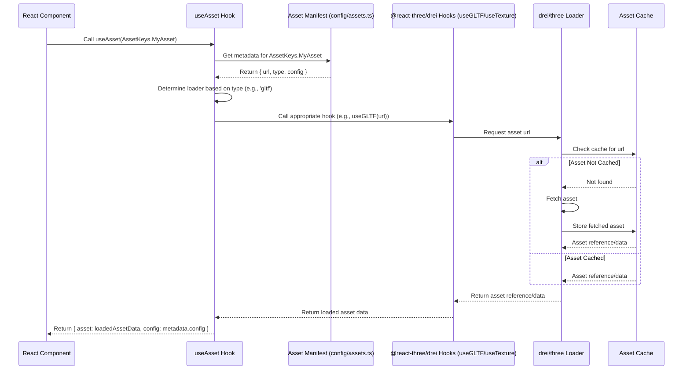

# Asset Management

This document outlines the approach for loading and managing game assets using a typed manifest.

## Overview

- **Goal:** Provide a consistent, type-safe way to load various asset types (3D models, textures, audio files, etc.) with associated metadata.
- **Implementation:** Loading is centralized via the `useAsset(key: AssetKeys)` hook (`src/core/hooks/useAsset.ts`). This hook relies on a TypeScript-based **Asset Manifest** (`src/config/assets.ts`) to retrieve asset URLs, types, and configuration metadata.

## Supported Formats

- **Models:** GLTF (`.gltf`, `.glb`) is the preferred format, loadable via `useAsset` when defined in the manifest with type `'gltf'`.
- **Textures:** Standard web formats (JPG, PNG, WebP) and compressed formats like KTX2 (`.ktx2`). Loadable via `useAsset` when defined in the manifest with type `'texture'`. The underlying `useTexture` hook from `@react-three/drei` handles KTX2 decoding (requires necessary loaders to be configured, often implicitly handled by `@react-three/fiber`).
- **Audio:** Formats supported by `howler.js` (MP3, OGG, WAV, etc.). Defined in the manifest with type `'audio'`, but loading might require a separate hook (e.g., `useSound`) – `useAsset` may not directly load audio.
- **Other:** JSON, etc. Requires custom loading logic and manifest type definitions.

## Loading Mechanisms

- **Primary Mechanism: `useAsset` Hook:**
  - The standard way to load assets is by calling `useAsset(key: AssetKeys)`, passing an enum member from `AssetKeys` defined in `src/config/assets.ts`.
  - The hook retrieves the asset's metadata (URL, type, configuration) from the central manifest.
  - Based on the `type` in the metadata, it calls the appropriate underlying loader (`useGLTF`, `useTexture`) from `@react-three/drei`. These loaders handle various formats, including GLTF for models and standard image formats as well as KTX2 for textures.
  - **Return Value:** The hook returns an object containing both the loaded `asset` (e.g., GLTF scene, Texture) and its `config` object from the manifest: `{ asset, config }`.
  - **Responsibility:** The consuming component is responsible for applying any relevant `config` properties (e.g., setting texture wrapping, applying transforms to models) to the loaded `asset`.
  - **Important:** Components using `useAsset` must be wrapped in a `<Suspense fallback={...}>` component to handle the loading state propagated from the underlying `drei` hooks.
- **Direct `drei` Hooks:** Direct usage of `useGLTF`, `useTexture` is discouraged for assets defined in the manifest but remains possible for one-off or complex cases not suitable for the manifest system.
- **Preloading:** Critical assets can be preloaded using `drei`'s `<Loader />` or other Suspense-compatible methods. The asset manifest's URLs can be used to feed the preloader. `useAsset` will benefit from this by finding assets in the cache.
- **Asset Cache:** `@react-three/drei` and `three.js` handle caching internally based on the URL. `useAsset` leverages this cache.

## Asset Manifest & Metadata

- **Concept:** A central, type-safe system defines all known game assets and their associated configuration.
- **Structure:**
  - **`src/core/types/assets.ts`**: Contains TypeScript interfaces (`IBaseAssetMetadata`, `IModelAssetMetadata`, `ITextureAssetMetadata`, `IAudioAssetMetadata`, `IModelConfig`, `ITextureConfig`, `IAudioConfig`, `IAssetMetadata`, `AssetManifest`) defining the shape of metadata for different asset types.
  - **`src/config/assets.ts`**: Defines:
    - `AssetKeys` enum: Unique identifiers for all assets (e.g., `AssetKeys.PlayerCharacter`).
    - `assets: AssetManifest`: The main manifest object, mapping each `AssetKeys` member to its corresponding typed `IAssetMetadata` (which includes `key`, `type`, `url`, and optional `config`).
    - `getAssetMetadata(key: AssetKeys)`: A helper function to retrieve metadata by key.
- **Benefits:** Type safety, centralized configuration, easier refactoring, decoupling components from specific asset paths.

## Asset Organization

- **Location:** Asset files should be stored within the `public` folder, organized by type. The URLs in the manifest (`src/config/assets.ts`) reflect these paths.
  - `public/assets/models/`
  - `public/assets/textures/`
  - `public/assets/audio/`
  - `public/assets/fonts/`

## Usage Examples

```typescript
import { Suspense, useRef, useEffect } from 'react';
import * as THREE from 'three';
import { useAsset } from '@/core/hooks/useAsset'; // Adjust import path
import { AssetKeys } from '@/config/assets'; // Adjust import path
import { IModelConfig, ITextureConfig } from '@/core/types/assets'; // Adjust import path

function MyModelComponent() {
  // useAsset receives an AssetKey, returns the loaded asset and its config
  const { asset: gltf, config } = useAsset(AssetKeys.PlayerCharacter);
  const modelRef = useRef<THREE.Group>(null!);

  useEffect(() => {
    // Apply config after asset is loaded
    if (gltf?.scene && modelRef.current && config) {
        const modelConfig = config as IModelConfig; // Type assertion
        if (modelConfig.scale) {
            if (typeof modelConfig.scale === 'number') {
                modelRef.current.scale.setScalar(modelConfig.scale);
            } else {
                modelRef.current.scale.set(...modelConfig.scale);
            }
        }
        if (modelConfig.position) modelRef.current.position.set(...modelConfig.position);
        if (modelConfig.rotation) modelRef.current.rotation.set(...modelConfig.rotation);
    }
  }, [gltf, config]);

  // Clone the scene to avoid modifying the cached version
  return gltf ? <primitive object={gltf.scene.clone()} ref={modelRef} /> : null;
}

function MyTexturedComponent() {
  const { asset: texture, config } = useAsset(AssetKeys.WoodTexture);

  useEffect(() => {
    // Apply texture config
    if (texture && config) {
        const textureConfig = config as ITextureConfig; // Type assertion
        if (textureConfig.wrapS) texture.wrapS = textureConfig.wrapS;
        if (textureConfig.wrapT) texture.wrapT = textureConfig.wrapT;
        if (textureConfig.repeat) texture.repeat.set(...textureConfig.repeat);
        if (textureConfig.magFilter) texture.magFilter = textureConfig.magFilter;
        if (textureConfig.minFilter) texture.minFilter = textureConfig.minFilter;
        texture.needsUpdate = true; // Important after changing texture props
    }
  }, [texture, config]);

  return (
    <mesh>
      <planeGeometry args={[5, 5]} />
      {/* Ensure texture is loaded before using it in material */}
      {texture && <meshStandardMaterial map={texture} />}
    </mesh>
  );
}

function App() {
  return (
    <Suspense fallback={<div>Loading Assets...</div>}>
      <MyModelComponent />
      <MyTexturedComponent />
    </Suspense>
  );
}
```

## Loading Sequence Example (using `useAsset` with Manifest)



## Phased Implementation Plan

The development of this asset management system can be broken down into the following phases:

### Phase 1: Core Setup & Types

- Define core asset type interfaces (`IBaseAssetMetadata`, `IModelAssetMetadata`, etc.) in `src/core/types/assets.ts`.
- Define asset configuration interfaces (`IModelConfig`, `ITextureConfig`, etc.) in `src/core/types/assets.ts`.
- Define main manifest types (`IAssetMetadata`, `AssetManifest`) in `src/core/types/assets.ts`.
- Create `AssetKeys` enum in `src/config/assets.ts`.
- Create `assets: AssetManifest` object in `src/config/assets.ts`.
- Create `getAssetMetadata` helper function in `src/config/assets.ts`.
- Create basic `useAsset` hook signature and structure in `src/core/hooks/useAsset.ts` (returning placeholder data initially).
- Establish asset file organization structure in `public/assets/*`.

### Phase 2: Basic Asset Loading

- Implement GLTF model loading within `useAsset` using `useGLTF`.
- Implement standard texture loading (JPG, PNG, WebP) within `useAsset` using `useTexture`.
- Document basic usage of `useAsset` hook with `<Suspense>`.

### Phase 3: Configuration Application

- Implement applying model configuration (`scale`, `position`, `rotation`) in consuming components using the `config` object returned by `useAsset`.
- Implement applying texture configuration (`wrapS`, `wrapT`, `repeat`, filters) in consuming components.

### Phase 4: Advanced Loading & Features

- Implement KTX2 texture loading/decoding within `useAsset`.
- Integrate KTX2 loader setup if necessary.
- Implement audio asset loading (potentially via a separate hook like `useSound`).

### Phase 5: DX Improvements & Enhancements

- Implement generic `useAsset` hook for improved type safety (using `AssetTypeMap`, `ConfigTypeMap`).
- Create specialized wrapper hooks (`useConfiguredModel`, `useConfiguredTexture`) to auto-apply configurations, simplifying component usage.
- Create asset registration helper functions (`registerModel`, `registerTexture`).
- Implement asset groups for organized preloading (`AssetGroup` enum, `AssetPreloader` component).
- Enhance `useAsset` hook with error handling, fallbacks, and timeouts.
- Add backward compatibility to `useAsset` for direct URL loading.
- Develop `AssetExplorer` component for debugging.
- Create `validateAssetManifest` utility for build-time or development checks.

## Advanced Features & Developer Experience

These enhancements streamline development and improve type safety when working with assets.

### Type-Safe Generics

The `useAsset` hook can leverage TypeScript generics to provide precise type information without manual type assertions:

```typescript
// Enhanced useAsset hook with generics
function useAsset<T extends AssetKeys>(
  key: T,
): {
  asset: T extends keyof AssetTypeMap ? AssetTypeMap[T] : unknown;
  config: T extends keyof ConfigTypeMap ? ConfigTypeMap[T] : unknown;
} {
  // Implementation...
}

// Usage with fully typed returns:
const { asset, config } = useAsset(AssetKeys.PlayerCharacter);
// TypeScript knows asset is GLTF, config is IModelConfig
```

### Specialized Wrapper Hooks

To eliminate boilerplate code and further simplify asset usage, we can create specialized hooks that handle configuration automatically:

```typescript
// Auto-configuring model hook
function useConfiguredModel(key: AssetKeys) {
  const { asset: gltf, config } = useAsset(key);
  const groupRef = useRef<THREE.Group>(null!);

  // Auto-apply model configuration
  useEffect(() => {
    if (gltf?.scene && groupRef.current && config) {
      applyModelConfig(groupRef.current, config);
    }
  }, [gltf, config]);

  return { model: gltf?.scene, ref: groupRef };
}

// Usage simplifies to:
function PlayerModel() {
  const { model, ref } = useConfiguredModel(AssetKeys.PlayerCharacter);
  return model ? <primitive object={model.clone()} ref={ref} /> : null;
}

// Similar hooks for textures, audio, etc.
function useConfiguredTexture(key: AssetKeys) {
  // Auto-configuration for textures
}
```

### Asset Registration Helpers

For large projects, adding assets to the manifest can be streamlined with helper functions:

```typescript
// Add assets programmatically with type checking
function registerModel(key: string, url: string, config?: IModelConfig): AssetKeys {
  const assetKey = key as AssetKeys;
  assets[assetKey] = {
    key: assetKey,
    type: 'gltf',
    url,
    config,
  };
  return assetKey;
}

// Similar helpers for other asset types
function registerTexture(key: string, url: string, config?: ITextureConfig): AssetKeys {
  // Implementation
}

// Usage:
const PLAYER_KEY = registerModel('PlayerCharacter', '/assets/models/player.glb', { scale: 1.5 });
```

### Asset Groups for Organized Preloading

Define logical groups of assets to efficiently preload related content:

```typescript
// Asset grouping for controlled preloading
export enum AssetGroup {
  CoreUI = 'CoreUI',
  Level1 = 'Level1',
  Level2 = 'Level2',
  // etc.
}

// Add group information to the manifest
[AssetKeys.PlayerCharacter]: {
  key: AssetKeys.PlayerCharacter,
  type: 'gltf',
  url: '/assets/models/player_character.glb',
  groups: [AssetGroup.CoreUI, AssetGroup.Level1],
  config: { scale: 1.5 }
},

// Create a preloader component that works with groups
function AssetPreloader({ groups, children, fallback }) {
  const [isLoaded, setIsLoaded] = useState(false);

  useEffect(() => {
    // Preload all assets in the specified groups
    preloadAssetGroups(groups).then(() => setIsLoaded(true));
  }, [groups]);

  return isLoaded ? children : fallback;
}

// Usage in level transitions or initial loading:
function Level1Scene() {
  return (
    <AssetPreloader
      groups={[AssetGroup.Level1]}
      fallback={<LevelLoadingScreen />}
    >
      <Level1Content />
    </AssetPreloader>
  );
}
```

### Enhanced Error Handling

Improve reliability with better error handling and fallbacks:

```typescript
// Enhanced useAsset with error handling
function useAsset<T extends AssetKeys>(
  key: T,
  options: {
    fallback?: any;
    onError?: (error: Error) => void;
    timeout?: number;
  } = {},
) {
  // Implementation with error handling, timeouts, and fallbacks
}

// Usage with error handling:
const { asset } = useAsset(AssetKeys.PlayerCharacter, {
  fallback: DefaultPlayerModel,
  onError: (error) => console.error('Failed to load player:', error),
  timeout: 5000, // ms before timing out
});
```

### Progressive Enhancement & Backward Compatibility

Support gradual migration from direct URLs to the manifest system:

```typescript
// Backward compatibility with existing code
function useAsset(keyOrUrl: AssetKeys | string) {
  if (typeof keyOrUrl === 'string' && keyOrUrl.includes('/')) {
    // Legacy direct URL path loading
    return useDirectAsset(keyOrUrl);
  }
  // Normal asset key-based loading
  return useManifestAsset(keyOrUrl as AssetKeys);
}
```

### Development Tools

Add utilities to improve debugging and development workflows:

```typescript
// Development-only asset explorer component
function AssetExplorer({ filter }: { filter?: AssetGroup | string }) {
  // Renders a UI for browsing, previewing, and testing assets from the manifest
  // Filtered by group, type, or search term
}

// Asset validation utility
function validateAssetManifest() {
  // Check for missing files, duplicate keys, invalid configs, etc.
  // Run during build or as a dev tool
}

// Usage in development mode:
if (process.env.NODE_ENV === 'development') {
  ReactDOM.render(<AssetExplorer />, document.getElementById('dev-tools'));
}
```
