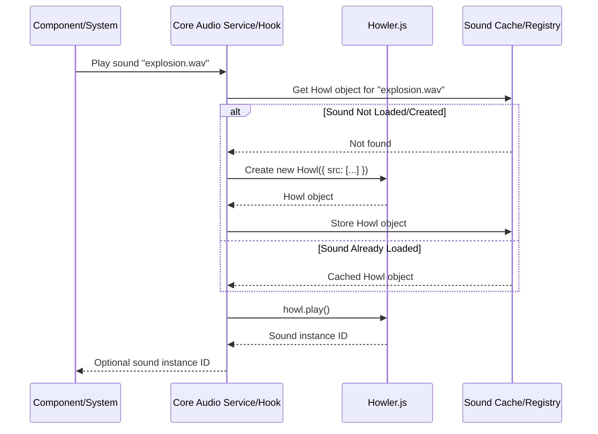

# Audio Integration (Howler.js)

This document describes the integration of `howler.js` for audio playback.

## Overview

- **Library:** Uses `howler.js` for reliable cross-browser audio.
- **Integration:** Likely managed via a singleton service or context accessible through a hook, initialized in `src/core/lib/audio.ts`.

## Features

- **Sound Loading:** Explain how sounds are loaded (likely preloaded based on a manifest).
- **Playback Control:** Basic playback (play, pause, stop, volume, looping).
- **Sound Sprites:** Mention potential use of audio sprites for efficient playback of short sounds.
- **Spatial Audio:** Discuss plans for 3D positional audio (integration with Three.js `AudioListener` and `PositionalAudio` might be needed).
- **Audio Groups/Buses:** Potential for grouping sounds (SFX, Music, UI) for volume control.

## Usage

- **Playing Sounds:** Show examples of how to trigger sound effects or play background music using the core audio service/hook.
- **Attaching Sounds to Entities:** Describe how sounds might be linked to game entities for spatialization.

## Asset Management

- Refer to `assets.md` for audio file formats and organization.

## Playback Flow Example

