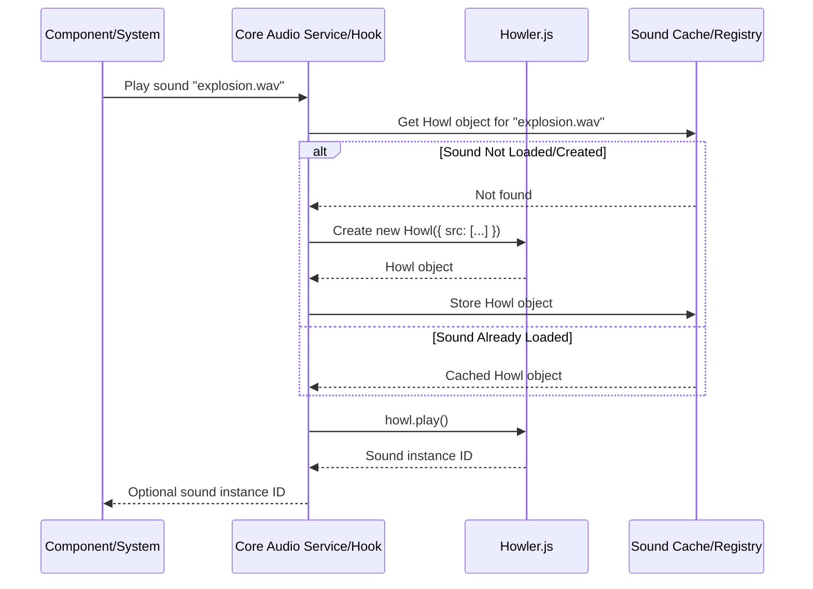

# Audio Integration (Howler.js)

This document describes the integration of `howler.js` for audio playback.

## Overview

- **Library:** Uses `howler.js` for reliable cross-browser audio.
- **Integration:** Likely managed via a singleton service or context accessible through a hook, initialized in `src/core/lib/audio.ts`.

## Features

- **Sound Loading:** Explain how sounds are loaded (likely preloaded based on a manifest).
- **Playback Control:** Basic playback (play, pause, stop, volume, looping).
- **Sound Sprites:** Mention potential use of audio sprites for efficient playback of short sounds.
- **Spatial Audio:** Discuss plans for 3D positional audio (integration with Three.js `AudioListener` and `PositionalAudio` might be needed).
- **Audio Groups/Buses:** Potential for grouping sounds (SFX, Music, UI) for volume control.

## Usage

- **Playing Sounds:** Show examples of how to trigger sound effects or play background music using the core audio service/hook.
- **Attaching Sounds to Entities:** Describe how sounds might be linked to game entities for spatialization.

## Asset Management

- Refer to `assets.md` for audio file formats and organization.

## Playback Flow Example

## Integration

- **Sound in Entities:** Explain the approach for attaching sounds to game entities, particularly if they are positional (using Three.js `PositionalAudio`).
- **Background Music:** Discuss how background music tracks are handled (e.g., looping, fading between tracks).

## Core Hooks and Utilities

- **Audio Management:** The engine includes core utilities for audio functionality in `src/core/lib/audio.ts`:

  - `playSound`: Function to play a sound by URL with Howler.js options
  - `stopSound`: Function to stop a playing sound

- **useAudio Hook:** A React hook (`src/core/hooks/useAudio.ts`) providing global audio control:

  - Manages global mute state
  - Controls master volume
  - Uses Zustand for state persistence
  - Automatically applies settings to Howler.js

- **useSoundEffect Hook:** A React hook for component-level sound playback:
  - Provides `play()` and `stop()` methods
  - Handles cleanup on component unmount
  - Caches sound instances for performance

## Game-Specific Audio

Game implementations are responsible for:

- Creating their own sound assets
- Managing game-specific audio logic (e.g., character voice lines)
- Implementing advanced audio patterns (e.g., adaptive music systems)
