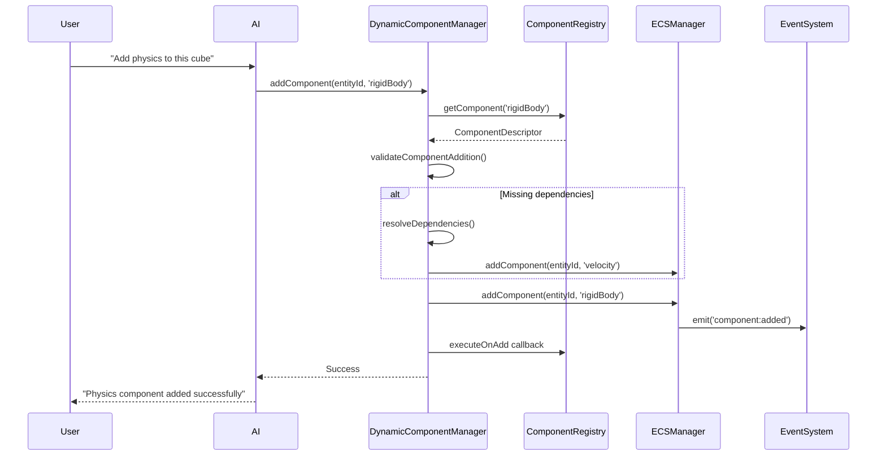

# Dynamic Component System

## Overview

### Context & Goals

- **Flexibility**: Enable entities to have only the components they actually need, rather than forcing all entities to support all components
- **Performance**: Reduce memory usage and improve cache efficiency by avoiding unused component data
- **Scalability**: Support a growing ecosystem of components without bloating every entity
- **AI Integration**: Allow the AI Copilot to dynamically add/remove components based on natural language commands

### Current Pain Points

- All entities are created with core components (`Transform`, `MeshType`, `Material`) regardless of need
- Adding new components requires manual updates to entity creation logic
- No standardized way to define component dependencies or compatibility
- Limited support for optional components that can be added at runtime

## Proposed Solution

### High-level Summary

- **Component Registry**: Centralized system for registering and managing component types with metadata
- **Entity Archetypes**: Template-based entity creation with predefined component sets
- **Dynamic Component API**: Runtime addition/removal of components with validation and events
- **Dependency Management**: Automatic handling of component dependencies and conflicts
- **AI Command Integration**: Natural language interface for component manipulation

### Architecture & Directory Structure

```
src/core/
├── lib/
│   ├── ecs.ts                           # Core ECS (existing)
│   ├── ecs-manager.ts                   # Core manager (existing)
│   ├── component-registry.ts            # NEW: Component registration system
│   ├── entity-archetypes.ts             # NEW: Entity template system
│   └── dynamic-components.ts            # NEW: Runtime component management
├── types/
│   ├── ecs.ts                          # ECS types (existing)
│   └── component-registry.ts           # NEW: Registry types
├── hooks/
│   ├── useComponent.ts                 # NEW: Dynamic component hooks
│   └── useArchetype.ts                 # NEW: Archetype management hooks
└── systems/
    └── ComponentValidationSystem.ts    # NEW: Component validation
```

## Implementation Plan

### Phase 1: Component Registry Foundation (1 day)

1. Create `IComponentDescriptor` interface with metadata
2. Implement `ComponentRegistry` class for registration and lookup
3. Add validation schema support using Zod
4. Create component categories and tagging system
5. Migrate existing components to use the registry

### Phase 2: Entity Archetypes (1 day)

1. Design `IEntityArchetype` interface for templates
2. Implement common archetypes (StaticMesh, DynamicObject, Character, etc.)
3. Create archetype validation and component dependency checking
4. Integrate archetype-based entity creation with ECSManager
5. Add archetype serialization support

### Phase 3: Dynamic Component API (1.5 days)

1. Implement `DynamicComponentManager` for runtime operations
2. Create component addition/removal validation
3. Add dependency resolution and conflict detection
4. Implement component lifecycle events and notifications
5. Create React hooks for dynamic component management

### Phase 4: AI Integration & Testing (0.5 day)

1. Integrate dynamic components with AI command parser
2. Add natural language commands for component manipulation
3. Create comprehensive test suite for edge cases
4. Add debug utilities and inspector integration

## File and Directory Structures

### New Component Registry Structure

```
src/core/lib/component-registry.ts
├── IComponentDescriptor interface
├── ComponentRegistry class
├── Component category definitions
└── Built-in component registrations

src/core/types/component-registry.ts
├── Component metadata types
├── Archetype definition types
└── Dependency resolution types
```

## Technical Details

### Component Registry

```typescript
// src/core/lib/component-registry.ts
export interface IComponentDescriptor<T = any> {
  id: string;
  name: string;
  category: ComponentCategory;
  component: any; // bitecs component
  dependencies?: string[];
  conflicts?: string[];
  schema: z.ZodSchema<T>;
  serialize: (entityId: number) => T | undefined;
  deserialize: (entityId: number, data: T) => void;
  onAdd?: (entityId: number) => void;
  onRemove?: (entityId: number) => void;
  required?: boolean;
  metadata?: {
    description?: string;
    version?: string;
    author?: string;
  };
}

export enum ComponentCategory {
  Core = 'core', // Transform, Name
  Rendering = 'rendering', // Material, MeshType
  Physics = 'physics', // Velocity, RigidBody
  Gameplay = 'gameplay', // Health, Inventory
  AI = 'ai', // AIAgent, Behavior
  Audio = 'audio', // AudioSource, AudioListener
  UI = 'ui', // UIElement, Canvas
  Network = 'network', // NetworkSync, PlayerInput
}

export class ComponentRegistry {
  private static instance: ComponentRegistry;
  private components: Map<string, IComponentDescriptor> = new Map();

  registerComponent<T>(descriptor: IComponentDescriptor<T>): void;
  unregisterComponent(id: string): void;
  getComponent(id: string): IComponentDescriptor | undefined;
  getComponentsByCategory(category: ComponentCategory): IComponentDescriptor[];
  validateDependencies(componentIds: string[]): ValidationResult;
  resolveDependencies(componentIds: string[]): string[];
}
```

### Entity Archetypes

```typescript
// src/core/lib/entity-archetypes.ts
export interface IEntityArchetype {
  id: string;
  name: string;
  description?: string;
  components: string[]; // Component IDs
  defaultValues?: Record<string, any>;
  validation?: (data: any) => boolean;
}

export class ArchetypeManager {
  private static archetypes: Map<string, IEntityArchetype> = new Map();

  static registerArchetype(archetype: IEntityArchetype): void;
  static createEntity(archetypeId: string, overrides?: any): number;
  static getArchetype(id: string): IEntityArchetype | undefined;
  static listArchetypes(): IEntityArchetype[];
}

// Built-in archetypes
export const BUILT_IN_ARCHETYPES: IEntityArchetype[] = [
  {
    id: 'static-mesh',
    name: 'Static Mesh',
    components: ['transform', 'meshType', 'material'],
  },
  {
    id: 'dynamic-object',
    name: 'Dynamic Object',
    components: ['transform', 'meshType', 'material', 'velocity'],
  },
  {
    id: 'physics-body',
    name: 'Physics Body',
    components: ['transform', 'meshType', 'material', 'velocity', 'rigidBody'],
  },
  {
    id: 'character',
    name: 'Character',
    components: ['transform', 'meshType', 'material', 'velocity', 'health', 'input'],
  },
];
```

### Dynamic Component Manager

```typescript
// src/core/lib/dynamic-components.ts
export class DynamicComponentManager {
  private static instance: DynamicComponentManager;

  addComponent(entityId: number, componentId: string, data?: any): Promise<boolean>;
  removeComponent(entityId: number, componentId: string): Promise<boolean>;
  hasComponent(entityId: number, componentId: string): boolean;
  getEntityComponents(entityId: number): string[];
  validateComponentAddition(entityId: number, componentId: string): ValidationResult;

  private resolveDependencies(entityId: number, componentId: string): void;
  private checkConflicts(entityId: number, componentId: string): string[];
  private notifyComponentChange(
    entityId: number,
    componentId: string,
    action: 'add' | 'remove',
  ): void;
}

export interface ValidationResult {
  valid: boolean;
  errors: string[];
  warnings: string[];
  missingDependencies?: string[];
  conflicts?: string[];
}
```

## Usage Examples

### Registering a Custom Component

```typescript
import { ComponentRegistry, ComponentCategory } from '@core/lib/component-registry';

// Register a Health component
componentRegistry.registerComponent({
  id: 'health',
  name: 'Health',
  category: ComponentCategory.Gameplay,
  component: HealthComponent,
  schema: z.object({
    current: z.number().min(0),
    maximum: z.number().min(1),
    regeneration: z.number().min(0).default(0),
  }),
  serialize: (entityId) => ({
    current: HealthComponent.current[entityId],
    maximum: HealthComponent.maximum[entityId],
    regeneration: HealthComponent.regeneration[entityId],
  }),
  deserialize: (entityId, data) => {
    HealthComponent.current[entityId] = data.current;
    HealthComponent.maximum[entityId] = data.maximum;
    HealthComponent.regeneration[entityId] = data.regeneration;
  },
  onAdd: (entityId) => {
    console.log(`Health component added to entity ${entityId}`);
  },
});
```

### Creating Entities with Archetypes

```typescript
import { ArchetypeManager } from '@core/lib/entity-archetypes';

// Create a character entity
const characterId = ArchetypeManager.createEntity('character', {
  transform: { position: [0, 1, 0] },
  health: { current: 100, maximum: 100 },
});

// Create a static mesh
const meshId = ArchetypeManager.createEntity('static-mesh', {
  material: { color: [1, 0, 0] },
});
```

### Dynamic Component Management

```typescript
import { DynamicComponentManager } from '@core/lib/dynamic-components';

const componentManager = DynamicComponentManager.getInstance();

// Add a component at runtime
await componentManager.addComponent(entityId, 'velocity', {
  linear: [0, 0, 0],
  angular: [0, 0, 0],
});

// Remove a component
await componentManager.removeComponent(entityId, 'velocity');

// Check validation before adding
const validation = componentManager.validateComponentAddition(entityId, 'rigidBody');
if (validation.valid) {
  await componentManager.addComponent(entityId, 'rigidBody');
} else {
  console.error('Cannot add component:', validation.errors);
}
```

## Testing Strategy

### Unit Tests

- Component registry registration and lookup
- Archetype validation and dependency resolution
- Dynamic component addition/removal
- Schema validation for component data
- Conflict detection and resolution

### Integration Tests

- End-to-end entity creation with archetypes
- Component lifecycle events and notifications
- ECS system integration with dynamic components
- Serialization/deserialization of dynamic entities
- AI command integration for component manipulation

## Edge Cases

| Edge Case                                               | Remediation                                                          |
| ------------------------------------------------------- | -------------------------------------------------------------------- |
| Adding component with missing dependencies              | Automatically resolve and add dependencies, or fail with clear error |
| Removing component that other components depend on      | Warn user and offer to remove dependent components                   |
| Component conflicts (e.g., multiple physics components) | Detect conflicts and either prevent addition or replace existing     |
| Invalid component data during deserialization           | Use schema validation to sanitize or reject invalid data             |
| Component registry corruption                           | Implement backup/restore mechanism and validation                    |
| Memory leaks from dynamic components                    | Proper cleanup in component removal and entity destruction           |
| Circular dependencies between components                | Detect cycles during dependency resolution and reject                |
| AI adding incompatible components                       | Validate AI commands through the same system as manual operations    |

## Sequence Diagram



## Risks & Mitigations

| Risk                                               | Mitigation                                                             |
| -------------------------------------------------- | ---------------------------------------------------------------------- |
| Performance overhead from dynamic lookups          | Cache frequently accessed components and use efficient data structures |
| Complexity of dependency management                | Implement comprehensive testing and clear dependency graphs            |
| Breaking changes to existing ECS code              | Maintain backwards compatibility and gradual migration path            |
| Memory fragmentation from dynamic allocation       | Use object pooling and efficient memory management                     |
| Race conditions in concurrent component operations | Implement proper locking and atomic operations                         |
| Difficulty debugging dynamic component issues      | Enhanced logging, debug utilities, and inspector integration           |

## Timeline

- **Phase 1 (Component Registry)**: 1 day
- **Phase 2 (Entity Archetypes)**: 1 day
- **Phase 3 (Dynamic Component API)**: 1.5 days
- **Phase 4 (AI Integration & Testing)**: 0.5 day
- **Total Estimated Time**: 4 days

## Acceptance Criteria

- Component registry can register, validate, and manage custom components
- Entity archetypes provide template-based entity creation with predefined component sets
- Components can be dynamically added/removed at runtime with proper validation
- Dependency resolution automatically handles component requirements
- Conflict detection prevents incompatible components from being added together
- AI Copilot can add/remove components through natural language commands
- All component operations emit proper events for UI synchronization
- Existing ECS functionality remains fully compatible
- Comprehensive test coverage for all edge cases and error conditions
- Performance impact is minimal compared to current static component system

## Conclusion

The Dynamic Component System will transform the ECS architecture from a rigid, all-components-required model to a flexible, on-demand system. This enables better memory efficiency, clearer entity definitions, and more intuitive AI-driven development workflows. The archetype system provides structured templates while maintaining the flexibility to add custom components as needed.

The implementation prioritizes backwards compatibility and gradual adoption, ensuring existing code continues to work while new features leverage the dynamic capabilities. This foundation will support the growing ecosystem of components and enable more sophisticated AI-assisted game development.

## Assumptions & Dependencies

- **bitecs Library**: Continued use of bitecs as the underlying ECS implementation
- **Zod Validation**: Component schemas will use Zod for runtime validation
- **Event System**: Existing ECS event system will be enhanced to support dynamic components
- **AI Copilot**: Integration assumes the AI command parser from Phase 2 of the roadmap is implemented
- **Serialization**: Current ECS serialization system will be extended to support dynamic components
- **Performance**: Memory and CPU overhead should remain under 10% compared to current static system
- **TypeScript**: Strong typing support for component descriptors and archetype definitions
