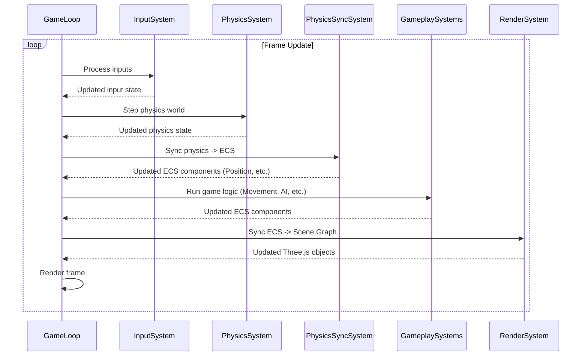

# ECS Integration (bitecs)

This document explains the integration and usage of the `bitecs` Entity Component System (ECS) library in the Vibe Coder 3D core framework.

## Overview

- **Library:** Uses the `bitecs` library for high-performance ECS.
- **World Setup:** A single `bitecs` world instance is created and managed, likely initialized in `src/core/lib/ecs.ts`.
- **Philosophy:** Aims for data-oriented design, separating data (components) from logic (systems).

## Core Components

- **Location:** Defined in `src/core/types` or a dedicated `src/core/components/ecs` directory.
- **Examples:** Core components will include `Position`, `Velocity`, `Rotation`, `Scale`, `Renderable` (linking to a Three.js object), `PhysicsBodyRef` (linking to a Rapier body handle).
- **Schema:** Components are defined using `bitecs` schema (e.g., `Position: { x: Types.f32, y: Types.f32, z: Types.f32 }`).
- **Usage:** Use `addComponent`, `removeComponent`, `hasComponent` from `bitecs`.

## Core Systems

- **Location:** Implemented as functions in `src/core/systems`.
- **Examples:** `MovementSystem` (updates `Position` based on `Velocity`), `PhysicsSyncSystem` (reads physics state and updates ECS components like `Position`/`Rotation`, and vice-versa), `RenderSystem` (updates Three.js object transforms based on ECS components).
- **Execution:** Systems are executed in a defined order within the game loop, likely managed by a central function.

## Core Hooks

- **Purpose:** Hooks in `src/core/hooks` will simplify interaction with the ECS world (e.g., `useECSWorld()`, `useQuery()`, `useEntity()`).

## Usage Patterns

- **Queries:** Use `defineQuery` from `bitecs` to efficiently retrieve entities possessing specific components.
- **Game Logic:** Game-specific logic should primarily reside in custom systems. Game-specific components extend the core set.

## Debugging

- **Utilities:** Plan to add utilities to inspect entity components and system performance. Potentially integrate with browser dev tools or an in-game console.

## System Execution Order

Systems are executed in a defined order within the game loop to ensure correct data flow (e.g., process input, update physics, sync physics state to ECS, update game logic, render).

