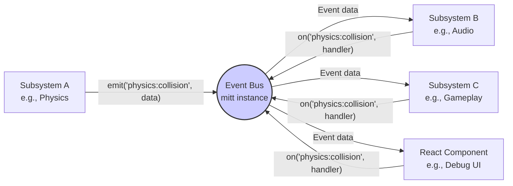

# Event System Architecture

This document details the event system used for decoupled communication between different parts of the Vibe Coder 3D engine and game logic, based on the principles outlined in `docs/research/architecture-research.md`.

## Core Philosophy: Decoupling via Events

To maintain separation between subsystems (Physics, Rendering, UI, Input, Game Logic, etc.) and avoid complex direct dependencies, a central event bus mechanism is employed. Instead of subsystems calling each other directly, they emit events that other interested subsystems can subscribe to.

## Chosen Implementation: `mitt`

We use the `mitt` library as our event emitter implementation.

**Rationale:**

- **Minimalism:** Extremely lightweight (~200 bytes), adding virtually no overhead.
- **Performance:** Designed for speed, suitable for game loop scenarios.
- **Type Safety:** Excellent TypeScript integration is crucial for maintainability and preventing runtime errors.
- **Simplicity:** Provides a clear and concise API (`on`, `off`, `emit`).

**Installation:**

```bash
npm install mitt
# or
yarn add mitt
```

## Type Safety with TypeScript

A core strength of this approach is type safety. We define a central type mapping all possible events to their expected payload types.

```typescript
// src/core/types/events.ts (Example)
import { Vector3 } from 'three';
import { EntityID } from '../ecs'; // Assuming an EntityID type

export type CoreEvents = {
  // System Events
  'physics:collision': {
    entityA: EntityID;
    entityB: EntityID;
    position: Vector3;
  };
  'asset:loaded': { url: string; asset: unknown };
  'scene:loaded': { sceneName: string };

  // Input Events (Higher Level Actions)
  'input:actionPressed': { action: string };
  'input:actionReleased': { action: string };

  // Game Specific Events (Define in src/game/types/events.ts and potentially merge)
  'game:playerDamaged': { damage: number };
  'game:scoreChanged': { newScore: number };
  'game:itemCollected': { itemType: string; entity: EntityID };

  // UI Events
  'ui:buttonClicked': { buttonId: string };
};

// Could potentially merge CoreEvents and GameEvents for a single bus
// export type AppEvents = CoreEvents & GameEvents;
```

## API Usage

1.  **Creating an Emitter Instance:**
    We typically create a single, globally accessible emitter instance.

    ```typescript
    // src/core/lib/events.ts
    import mitt, { Emitter } from 'mitt';
    import { CoreEvents } from '../types/events'; // Use your defined event map

    // Create a typed emitter instance
    export const emitter: Emitter<CoreEvents> = mitt<CoreEvents>();

    // Optional: Export helper functions for type-safe emitting/listening
    export function emit<Key extends keyof CoreEvents>(
      type: Key,
      event: CoreEvents[Key]
    ) {
      emitter.emit(type, event);
    }

    export function on<Key extends keyof CoreEvents>(
      type: Key,
      handler: (event: CoreEvents[Key]) => void
    ) {
      emitter.on(type, handler);
      // Return an unsubscribe function for easier cleanup
      return () => emitter.off(type, handler);
    }

    export function off<Key extends keyof CoreEvents>(
      type: Key,
      handler: (event: CoreEvents[Key]) => void
    ) {
      emitter.off(type, handler);
    }
    ```

2.  **Subscribing (`on`)**:
    Systems or components listen for specific events.

    ```typescript
    // Example in an ECS System (conceptual)
    import { on } from '../lib/events';

    function ScoreSystem() {
      const unsubscribe = on('game:itemCollected', (payload) => {
        console.log(`Item collected: ${payload.itemType}, updating score...`);
        // Access score component, update state, etc.
        // emit('game:scoreChanged', { newScore: newScore });
      });

      // Remember to call unsubscribe() when the system is destroyed!
      // How this is done depends on the ECS system lifecycle management.
    }

    // Example in a React Component
    import React, { useEffect, useState } from 'react';
    import { on } from '../../core/lib/events';

    function ScoreDisplay() {
      const [score, setScore] = useState(0);

      useEffect(() => {
        // Subscribe when component mounts
        const unsubscribe = on('game:scoreChanged', (payload) => {
          setScore(payload.newScore);
        });

        // Unsubscribe when component unmounts
        return () => {
          unsubscribe();
        };
      }, []); // Empty dependency array ensures this runs only on mount/unmount

      return <div>Score: {score}</div>;
    }
    ```

3.  **Emitting (`emit`)**:
    When something notable happens, an event is emitted.

    ```typescript
    // Example: Collision handling in a physics system
    import { emit } from '../lib/events';
    import { Vector3 } from 'three';

    function handleCollision(entityA, entityB, contactPoint) {
      // ... collision resolution logic ...

      emit('physics:collision', {
        entityA: entityA.id, // Assuming entities have IDs
        entityB: entityB.id,
        position: new Vector3().copy(contactPoint),
      });
    }
    ```

4.  **Unsubscribing (`off`)**:
    Crucial to prevent memory leaks. Listeners **must** be removed when the listening entity/system/component is no longer active. The helper function `on` shown above returns an `unsubscribe` function to make this easier, especially within `useEffect` hooks.

## Visualization



## Best Practices

- **Define Typed Events:** Always use a typed event map (`CoreEvents` example) for type safety and auto-completion.
- **Central Emitter:** Use a single global emitter instance for simplicity unless there's a strong reason for multiple buses.
- **Clear Naming:** Use descriptive event names (e.g., `namespace:subjectAction`).
- **Focused Payloads:** Include only necessary data in event payloads.
- **Clean Up Listeners:** Religiously unsubscribe listeners to prevent memory leaks. Use `useEffect` cleanup in React, and ensure ECS systems have a destruction/cleanup phase where listeners are removed.
- **Avoid Complex Listener Logic:** Keep listeners relatively simple. If complex reactions are needed, the listener might emit another, more specific event for other systems to handle.

## Worker Communication

`mitt` instances are synchronous and operate within their own thread context. Communicating events between the main thread and web workers (e.g., the physics worker) requires using the standard `postMessage` API. A common pattern is:

1.  Worker emits an internal event using its own `mitt` instance.
2.  A dedicated listener in the worker catches this event and uses `postMessage` to send the relevant data to the main thread.
3.  A message handler on the main thread receives the data and emits the corresponding event on the main thread's `mitt` instance.
4.  The reverse flow works similarly for main-thread-to-worker communication.
