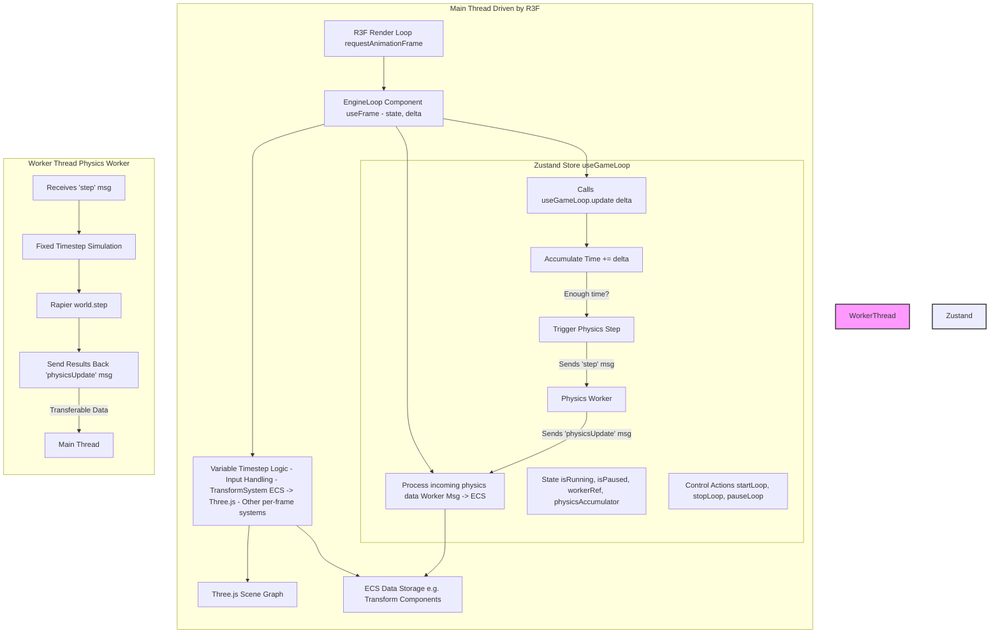

# Game Loop Architecture

This document describes the core game loop structure for Vibe Coder 3D, designed to integrate smoothly with React Three Fiber (R3F) while maintaining a clear separation between variable-rate rendering updates and fixed-rate physics simulation, conceptually similar to Godot's `_process` and `_physics_process`.

## Core Philosophy: R3F-Driven with Decoupled Physics

We leverage **React Three Fiber's render loop** as the primary driver for main-thread updates. This ensures optimal integration with the React ecosystem and Three.js rendering. Physics simulation is decoupled and runs in a separate **Web Worker** at a **fixed timestep** for stability and determinism.

Key Characteristics:

1.  **R3F's `useFrame` (Variable Timestep - `_process` equivalent):**
    - R3F's internal `requestAnimationFrame` loop provides the `delta` time to components via the `useFrame` hook.
    - Logic requiring updates every visual frame (e.g., synchronizing ECS `Transform` data to Three.js objects, animations, input processing) executes within a dedicated component using `useFrame`.
    - This hook also drives the accumulation of time for the fixed physics step.
2.  **Physics Worker (Fixed Timestep - `_physics_process` equivalent):**
    - The physics simulation (using Rapier) runs independently in a Web Worker.
    - It's driven by a time accumulator managed in the main thread's state. When enough time has accumulated (based on the variable `delta` from `useFrame`), the main thread posts a `step` command to the worker, instructing it how many fixed steps to simulate.
    - The worker posts simulation results (e.g., updated entity transforms) back to the main thread asynchronously.
3.  **State Management (Zustand):**
    - A Zustand store (`useGameLoop`) manages the core loop state (`isRunning`, `isPaused`), the physics worker reference, communication logic, and the physics time accumulator.
    - Components subscribe _selectively_ to the necessary state, minimizing re-renders.
4.  **ECS Integration:**
    - ECS systems are run at appropriate points:
      - Rendering/Transform sync systems run within `useFrame` on the main thread.
      - Physics simulation is implicitly handled by `world.step` within the worker.
      - Physics results are applied back to ECS components on the main thread when messages are received from the worker.

## Loop Structure Visualization

## System Execution

- **Variable Timestep (`useFrame`):** Systems that interact directly with the Three.js scene graph (`TransformSystem`), handle frame-based animations, or process user input run here.
- **Fixed Timestep (Worker):** The core physics simulation (`world.step`) runs here based on commands from the main thread.
- **Data Synchronization:** Physics results are applied to ECS components on the main thread asynchronously when messages arrive from the worker, often processed within the `useFrame` loop or a dedicated message handler.

This architecture aligns well with our technical stack, leveraging R3F's strengths while ensuring stable physics through worker-based, fixed-timestep simulation.

## Implementation Plan

We'll implement this architecture in phases, starting with a minimal foundation that can be incrementally expanded.

### Phase 1: Minimal Functional Game Loop

Focus on the core R3F integration, omitting physics worker for simplicity.

1. **Simplified Zustand Store (`useGameLoop`)**

   - Implement basic state (`isRunning`, `isPaused`, `fps`, `frameCount`)
   - Add control actions (`startLoop`, `pauseLoop`, `resumeLoop`, `stopLoop`)

2. **EngineLoop Component**

   - Create a component that uses `useFrame` to run on every R3F frame
   - Run main-thread ECS systems (e.g., `transformSystem`)
   - Update global state (frameCount, fps)

3. **Basic `useGameEngine` Hook**

   - Provide memoized control functions that interact with the Zustand store
   - Include basic world reset functionality

4. **GameEngine Component**
   - Set up the R3F Canvas with the EngineLoop inside
   - Add auto-start functionality
   - Support passing children for scene content

### Phase 2: Debug and Monitoring (Optional)

- Add `EngineDebugUI` component to display stats
- Implement frame time tracking and performance monitoring

### Phase 3: Physics Integration

- Add physics worker implementation
- Extend `useGameLoop` with physics accumulator and worker references
- Implement worker communication
- Add physics components to the ECS

### Phase 4: Advanced Features

- Entity pooling and object recycling
- Spatial partitioning
- Optimized render batching
- Event system for inter-system communication

### Phase 5: Multiplayer and Networking

- Add client-side prediction
- Implement state synchronization with server
- Add interpolation and reconciliation

Each phase builds upon the previous one, allowing for incremental testing and validation. The core architecture remains consistent throughout, with additional features layered on top of the foundation established in Phase 1.
