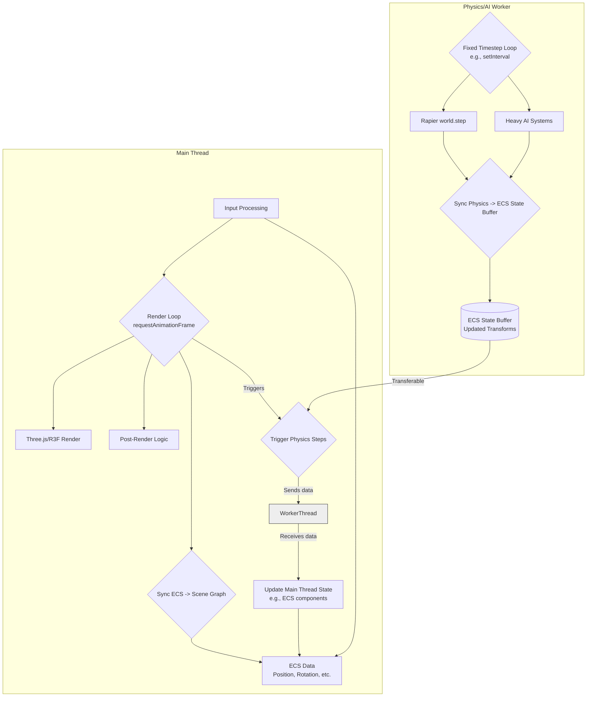

# Game Loop Architecture

This document describes the core game loop structure and philosophy for Vibe Coder 3D, drawing inspiration from the research in `docs/research/architecture-research.md`.

## Core Philosophy: Decoupled & Data-Oriented

The game loop is designed around **data-oriented principles** using an Entity Component System (ECS) and emphasizes **decoupled subsystems**. This approach aims to maximize performance and flexibility, especially in a web environment.

Key characteristics:

1.  **Decoupled Ticks:** Unlike some traditional loops where everything runs lock-step, we separate the physics simulation tick from the rendering tick.
    - **Physics:** Runs at a **fixed delta time** (deterministic tick) for stable and predictable physics simulation, handled by Rapier.
    - **Rendering:** Runs at a **variable delta time** based on the browser's `requestAnimationFrame`, allowing for smooth rendering independent of physics simulation speed. This is managed by React Three Fiber / Three.js.
2.  **ECS-Driven:** Logic is primarily executed within ECS Systems that iterate over component data. This contrasts with object-oriented approaches where update methods might be called on individual game objects or nodes. See `docs/architecture/ecs.md` for details on system execution.
3.  **Multi-threading (Workers):** To avoid blocking the main thread (responsible for rendering and user interaction), computationally intensive tasks are offloaded.
    - **Main Thread:** Handles Rendering (Three.js/R3F), Input processing, and main loop coordination.
    - **Worker Thread(s):** Handle Physics simulation (Rapier WASM) and potentially heavy AI or other background tasks. Communication happens via transferable `ArrayBuffer`s or `SharedArrayBuffer`s for efficiency.

### Comparison to Other Engines

- **vs. Godot:** Godot uses `_process` (variable delta) and `_physics_process` (fixed delta) methods on nodes. While we share the concept of separate fixed/variable updates, our logic resides primarily in ECS systems operating on shared data pools, rather than methods called on individual nodes in a tree.
- **vs. Unity/Unreal:** These engines also use component-based approaches (`Update`, `FixedUpdate` in Unity). Our model is similar in using components but leans more heavily on the pure ECS pattern (systems iterating external data) and leverages web workers more explicitly for core subsystems like physics due to the browser environment constraints.

## Loop Structure Visualization

The two main loops operate concurrently, coordinated by the main thread, with data synchronized between them.

_(Diagram Note: This is a simplified representation. Actual implementation might involve more complex state management and synchronization mechanisms like SharedArrayBuffers or specific message passing.)_

## System Execution

Within each loop (especially the fixed physics tick and parts of the render tick), ECS systems are executed in a defined order. Refer to the System Execution Order diagram in `docs/architecture/ecs.md` for a more detailed sequence of how systems interact frame-to-frame.
