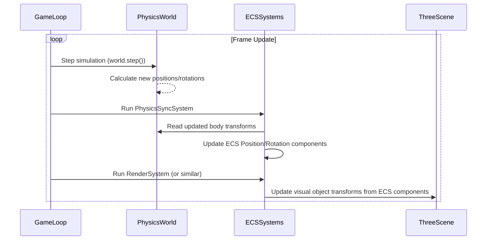

# Physics Integration (Rapier)

This document details the integration of the Rapier physics engine within the Vibe Coder 3D core framework.

## Overview

- **Dependencies:** Integration relies on `rapier3d-compat` and `@dimforge/rapier3d-compat`.
- **Setup:** The Rapier physics world is initialized and managed within the main React Three Fiber render loop, likely handled in `src/core/lib/physics.ts`.
- **Synchronization:** Physics simulation runs independently and needs synchronization with the Three.js scene graph.

## Core Components

- **`<PhysicsBody>`:** A React component located in `src/core/components` designed to wrap Three.js objects (like `Mesh`). It automatically creates and manages a corresponding Rapier rigid body and collider.
- **Synchronization:** This component handles the synchronization between the Rapier body's transform (position, rotation) and the associated Three.js object's transform on each frame or physics step.

## Usage

- **Adding Physics:** Wrap visual components (`<mesh>`, `<group>`, etc.) with the `<PhysicsBody>` component to add physics properties. Configure properties like mass, shape (cube, sphere, capsule), friction, etc., via props.
- **Stepping:** The physics world simulation is advanced ('stepped') within the game loop, typically using `world.step()`. The frequency might be tied to the render loop or run at a fixed rate.
- **Hooks:** A core hook (e.g., `usePhysics`) might be provided in `src/core/hooks` to access the physics world instance or perform specific physics operations.

## Debugging

- **Visual Debugger:** Plan to integrate `@react-three/rapier`'s `<Debug />` component or a similar utility for visualizing collider shapes and physics interactions.

## Synchronization Loop

The physics world runs its simulation steps, and the results need to be synchronized with the visual representation in the Three.js scene. This typically happens within the main game loop.

