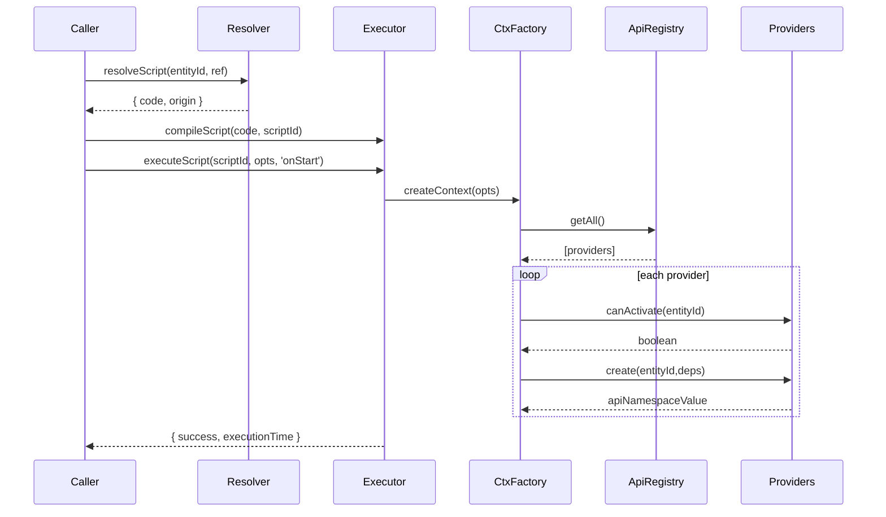

# Scripting System Architecture Plan (SRP/DRY/KISS)

## Overview

- **Context & Goals**: Provide a clean, scalable scripting architecture that exposes engine capabilities via small, composable, testable APIs. Support multiple systems (input, audio, events, physics, entities, prefab, query, three) without coupling execution to API details. Ensure deterministic, debuggable execution with minimal re-renders and safe mutation buffering.
- **Current Pain Points**:
  - Large `ScriptAPI.ts` aggregates many concerns; adding new APIs can bloat the module and increase coupling.
  - `DirectScriptExecutor` and `ScriptContextFactory` know concrete API sets; integration points for new APIs require edits in multiple places.
  - Limited formal plugin/registry pattern; discovery and lifecycle for new APIs are implicit rather than declarative.

## Proposed Solution

- **High‑level Summary**:

  - Introduce a formal Script API Provider abstraction with a registry-based composition model.
  - Split execution responsibilities: resolve → compile → context → run → cleanup, each with narrow SRP.
  - Use a declarative manifest for context shape and per-entity capabilities (capability flags, lazy getters).
  - Provide a lightweight, strongly-typed facade to scripts; keep engine internals behind accessors and a mutation buffer.
  - Add first-class lifecycle hooks for API providers (onContextCreate/onEntityAttach/onEntityDetach/cleanup).

- **Architecture & Directory Structure**:
  ```
  src/core/lib/scripting/
  ├─ executor/
  │  ├─ IScriptExecutor.ts
  │  ├─ DirectScriptExecutor.ts          # retains existing impl, implements interface
  │  └─ SafeScriptExecutor.ts            # retains existing impl, implements interface
  ├─ context/
  │  ├─ IScriptContext.ts                # public context shape (narrow)
  │  ├─ ScriptContextFactory.ts          # composes providers via registry
  │  └─ ContextManifest.ts               # declarative provider selection per entity
  ├─ apis/
  │  ├─ IApiProvider.ts                  # new abstraction
  │  ├─ registry/
  │  │  └─ ApiRegistry.ts                # register/enable/disable providers
  │  ├─ input/
  │  │  └─ InputAPIProvider.ts           # wraps existing InputAPI
  │  ├─ audio/
  │  │  └─ AudioAPIProvider.ts           # wraps existing AudioAPI
  │  ├─ events/
  │  │  └─ EventAPIProvider.ts           # wraps existing EventAPI
  │  ├─ three/
  │  │  └─ ThreeAPIProvider.ts           # wraps createThreeJSAPI
  │  ├─ entities/
  │  │  └─ EntitiesAPIProvider.ts        # wraps EntitiesAPI + components proxy
  │  ├─ physics/
  │  │  ├─ PhysicsEventsAPIProvider.ts
  │  │  └─ CharacterControllerAPIProvider.ts
  │  ├─ timer/
  │  │  └─ TimerAPIProvider.ts
  │  ├─ query/
  │  │  └─ QueryAPIProvider.ts
  │  └─ prefab/
  │     └─ PrefabAPIProvider.ts
  ├─ resolver/
  │  └─ ScriptResolver.ts                # current file moved
  ├─ cache/
  │  └─ ScriptCache.ts                   # optional cache facade if needed
  ├─ types/
  │  ├─ ScriptTypes.ts                   # shared types (EntityId, lifecycle names)
  │  └─ CapabilityFlags.ts               # guards for API availability
  └─ README.md
  ```

## Implementation Plan

- Phase 1: Abstractions & Interfaces (0.5 day)

  1. Create `IApiProvider` with lifecycle hooks and `namespace` key.
  2. Define `IScriptContext` minimal surface and `IScriptExecutor` interface.
  3. Implement `ApiRegistry` for register/enable/disable and lookups.

- Phase 2: Context Composition (0.5 day)

  1. Add `ContextManifest` supporting default set + per-entity capability flags.
  2. Refactor `ScriptContextFactory` to compose providers via `ApiRegistry` and manifest.
  3. Use lazy getters for per-entity accessors (mesh, scene, components) to keep KISS.

- Phase 3: Provider Adapters (1.0 day)

  1. Wrap existing APIs in provider classes (input, audio, events, three, entities, physics, timer, query, prefab).
  2. Move cleanup into providers; remove cross-cleanup logic from executor.
  3. Ensure providers only depend on engine accessors and mutation buffer, not on executor internals.

- Phase 4: Executors Integration (0.5 day)

  1. Make `DirectScriptExecutor` and `SafeScriptExecutor` implement `IScriptExecutor`.
  2. Replace direct API wiring with registry-driven context creation.
  3. Keep TypeScript transpile path and lifecycle caching as-is.

- Phase 5: Testing & Migration (0.5 day)
  1. Update unit tests to use registry + manifest.
  2. Add integration tests for context composition, provider lifecycle, and cleanup.
  3. Keep public scripting API stable for scripts; no script changes.

## File and Directory Structures

```text
src/core/lib/scripting/
├─ executor/
│  ├─ IScriptExecutor.ts
│  ├─ DirectScriptExecutor.ts
│  └─ SafeScriptExecutor.ts
├─ context/
│  ├─ IScriptContext.ts
│  ├─ ScriptContextFactory.ts
│  └─ ContextManifest.ts
├─ apis/
│  ├─ IApiProvider.ts
│  ├─ registry/ApiRegistry.ts
│  ├─ input/InputAPIProvider.ts
│  ├─ audio/AudioAPIProvider.ts
│  ├─ events/EventAPIProvider.ts
│  ├─ three/ThreeAPIProvider.ts
│  ├─ entities/EntitiesAPIProvider.ts
│  ├─ physics/PhysicsEventsAPIProvider.ts
│  ├─ physics/CharacterControllerAPIProvider.ts
│  ├─ timer/TimerAPIProvider.ts
│  ├─ query/QueryAPIProvider.ts
│  └─ prefab/PrefabAPIProvider.ts
├─ resolver/ScriptResolver.ts
├─ cache/ScriptCache.ts (optional)
└─ types/{ScriptTypes.ts, CapabilityFlags.ts}
```

## Technical Details

```ts
// apis/IApiProvider.ts
export interface IApiProvider<TContextKey extends string = string> {
  readonly namespace: TContextKey; // e.g., 'input', 'audio'
  canActivate(entityId: number): boolean; // capability flag/guard
  create(entityId: number, deps: ProviderDeps): unknown; // value injected into context
  onAttach?(entityId: number): void; // optional lifecycle
  onDetach?(entityId: number): void; // optional lifecycle
  cleanup?(entityId: number): void; // mandatory if provider holds resources
}

export interface ProviderDeps {
  getMeshRef(): THREE.Object3D | null;
  getSceneRef(): THREE.Scene | null;
  mutationBuffer: ComponentMutationBuffer;
  time: ITimeAPI;
  input: IInputAPI;
  // engine services, registries, factories as needed
}
```

```ts
// apis/registry/ApiRegistry.ts
export class ApiRegistry {
  private providers = new Map<string, IApiProvider>();
  register(provider: IApiProvider): void {
    this.providers.set(provider.namespace, provider);
  }
  unregister(namespace: string): void {
    this.providers.delete(namespace);
  }
  getAll(): IApiProvider[] {
    return [...this.providers.values()];
  }
  get(namespace: string): IApiProvider | undefined {
    return this.providers.get(namespace);
  }
}
```

```ts
// context/IScriptContext.ts
export interface IScriptContext {
  entity: IEntityScriptAPI; // with component accessors via proxy
  time: ITimeAPI;
  input: IInputAPI;
  math: IMathAPI;
  console: IConsoleAPI;
  // dynamically composed namespaces below
  [namespace: string]: unknown;
}
```

```ts
// context/ContextManifest.ts
export interface ContextManifest {
  // defaults enable these providers for every entity (if canActivate passes)
  defaults: string[]; // ['three','entities','query','events','timer','audio','input']
  // per-entity overrides
  allow?: Record<number, string[]>; // enable additional providers
  deny?: Record<number, string[]>; // disable specific providers
}
```

```ts
// context/ScriptContextFactory.ts (excerpt)
export class ScriptContextFactory {
  constructor(
    private registry: ApiRegistry,
    private manifest: ContextManifest,
  ) {}
  createContext(opts: IScriptContextFactoryOptions): IScriptContext {
    const base = createBaseContext(opts); // entity, math, console, time, input
    const deps: ProviderDeps = {
      getMeshRef,
      getSceneRef,
      mutationBuffer,
      time: opts.timeInfo,
      input: opts.inputInfo,
    };
    const providers = selectProvidersForEntity(this.registry, this.manifest, opts.entityId);
    for (const provider of providers) {
      if (provider.canActivate(opts.entityId)) {
        const value = provider.create(opts.entityId, deps);
        Object.defineProperty(base, provider.namespace, { get: () => value, enumerable: true });
        provider.onAttach?.(opts.entityId);
      }
    }
    return base;
  }
  detach(entityId: number): void {
    /* iterate providers and call onDetach/cleanup */
  }
}
```

```ts
// executor/IScriptExecutor.ts
export interface IScriptExecutor {
  hasCompiled(scriptId: string): boolean;
  compileScript(
    code: string,
    scriptId: string,
  ): { success: boolean; error?: string; executionTime: number };
  executeScript(
    scriptId: string,
    opts: ExecOptions,
    lifecycle?: LifecycleName,
  ): { success: boolean; error?: string; executionTime: number };
  removeScriptContext(entityId: number): void;
  removeCompiledScript(scriptId: string): void;
  clearAll(): void;
}
```

## Usage Examples

```ts
// Register a new API provider (e.g., analytics)
apiRegistry.register(new AnalyticsAPIProvider());
```

```ts
// Create context with manifest
const factory = new ScriptContextFactory(apiRegistry, defaultManifest);
const ctx = factory.createContext({ entityId, timeInfo, inputInfo, parameters, mutationBuffer });
```

```ts
// Access from scripts remains stableunction onStart() {
  console.log('hi');
  entity.transform.setPosition(1,2,3);
  audio.play('footstep');
  input.onAction('Gameplay','Jump',(phase)=>{ /* ... */ });
}
```

## Testing Strategy

- **Unit Tests**:

  - ApiRegistry registration, retrieval, and idempotency.
  - Provider `canActivate` gating and lifecycle hooks invoked.
  - ContextManifest selection logic (defaults/allow/deny precedence).
  - ScriptContextFactory integrates providers and exposes lazy getters.

- **Integration Tests**:
  - End-to-end: resolve → compile → execute onUpdate → mutation buffer flush.
  - Provider cleanup on `removeScriptContext` and `clearAll`.
  - Adding a new provider requires zero changes to executors/factory beyond registration.

## Edge Cases

| Edge Case                                      | Remediation                                                   |
| ---------------------------------------------- | ------------------------------------------------------------- |
| Entity lacks required component for a provider | `canActivate` returns false; getter omitted                   |
| Provider throws during create                  | Catch, log, skip provider; keep context usable                |
| Conflicting namespace                          | Registry prevents duplicate namespace; require unique keys    |
| Long-running lifecycle                         | Warn when exceeding budget; keep maxExecutionTime enforcement |
| Hot-reload of scripts                          | Executor `clearAll` and re-compose context; providers cleanup |

## Sequence Diagram



## Risks & Mitigations

| Risk                                       | Mitigation                                                             |
| ------------------------------------------ | ---------------------------------------------------------------------- |
| Over-abstraction increases boilerplate     | Keep `IApiProvider` minimal; codegen helpers for provider stubs        |
| Performance regression in context creation | Lazy getters; cache per-entity context; reuse existing mutation buffer |
| Inconsistent cleanup across providers      | Enforce `cleanup` in interface; central `detach` invokes all           |
| Namespace sprawl                           | Document naming; registry enforces uniqueness                          |

## Timeline

- Total: ~3.0 days
  - Phase 1: 0.5 day
  - Phase 2: 0.5 day
  - Phase 3: 1.0 day
  - Phase 4: 0.5 day
  - Phase 5: 0.5 day

## Acceptance Criteria

- New providers can be added without modifying executors or factory beyond registration.
- Script context is composed via registry + manifest and exposes only needed APIs.
- Cleanup is handled by providers, invoked on entity detach and clearAll.
- No breaking changes to script-level API names (entity, input, audio, etc.).
- Unit and integration tests added for registry, manifest, composition, and cleanup.

## Conclusion

This design decouples API exposure from script execution via a registry/manifest pattern, achieving SRP/DRY/KISS. It keeps the script-facing surface stable, makes adding systems (input, audio, physics, etc.) trivial, and centralizes lifecycle/cleanup, improving maintainability and scalability.

## Assumptions & Dependencies

- TypeScript and existing engine accessors remain available.
- Mutation buffer continues to be flushed by existing systems post-scripts.
- No change to how external scripts are resolved; `ScriptResolver` remains the source.
- Build system supports file moves/renames reflected above; path aliases used for imports.

