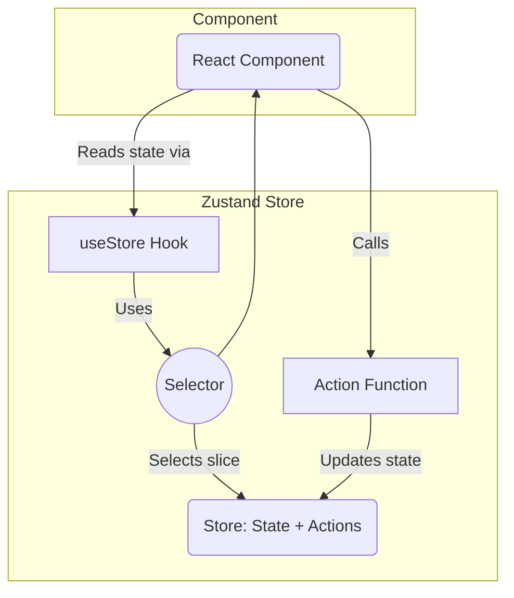

# State Management (Zustand)

This document describes the state management approach using Zustand.

## Core State

- **Location:** `src/core/state/index.ts` (or similar)
- **Purpose:** Manages global state relevant to the core engine (e.g., game phase, loading status, global settings).
- **Structure:** Define the shape of the core state slice.

## Game State

- **Location:** `src/game/state/index.ts` (or similar)
- **Purpose:** Manages state specific to the current game instance (e.g., score, lives, player inventory, quest status).
- **Structure:** Define the shape of the game state slice.

## Usage

- **Accessing State:** Show how to use the Zustand hook (`useStore`) to access and subscribe to state slices in React components.
- **Updating State:** Provide examples of actions or methods defined within the store to modify state immutably.
- **Selectors:** Encourage the use of selectors for optimized state access and memoization.

## Interaction

- Explain how core state and game state might interact or if they are kept separate.

## Interaction Flow

Components primarily interact with the Zustand store via hooks and actions.

