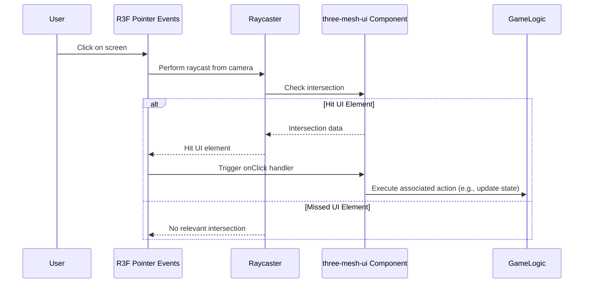

# UI Implementation

This document covers the approaches for creating User Interfaces (UI).

## In-World UI (three-mesh-ui)

- **Library:** Utilizes `three-mesh-ui` for rendering UI elements within the 3D scene.
- **Core Components:** Document any wrapper components created in `src/core/components/ui` to simplify `three-mesh-ui` usage (e.g., `<UIButton>`, `<UIText>`, `<UIPanel>`).
- **Layout:** Explain layout principles (block, inline-block, flex-like properties).
- **Interaction:** Describe how interactions (hover, click) with in-world UI elements are handled (likely involving raycasting).
- **Usage:** Provide examples of creating simple menus or HUD elements using the core components.

### Interaction Flow Example (Click)



## DOM UI (React)

- **Purpose:** Used for overlays, menus, debug panels, or interfaces that don't need to be part of the 3D world.
- **Implementation:** Standard React components rendered outside the R3F Canvas.
- **State Interaction:** Explain how DOM UI components interact with game state (via Zustand stores).
- **Styling:** Mention the chosen styling solution (e.g., CSS Modules, Tailwind CSS, Styled Components).

## Integration

- Discuss when to use In-World UI vs. DOM UI.
- How communication happens between the two (e.g., via Zustand state).

```mermaid
graph TD
    subgraph Browser DOM
        direction LR
        ReactUI[React DOM UI<br/>(Overlays, Menus)]
    end

    subgraph ThreeJS Scene
        direction LR
        InWorldUI_G[In-World UI<br/>(three-mesh-ui)]
    end

    subgraph Shared State
        Zustand[Zustand Store]
    end

    ReactUI <-- Reads/Writes --> Zustand
    InWorldUI_G <-- Reads/Writes --> Zustand

    style Zustand fill:#f9f,stroke:#333,stroke-width:2px
```
