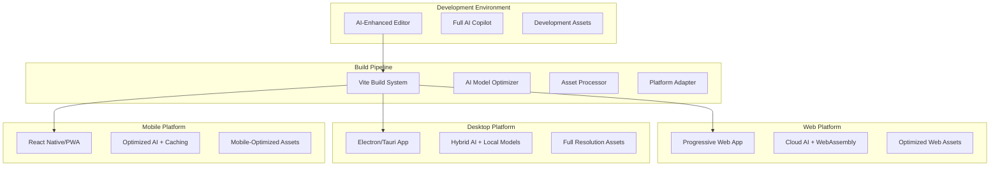

# Deployment Strategy: Multi-Platform AI-First Game Engine

**Vibe Coder 3D: Comprehensive Deployment Plan for Web, PC, and Mobile**

## Overview

### Context & Goals

- **Universal AI Access**: Ensure the AI Copilot works seamlessly across all deployment platforms
- **Performance Optimization**: Maintain 60fps+ gameplay while supporting AI features on each platform
- **Platform-Native Integration**: Leverage platform-specific capabilities while maintaining code reuse
- **Scalable Distribution**: Support both development builds and production distribution workflows

### Current Deployment Challenges

- **AI Model Integration**: Large language models and processing requirements vary by platform
- **Asset Size Management**: 3D models, textures, and AI models can create large bundle sizes
- **Platform Performance Differences**: Mobile devices have different capabilities than desktop
- **AI API Connectivity**: Ensuring reliable cloud AI access across platforms and network conditions

## Proposed Solution

### High-level Summary

- **Progressive Deployment Strategy**: Start with web, then desktop, finally mobile
- **AI-Adaptive Architecture**: AI features scale based on platform capabilities
- **Hybrid Cloud/Local Approach**: Balance cloud AI power with local fallbacks
- **Platform-Optimized Builds**: Tailored bundles and optimizations for each target
- **Universal Development Experience**: Same AI-first development tools work across all platforms

### Platform Architecture Overview



## Implementation Plan

### Phase 1: Web Platform Foundation (2 weeks)

#### Week 1: Progressive Web App Setup

1. **PWA Configuration**

   - Configure service worker for offline capabilities
   - Implement app manifest for installation
   - Set up caching strategies for assets and AI responses
   - Add offline fallback for basic editor functionality

2. **Web-Optimized AI Integration**
   - Implement cloud AI providers (OpenAI, Claude) with API key management
   - Add request queuing and rate limiting
   - Create fallback responses for network failures
   - Implement AI response caching

#### Week 2: Production Web Deployment

3. **Build Optimization**

   - Configure Vite for production builds with code splitting
   - Implement dynamic imports for large AI modules
   - Set up asset compression and optimization
   - Add bundle analysis and size monitoring

4. **Hosting & CDN Setup**
   - Deploy to Vercel/Netlify with edge functions for AI proxying
   - Configure CDN for global asset delivery
   - Set up staging and production environments
   - Implement analytics and error tracking

### Phase 2: Desktop Platform (3 weeks)

#### Week 1: Desktop Framework Selection & Setup

1. **Framework Evaluation**

   - Compare Electron vs Tauri for bundle size and performance
   - Evaluate native module support for AI processing
   - Test cross-platform compatibility (Windows, macOS, Linux)
   - Assess security implications for AI model storage

2. **Desktop Architecture Implementation**
   - Set up chosen framework with React Three Fiber
   - Configure native file system access for projects
   - Implement desktop-specific UI enhancements
   - Add window management and system integration

#### Week 2: Desktop AI Enhancement

3. **Local AI Model Integration**

   - Research and integrate local LLM options (Ollama, LocalAI)
   - Implement hybrid cloud/local AI routing
   - Add model downloading and management
   - Create fallback chains: Local → Cloud → Cached responses

4. **Desktop-Specific Features**
   - Implement drag-and-drop file imports
   - Add native context menus and shortcuts
   - Integrate with system file associations
   - Support for hardware acceleration

#### Week 3: Desktop Distribution

5. **Build Pipeline & Distribution**

   - Configure auto-updater system
   - Set up code signing for all platforms
   - Create installer packages (MSI, DMG, AppImage)
   - Implement crash reporting and analytics

6. **Performance Optimization**
   - Profile and optimize startup time
   - Implement lazy loading for editor modules
   - Add memory management for large scenes
   - Optimize AI model loading and caching

### Phase 3: Mobile Platform (4 weeks)

#### Week 1: Mobile Strategy & Proof of Concept

1. **Platform Selection**

   - Evaluate React Native vs Capacitor vs PWA approaches
   - Test 3D rendering performance on mobile devices
   - Assess AI processing capabilities and limitations
   - Create basic mobile prototype

2. **Mobile Architecture Design**
   - Design touch-optimized editor interface
   - Plan reduced feature set for mobile constraints
   - Design AI interaction patterns for mobile
   - Create responsive layout system

#### Week 2: Mobile-Optimized AI System

3. **Lightweight AI Implementation**

   - Implement aggressive AI response caching
   - Create mobile-optimized prompts and responses
   - Add offline mode with pre-generated suggestions
   - Implement smart batching for API requests

4. **Mobile Asset Pipeline**
   - Create mobile-specific asset optimization
   - Implement progressive loading for 3D models
   - Add texture compression and LOD systems
   - Optimize shader complexity for mobile GPUs

#### Week 3: Mobile Editor & Experience

5. **Touch Interface Development**

   - Implement gesture-based 3D manipulation
   - Create mobile-optimized AI chat interface
   - Add voice input for AI commands
   - Design simplified component inspector

6. **Performance Optimization**
   - Implement aggressive culling and LOD
   - Add frame rate targeting and dynamic quality
   - Optimize memory usage for mobile constraints
   - Test on various device configurations

#### Week 4: Mobile Distribution

7. **App Store Preparation**

   - Create store assets and descriptions
   - Implement in-app purchase for AI credits (if needed)
   - Add privacy policy and data handling
   - Prepare for app store review processes

8. **Mobile-Specific Features**
   - Add camera integration for AR previews
   - Implement device sensors for game testing
   - Add share functionality for projects
   - Create offline project sync

## File and Directory Structures

### Build Configuration Structure

```
build/
├── web/
│   ├── vite.config.web.ts          # Web-specific Vite config
│   ├── sw.ts                       # Service worker for PWA
│   └── manifest.json               # Web app manifest
├── desktop/
│   ├── electron/
│   │   ├── main.ts                 # Electron main process
│   │   ├── preload.ts              # Secure context bridge
│   │   └── updater.ts              # Auto-update logic
│   ├── tauri/
│   │   ├── tauri.conf.json         # Tauri configuration
│   │   └── src-tauri/              # Rust backend code
│   └── forge.config.js             # Electron Forge config
├── mobile/
│   ├── react-native/
│   │   ├── metro.config.js         # Metro bundler config
│   │   ├── android/                # Android-specific code
│   │   └── ios/                    # iOS-specific code
│   ├── capacitor/
│   │   ├── capacitor.config.ts     # Capacitor configuration
│   │   └── android/                # Android Capacitor project
│   └── pwa/
│       └── mobile-manifest.json    # Mobile PWA manifest
└── shared/
    ├── ai-config.ts                # Platform-specific AI configs
    ├── asset-optimizer.ts          # Asset processing pipeline
    └── platform-detector.ts        # Runtime platform detection
```

### Platform-Specific Source Structure

```
src/
├── platforms/
│   ├── web/
│   │   ├── WebAIProvider.ts        # Web-optimized AI integration
│   │   ├── WebAssetLoader.ts       # Browser-specific asset loading
│   │   └── WebPlatformAdapter.ts   # Web platform abstractions
│   ├── desktop/
│   │   ├── DesktopAIProvider.ts    # Hybrid cloud/local AI
│   │   ├── NativeFileSystem.ts     # File system integration
│   │   └── DesktopPlatformAdapter.ts
│   └── mobile/
│       ├── MobileAIProvider.ts     # Mobile-optimized AI
│       ├── TouchControls.ts        # Touch interaction system
│       ├── MobileAssetLoader.ts    # Mobile asset optimization
│       └── MobilePlatformAdapter.ts
└── core/
    └── platform/
        ├── IPlatformAdapter.ts      # Platform abstraction interface
        ├── PlatformManager.ts       # Runtime platform management
        └── PlatformCapabilities.ts  # Feature detection
```

## Technical Details

### Platform Abstraction Interface

```typescript
// src/core/platform/IPlatformAdapter.ts
export interface IPlatformAdapter {
  // AI Integration
  getAIProvider(): AIProvider;
  supportsLocalAI(): boolean;
  getAICapabilities(): AICapabilities;

  // Asset Management
  loadAsset(url: string): Promise<Asset>;
  supportsFileSystem(): boolean;
  getStorageManager(): StorageManager;

  // Performance
  getPerformanceProfile(): PerformanceProfile;
  supportsWebGL2(): boolean;
  getMaxTextureSize(): number;

  // Platform Features
  supportsVoiceInput(): boolean;
  supportsTouchInput(): boolean;
  supportsFileImport(): boolean;

  // Deployment
  getBuildTarget(): BuildTarget;
  getVersion(): string;
  getDistributionChannel(): string;
}

// Platform-specific AI configurations
export interface PlatformAIConfig {
  web: {
    primaryProvider: 'openai' | 'claude';
    fallbackEnabled: true;
    cacheDuration: 3600000; // 1 hour
    maxConcurrentRequests: 3;
  };
  desktop: {
    localModelPath: string;
    hybridMode: true;
    localModelFallback: true;
    cloudAPIKey?: string;
  };
  mobile: {
    aggressiveCaching: true;
    offlineMode: true;
    compressionEnabled: true;
    maxCacheSize: 50000000; // 50MB
  };
}
```

### Build Pipeline Architecture

```typescript
// build/shared/BuildPipeline.ts
export class BuildPipeline {
  async buildForPlatform(platform: Platform): Promise<BuildResult> {
    const config = await this.loadPlatformConfig(platform);

    // AI Model Optimization
    await this.optimizeAIModels(platform, config);

    // Asset Processing
    await this.processAssets(platform, config);

    // Code Optimization
    await this.optimizeCode(platform, config);

    // Platform-specific Packaging
    return await this.packageForPlatform(platform, config);
  }

  private async optimizeAIModels(platform: Platform, config: BuildConfig) {
    switch (platform) {
      case 'web':
        // Minimize AI bundle, prefer cloud APIs
        break;
      case 'desktop':
        // Include local models, hybrid setup
        break;
      case 'mobile':
        // Aggressive caching, minimal bundle
        break;
    }
  }
}
```

## Platform-Specific Deployment Workflows

### Web Deployment Workflow

```yaml
# .github/workflows/deploy-web.yml
name: Deploy Web Platform
on:
  push:
    branches: [main]
    paths: ['src/**', 'public/**', 'build/web/**']

jobs:
  deploy-web:
    runs-on: ubuntu-latest
    steps:
      - uses: actions/checkout@v3

      - name: Setup Node.js
        uses: actions/setup-node@v3
        with:
          node-version: '20'
          cache: 'yarn'

      - name: Install dependencies
        run: yarn install --frozen-lockfile

      - name: Build for web
        run: |
          yarn build:web
          yarn optimize:assets
          yarn compress:bundle
        env:
          VITE_AI_API_KEY: ${{ secrets.OPENAI_API_KEY }}
          VITE_BUILD_TARGET: web

      - name: Deploy to Vercel
        uses: vercel/action@v1
        with:
          vercel-token: ${{ secrets.VERCEL_TOKEN }}
          vercel-project-id: ${{ secrets.VERCEL_PROJECT_ID }}
```

### Desktop Deployment Workflow

```yaml
# .github/workflows/deploy-desktop.yml
name: Deploy Desktop Platform
on:
  push:
    tags: ['v*']

jobs:
  build-desktop:
    strategy:
      matrix:
        os: [windows-latest, macos-latest, ubuntu-latest]
    runs-on: ${{ matrix.os }}

    steps:
      - uses: actions/checkout@v3

      - name: Setup Node.js
        uses: actions/setup-node@v3
        with:
          node-version: '20'
          cache: 'yarn'

      - name: Install dependencies
        run: yarn install --frozen-lockfile

      - name: Download local AI models
        run: |
          yarn download:ai-models
          yarn verify:models

      - name: Build desktop app
        run: |
          yarn build:desktop
          yarn package:${{ runner.os }}
        env:
          CSC_LINK: ${{ secrets.CSC_LINK }}
          CSC_KEY_PASSWORD: ${{ secrets.CSC_KEY_PASSWORD }}
          APPLE_ID: ${{ secrets.APPLE_ID }}
          APPLE_ID_PASS: ${{ secrets.APPLE_ID_PASS }}

      - name: Upload artifacts
        uses: actions/upload-artifact@v3
        with:
          name: desktop-${{ runner.os }}
          path: dist/
```

### Mobile Deployment Workflow

```yaml
# .github/workflows/deploy-mobile.yml
name: Deploy Mobile Platform
on:
  push:
    tags: ['mobile-v*']

jobs:
  build-android:
    runs-on: ubuntu-latest
    steps:
      - uses: actions/checkout@v3

      - name: Setup React Native
        uses: ./.github/actions/setup-react-native

      - name: Build for mobile
        run: |
          yarn build:mobile
          yarn optimize:mobile-assets
          yarn compress:textures

      - name: Build Android APK
        run: |
          cd mobile/react-native
          yarn android:build:release
        env:
          ANDROID_KEYSTORE: ${{ secrets.ANDROID_KEYSTORE }}
          ANDROID_KEY_ALIAS: ${{ secrets.ANDROID_KEY_ALIAS }}

      - name: Upload to Play Store
        uses: r0adkll/upload-google-play@v1
        with:
          serviceAccountJsonPlainText: ${{ secrets.GOOGLE_PLAY_SERVICE_ACCOUNT }}
          packageName: com.vibecoder3d.app
          releaseFiles: mobile/react-native/android/app/build/outputs/apk/release/app-release.apk
          track: beta
```

## Usage Examples

### Cross-Platform Build Commands

```bash
# Development builds
yarn dev:web          # Start web development server
yarn dev:desktop      # Start desktop development with hot reload
yarn dev:mobile       # Start mobile development with metro

# Production builds
yarn build:web        # Build optimized web bundle
yarn build:desktop    # Build desktop applications for all platforms
yarn build:mobile     # Build mobile applications for iOS/Android

# Platform-specific optimizations
yarn optimize:web     # Web-specific optimizations (PWA, compression)
yarn optimize:desktop # Desktop optimizations (native modules, local AI)
yarn optimize:mobile  # Mobile optimizations (asset compression, caching)

# Distribution
yarn package:web      # Deploy to web hosting
yarn package:desktop  # Create installers for desktop platforms
yarn package:mobile   # Prepare for app store submission
```

### AI Configuration Per Platform

```typescript
// Example: Platform-specific AI setup
import { PlatformManager } from '@core/platform/PlatformManager';

const aiConfig = PlatformManager.current.getAICapabilities();

if (aiConfig.supportsLocalAI) {
  // Desktop: Use hybrid cloud/local approach
  await aiService.initializeHybridMode({
    localModel: 'llama3-8b',
    cloudFallback: 'openai-gpt4',
    preferLocal: true,
  });
} else if (aiConfig.platform === 'mobile') {
  // Mobile: Aggressive caching and optimization
  await aiService.initializeMobileMode({
    cachingStrategy: 'aggressive',
    compressionEnabled: true,
    offlineMode: true,
    maxCacheSize: '50MB',
  });
} else {
  // Web: Cloud-first with PWA caching
  await aiService.initializeWebMode({
    primaryProvider: 'openai',
    serviceWorkerCache: true,
    responseCompression: true,
  });
}
```

## Testing Strategy

### Cross-Platform Testing

- **Web Testing**: Automated browser testing (Playwright) across Chrome, Firefox, Safari
- **Desktop Testing**: E2E testing on Windows, macOS, Linux with different hardware configurations
- **Mobile Testing**: Device testing on Android/iOS with various screen sizes and performance levels
- **AI Integration Testing**: Test AI features across all platforms with network simulation
- **Performance Testing**: Frame rate and memory usage testing on each platform

### Platform-Specific Test Scenarios

- **Web**: Offline functionality, PWA installation, cross-browser compatibility
- **Desktop**: File system access, local AI models, auto-updates, system integration
- **Mobile**: Touch interactions, device orientation, background/foreground transitions, app store compliance

## Edge Cases

| Edge Case                  | Web Solution                                 | Desktop Solution                              | Mobile Solution                              |
| -------------------------- | -------------------------------------------- | --------------------------------------------- | -------------------------------------------- |
| **No internet connection** | Offline PWA mode with cached AI responses    | Local AI models with cached responses         | Aggressive caching with offline-first design |
| **Low-end hardware**       | Reduced quality settings, simplified shaders | Dynamic quality adjustment, feature reduction | Automatic quality scaling, simplified UI     |
| **Limited storage**        | Streaming assets, progressive loading        | Optional local AI models, asset cleanup       | Compressed assets, intelligent caching       |
| **AI API failures**        | Fallback to cached responses, retry logic    | Switch to local models automatically          | Offline mode with pre-generated suggestions  |
| **Platform restrictions**  | Web standards compliance                     | Code signing, security policies               | App store guidelines, permission handling    |

## Performance Optimization

### Platform-Specific Optimizations

**Web Platform:**

- Code splitting for lazy loading of AI modules
- Service worker caching for offline functionality
- WebAssembly for performance-critical operations
- CDN optimization for global asset delivery

**Desktop Platform:**

- Native module integration for better performance
- Local AI model optimization and caching
- Hardware acceleration utilization
- Memory management for large projects

**Mobile Platform:**

- Aggressive texture compression and LOD systems
- Battery-aware performance scaling
- Touch-optimized input handling
- Background/foreground state management

## Security Considerations

### Platform Security Models

- **Web**: Content Security Policy, HTTPS enforcement, API key protection
- **Desktop**: Code signing, secure storage for AI models, sandboxed execution
- **Mobile**: App permissions, secure keychain storage, certificate pinning

### AI-Specific Security

- **API Key Management**: Secure storage and rotation across platforms
- **Model Security**: Validate local AI models, prevent tampering
- **Data Privacy**: Ensure user project data stays local when possible
- **Network Security**: Encrypt AI API communications, validate responses

## Deployment Timeline

**Total Estimated Time: 9 weeks**

- **Phase 1 (Web)**: 2 weeks
- **Phase 2 (Desktop)**: 3 weeks
- **Phase 3 (Mobile)**: 4 weeks

### Milestone Schedule:

- **Week 2**: Web PWA live with full AI features
- **Week 5**: Desktop beta available for all platforms
- **Week 7**: Mobile prototype with core features
- **Week 9**: All platforms production-ready with app store submissions

## Success Metrics

- **Cross-Platform Consistency**: 95%+ feature parity across platforms
- **Performance Targets**: 60fps on web, desktop; 30fps minimum on mobile
- **AI Response Times**: <5s web/desktop, <10s mobile
- **Bundle Sizes**: <10MB web, <200MB desktop, <50MB mobile
- **Platform Coverage**: Support for 95% of target devices

## Conclusion

This deployment strategy enables Vibe Coder 3D to reach users across all major platforms while maintaining the AI-first experience that defines the engine. By starting with web deployment and progressively adding desktop and mobile support, we can validate the core concept while building platform expertise.

The AI-adaptive architecture ensures that users get the best possible experience on each platform, from full-featured desktop development to optimized mobile game testing. The emphasis on performance optimization and platform-native integration will make Vibe Coder 3D feel native on every platform while maintaining the revolutionary conversational development experience.

## Assumptions & Dependencies

- **Platform Stability**: React Three Fiber and bitecs compatibility across all target platforms
- **AI API Availability**: Reliable access to cloud AI services with acceptable latency
- **Hardware Requirements**: Minimum device specifications for acceptable 3D performance
- **App Store Policies**: Compliance with platform guidelines for AI-powered applications
- **Network Infrastructure**: CDN and hosting capable of global asset delivery
- **Development Resources**: Team expertise in platform-specific development and deployment
- **Security Compliance**: Meeting platform security requirements for AI model distribution
- **Performance Targets**: Achieving acceptable frame rates on minimum hardware specifications
