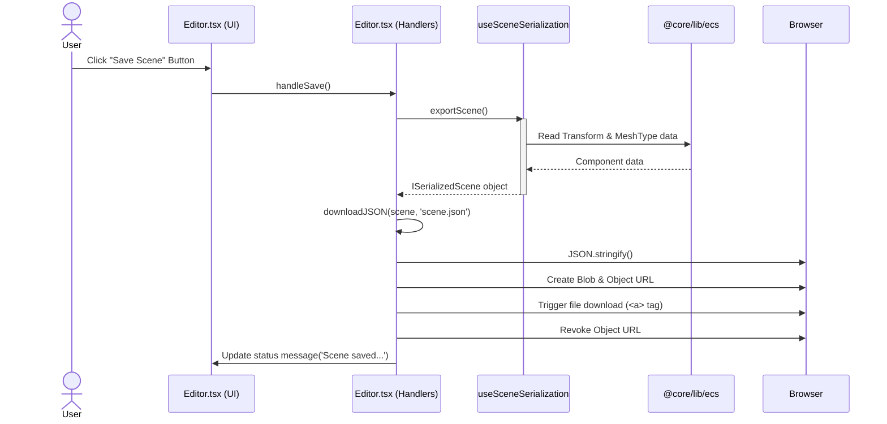
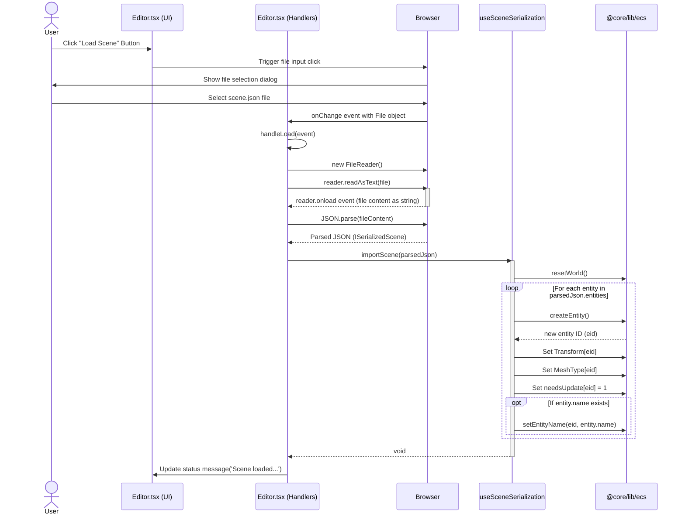
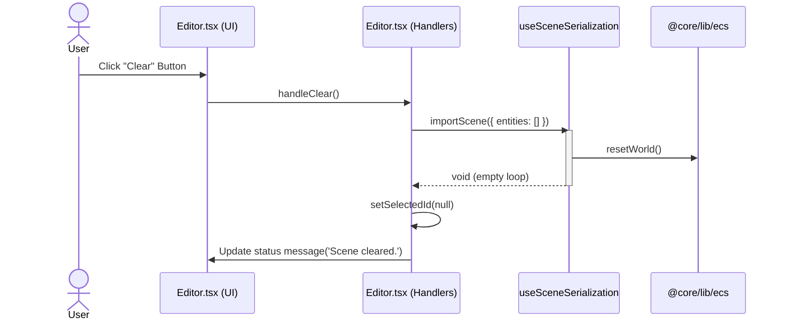

# Game Editor Scene Serialization

This document outlines the functionality for saving and loading scene data within the Vibe Coder 3D Editor.

## Goal

The primary goal is to allow users to save the current state of the scene (entities and their relevant components) to a JSON file and load it back into the editor, enabling persistence of work.

## Current Implementation

Scene serialization is handled by the `useSceneSerialization` hook located at `src/editor/hooks/useSceneSerialization.ts`. This hook provides two core functions:

- `exportScene(): ISerializedScene`: Iterates through all entities in the `bitecs` world that have a `Transform` component. For each valid entity, it extracts its `Transform` and `MeshType` component data and packages it into an `ISerializedEntity` object. It returns an `ISerializedScene` object containing an array of these entities.
- `importScene(scene: ISerializedScene)`: Takes an `ISerializedScene` object as input. It first calls `resetWorld()` from `@core/lib/ecs` to clear the current ECS state. Then, it iterates through the `entities` array in the input scene object. For each serialized entity, it calls `createEntity()` to create a new entity in the world and sets its `MeshType` and `Transform` component data based on the loaded information. It also marks the transform for update (`Transform.needsUpdate[eid] = 1`).

### Integration in Editor.tsx

The `Editor` component (`src/editor/Editor.tsx`) utilizes this hook:

- **Save:** The `handleSave` function calls `exportScene()` to get the scene data and then uses a helper function `downloadJSON` to trigger a browser download of the data as `scene.json`.
- **Load:** The `handleLoad` function is triggered by a hidden file input (`<input type="file">`). When a file is selected, it reads the file content, parses it as JSON, and calls `importScene()` with the parsed data.
- **Clear:** The `handleClear` function effectively loads an empty scene by calling `importScene({ entities: [] })` and resets the selected entity ID.
- **UI:** Buttons for "Save Scene", "Load Scene", and "Clear" are present in the editor's header, wired to these handler functions.

### Save Process Diagram



### Load Process Diagram



### Clear Process Diagram



## Data Format

The serialization format is defined by TypeScript interfaces within `useSceneSerialization.ts`:

```typescript
export interface ISerializedEntity {
  id: number; // Note: This ID is informational during export, not strictly used during import
  name?: string; // Currently not exported, but supported during import
  meshType: MeshTypeEnum;
  transform: {
    position: [number, number, number];
    rotation: [number, number, number, number]; // Quaternion (x, y, z, w)
    scale: [number, number, number];
  };
  // Future components can be added here
}

export interface ISerializedScene {
  entities: ISerializedEntity[];
}
```

## Limitations & Future Improvements

- **Limited Component Support:** Currently, only `Transform` and `MeshType` are serialized. Other components like `Velocity`, `Name` (partially), physics properties, materials, or custom game components are ignored.
- **Basic Error Handling:** File reading/parsing has basic `try...catch` blocks, but there's no validation of the JSON structure against the `ISerializedScene` interface. Invalid files might cause runtime errors or unexpected behavior.
- **No Versioning:** The format doesn't have a version number. If the format changes in the future, loading older scene files might fail.
- **Entity ID Handling:** The exported `id` isn't used during import; entities are recreated sequentially. This is generally fine but prevents maintaining specific entity relationships if needed later.
- **Name Component:** The `ISerializedEntity` interface includes an optional `name`, and `importScene` supports setting it via `setEntityName`, but `exportScene` currently doesn't export the name.

**Potential Enhancements:**

- Add support for serializing more components (e.g., `Velocity`, `Name`, materials, physics settings).
- Implement schema validation (e.g., using Zod or Ajv) during `importScene` to provide better error messages for invalid files.
- Introduce a version number to the `ISerializedScene` format for backward compatibility.
- Enhance the `exportScene` function to include the entity's name using `getEntityName`.
- Consider serializing entity relationships or hierarchy if the editor evolves to support it.
- Improve UI feedback during save/load operations (e.g., loading indicators, more specific success/error messages).
