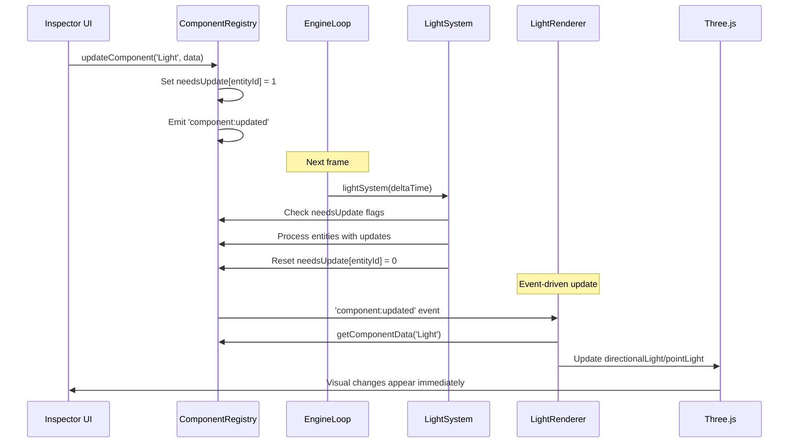

# Lighting System Implementation

## Overview

### Context & Goals

- **Real-time Lighting Updates**: Enable immediate visual feedback when light properties are modified in the inspector, ensuring designers see changes instantly without needing to click or refresh components.
- **ECS Integration**: Proper integration of light components with the ECS system loop, following the same patterns as camera and transform systems.
- **Performance Optimization**: Efficient processing of light updates using the `needsUpdate` flag pattern to avoid unnecessary Three.js light recreations.
- **System Consistency**: Align light processing with other core systems (camera, transform, material) in the EngineLoop execution cycle.

### Current Pain Points

- **No Real-time Updates**: Light property changes don't reflect in the viewport until component is clicked or refreshed, breaking the design workflow.
- **Missing System Integration**: No `lightSystem` in EngineLoop to process the `needsUpdate` flag that's set when light components are modified.
- **Inconsistent Architecture**: While Light component follows ECS patterns, it lacks the system processing that camera and transform components have.
- **Poor User Experience**: Designers must perform extra clicks to see lighting changes, disrupting the iterative design process.

## Proposed Solution

### High-level Summary

- **Create LightSystem**: Implement a `lightSystem` function that processes light components with `needsUpdate` flag, following the established pattern from `cameraSystem` and `transformSystem`.
- **EngineLoop Integration**: Add `lightSystem` to the EngineLoop's system execution order to ensure lights are processed each frame when needed.
- **Event-Driven Updates**: Enhance LightRenderer to properly react to ECS component changes through the existing event system.
- **Manager Pattern**: Implement LightManager component following the proven CameraBackgroundManager pattern for Three.js scene integration.
- **Performance Optimization**: Use the `needsUpdate` flag pattern to only process lights that have actually changed, maintaining 60fps performance.

### Architecture & Directory Structure

```
src/core/
├── systems/
│   ├── lightSystem.ts                    # 🆕 New light processing system
│   ├── cameraSystem.ts                   # ✅ Existing reference pattern
│   └── transformSystem.ts               # ✅ Existing reference pattern
├── components/
│   ├── EngineLoop.tsx                    # 🔄 Add lightSystem integration
│   └── lighting/
│       └── LightManager.tsx              # 🆕 Scene-level light management
└── lib/ecs/components/definitions/
    └── LightComponent.ts                 # ✅ Already has needsUpdate field

src/editor/components/panels/ViewportPanel/
├── LightRenderer.tsx                     # 🔄 Enhanced with event handling
├── ViewportPanel.tsx                     # 🔄 Add LightManager integration
└── components/
    └── LightManager.tsx                  # 🆕 Viewport-specific light management
```

## Implementation Plan

### Phase 1: Core Light System (0.5 day)

1. Create `src/core/systems/lightSystem.ts` following `cameraSystem.ts` pattern
2. Implement light processing with `needsUpdate` flag handling
3. Add comprehensive logging for debugging light updates
4. Unit test the light system functionality

### Phase 2: EngineLoop Integration (0.25 day)

1. Add `lightSystem` import to `EngineLoop.tsx`
2. Integrate light system into the `runECSSystems` execution order
3. Add debug logging to track light system performance
4. Verify system execution through console logging

### Phase 3: Enhanced LightRenderer (0.5 day)

1. Add event-driven updates to `LightRenderer`
2. Implement change detection to avoid unnecessary light recreation
3. Add proper cleanup for disabled lights
4. Optimize light property updates vs full recreation

### Phase 4: Light Manager Pattern (0.5 day)

1. Create `LightManager` component following `CameraBackgroundManager` pattern
2. Implement scene-level light state management
3. Add proper Three.js light lifecycle management
4. Integrate manager into ViewportPanel

### Phase 5: Testing & Optimization (0.25 day)

1. Test real-time updates with all light types
2. Performance testing with multiple lights
3. Edge case testing (disabled lights, light removal)
4. Documentation updates

## File and Directory Structures

### Core System Files

```
src/core/systems/
├── lightSystem.ts                        # Main light processing system
├── cameraSystem.ts                       # Reference implementation
└── transformSystem.ts                    # Reference implementation

src/core/components/
├── EngineLoop.tsx                        # System orchestration
└── lighting/
    └── LightManager.tsx                  # Scene light management
```

### Editor Integration Files

```
src/editor/components/panels/ViewportPanel/
├── LightRenderer.tsx                     # Entity-specific light rendering
├── ViewportPanel.tsx                     # Main viewport coordination
└── components/
    └── LightManager.tsx                  # Viewport light management
```

## Technical Details

### Light System Implementation

```typescript
// src/core/systems/lightSystem.ts
import { defineQuery } from 'bitecs';
import { componentRegistry } from '@core/lib/ecs/ComponentRegistry';
import { ECSWorld } from '@core/lib/ecs/World';
import { LightData } from '@core/lib/ecs/components/definitions/LightComponent';

const world = ECSWorld.getInstance().getWorld();
let lightQuery: ReturnType<typeof defineQuery> | null = null;

function getLightQuery() {
  if (!lightQuery) {
    const lightComponent = componentRegistry.getBitECSComponent('Light');
    if (!lightComponent) return null;
    lightQuery = defineQuery([lightComponent]);
  }
  return lightQuery;
}

export function lightSystem(deltaTime: number): number {
  const query = getLightQuery();
  if (!query) return 0;

  const entities = query(world);
  let updatedCount = 0;

  entities.forEach((eid: number) => {
    const lightComponent = componentRegistry.getBitECSComponent('Light');
    if (!lightComponent?.needsUpdate?.[eid]) return;

    const lightData = componentRegistry.getComponentData<LightData>(eid, 'Light');
    if (!lightData) return;

    // Process light updates (handled by LightRenderer/LightManager)
    console.log(`[lightSystem] Processing light update for entity ${eid}`);

    // Reset the needsUpdate flag
    lightComponent.needsUpdate[eid] = 0;
    updatedCount++;
  });

  return updatedCount;
}
```

### EngineLoop Integration

```typescript
// src/core/components/EngineLoop.tsx (additions)
import { lightSystem } from '../systems/lightSystem';

function runECSSystems(deltaTime: number) {
  // ... existing systems

  // Run light system - processes light component updates
  const lightCount = lightSystem(deltaTime);

  // ... rest of systems

  if (lightCount > 0) {
    console.log(`[EngineLoop] Light system updated ${lightCount} lights`);
  }
}
```

### Enhanced LightRenderer

```typescript
// src/editor/components/panels/ViewportPanel/LightRenderer.tsx (enhancements)
export const LightRenderer: React.FC<ILightRendererProps> = ({ entityId }) => {
  const [lightData, setLightData] = useState<LightData | null>(null);
  const [updateTrigger, setUpdateTrigger] = useState(0);

  // Listen for light component changes
  useEvent('component:updated', (event) => {
    if (event.entityId === entityId && event.componentId === 'Light') {
      setUpdateTrigger((prev) => prev + 1);
    }
  });

  // Update light data when component changes
  useEffect(() => {
    const lightComponent = componentManager.getComponent(entityId, KnownComponentTypes.LIGHT);
    setLightData(lightComponent?.data || null);
  }, [entityId, updateTrigger]);

  // ... rest of implementation
};
```

## Usage Examples

### System Integration

```typescript
// EngineLoop automatically processes light updates
<EngineLoop autoStart={true} debug={false}>
  {/* Light system runs automatically */}
</EngineLoop>
```

### Real-time Light Updates

```typescript
// Inspector changes trigger immediate updates
const handleLightUpdate = (updates: Partial<LightData>) => {
  updateComponent(KnownComponentTypes.LIGHT, updates);
  // System automatically processes update on next frame
};
```

### Multi-Light Management

```typescript
// Multiple lights update efficiently
<Canvas>
  <LightManager />  {/* Manages all scene lights */}
  {lightIds.map(id => (
    <LightRenderer key={id} entityId={id} />
  ))}
</Canvas>
```

## Testing Strategy

### Unit Tests

- Light system processes `needsUpdate` flag correctly
- Component updates trigger proper light recreation
- Performance testing with multiple simultaneous light updates
- Light system handles missing components gracefully

### Integration Tests

- Inspector light changes reflect immediately in viewport
- Multiple light types update correctly (directional, point, spot, ambient)
- Light disable/enable functionality works properly
- Light removal cleanup prevents memory leaks

## Edge Cases

| Edge Case                             | Remediation                                          |
| ------------------------------------- | ---------------------------------------------------- |
| Light component deleted during update | Check component exists before processing             |
| Multiple rapid light updates          | Debounce updates to prevent performance issues       |
| Light with invalid data               | Use default values and log warnings                  |
| Scene with 50+ lights                 | Implement update batching and performance monitoring |
| Light type change during runtime      | Handle light recreation vs property updates          |

## Sequence Diagram



## Risks & Mitigations

| Risk                                        | Mitigation                                                            |
| ------------------------------------------- | --------------------------------------------------------------------- |
| Performance degradation with many lights    | Implement update batching and `needsUpdate` flag optimization         |
| Light updates out of sync with transforms   | Ensure proper system execution order in EngineLoop                    |
| Memory leaks from unused lights             | Implement proper cleanup in LightRenderer and LightManager            |
| Inconsistent light behavior across browsers | Use Three.js standard light implementations and test across platforms |

## Timeline

- **Phase 1**: Core Light System - 0.5 day
- **Phase 2**: EngineLoop Integration - 0.25 day
- **Phase 3**: Enhanced LightRenderer - 0.5 day
- **Phase 4**: Light Manager Pattern - 0.5 day
- **Phase 5**: Testing & Optimization - 0.25 day

**Total Estimated Time**: 2 days

## Acceptance Criteria

- ✅ Light property changes in inspector reflect immediately in viewport
- ✅ All light types (directional, point, spot, ambient) update in real-time
- ✅ No performance degradation with multiple lights (maintain 60fps)
- ✅ Light system integrates seamlessly with existing ECS architecture
- ✅ `needsUpdate` flag pattern works correctly for light components
- ✅ Light disable/enable toggles work instantly
- ✅ Light removal properly cleans up Three.js objects
- ✅ System follows established patterns from camera and transform systems

## Conclusion

The lighting system implementation will complete the ECS integration for light components, enabling real-time updates and maintaining consistency with other engine systems. This addresses the core user experience issue where light changes require manual component interaction to become visible, providing the immediate feedback designers need for efficient lighting workflows.

## Assumptions & Dependencies

- Three.js r150+ for consistent light behavior
- Existing ECS component registry and event system
- React Three Fiber v9+ for proper useFrame integration
- BitECS component system with `needsUpdate` flag support
- Established system patterns from camera and transform systems
