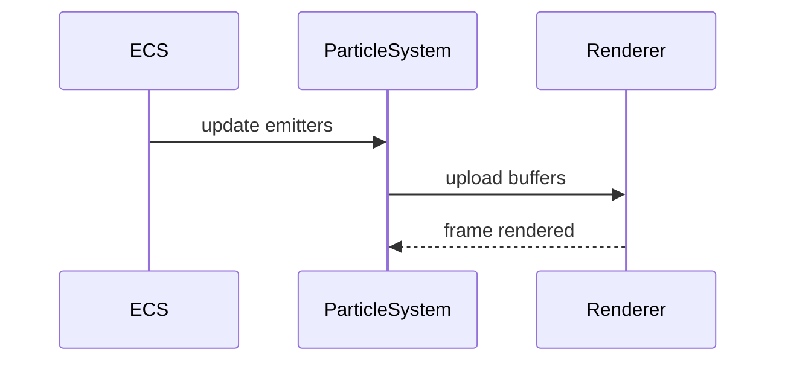

# Particle System PRD

## Overview

### Context & Goals

- Add GPU-accelerated particle effects (muzzle flash, smoke, sparks).
- Author effects via ECS `ParticleComponent` plus presets.
- Support bursts and continuous emitters with lifetime curves.

### Current Pain Points

- No standardized particle effects pipeline.
- Visual feedback missing for actions and impacts.
- Manual effect coding increases coupling and regressions.

## Proposed Solution

### High‑level Summary

- Introduce `ParticleSystem` updating emitter state and GPU buffers.
- Define `ParticleComponent` schema (Zod) with emission and material params.
- Implement instanced/points-based renderer with curves (size, color over time).
- Provide presets and editor-friendly parameters.

### Architecture & Directory Structure

```
/src/core/
  ├── systems/
  │   └── ParticleSystem.ts
  ├── lib/particles/
  │   ├── curves.ts
  │   ├── gpuBuffers.ts
  │   └── materials.ts
  └── components/particles/
      ├── ParticleEmitter.tsx
      └── ParticleComponent.schema.ts
```

## Implementation Plan

1. Phase 1: Core (1 day)

   1. Component schema + emitter lifecycle
   2. CPU sim baseline; instanced rendering
   3. Curves and color/size over lifetime

2. Phase 2: GPU Path (1 day)

   1. GPU buffer management
   2. Materials and sorting strategies
   3. Perf instrumentation

3. Phase 3: Presets & Events (0.5 day)
   1. Common presets (smoke/sparks)
   2. Trigger via events (e.g., collision)

## File and Directory Structures

```
/docs/implementation/
  └── 4-10-particle-system-prd.md
```

## Technical Details

```ts
export interface IParticleComponent {
  maxParticles: number;
  emissionRate?: number; // particles/sec
  burst?: { count: number; interval: number };
  lifetime: [number, number]; // min,max
  startColor?: [number, number, number, number];
  endColor?: [number, number, number, number];
  startSize?: number;
  endSize?: number;
  worldSpace?: boolean;
}

export interface IParticleSystemApi {
  triggerBurst(entityId: number, count?: number): void;
}
```

### Editor & Component Integration

```ts
// 1) Add a new KnownComponentType
// src/core/lib/ecs/IComponent.ts
export const KnownComponentTypes = {
  // ...existing,
  PARTICLES: 'Particles',
} as const;

// 2) Schema & data type
// src/core/components/particles/ParticleComponent.schema.ts
import { z } from 'zod';
export const ParticleComponentSchema = z.object({
  enabled: z.boolean().default(true),
  maxParticles: z.number().int().positive().default(1024),
  emissionRate: z.number().nonnegative().default(0),
  burst: z.object({ count: z.number().int().positive(), interval: z.number().positive() }).optional(),
  lifetime: z.tuple([z.number().positive(), z.number().positive()]).default([0.5, 1.5]),
  startColor: z.tuple([z.number(), z.number(), z.number(), z.number()]).default([1,1,1,1]),
  endColor: z.tuple([z.number(), z.number(), z.number(), z.number()]).default([1,1,1,0]),
  startSize: z.number().positive().default(0.1),
  endSize: z.number().positive().default(0.01),
  worldSpace: z.boolean().default(true),
});
export type ParticleData = z.infer<typeof ParticleComponentSchema>;

// 3) Inspector adapter
// src/editor/components/inspector/adapters/ParticleAdapter.tsx
export const ParticleAdapter: React.FC<{
  particleComponent: IComponent<ParticleData> | null;
  updateComponent: (type: string, data: unknown) => boolean;
  removeComponent: (type: string) => boolean;
}> = ({ particleComponent, updateComponent, removeComponent }) => {
  // form controls for emission, lifetime, colors, sizes
  return null;
};

// 4) Add menu entry + defaults
// src/editor/components/menus/AddComponentMenu.tsx
COMPONENT_DEFINITIONS.push({
  id: KnownComponentTypes.PARTICLES,
  name: 'Particles',
  description: 'GPU-accelerated particle emitter',
  icon: /* choose icon */, category: 'VFX',
});
// handle defaultData
case KnownComponentTypes.PARTICLES:
  defaultData = { enabled: true, maxParticles: 1024, emissionRate: 50, lifetime: [0.5,1.5] };
  break;

// 5) Visualization (optional)
// src/editor/components/panels/ViewportPanel/components/ParticleVisualization.tsx
// draw emitter gizmos, bounds, trajectories when selected

// 6) Runtime registration
// src/core/systems/ParticleSystem.ts
registerSystem({ id: 'core.particles', order: 70, update: (dt) => particleSystem.update(dt) });
```

## Usage Examples

```ts
// Create an emitter and trigger a burst
particles.triggerBurst(entityId, 30);
```

## Testing Strategy

- Unit: curve evaluation, lifetime pool reuse, schema validation.
- Integration: emitter updates in step loop, rendering stability under load.

## Edge Cases

| Edge Case           | Remediation                                         |
| ------------------- | --------------------------------------------------- |
| Excess particles    | Cap by `maxParticles` with LRU replacement          |
| Transparent sorting | Use approximate back-to-front or disable depthWrite |

## Sequence Diagram



## Risks & Mitigations

| Risk         | Mitigation                                 |
| ------------ | ------------------------------------------ |
| GPU overdraw | Limit size, soft particle options, pooling |
| GC pressure  | Reuse buffers; object pools                |

## Timeline

- Total: ~2.5 days (Core 1, GPU 1, Presets 0.5)

## Acceptance Criteria

- Emitters spawn particles with curves and pooling.
- GPU path sustains target FPS for 5k particles.
- Event-triggered effects work (e.g., collisions).

## Conclusion

Adds a scalable particle pipeline with ECS-first authoring and GPU efficiency.

## Assumptions & Dependencies

- Three.js renderer; existing event bus; Zod available.
