🧠 Planning documents standards rule loaded!

# PRD: Code–Editor Round‑Trip Workflow (Stable IDs, Scene API, Overrides, Prefabs, Codegen)

## Overview

- **Context & Goals**

  - Enable building scenes and behavior in code while using the visual editor for spatial and parametric tweaks with immediate feedback.
  - Establish a reliable round‑trip: code defines the base scene; editor tweaks persist as non-destructive overrides and survive rebuilds.
  - Standardize serialization so both runtime and editor load/produce the same format with schema validation.
  - Provide prefabs and optional code generation to accelerate workflows and reduce drift.

- **Current Pain Points**
  - Entity identity is transient (numeric `eid`), making it hard to map editor tweaks back to code-defined entities.
  - Persistence is localStorage-first; no project-level, file-based save/load with source control integration.
  - No shared scene API; editor bootstrap is separate from code-defined scenes.
  - No prefab/blueprint model for reusable code-first entities with per-instance overrides.

## Proposed Solution

- **High‑level Summary**

  - Introduce a `PersistentId` component to give each entity a stable identity; include in serialization and queries.
  - Provide a shared `SceneRegistry` and `defineScene(id, builder)` API; both runtime and editor load scenes via this API.
  - Persist editor changes as per-entity component deltas in `*.overrides.json`, keyed by `PersistentId`; apply on top of the code-built scene during load.
  - Unify serialization in `SceneSerializerV3` in core; editor uses the same serializer for export/import.
  - Add a minimal prefab system (`PrefabRegistry`) for code-defined blueprints plus instance parameters; editor can instantiate and override.
  - Optional: “Export to TypeScript” command to generate a scene module from the current ECS state.
  - Feasibility: Supported by existing `ComponentRegistry` with Zod schemas, editor gizmos that write back to ECS, and current entity/component managers.
  - JSX ECS façade: add light React wrappers (`<Entity>`, `<Transform>`, `<MeshRenderer>`) that register R3F JSX into ECS so regular R3F-style code is editable.

- **Architecture & Directory Structure**

```
src/
  core/
    lib/
      ecs/
        components/
          definitions/
            PersistentIdComponent.ts          # New stable identity component
        serialization/
          SceneSerializerV3.ts                # Unified serializer (runtime+editor)
          SceneDiff.ts                        # Compute diffs vs base for overrides
      scene/
        SceneRegistry.ts                      # defineScene/loadScene APIs
        overrides/
          OverridesStore.ts                   # Load/save overrides files
          OverrideApplier.ts                  # Apply overrides to ECS world
      prefabs/
        PrefabRegistry.ts                     # Register/invoke prefabs
        types.ts                              # Prefab types
  editor/
    hooks/
      useSceneActions.ts                      # Update to use file-based persistence + overrides
      useSceneInitialization.ts               # Load via SceneRegistry and then apply overrides
    utils/
      fileIO.ts                               # FS Access API or download/upload helpers
docs/
  implementation/
    4-11-code-editor-roundtrip-prd.md         # This PRD
```

### JSX ECS Façade (R3F integration)

```
src/
  core/
    components/
      jsx/
        Entity.tsx                # Wraps children, ensures PersistentId, creates ECS entity
        Transform.tsx             # Maps props to ECS Transform component
        MeshRenderer.tsx          # Maps props to ECS MeshRenderer component
```

## Implementation Plan

- **Phase 1: Stable Identity & Serializer Unification (0.5–1 day)**

  1. Add `PersistentIdComponent` (UUID or deterministic path hash) with Zod schema and (de)serialize.
  2. Auto-attach `PersistentId` on entity creation if missing; expose helpers to read/write.
  3. Create `SceneSerializerV3` in `core/lib/serialization` and migrate editor to use it.

- **Phase 2: Shared Scene API (0.5–1 day)**

  1. Implement `SceneRegistry` with `defineScene`, `loadScene(id, world)`.
  2. Move current default bootstrapping into a scene module (`default` scene).
  3. Editor `useSceneInitialization` loads via `SceneRegistry` instead of custom logic.

- **Phase 2b: JSX ECS Façade (0.5–1 day)**

  1. Implement `<Entity>`, `<Transform>`, `<MeshRenderer>` wrappers that register/update ECS components from JSX props.
  2. Support `persistentId` prop on `<Entity>`; auto-generate one if omitted.
  3. Ensure wrappers avoid update loops: props → ECS; gizmos/inspector → ECS; viewport reads ECS only.
  4. Dev warnings when raw R3F meshes are not wrapped by `<Entity>` (non-editable), plus migration hint.

- **Phase 3: Overrides Files (1–1.5 days)**

  1. Implement `SceneDiff` to compute deltas between code-built scene and current world.
  2. Implement `OverridesStore` and `OverrideApplier` keyed by `PersistentId`.
  3. Update editor save/load to write/read `*.overrides.json` (project path or download/upload).

- **Phase 4: Prefabs (1 day)**

  1. Implement `PrefabRegistry` with `definePrefab(id, builder)`.
  2. Add `PrefabInstance` data (component) with `prefabId` and parameter bag.
  3. Update inspector to display prefab linkage and allow per-instance overrides.

- **Phase 5: TypeScript Codegen (optional, 0.5–1 day)**

  1. Add codegen that emits a `defineScene('level-x', builder)` file from current ECS state.
  2. Gate behind editor command; ensure emitted code conforms to named-exports.

- **Phase 6: Integration & Migration (0.5 day)**
  1. Migrate `useSceneActions` off localStorage; enable file-based save/load.
  2. Provide a one-time migration path for existing `scene.json` to `*.overrides.json` + scene module.

## File and Directory Structures

```
src/core/lib/ecs/components/definitions/PersistentIdComponent.ts
src/core/lib/serialization/SceneSerializerV3.ts
src/core/lib/serialization/SceneDiff.ts
src/core/lib/scene/SceneRegistry.ts
src/core/lib/scene/overrides/OverridesStore.ts
src/core/lib/scene/overrides/OverrideApplier.ts
src/core/lib/prefabs/PrefabRegistry.ts
src/core/lib/prefabs/types.ts
src/editor/utils/fileIO.ts
```

```tsx
// src/core/components/jsx/Entity.tsx
import React, { useEffect } from 'react';
import { useEntityManager } from '@/editor/hooks/useEntityManager';
import { useComponentRegistry } from '@/core/hooks/useComponentRegistry';

export type EntityProps = {
  name?: string;
  persistentId?: string;
  children?: React.ReactNode;
};

export const Entity: React.FC<EntityProps> = ({ name = 'Entity', persistentId, children }) => {
  const em = useEntityManager();
  const { addComponent } = useComponentRegistry();
  useEffect(() => {
    const e = em.createEntity(name);
    addComponent(e.id, 'PersistentId', { id: persistentId ?? crypto.randomUUID() });
    return () => em.deleteEntity(e.id);
  }, []);
  return <>{children}</>;
};
```

```tsx
// src/core/components/jsx/Transform.tsx
export type TransformProps = {
  position?: [number, number, number];
  rotation?: [number, number, number];
  scale?: [number, number, number];
};
export const Transform: React.FC<TransformProps> = ({ position, rotation, scale }) => {
  // Reads current entity from context (provided by <Entity>) and updates ECS
  return null;
};
```

```tsx
// src/core/components/jsx/MeshRenderer.tsx
export type MeshRendererProps = {
  meshId: string;
  materialId?: string;
};
export const MeshRenderer: React.FC<MeshRendererProps> = ({ meshId, materialId = 'default' }) => {
  // Adds/updates MeshRenderer on the current entity
  return null;
};
```

## Technical Details

```ts
// src/core/lib/ecs/components/definitions/PersistentIdComponent.ts
import { z } from 'zod';
import { Types } from 'bitecs';
import { ComponentFactory, ComponentCategory } from '@/core/lib/ecs/ComponentRegistry';

export const PersistentIdSchema = z.object({
  id: z.string().uuid().or(z.string().min(8)), // allow UUID or deterministic hash
});

export const persistentIdComponent = ComponentFactory.create({
  id: 'PersistentId',
  name: 'Persistent Id',
  category: ComponentCategory.Core,
  schema: PersistentIdSchema,
  fields: { idHash: Types.ui32 },
  serialize: (eid, comp) => ({ id: /* resolve from idHash */ '' }),
  deserialize: (eid, data, comp) => {
    /* store hash */
  },
});
```

```ts
// src/core/lib/serialization/SceneSerializerV3.ts
export interface SerializedSceneV3 {
  version: 3;
  entities: Array<{
    persistentId: string;
    name?: string;
    parentPersistentId?: string;
    components: Record<string, unknown>;
  }>;
}

export function serializeWorldToV3(): SerializedSceneV3 {
  /* ... */
}
export function deserializeV3IntoWorld(scene: SerializedSceneV3): void {
  /* ... */
}
```

```ts
// src/core/lib/scene/SceneRegistry.ts
export type SceneBuilder = (ctx: { world: unknown }) => void;

const registry = new Map<string, SceneBuilder>();

export function defineScene(id: string, builder: SceneBuilder): void {
  registry.set(id, builder);
}

export function loadScene(id: string, world: unknown): void {
  const builder = registry.get(id);
  if (!builder) throw new Error(`Scene not found: ${id}`);
  builder({ world });
}
```

```ts
// src/core/lib/serialization/SceneDiff.ts
export type OverridePatch = {
  persistentId: string;
  components: Record<string, Partial<unknown>>; // per-component partials
};

export interface OverridesFileV1 {
  version: 1;
  sceneId: string;
  patches: OverridePatch[];
}

export function diffAgainstBase(/* base, current */): OverridesFileV1 {
  /* ... */
}
```

```ts
// src/core/lib/scene/overrides/OverrideApplier.ts
export function applyOverrides(overrides: OverridesFileV1): void {
  /* ... */
}
```

```ts
// src/core/lib/prefabs/types.ts
export type PrefabParams = Record<string, unknown>;
export type PrefabBuilder = (params: PrefabParams) => { entityId: number };
```

```ts
// src/core/lib/prefabs/PrefabRegistry.ts
const prefabs = new Map<string, PrefabBuilder>();
export function definePrefab(id: string, builder: PrefabBuilder): void {
  prefabs.set(id, builder);
}
export function instantiatePrefab(id: string, params: PrefabParams) {
  const b = prefabs.get(id);
  if (!b) throw new Error(id);
  return b(params);
}
```

```ts
// src/editor/utils/fileIO.ts
export async function saveJSONFile(pathHint: string, data: unknown): Promise<void> {
  /* File System Access API or fallback to download */
}
export async function openJSONFile(): Promise<unknown | null> {
  /* ... */
}
```

## Usage Examples

```ts
// 1) Define a scene in code
import { defineScene } from '@/core/lib/scene/SceneRegistry';
import { EntityManager } from '@/core/lib/ecs/EntityManager';
import { componentRegistry } from '@/core/lib/ecs/ComponentRegistry';

export const defineDefaultScene = () =>
  defineScene('default', ({ world }) => {
    const em = EntityManager.getInstance();
    const entity = em.createEntity('Player');
    componentRegistry.addComponent(entity.id, 'PersistentId', { id: 'player-root' });
    componentRegistry.addComponent(entity.id, 'Transform', {
      position: [0, 1, 0],
      rotation: [0, 0, 0],
      scale: [1, 1, 1],
    });
    componentRegistry.addComponent(entity.id, 'MeshRenderer', {
      meshId: 'cube',
      materialId: 'default',
    });
  });
```

```tsx
// 1b) Author with regular R3F style via JSX wrappers (editable in the editor)
import { Entity, Transform, MeshRenderer } from '@/core/components/jsx';

export function Level() {
  return (
    <Entity persistentId="player-root" name="Player">
      <Transform position={[0, 1, 0]} rotation={[0, 0, 0]} scale={[1, 1, 1]} />
      <MeshRenderer meshId="cube" materialId="default" />
    </Entity>
  );
}
```

```ts
// 2) Editor load flow (simplified)
loadScene('default', world);
const overrides = await openJSONFile();
if (overrides) applyOverrides(overrides as OverridesFileV1);
```

```ts
// 3) Save overrides from editor
const base = serializeWorldToV3();
const overrides = diffAgainstBase(/* base, current world */);
await saveJSONFile('default.overrides.json', overrides);
```

## Testing Strategy

- **Unit Tests**

  - `PersistentIdComponent` serialization/deserialization and stable value behavior.
  - `SceneSerializerV3` round-trip: serialize → deserialize → match world state.
  - `SceneDiff` correctness: add/update/remove component fields produce expected patches.
  - `OverrideApplier` determinism and idempotence.
  - `PrefabRegistry` registration, instantiation with parameters.

- **Integration Tests**
  - Load code-defined scene → apply overrides → gizmo changes → save overrides → reload → state matches.
  - Editor inspector edits propagate to ECS and persist in overrides.
  - Migration: load legacy `scene.json` → convert to overrides + scene module → no data loss.

## Edge Cases

| Edge Case                                          | Remediation                                                                              |
| -------------------------------------------------- | ---------------------------------------------------------------------------------------- |
| Entity renamed or reparented                       | Use `PersistentId` for identity; compute parent references by persistent IDs, not names. |
| Entity deleted in code but overrides still present | Ignore unmatched override patches and warn; offer cleanup tool.                          |
| Component schema changed                           | Version `overrides.json`; Zod validate and provide migrations or defaults.               |
| Duplicate `PersistentId`                           | Detect at load and fail fast with clear error + auto-fix suggestion.                     |
| Large models or many entities                      | Apply overrides in batches; avoid re-render storms using event coalescing.               |

## Sequence Diagram

```mermaid
sequenceDiagram
  participant Dev as Developer (code)
  participant Scene as SceneRegistry
  participant World as ECS World
  participant Editor as Editor UI
  participant Store as OverridesStore

  Dev->>Scene: defineScene('default', builder)
  Editor->>Scene: loadScene('default', world)
  Scene->>World: builder({ world })
  Editor->>Store: load overrides (default.overrides.json)
  Store-->>Editor: OverridesFileV1
  Editor->>World: applyOverrides(overrides)
  Editor->>World: gizmo/inspector edits → ECS updates
  Editor->>World: serializeWorldToV3()
  Editor->>Scene: diffAgainstBase(base, current)
  Scene-->>Editor: OverridesFileV1
  Editor->>Store: save overrides
```



## Risks & Mitigations

| Risk                                              | Mitigation                                                                    |
| ------------------------------------------------- | ----------------------------------------------------------------------------- |
| Divergence between editor and runtime serializers | Single `SceneSerializerV3` in core; shared types and tests.                   |
| Instability from retrofitting IDs                 | Auto-attach IDs for missing entities; migration scripts; collision detection. |
| Override patch size growth                        | Diff algorithm only stores changed fields; optional prune tool.               |
| Developer confusion about base vs overrides       | Clear UI indicators and documentation; toggles to view base/overrides.        |

## Timeline

- Phase 1: 0.5–1 day
- Phase 2: 0.5–1 day
- Phase 3: 1–1.5 days
- Phase 4: 1 day
- Phase 5 (optional): 0.5–1 day
- Phase 6: 0.5 day

Total: 3.5–6 days (4.5–7 days including optional codegen).

## Acceptance Criteria

- Unified `SceneSerializerV3` used by both runtime and editor with Zod validation.
- Every entity in editor and code has a `PersistentId`; duplicates are rejected.
- Editor loads code-defined scene via `SceneRegistry` and applies overrides successfully.
- Editor save produces `*.overrides.json` containing only deltas; reload reproduces state.
- Prefab system supports code-defined blueprints and per-instance overrides in the editor.
- Optional: “Export to TypeScript scene” generates a compilable scene file with named exports.

## Conclusion

This plan enables a robust hybrid workflow: code defines structure and behavior, while the editor provides high-fidelity spatial and parametric editing. With stable IDs, a shared scene API, non-destructive overrides, and unified serialization, round‑tripping is reliable and source-control friendly. Prefabs and optional codegen improve velocity without sacrificing clarity.

## Assumptions & Dependencies

- Existing `ComponentRegistry` and editor gizmo/inspector writebacks remain the single source of truth for component data.
- Zod is available and used for all component and scene schemas.
- File persistence can rely on browser File System Access API or download/upload fallbacks during development.
- No server is required; all features work in local dev; CI can validate via unit/integration tests.
