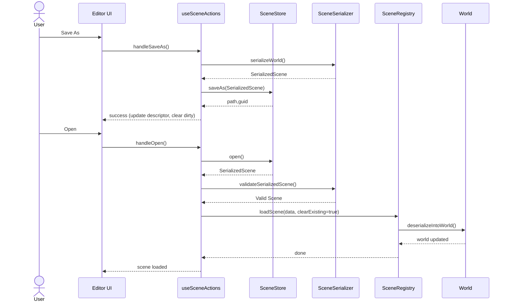

# Scene Management PRD

## 1. Overview

- **Context & Goals**

  - Enable authoring, saving, and loading scenes as external assets (JSON) in addition to code-defined scenes, aligning with Unity’s Scene asset model.
  - Unify runtime/editor serialization using stable persistent IDs to support round‑trip editing and reproducible scene loads.
  - Support saving either full scenes or deltas (overrides) against a code-defined base, enabling a clean separation of base content and editor changes.
  - Provide editor UX for New/Open/Save/Save As/Revert, plus basic additive scene loading analogous to Unity.

- **Current Pain Points**
  - Scenes are primarily code‑defined via `SceneRegistry`; external save/load is only supported for overrides through a separate flow.
  - No canonical “Scene Asset” concept with GUIDs, metadata, or index; discovery and listing are ad‑hoc.
  - No additive scene composition; switching scenes clears the world.
  - Dirty-state tracking and guardrails (e.g., prompt to save changes) are missing.

## 2. Proposed Solution

- **High‑level Summary**

  - Introduce “Scene Assets” stored as JSON (`.scene.json`) validated via Zod (`SerializedSceneSchema`) backed by the existing `PersistentId` component.
  - Extend `SceneRegistry` to load scenes from multiple providers: code, file system (FS Access), and remote endpoint. Treat code scenes as base; data scenes as primary content.
  - Provide a `SceneStore` abstraction for external scene IO (Open/Save/Save As/Delete/List), with browser FS Access API and download/upload fallbacks.
  - Implement dirty tracking and a simple additive loading API (`loadSceneAdditive`) with an active scene concept (mirroring Unity’s Active Scene).
  - Keep overrides: support saving deltas as `.overrides.json` (already implemented) and optionally “apply” overrides into a new full scene file.

- **Architecture & Directory Structure**

```
src/
  core/
    lib/
      scene/
        SceneRegistry.ts                      # Extend to support providers + additive loading
        providers/
          CodeSceneProvider.ts                # Wraps existing code-defined scenes
          FileSceneProvider.ts                # Loads from SceneStore (external .scene.json)
          RemoteSceneProvider.ts              # Optional: loads from HTTP endpoint
        SceneStore.ts                         # Abstracts FS Access / upload-download
        ScenesIndex.ts                        # Optional in-memory index of known scenes
      serialization/
        SceneSerializer.ts                    # Already present; unified serializer (PersistentId)
        SceneDiff.ts                          # Already present; overrides diff
      ecs/
        components/definitions/PersistentIdComponent.ts # Stable identity
  editor/
    hooks/
      useSceneActions.ts                      # Extend: New/Open/Save/SaveAs/Revert + additive
      useSceneInitialization.ts               # Load default, optionally last opened
      useSceneDirtyTracking.ts                # Track and prompt save on switch
    components/shared/
      SceneSelector.tsx                       # Extend: provider-aware list + recent scenes
      SaveIndicator.tsx                       # Dirty state indicator
public/
  scenes/                                     # Example location for saved scenes (downloaded)
    example.scene.json
    example.overrides.json
```

## 3. Implementation Plan

- **Phase 0: Current State Alignment (0.5 day)**

  1. Confirm serializer format (`SerializedSceneSchema`) and `PersistentId` usage across editor/runtime.
  2. Review `OverridesStore` and `OverrideApplier` behavior; note duplication patterns for re‑use.

- **Phase 1: Data Model & Provider Contracts (0.5 day)**

  1. Add `ISceneProvider` and register a default `CodeSceneProvider` that maps existing code scenes.
  2. Define `SceneDescriptor` (id, name, guid, source, path?, tags, updatedAt).
  3. Add `SceneStore` interface for external scene IO with FS Access + fallback.

- **Phase 2: File Scene Provider & SceneStore (0.5–1 day)**

  1. Implement `BrowserSceneStore` using FS Access; fallback to download/upload JSON.
  2. Implement `FileSceneProvider` using `SceneStore` to Open/Save/Save As.
  3. Add `ScenesIndex` (in‑memory; optionally serialized alongside scenes).

- **Phase 3: Editor UX (0.5–1 day)**

  1. Extend `useSceneActions` with New/Open/Save/Save As/Revert and additive loading.
  2. Add `useSceneDirtyTracking` and `SaveIndicator` to show dirty state.
  3. Update `SceneSelector` to show code scenes and external scenes from providers.

- **Phase 4: Overrides Integration (0.5 day)**

  1. Provide two save modes: Full Scene (`serializeWorld`) and Overrides (`diffAgainstBase`).
  2. Add “Apply Overrides to New Scene” flow (merge base+overrides -> save `.scene.json`).

- **Phase 5: Additive Loading & Active Scene (0.5 day)**

  1. Add `loadSceneAdditive(id)`; track active scene; allow `setActiveScene(id)`.
  2. Ensure parenting rules and identity remain correct with multiple loaded scenes.

- **Phase 6: Tests & Docs (0.5 day)**
  1. Unit tests for `SceneStore`, providers, serializer/validator, and overrides merge.
  2. Integration tests for editor flows (Open/Save/Save As/Revert/additive).
  3. Update docs and quickstart.

## 4. File and Directory Structures

```
/src/core/lib/scene/
├── SceneRegistry.ts
├── SceneStore.ts
├── ScenesIndex.ts
└── providers/
    ├── CodeSceneProvider.ts
    ├── FileSceneProvider.ts
    └── RemoteSceneProvider.ts
```

```
/editor/hooks/
├── useSceneActions.ts
├── useSceneInitialization.ts
└── useSceneDirtyTracking.ts
```

```
/public/scenes/
├── sample.scene.json
└── sample.overrides.json
```

## 5. Technical Details

- Scene Asset Schema (existing with minor metadata additions):

```ts
// SceneSerializer.ts (existing)
export const SerializedSceneSchema = z.object({
  entities: z.array(
    z.object({
      persistentId: z.string(),
      name: z.string().optional(),
      parentPersistentId: z.string().optional(),
      components: z.record(z.string(), z.unknown()),
    }),
  ),
  metadata: z
    .object({
      timestamp: z.string(),
      description: z.string().optional(),
      guid: z.string().optional(), // NEW: unique Scene GUID (Unity-like)
      title: z.string().optional(),
      tags: z.array(z.string()).optional(),
    })
    .optional(),
});
```

- Scene Provider Contracts:

```ts
export interface SceneDescriptor {
  id: string; // human-friendly id (e.g., "default" or derived from file)
  guid: string; // stable unique guid
  name: string;
  source: 'code' | 'file' | 'remote';
  path?: string; // file path or URL for file/remote sources
  tags?: string[];
  updatedAt?: string;
}

export interface ISceneProvider {
  list(): Promise<SceneDescriptor[]>;
  get(id: string): Promise<SceneDescriptor | undefined>;
  load(id: string, opts?: { clearExisting?: boolean; additive?: boolean }): Promise<void>;
}
```

- `SceneRegistry` Extensions (sketch):

```ts
export class SceneRegistry {
  registerProvider(provider: ISceneProvider): void;
  listAllScenes(): Promise<SceneDescriptor[]>; // merges providers
  loadScene(id: string, clearExisting = true): Promise<void>;
  loadSceneAdditive(id: string): Promise<void>; // NEW
  getCurrentSceneId(): string | null;
  getActiveSceneId(): string | null; // NEW (for additive)
  setActiveScene(id: string): void; // NEW
}
```

- `SceneStore` Interface:

```ts
export interface ISceneStore {
  open(): Promise<{ scene: SerializedScene; descriptor: Partial<SceneDescriptor> } | null>;
  save(scene: SerializedScene, suggestName?: string): Promise<{ path?: string; guid?: string }>;
  saveAs(scene: SerializedScene, defaultName?: string): Promise<{ path?: string; guid?: string }>;
  delete(path: string): Promise<boolean>;
  // Optional convenience
  download(scene: SerializedScene, filename: string): void;
}
```

- Overrides Flow (existing + “apply to new scene”):

```ts
// Merge base + overrides -> new SerializedScene -> save via SceneStore
function applyOverridesToScene(base: SerializedScene, overrides: OverridesFile): SerializedScene {
  /* ... */
}
```

## 6. Usage Examples

- Load a code-defined scene:

```ts
await sceneRegistry.loadScene('default');
```

- Save current world as external scene asset:

```ts
const data = serializeWorld();
await sceneStore.saveAs(data, 'MyScene.scene.json');
```

- Open an external scene and load it:

```ts
const opened = await sceneStore.open();
if (opened) {
  const valid = validateSerializedScene(opened.scene);
  if (valid) deserializeIntoWorld(valid, true);
}
```

- Additive load (Unity-like multi-scene editing):

```ts
await sceneRegistry.loadSceneAdditive('lighting-kit');
sceneRegistry.setActiveScene('lighting-kit');
```

## 7. Testing Strategy

- **Unit Tests**

  - Serializer round‑trip with hierarchy and `PersistentId`.
  - `SceneStore` open/save/saveAs with FS Access fallback.
  - Providers: `CodeSceneProvider`, `FileSceneProvider` list/get/load.
  - Overrides merge correctness (add/update/remove, name changes).

- **Integration Tests**
  - Editor flows: New/Open/Save/Save As/Revert/Apply Overrides.
  - Loading base code scene, applying overrides, saving new `.scene.json`.
  - Additive loading: ensure parent/child and identities remain consistent.

## 8. Edge Cases

| Edge Case                        | Remediation                                                           |
| -------------------------------- | --------------------------------------------------------------------- |
| Missing component type on import | Validate with Zod; skip unknown components with warning.              |
| Duplicate `persistentId` in file | Detect and re‑map collisions; log error; halt import.                 |
| Scene too large (FS failures)    | Stream or chunk download fallback; warn user.                         |
| Overrides for wrong scene        | Block apply; show scene mismatch (already implemented).               |
| Switching with unsaved changes   | Dirty tracking prompts Save/Discard/Cancel.                           |
| Additive load conflicts          | Namespace collisions prevented by `persistentId`; track active scene. |
| FS Access API unavailable        | Fallback to download/upload JSON.                                     |

## 9. Sequence Diagram



## 10. Risks & Mitigations

| Risk                                           | Mitigation                                                                                      |
| ---------------------------------------------- | ----------------------------------------------------------------------------------------------- |
| Divergence between code scenes and data scenes | Clear provider model; overrides clearly labeled; tooling to apply overrides to new data scenes. |
| FS Access browser support                      | Provide robust upload/download fallback.                                                        |
| Performance on large scenes                    | Incremental serialization, lazy component hydration; profiling.                                 |
| ID collisions across additive scenes           | Always use `PersistentId`; validate and remap if necessary.                                     |
| Editor complexity creep                        | Keep UX minimal initially; defer advanced features (multi-scene editing tools).                 |

## 11. Timeline

- Total estimate: ~3–4 days
  - Phase 0: 0.5d, Phase 1: 0.5d, Phase 2: 0.5–1d, Phase 3: 0.5–1d, Phase 4: 0.5d, Phase 5: 0.5d, Phase 6: 0.5d

## 12. Acceptance Criteria

- Can New/Open/Save/Save As external `.scene.json` using editor UI.
- Loading an external scene reproduces entities, hierarchy, and components via `PersistentId`.
- Overrides can be saved as `.overrides.json` and applied on top of base scenes.
- Optional “Apply Overrides to New Scene” produces a valid `.scene.json` matching the current world.
- Additive `loadSceneAdditive` works; active scene can be set; identities remain stable.
- All schemas validated with Zod; invalid files produce clear errors.

## 13. Conclusion

This plan introduces Unity‑like scene asset workflows while preserving code‑first authoring. It standardizes scene files, adds provider‑based loading, formalizes IO via `SceneStore`, and integrates overrides and additive loading. The result is a robust, editor‑friendly scene system with clean round‑trip behavior.

## 14. Assumptions & Dependencies

- Browser environment with File System Access API; fallback download/upload path required.
- `PersistentIdComponent` remains the stable identity mechanism.
- Zod for schema validation; Yarn/TS stack as currently configured.
- Future: optional remote provider behind authenticated HTTP or project service.
