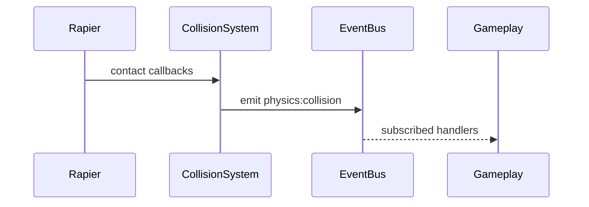

# Collision Detection System PRD

## Overview

### Context & Goals

- Provide reliable collision enter/stay/exit events integrated with ECS.
- Support collision layers/masks, triggers, and queries (raycast/sweep).
- Decouple physics engine details from gameplay logic via event bus.

### Current Pain Points

- No standardized collision event pipeline for gameplay.
- Limited filtering and trigger semantics across entities.
- Hard to test collision-driven logic deterministically.

## Proposed Solution

### High‑level Summary

- Implement `CollisionSystem` that subscribes to Rapier contacts and emits ECS events.
- Define `Collider` component schema (Zod) with layer/mask/trigger flags.
- Provide helpers for raycast/sweep/overlap queries.
- Add optional debug overlay and perf counters.

### Architecture & Directory Structure

```
/src/core/
  ├── systems/
  │   └── CollisionSystem.ts
  ├── lib/physics/collision/
  │   ├── contacts.ts
  │   ├── filters.ts
  │   └── debug.ts
  └── components/physics/
      ├── Collider.tsx
      └── Collider.schema.ts
```

## Implementation Plan

1. Phase 1: Events & Schema (0.5 day)

   1. Define Zod schema for `Collider` (shape, layer, mask, trigger)
   2. Map Rapier contact events to `enter/stay/exit` with entity ids

2. Phase 2: Filtering & Triggers (0.5 day)

   1. Implement layer/mask filtering and trigger-only colliders
   2. Add helpers for queries (raycast/overlap)

3. Phase 3: Integration & Debug (0.5 day)
   1. Emit `physics:collision` via event bus
   2. Optional debug visuals + perf metrics

## File and Directory Structures

```
/docs/implementation/
  └── 4-13-collision-detection-system-prd.md
```

## Technical Details

```ts
export interface ICollisionEvent {
  type: 'enter' | 'stay' | 'exit';
  a: number; // entity id
  b: number; // entity id
  point?: [number, number, number];
  normal?: [number, number, number];
}

export interface IColliderComponent {
  shape: 'box' | 'sphere' | 'capsule' | 'mesh';
  layer: number;
  mask: number;
  isTrigger?: boolean;
}

export interface ICollisionSystemApi {
  on(handler: (e: ICollisionEvent) => void): () => void;
  raycast(origin: [number, number, number], dir: [number, number, number], max?: number): unknown;
}
```

### Editor & Component Integration

```ts
// 1) Extend KnownComponentTypes or reuse MeshCollider
// src/core/lib/ecs/IComponent.ts
export const KnownComponentTypes = {
  // ...existing,
  MESH_COLLIDER: 'MeshCollider',
  // optionally COLLIDER: 'Collider'
} as const;

// 2) Schema additions (layer/mask/trigger)
// src/core/lib/ecs/components/definitions/MeshColliderComponent.ts
export const MeshColliderSchema = z.object({
  enabled: z.boolean().default(true),
  colliderType: z.enum(['box', 'sphere', 'capsule', 'mesh']).default('box'),
  isTrigger: z.boolean().default(false),
  layer: z.number().int().nonnegative().default(1),
  mask: z.number().int().nonnegative().default(0xffffffff),
  // existing size/material fields
});

// 3) Inspector adapter fields
// src/editor/components/inspector/adapters/MeshColliderAdapter.tsx
// expose layer, mask (hex), isTrigger with validation and tooltips

// 4) Visualization hooks
// src/editor/components/panels/ViewportPanel/EntityColliderVisualization.tsx
// already present; add color coding for triggers vs solids

// 5) Runtime system registration
// src/core/systems/CollisionSystem.ts
registerSystem({ id: 'core.collision', order: 40, update: (dt) => collisionSystem.update(dt) });
// order: before scripts that consume events, after physics step

// 6) Event emission
// src/core/lib/events.ts
// use emit('physics:collision', { entityA, entityB, point }) from system callbacks
```

## Usage Examples

```ts
// Subscribe to collision events
const off = collision.on((e) => {
  if (e.type === 'enter') {
    // handle pickup, damage, etc.
  }
});
```

## Testing Strategy

- Unit: layer/mask filtering, trigger semantics, event coalescing.
- Integration: deterministic enter/stay/exit under fixed timestep.

## Edge Cases

| Edge Case          | Remediation                        |
| ------------------ | ---------------------------------- |
| Fast-moving bodies | CCD configuration; step capping    |
| Contact spam       | Coalesce events per pair per frame |

## Sequence Diagram



## Risks & Mitigations

| Risk                 | Mitigation                            |
| -------------------- | ------------------------------------- |
| Performance at scale | Batch events; pooling; thresholds     |
| Flaky enter/exit     | Track pair states; robust transitions |

## Timeline

- Total: ~1.5 days (Events 0.5, Filtering 0.5, Integration 0.5)

## Acceptance Criteria

- Enter/stay/exit events emitted with correct entities and filtering.
- Triggers do not produce physical response but emit events.
- Raycast/overlap helpers available to gameplay.

## Conclusion

Establishes a clean, testable collision pipeline powering core interactions.

## Assumptions & Dependencies

- Rapier available; event bus in place; Zod for schemas.
