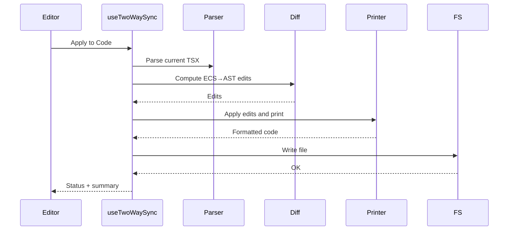

# JSX ↔ ECS Two-Way Sync PRD

## 1. Overview

### Context & Goals

- Enable seamless two-way synchronization between JSX-authored scenes (TSX) and the live ECS world.
- Preserve developer control and code quality (formatting, comments, structure) while allowing editor-driven changes.
- Support incremental adoption: minimal AST edits for high-confidence changes; fall back to overrides when ambiguous.
- Provide robust identity and conflict resolution to avoid drift and data loss.

### Current Pain Points

- Editor changes do not persist back to TSX scenes; code is a write-only seed.
- Direct scene edits in TSX are not reflected in the live ECS until manual reload.
- No stable identity between code elements and ECS entities/components → fragile mapping.
- Risk of formatting churn or comment loss when programmatically writing files.

## 2. Proposed Solution

### High‑level Summary

- Introduce `PersistentId` identity and lightweight code anchors for resilient mapping.
- Code → ECS: parse TSX via ts-morph/recast, build a scene graph, hydrate ECS; validate via Zod.
- ECS → Code: compute diffs vs current AST and emit minimal node/prop edits; format with Prettier; preserve comments.
- Conflict handling: last-writer-wins + UI surfaced conflicts with accept/revert; debounce writes.
- UX: Auto-sync toggle; explicit Pull from Code / Apply to Code commands; per-change preview.

### Architecture & Directory Structure

```text
src/
  core/
    lib/
      serialization/
        SceneDiff.ts                 # Already exists; extend for JSX-aware diffs
      jsx-sync/
        ast/
          parser.ts                  # TSX parse -> AST with positions, comments
          printer.ts                 # AST -> code (recast + Prettier)
          utils.ts                   # Node finders, prop edit helpers
        mapping/
          identity.ts                # PersistentId mapping, anchors, roundtrips
          schema.ts                  # Zod schemas for code-side scene nodes
        sync/
          codeToWorld.ts             # TSX -> ECS hydration
          worldToCode.ts             # ECS diffs -> AST edits
          conflict.ts                # Conflict detection/resolution
  editor/
    hooks/
      useTwoWaySync.ts              # Orchestrates sync, debounce, commands
    components/panels/
      SyncStatus.tsx                # Status, conflicts, actions
```

## 3. Implementation Plan

- Phase 1: Identity & Schema (0.5 day)

  1. Enforce `PersistentId` for `Entity` and stable ids for components.
  2. Add Zod schemas representing code-scene nodes (Entity, Transform, etc.).
  3. Store mapping (eid ↔ persistentId ↔ AST location/anchor).

- Phase 2: Code → ECS (0.5–1.0 day)

  1. Build `parser.ts` (ts-morph or @babel/parser + recast) to parse TSX scenes.
  2. Extract entities/components into normalized structure; validate with Zod.
  3. Implement `codeToWorld.ts` to hydrate/patch ECS.

- Phase 3: World → Code (1.0–1.5 days)

  1. Extend `SceneDiff` to generate JSX-aware diffs (add/remove/update entity/component/props).
  2. Implement AST edit helpers (insert node, update prop, remove subtree) with minimal surface change.
  3. Implement `printer.ts` to print with recast, then format with Prettier.

- Phase 4: Conflict & UX (0.5–1.0 day)

  1. Detect concurrent edits (file timestamp, git index, in-memory change set).
  2. Provide `SyncStatus.tsx` with conflict list and actions.
  3. Debounce save; batch edits; allow manual “Apply/Pull”.

- Phase 5: Editor Integration (0.5 day)
  1. `useTwoWaySync.ts` hook exposes: enable/disable auto-sync, pull/apply, status, last sync summary.
  2. Wire into existing save/load flows; add keybindings.

## 4. File and Directory Structures

```text
src/core/lib/jsx-sync/
├── ast/
│   ├── parser.ts
│   ├── printer.ts
│   └── utils.ts
├── mapping/
│   ├── identity.ts
│   └── schema.ts
└── sync/
    ├── codeToWorld.ts
    ├── worldToCode.ts
    └── conflict.ts

src/editor/hooks/useTwoWaySync.ts
src/editor/components/panels/SyncStatus.tsx
```

## 5. Technical Details

- Identity

```ts
// identity.ts
export type PersistentId = string; // human-friendly, stable
export interface IAstAnchor {
  start: number;
  end: number;
  path: string[];
}
export interface IEntityBinding {
  persistentId: PersistentId;
  ast?: IAstAnchor;
  entityId?: number;
}
export function bindEntity(persistentId: PersistentId, ast: IAstAnchor, entityId?: number): void {}
export function findByPersistentId(id: PersistentId): IEntityBinding | undefined {}
```

- AST Parse/Print

```ts
// parser.ts
export function parseTsx(source: string): AstRoot {}
export function findEntityNodes(ast: AstRoot): AstEntityNode[] {}

// printer.ts
export function applyEdits(ast: AstRoot, edits: AstEdit[]): AstRoot {}
export function print(ast: AstRoot): string {}
```

- Sync APIs

```ts
// codeToWorld.ts
export async function applyCodeToWorld(
  filePath: string,
): Promise<{ created: number; updated: number; removed: number }>;

// worldToCode.ts
export async function applyWorldToCode(
  filePath: string,
): Promise<{ edits: number; conflicts: number }>;
```

## 6. Usage Examples

- Pull from code

```ts
await applyCodeToWorld('src/game/scenes/jsxExampleScene.tsx');
```

- Apply editor changes to code

```ts
await applyWorldToCode('src/game/scenes/jsxExampleScene.tsx');
```

- Enable auto-sync

```ts
const { enableAutoSync } = useTwoWaySync();
enableAutoSync(true);
```

## 7. Testing Strategy

- Unit Tests

  - Parse/print roundtrip preserves comments and formatting (snapshot-based).
  - Identity binding survives insertions/removals nearby.
  - Diff generation for add/update/remove produces minimal AST edits.

- Integration Tests
  - Modify a component prop in editor → code updates single prop.
  - Add entity in editor → code inserts a new `<Entity>` subtree.
  - Edit TSX and save → ECS updates without duplicates; identities preserved.

## 8. Edge Cases

| Edge Case                                        | Remediation                                                    |
| ------------------------------------------------ | -------------------------------------------------------------- |
| Missing `PersistentId` on an entity              | Auto-generate id and insert prop in code; warn in UI.          |
| Complex expressions in props (functions, spread) | Skip with warning; require manual edit.                        |
| Significant code refactors between syncs         | Fallback to “Pull from code” full refresh; keep overrides.     |
| Formatting/style drift                           | Use recast + Prettier; minimal edits; respect existing config. |
| Merge conflicts on disk                          | Pause auto-sync; show conflict UI; require manual resolution.  |

## 9. Sequence Diagram



## 10. Risks & Mitigations

| Risk                        | Mitigation                                               |
| --------------------------- | -------------------------------------------------------- |
| AST edits break code        | Validate with TS; small, targeted edits; snapshots.      |
| Performance on large scenes | Debounce, batch, incremental edits, workerize parsing.   |
| Unhandled TSX patterns      | Guard with Zod; provide fallbacks and warnings.          |
| Identity drift              | Enforce `PersistentId`; maintain mapping cache; anchors. |

## 11. Timeline

- Total: ~3–4 days
  - Phase 1: 0.5d
  - Phase 2: 0.5–1.0d
  - Phase 3: 1.0–1.5d
  - Phase 4: 0.5–1.0d
  - Phase 5: 0.5d

## 12. Acceptance Criteria

- Editor can add/update/remove entities/components and see minimal TSX edits persisted.
- TSX edits reflect in ECS without duplicates or identity loss.
- Formatting and comments preserved; conflicts surfaced with user controls.
- Auto-sync toggle and manual Pull/Apply commands available with status feedback.

## 13. Conclusion

Two-way JSX ↔ ECS sync elevates TSX scenes to first-class, live-editable sources of truth, enabling ergonomic R3F authoring alongside powerful in-editor workflows without sacrificing code quality.

## 14. Assumptions & Dependencies

- Use `PersistentId` on entities; Zod for validation.
- ts-morph or @babel/parser + recast for AST; Prettier for formatting.
- Existing `SceneDiff` extended, not replaced.
