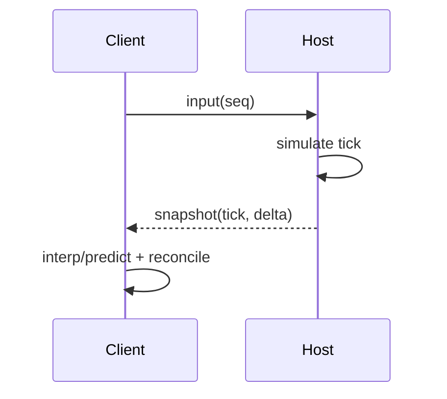

# Networking System PRD

## Overview

### Context & Goals

- Add multiplayer capabilities with host-authoritative simulation.
- Synchronize entities with snapshot interpolation and client prediction.
- Provide transport-agnostic API (WebSocket/WebRTC).

### Current Pain Points

- No networking abstractions or replication model.
- Hard to reason about authority, latency, and reconciliation.
- No message schema/versioning or interest management.

## Proposed Solution

### High‑level Summary

- Introduce `NetworkingSystem` orchestrating ticks, replication, and prediction gates.
- Define message schemas (inputs, snapshots, acks) with versioning.
- Implement host authority with delta snapshots and interpolation on clients.
- Add interest management and bandwidth capping.

### Architecture & Directory Structure

```
/src/core/networking/
  ├── Transport.ts (WS/RTC adapters)
  ├── Protocol.ts (schemas)
  ├── Replication.ts
  └── Prediction.ts
/src/core/systems/
  └── NetworkingSystem.ts
```

## Implementation Plan

1. Phase 1: Transport & Protocol (1 day)

   1. Transport abstraction + WS adapter
   2. Protocol schemas (inputs/snapshots/acks)

2. Phase 2: Host Authority (1 day)

   1. Server tick loop; snapshot generation
   2. Delta compression; clock sync

3. Phase 3: Client Interp/Pred (1 day)

   1. Snapshot buffer + interpolation
   2. Client prediction + reconciliation

4. Phase 4: Interest & QoS (0.5 day)

   1. Relevance/area sets; rate limits
   2. Basic metrics and profiling

## File and Directory Structures

```
/docs/implementation/
  └── 4-14-networking-system-prd.md
```

## Technical Details

```ts
export interface IPlayerInputMsg {
  t: number; // client time
  seq: number; // monotonic
  axes: number[];
  buttons: number[];
}

export interface ISnapshotMsg {
  tick: number;
  entities: Array<{ id: number; comp: Record<string, unknown> }>;
}

export interface INetworkingApi {
  connect(url: string): Promise<void>;
  sendInput(msg: IPlayerInputMsg): void;
  onSnapshot(cb: (s: ISnapshotMsg) => void): () => void;
}
```

### Editor & Component Integration

```ts
// 1) Add replication flags to KnownComponentTypes or separate component
// src/core/lib/ecs/IComponent.ts
export const KnownComponentTypes = {
  // ...existing
  NETWORKED: 'Networked', // marks entity for replication
} as const;

// 2) Schema & data type
// src/core/networking/NetworkedComponent.schema.ts
import { z } from 'zod';
export const NetworkedComponentSchema = z.object({
  mode: z.enum(['owner', 'replica', 'authority']).default('replica'),
  interestMask: z.number().int().nonnegative().default(0xffffffff),
  sendRateHz: z.number().positive().default(20),
  interpDelayMs: z.number().nonnegative().default(100),
});
export type NetworkedData = z.infer<typeof NetworkedComponentSchema>;

// 3) Inspector adapter
// src/editor/components/inspector/adapters/NetworkingAdapter.tsx
export const NetworkingAdapter: React.FC<{
  netComponent: IComponent<NetworkedData> | null;
  updateComponent: (type: string, data: unknown) => boolean;
  removeComponent: (type: string) => boolean;
}> = ({ netComponent, updateComponent, removeComponent }) => {
  // controls for mode, interestMask (hex), rates, interp delay
  return null;
};

// 4) Add to AddComponentMenu with defaults
// src/editor/components/menus/AddComponentMenu.tsx
COMPONENT_DEFINITIONS.push({
  id: KnownComponentTypes.NETWORKED,
  name: 'Networked',
  description: 'Replication settings for multiplayer',
  icon: /* choose icon */, category: 'Networking',
});
case KnownComponentTypes.NETWORKED:
  defaultData = { mode: 'replica', interestMask: 0xffffffff, sendRateHz: 20, interpDelayMs: 100 };
  break;

// 5) System registration & ordering
// src/core/systems/NetworkingSystem.ts
registerSystem({ id: 'core.networking', order: 30, update: (dt) => networking.update(dt) });
// Note: built-in EngineLoop runs Transform/Material/Camera before registered systems.
// Network-applied component changes will be visible next frame in TransformSystem.

// 6) Input capture integration
// src/core/hooks/useInput.ts (client)
// periodically package actions -> IPlayerInputMsg and send via INetworkingApi

// 7) Snapshot application
// src/core/networking/Replication.ts
// apply snapshot deltas to ECS components (Transform, RigidBody, etc.) respecting authority rules
```

## Usage Examples

```ts
await net.connect(url);
net.sendInput({ t: performance.now(), seq, axes, buttons });
```

## Testing Strategy

- Unit: schema validation, delta encode/decode.
- Integration: jitter/packet loss simulation; reconciliation correctness.

## Edge Cases

| Edge Case   | Remediation                         |
| ----------- | ----------------------------------- |
| Packet loss | Acks + resend; interpolation buffer |
| Clock drift | Periodic sync; smoothed adjustments |

## Sequence Diagram



## Risks & Mitigations

| Risk      | Mitigation                             |
| --------- | -------------------------------------- |
| Desync    | Authoritative host; periodic hard sync |
| Bandwidth | Interest mgmt; delta compression       |

## Timeline

- Total: ~3.5 days (1 + 1 + 1 + 0.5)

## Acceptance Criteria

- Clients connect and receive interpolated snapshots.
- Inputs acknowledged and reconciled; stable under jitter/loss.
- Transport swap (WS/RTC) without API changes.

## Conclusion

Provides a pragmatic foundation for multiplayer with clear authority and smooth visuals.

## Assumptions & Dependencies

- Existing ECS diffing; stable tick from engine loop; Zod for schemas.
