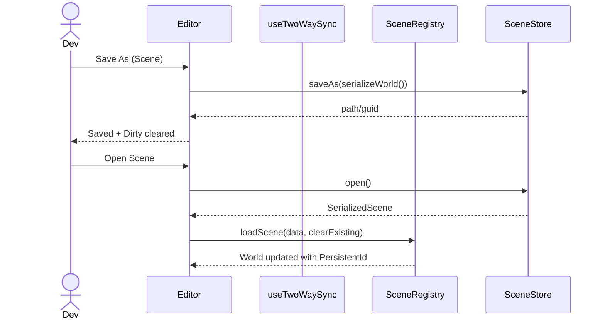

# Editor ↔ TSX Two‑Way Binding Preparation PRD

## 1. Overview

- **Context & Goals**

  - Prepare the codebase for safe, incremental adoption of two‑way synchronization between the Editor (ECS world) and TSX scene files.
  - Strengthen identity, serialization, and scene lifecycle so round‑trip editing is reliable and low‑risk.
  - Establish interfaces, directory layout, validation, and UX hooks before implementing AST edits.
  - Ensure formatting/comment preservation strategy and conflict handling are designed up‑front.

- **Current Pain Points**
  - Editor changes persist via overrides only; TSX source of truth is not round‑trippable today.
  - Identity mapping between code elements and ECS entities/components is not consistently enforced.
  - No canonical TSX scene DSL constraints; unconstrained JSX would make AST edits risky.
  - Missing UX surface for pull/apply operations and conflict visibility.

## 2. Proposed Solution

- **High‑level Summary**

  - Enforce `PersistentId` as stable identity for all entities; validate across editor and runtime.
  - Normalize scene serialization and finalize provider‑based `SceneRegistry` for code/data scenes.
  - Define a constrained TSX scene DSL and validation rules (documentation + Zod schemas) to bound AST edit complexity later.
  - Introduce mapping and manifests (PersistentId ↔ AST anchor ↔ EntityId) with storage and lifecycle hooks.
  - Add editor‑level commands and status surfaces (no AST edits yet): “Pull from Code” skeleton, “Apply to Code” placeholder, auto‑sync toggle wiring (disabled until feature lands).

- **Architecture & Directory Structure**

```
src/
  core/
    lib/
      scene/
        SceneRegistry.ts                      # providerized scene loading (extend)
        providers/
          CodeSceneProvider.ts                # maps code-defined scenes
          FileSceneProvider.ts                # external .scene.json via SceneStore
          RemoteSceneProvider.ts              # optional HTTP provider
        SceneStore.ts                         # FS Access + upload/download abstraction
        ScenesIndex.ts                        # in-memory/serializable index
      serialization/
        SceneSerializer.ts                    # unified serializer w/ PersistentId
        SceneDiff.ts                          # overrides diff (extend tests)
      jsx-sync/
        mapping/
          identity.ts                         # PersistentId↔AST anchor↔EntityId interfaces only
          schema.ts                           # Zod for code-side scene nodes (constraints)
        sync/
          contracts.ts                        # interfaces for future pull/apply; no impl yet
  editor/
    hooks/
      useTwoWaySync.ts                        # orchestrates commands & status (no AST edits)
      useSceneDirtyTracking.ts                # dirty state & prompts
    components/panels/
      SyncStatus.tsx                          # status + conflict placeholder UI
    components/shared/
      SaveIndicator.tsx                       # dirty indicator (extend)
```

## 3. Implementation Plan

- **Phase 0: Current State Audit (0.5 day)**

  1. Verify `PersistentId` presence for all entities created by scenes and editor tools.
  2. Confirm `SerializedSceneSchema` parity across import/export and extend tests.
  3. Catalog existing scene entry points (`SceneRegistry`) and overrides flow.

- **Phase 1: Identity Enforcement & Validation (0.5 day)**

  1. Add runtime validation to ensure each entity has `PersistentId` on creation.
  2. Add Zod guards around scene import to reject duplicates/missing IDs with actionable errors.
  3. Document ID generation rules; define migration guidance for legacy entities.

- **Phase 2: Providerized Scene Lifecycle (0.5–1.0 day)**

  1. Finalize `ISceneProvider` and `SceneStore` interfaces; wire `CodeSceneProvider`, `FileSceneProvider` skeletons.
  2. Extend `SceneRegistry` to list and load from multiple providers; add `loadSceneAdditive` API design.
  3. Provide `ScenesIndex` in-memory model and optional persistence format.

- **Phase 3: Serialization Normalization & Tests (0.5–1.0 day)**

  1. Ensure `SceneSerializer` includes hierarchy and metadata; align with provider IO.
  2. Expand unit tests for serialize/deserialize round‑trip preserving `PersistentId` & parenting.
  3. Add tests around overrides diff stability (unchanged formatting semantics).

- **Phase 4: TSX Scene DSL Specification (0.5 day)**

  1. Define supported JSX patterns (Entity + simple component tags with literal props; no spreads/functions).
  2. Write Zod schemas for code‑side nodes in `jsx-sync/mapping/schema.ts` (no parser yet).
  3. Publish developer guidelines and migration notes in `/docs`.

- **Phase 5: Mapping & Manifests (0.5 day)**

  1. Specify `identity.ts` interfaces for PersistentId ↔ AST anchor ↔ EntityId mapping (no persistence impl yet).
  2. Define manifest file format (optional) to aid recovery when anchors drift.
  3. Lifecycle hooks for when scenes load/unload and when editor selection changes.

- **Phase 6: Editor UX Scaffolding (0.5 day)**

  1. Add `useTwoWaySync.ts` with command placeholders: `pullFromCode`, `applyToCode`, `enableAutoSync`.
  2. Implement `SyncStatus.tsx` for status display and conflict placeholders.
  3. Extend dirty tracking and save indicator to integrate with provider flows.

- **Out of Scope (for this PRD)**
  - Implementing TSX parsing/printing, AST edits, or actual two‑way synchronization.
  - Auto‑sync behavior and code modification logic.

## 4. File and Directory Structures

```
/src/core/lib/jsx-sync/
├── mapping/
│   ├── identity.ts          # interfaces & docs only
│   └── schema.ts            # Zod schemas for DSL nodes
└── sync/
    └── contracts.ts         # pull/apply interfaces, error types, events

/src/core/lib/scene/
├── SceneRegistry.ts         # extend with providers & additive APIs
├── SceneStore.ts            # FS Access abstraction
├── ScenesIndex.ts           # optional index
└── providers/
    ├── CodeSceneProvider.ts # provider contract impl (skeleton)
    ├── FileSceneProvider.ts # provider contract impl (skeleton)
    └── RemoteSceneProvider.ts

/src/editor/
├── hooks/
│   ├── useTwoWaySync.ts
│   └── useSceneDirtyTracking.ts
└── components/
    └── panels/SyncStatus.tsx
```

## 5. Technical Details

- **Identity Contracts**

```ts
// identity.ts (interfaces only)
export type PersistentId = string;

export interface AstAnchor {
  start: number;
  end: number;
  path: string[]; // stable locator within a TSX file
}

export interface EntityBinding {
  filePath: string;
  persistentId: PersistentId;
  entityId?: number;
  ast?: AstAnchor;
}

export interface IdentityMappingStore {
  bind(binding: EntityBinding): void;
  findById(filePath: string, id: PersistentId): EntityBinding | undefined;
  removeById(filePath: string, id: PersistentId): void;
  clearForFile(filePath: string): void;
}
```

- **Scene Providers & Store**

```ts
// SceneStore.ts
export interface SceneDescriptor {
  id: string;
  guid: string;
  name: string;
  source: 'code' | 'file' | 'remote';
  path?: string;
  tags?: string[];
  updatedAt?: string;
}

export interface ISceneStore {
  open(): Promise<{ scene: unknown; descriptor: Partial<SceneDescriptor> } | null>;
  save(scene: unknown, suggestName?: string): Promise<{ path?: string; guid?: string }>;
  saveAs(scene: unknown, defaultName?: string): Promise<{ path?: string; guid?: string }>;
  delete(path: string): Promise<boolean>;
}

// providers/contracts
export interface ISceneProvider {
  list(): Promise<SceneDescriptor[]>;
  get(id: string): Promise<SceneDescriptor | undefined>;
  load(id: string, opts?: { clearExisting?: boolean; additive?: boolean }): Promise<void>;
}
```

- **Two‑Way Sync Contracts (placeholders only)**

```ts
// sync/contracts.ts
export interface PullFromCodeResult {
  created: number;
  updated: number;
  removed: number;
}
export interface ApplyToCodeResult {
  edits: number;
  conflicts: number;
}

export interface TwoWaySync {
  pullFromCode(filePath: string): Promise<PullFromCodeResult>;
  applyToCode(filePath: string): Promise<ApplyToCodeResult>;
  enableAutoSync(enable: boolean): void;
}
```

- **TSX Scene DSL (documented constraints)**

```tsx
// Allowed (Phase 1): literal props only; no spreads or inline functions
<Entity persistentId="hero">
  <Transform position={[0, 1, 0]} rotation={[0, 0, 0, 1]} scale={[1, 1, 1]} />
  <MeshRenderer mesh="crate" material="mat/crate" />
</Entity>
```

## 6. Usage Examples (Planned)

- **List scenes via providers**

```ts
const scenes = await sceneRegistry.listAllScenes();
```

- **Dirty tracking**

```ts
const { isDirty, markDirty, clearDirty } = useSceneDirtyTracking();
```

- **Two‑way commands (no‑op placeholders)**

```ts
const { pullFromCode, applyToCode, enableAutoSync } = useTwoWaySync();
await pullFromCode('src/game/scenes/MyScene.tsx');
```

## 7. Testing Strategy

- **Unit Tests**

  - Identity: ensure `PersistentId` enforcement and duplicate detection.
  - Serialization: round‑trip preserves hierarchy, names, and IDs.
  - Providers: `list/get/load` contracts (mocks for `SceneStore`).
  - Dirty tracking: state transitions and prompts.

- **Integration Tests**
  - Load code scene via `SceneRegistry` provider; entities appear with stable IDs.
  - Save scene via `SceneStore`; reload reproduces identical entities.
  - Overrides diff stability against unchanged world.

## 8. Edge Cases

| Edge Case                            | Remediation                                             |
| ------------------------------------ | ------------------------------------------------------- |
| Missing `PersistentId`               | Auto‑generate on import; warn; block save until fixed.  |
| Duplicate IDs across additive scenes | Validate; remap with deterministic suffix; log mapping. |
| Unsupported JSX usage (early phases) | Lint rule + docs; skip edits; fallback to overrides.    |
| Provider load failures               | Clear error UI; keep world unchanged; suggest retry.    |
| Large scenes                         | Debounce provider IO; progressive loading in UI.        |

## 9. Sequence Diagram (Preparation Flows)



## 10. Risks & Mitigations

| Risk                                     | Mitigation                                                   |
| ---------------------------------------- | ------------------------------------------------------------ |
| Identity drift during migrations         | Enforce at creation; validate on import; migration tools.    |
| Formatting churn when edits arrive later | Use recast + Prettier; design minimal edits; snapshot tests. |
| Provider complexity                      | Keep initial providers minimal; document extension points.   |
| UX confusion (multiple flows)            | Clear commands; status surfaces; docs and prompts.           |

## 11. Timeline

- Total: ~3–4 days (preparation only)
  - Phase 0: 0.5d; Phase 1: 0.5d; Phase 2: 0.5–1.0d; Phase 3: 0.5–1.0d; Phase 4: 0.5d; Phase 5: 0.5d; Phase 6: 0.5d

## 12. Acceptance Criteria

- `PersistentId` enforced for all entities in editor and scenes; duplicate detection in place.
- `SceneRegistry` supports provider model and additive load API surface (design + skeletons).
- `SceneStore` abstraction defined; file provider skeleton operational (mocked/e2e testable).
- Serialization round‑trip tests pass with hierarchy, names, metadata.
- TSX scene DSL constraints documented and validated by Zod (no parser/edits yet).
- `useTwoWaySync` commands and `SyncStatus` UI exist as scaffolding (no AST edits).
- Edge cases documented with remediation; CI tests cover identity/serialization/providers.

## 13. Conclusion

This preparation isolates risk by stabilizing identity, scene IO, and UX scaffolding before any AST/code edits. With providers, schemas, and contracts in place, the codebase will be ready to safely implement two‑way Editor ↔ TSX synchronization in a subsequent iteration.

## 14. Assumptions & Dependencies

- TypeScript + Yarn stack; TS path aliases for imports.
- Zod for schema validation; Prettier configured for formatting.
- Browser FS Access API available with upload/download fallback.
- Existing overrides system remains available as a safe fallback.
