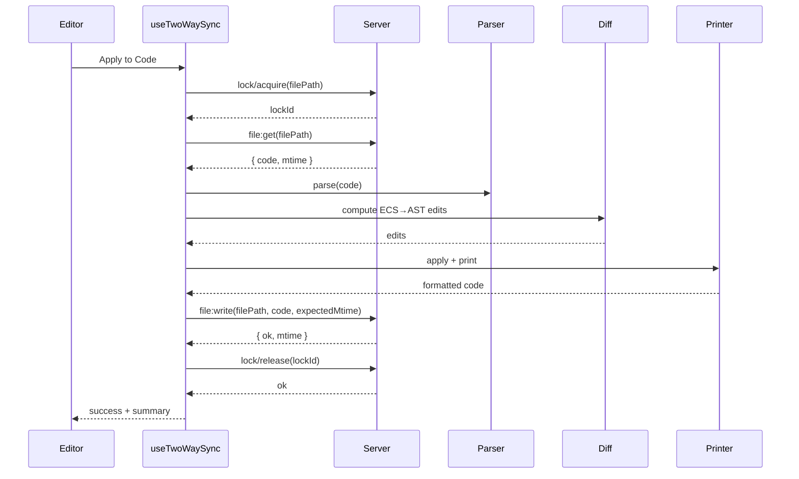

# JSX ↔ ECS Two‑Way Sync PRD

## 1. Overview

- **Context & Goals**

  - Deliver robust two‑way synchronization between TSX‑authored scenes and the live ECS world in the editor.
  - Preserve developer code quality (formatting, comments, structure) while enabling editor‑driven authoring.
  - Provide conflict‑aware sync with explicit commands and optional auto‑sync, backed by a lightweight sync server.
  - Ensure incremental rollout: minimal AST edits first; safe fallbacks (overrides) when ambiguous.

- **Current Pain Points**
  - Editor changes do not persist to TSX; code edits require manual reload.
  - No resilient identity or mapping between code and world; risk of duplication/drift.
  - Formatting churn/comment loss if naively writing TSX.
  - No backend coordination for multi‑client edits or project‑level file operations.

## 2. Proposed Solution

- **High‑level Summary**

  - Introduce `core/lib/jsx-sync` for AST parsing/printing, identity mapping, diffing, and conflict handling.
  - Editor → Code: compute ECS→AST diffs and emit minimal edits; print with recast + Prettier.
  - Code → Editor: parse TSX to scene graph, validate, hydrate ECS; maintain mapping and anchors.
  - Add `server` endpoints for sync orchestration, file IO, and locks to avoid concurrent write corruption.
  - UX: commands for Pull/Apply; conflict previews; auto‑sync with debounce and status surface.

- **Architecture & Directory Structure**

```
src/
  core/
    lib/
      serialization/
        SceneDiff.ts                 # extends with JSX-aware diffs
      jsx-sync/
        ast/
          parser.ts                  # TSX → AST (with locations, comments)
          printer.ts                 # AST edits → TS/TSX string (recast + Prettier)
          utils.ts                   # finders, prop mutators, node builders
        mapping/
          identity.ts                # PersistentId↔AST anchor↔EntityId map, cache
          schema.ts                  # Zod schemas for code-scene nodes
        sync/
          codeToWorld.ts             # TSX → ECS hydration
          worldToCode.ts             # ECS diffs → AST edits
          conflict.ts                # timestamp/git/lock checks, resolutions
  editor/
    hooks/
      useTwoWaySync.ts              # orchestrates sync, debounce, server calls
    components/panels/
      SyncStatus.tsx                # status, conflicts, actions
server/
  src/
    sync/
      routes.ts                     # REST endpoints for sync ops
      fileService.ts                # project FS operations + locks
      lockService.ts                # per-file locks, in-memory + optional redis
      gitService.ts                 # optional: status/diff/checks
      schema.ts                     # request/response zod schemas
```

## 3. Implementation Plan

- **Phase 1: Identity & Schemas (0.5 day)**

  1. Enforce `PersistentId` usage and add validation for duplicates/missing IDs.
  2. Define Zod schemas for code‑scene nodes and server contracts.
  3. Prepare mapping cache API: bind/find/update by PersistentId.

- **Phase 2: Code → World (0.5–1.0 day)**

  1. `parser.ts`: parse TSX using ts‑morph or @babel/parser + recast; capture locations/comments.
  2. Extract Entities/Components with literal props; validate via Zod.
  3. `codeToWorld.ts`: hydrate/patch ECS; maintain bindings and anchors.

- **Phase 3: World → Code (1.0–1.5 days)**

  1. Extend `SceneDiff` to JSX operations (insert/update/remove entity/component/prop).
  2. Implement AST edit helpers with minimal localized changes; preserve comments.
  3. `printer.ts`: apply edits and format via Prettier using project config.

- **Phase 4: Sync Server (0.5–1.0 day)**

  1. Implement REST endpoints for pull/apply, file read/write, format, and lock acquire/release.
  2. Add basic in‑memory locks; option to integrate Redis for multi‑instance.
  3. Optional: integrate git status/diff for conflict checks.

- **Phase 5: Editor Integration & UX (0.5–1.0 day)**

  1. `useTwoWaySync.ts`: call server endpoints; manage debounce and status.
  2. `SyncStatus.tsx`: show last sync, conflicts, actions (Apply/Pull/Revert).
  3. Keybindings and command palette entries; auto‑sync toggle.

- **Phase 6: Tests & Hardening (0.5–1.0 day)**
  1. Unit tests: parse/print roundtrip, diff minimality, mapping stability.
  2. Integration: end‑to‑end pull/apply flows; server lock behavior; concurrency.
  3. Performance: large file parsing and batched edits; workerize if needed.

## 4. File and Directory Structures

```
/src/core/lib/jsx-sync/
├── ast/
│   ├── parser.ts
│   ├── printer.ts
│   └── utils.ts
├── mapping/
│   ├── identity.ts
│   └── schema.ts
└── sync/
    ├── codeToWorld.ts
    ├── worldToCode.ts
    └── conflict.ts

/server/src/sync/
├── routes.ts
├── fileService.ts
├── lockService.ts
├── gitService.ts
└── schema.ts
```

## 5. Technical Details

- **Identity & Mapping**

```ts
// identity.ts
export type PersistentId = string;
export interface AstAnchor {
  start: number;
  end: number;
  path: string[];
}
export interface EntityBinding {
  filePath: string;
  persistentId: PersistentId;
  entityId?: number;
  ast?: AstAnchor;
}
export interface IdentityMappingStore {
  bind(b: EntityBinding): void;
  find(filePath: string, id: PersistentId): EntityBinding | undefined;
  remove(filePath: string, id: PersistentId): void;
  clear(filePath: string): void;
}
```

- **AST Parse/Print**

```ts
// parser.ts
export function parseTsx(code: string): AstRoot {}
export function findEntities(ast: AstRoot): AstEntityNode[] {}

// printer.ts
export function applyEdits(ast: AstRoot, edits: AstEdit[]): AstRoot {}
export function print(ast: AstRoot): string {}
```

- **Sync Algorithms**

```ts
// codeToWorld.ts (simplified)
export async function applyCodeToWorld(filePath: string) {
  const code = await server.readFile(filePath);
  const ast = parseTsx(code);
  const nodes = findEntities(ast);
  const validated = zodValidate(nodes);
  return hydrateWorld(validated);
}

// worldToCode.ts (simplified)
export async function applyWorldToCode(filePath: string) {
  const code = await server.readFile(filePath);
  const ast = parseTsx(code);
  const diffs = computeWorldToAstDiff(ast, worldSnapshot());
  const next = applyEdits(ast, diffs);
  const formatted = await server.formatTsx(print(next));
  await server.writeFile(filePath, formatted);
  return { edits: diffs.length };
}
```

- **Server API (REST)**

```ts
// routes.ts (sketch)
POST /sync/pull             { filePath } -> { created, updated, removed, warnings[] }
POST /sync/apply            { filePath } -> { edits, conflicts, warnings[] }
POST /sync/format           { code, filePath? } -> { code }
POST /sync/lock/acquire     { filePath, owner, ttlMs } -> { ok, lockId }
POST /sync/lock/release     { lockId } -> { ok }
GET  /sync/file             ?filePath=... -> { code, mtime }
POST /sync/file             { filePath, code, expectedMtime? } -> { ok, mtime }
GET  /sync/git/status       -> { branch, dirty, ahead, behind }
POST /sync/git/check        { filePath } -> { canApply, reason? }
```

- **Server Services**

  - `fileService.ts`: read/write with atomic temp files and mtime checks; Prettier/TSConfig resolution.
  - `lockService.ts`: in‑memory lock table keyed by `filePath`; optional Redis adapter for multi‑instance.
  - `gitService.ts`: optional; run `git status` and `git diff --name-only` for awareness.

- **Constraints & Fallbacks**
  - Only literal props in phase 1; skip complex expressions with warnings.
  - On ambiguity or parser errors, write `.overrides.json` instead; surface in UI.
  - Debounce and batch edits; no overlapping writes without a lock.

## 6. Usage Examples

- **Pull from code (Editor)**

```ts
const { pullFromCode } = useTwoWaySync();
await pullFromCode('src/game/scenes/LevelOne.tsx');
```

- **Apply to code (Editor)**

```ts
const { applyToCode } = useTwoWaySync();
await applyToCode('src/game/scenes/LevelOne.tsx');
```

- **Server integration (client sketch)**

```ts
await http.post('/sync/lock/acquire', { filePath, owner: 'editor', ttlMs: 15000 });
await http.post('/sync/apply', { filePath });
await http.post('/sync/lock/release', { lockId });
```

## 7. Testing Strategy

- **Unit Tests**

  - Parser/Printer roundtrip preserves comments and formatting (snapshots).
  - Identity mapping survives nearby insertions/removals and file moves.
  - Diff generation produces minimal AST edits for add/update/remove.

- **Integration Tests**
  - Editor change to a prop updates exactly one prop in TSX.
  - Adding an entity inserts a single `<Entity>` subtree with stable `persistentId`.
  - Server prevents concurrent writes; lock TTL expiry path tested.
  - Git awareness blocks apply when working tree conflicts are present (optional).

## 8. Edge Cases

| Edge Case                                        | Remediation                                                   |
| ------------------------------------------------ | ------------------------------------------------------------- |
| Missing `PersistentId` on an entity              | Auto-generate id and insert prop in code; warn in UI.         |
| Complex expressions in props (functions, spread) | Skip with warning; require manual edit.                       |
| Significant code refactors between syncs         | Fallback to Pull (full refresh) and keep overrides.           |
| Formatting/style drift                           | Use recast + Prettier; minimal edits; respect project config. |
| Concurrent edits (IDE + Editor)                  | Server locks + mtime preconditions; conflict UI.              |
| Large scenes                                     | Debounce, batch, incremental edits; workerize parsing.        |

## 9. Sequence Diagram



## 10. Risks & Mitigations

| Risk                       | Mitigation                                            |
| -------------------------- | ----------------------------------------------------- |
| AST edits break code       | TS validation; small, targeted edits; snapshot tests. |
| Performance on large files | Debounce/batch; workerize parsing; incremental diffs. |
| Unhandled TSX patterns     | Zod guards; skip with warnings; provide fallbacks.    |
| Multi-client concurrency   | Server locks; optional Redis; mtime/gIT checks.       |

## 11. Timeline

- Total: ~3–4 days
  - Phase 1: 0.5d
  - Phase 2: 0.5–1.0d
  - Phase 3: 1.0–1.5d
  - Phase 4: 0.5–1.0d
  - Phase 5: 0.5–1.0d
  - Phase 6: 0.5–1.0d

## 12. Acceptance Criteria

- Editor can Pull from Code and Apply to Code with minimal TSX edits and preserved formatting.
- Server mediates read/write with locks and mtime checks; prevents concurrent corruption.
- TSX edits reflect in ECS without duplicates; identities preserved; conflicts surfaced.
- Auto‑sync toggle (off by default) with debounce; status UI shows last sync and warnings.

## 13. Conclusion

Two‑way JSX ↔ ECS sync enables a first‑class TSX authoring workflow with safe, conflict‑aware round‑trip editing. The sync server coordinates writes and provides a foundation for future multi‑client collaboration, while AST‑level minimal edits preserve code quality and developer control.
