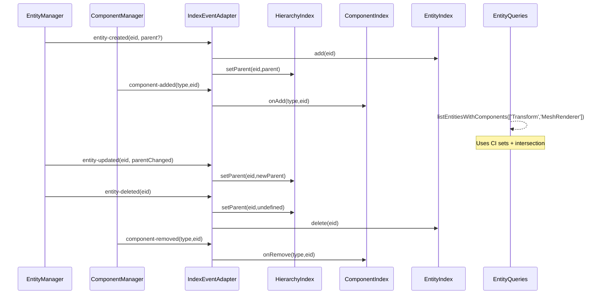

# PRD: Entity Traversal Optimization (Hierarchy Index + Sparse Scanning)

## 1. Overview

- **Context & Goals**
  - Replace O(n) and O(n²) scans with indexed, event-driven lookups to scale beyond 1k+ entities.
  - Introduce efficient parent/child adjacency structures and sparse entity iteration without fixed upper bounds.
  - Maintain compatibility with BitECS and existing editor flows; reduce GC and improve determinism.
  - Provide clear APIs for listing entities, querying by component(s), and traversing hierarchies.

- **Current Pain Points**
  - `getAllEntities()` and component queries iterate 0..10000 ids, causing wasted work and frame spikes.
  - Children arrays computed by filtering all entities per parent (O(n²)).
  - Multiple singletons mix responsibilities and duplicate scans; caches rebuilt frequently.
  - No central index for parent/child or component presence; no event-driven maintenance.

## 2. Proposed Solution

- **High‑level Summary**
  - Add `EntityIndex` for sparse entity tracking (present EIDs) maintained via entity create/delete.
  - Add `HierarchyIndex` with `parentId -> children` and `child -> parent` maps; update on parent changes.
  - Add `ComponentIndex` for fast membership sets per component type; update on add/remove.
  - Provide query helpers that operate on sets rather than scanning numeric ranges.
  - Replace `getAllEntities()` scan with `EntityIndex.list()`; replace child building with `HierarchyIndex.getChildren()`.

- **Architecture & Directory Structure**
  
```text
src/
  core/
    lib/
      ecs/
        indexers/
          EntityIndex.ts              # Tracks existing entity IDs (Set<number>)
          HierarchyIndex.ts           # parent->children, child->parent
          ComponentIndex.ts           # componentType->Set<eid>
        queries/
          entityQueries.ts            # listAll, byComponent(s), roots, descendants
        adapters/
          IndexEventAdapter.ts        # Wires EntityManager/ComponentManager events to indices
```

## 3. Implementation Plan

- **Phase 1: Indices Foundation (0.5 day)**
  1. Implement `EntityIndex` with `add(eid)`, `delete(eid)`, `has(eid)`, `list()`.
  2. Implement `HierarchyIndex` with `setParent(child, parent?)`, `getParent(child)`, `getChildren(parent)`.
  3. Implement `ComponentIndex` with `onAdd(type, eid)`, `onRemove(type, eid)`, `list(type)`.

- **Phase 2: Event Wiring (0.5 day)**
  1. Create `IndexEventAdapter` subscribing to `EntityManager` and `ComponentManager` events.
  2. On `entity-created/deleted`, update `EntityIndex` and `HierarchyIndex`.
  3. On `entity-updated` with parent change, call `HierarchyIndex.setParent`.
  4. On `component-added/removed`, update `ComponentIndex`.

- **Phase 3: Query API (0.5 day)**
  1. Implement `queries/entityQueries.ts`:
     - `listAllEntities()` from `EntityIndex`.
     - `listEntitiesWithComponent(type)` via `ComponentIndex`.
     - `listEntitiesWithComponents(types[])` using set intersection.
     - `getRootEntities()` where `HierarchyIndex.getParent(eid)` is undefined.
     - `getDescendants(eid)` using BFS over `HierarchyIndex`.
  2. Replace usage sites in `EntityManager` and editor hooks to use queries.

- **Phase 4: Remove 0..10000 Scans (0.5 day)**
  1. Update `EntityManager.getAllEntities()` to use `EntityIndex` and remove numeric loops.
  2. Update `ComponentManager.getEntitiesWithComponent(s)` to use `ComponentIndex`.
  3. Remove `entityScanUtils` fixed-range helpers or keep as fallback behind index presence.

- **Phase 5: Performance Polish (0.5 day)**
  1. Micro-benchmarks: measure list, intersection, children queries before/after.
  2. Ensure minimal allocations; reuse arrays or expose iterables where useful.
  3. Add dev-only assertions for index consistency.

- **Phase 6: Tests & Migration (0.5 day)**
  1. Unit tests for each index and adapter wiring.
  2. Integration tests: create/delete, parent changes, add/remove component → query correctness.
  3. Remove dead code paths and update docs.

## 4. File and Directory Structures

```text
/src/core/lib/ecs/indexers/
├── ComponentIndex.ts
├── EntityIndex.ts
└── HierarchyIndex.ts
/src/core/lib/ecs/queries/
└── entityQueries.ts
/src/core/lib/ecs/adapters/
└── IndexEventAdapter.ts
```

## 5. Technical Details

```ts
// src/core/lib/ecs/indexers/EntityIndex.ts
export class EntityIndex {
  private readonly present = new Set<number>();
  add(entityId: number): void { this.present.add(entityId); }
  delete(entityId: number): void { this.present.delete(entityId); }
  has(entityId: number): boolean { return this.present.has(entityId); }
  list(): number[] { return Array.from(this.present); }
}
```

```ts
// src/core/lib/ecs/indexers/HierarchyIndex.ts
export class HierarchyIndex {
  private readonly parentToChildren = new Map<number, Set<number>>();
  private readonly childToParent = new Map<number, number>();

  setParent(childId: number, parentId?: number): void {
    const currentParent = this.childToParent.get(childId);
    if (currentParent !== undefined) {
      const siblings = this.parentToChildren.get(currentParent);
      if (siblings) siblings.delete(childId);
    }
    if (parentId !== undefined) {
      let children = this.parentToChildren.get(parentId);
      if (!children) { children = new Set<number>(); this.parentToChildren.set(parentId, children); }
      children.add(childId);
      this.childToParent.set(childId, parentId);
    } else {
      this.childToParent.delete(childId);
    }
  }

  getParent(childId: number): number | undefined { return this.childToParent.get(childId); }
  getChildren(parentId: number): number[] { return Array.from(this.parentToChildren.get(parentId) ?? []); }
}
```

```ts
// src/core/lib/ecs/indexers/ComponentIndex.ts
export class ComponentIndex {
  private readonly membership = new Map<string, Set<number>>();
  onAdd(componentType: string, eid: number): void {
    let set = this.membership.get(componentType);
    if (!set) { set = new Set<number>(); this.membership.set(componentType, set); }
    set.add(eid);
  }
  onRemove(componentType: string, eid: number): void {
    const set = this.membership.get(componentType);
    if (set) set.delete(eid);
  }
  list(componentType: string): number[] { return Array.from(this.membership.get(componentType) ?? []); }
}
```

```ts
// src/core/lib/ecs/adapters/IndexEventAdapter.ts
import { EntityManager } from '../EntityManager';
import { ComponentManager } from '../ComponentManager';
import { EntityIndex } from '../indexers/EntityIndex';
import { HierarchyIndex } from '../indexers/HierarchyIndex';
import { ComponentIndex } from '../indexers/ComponentIndex';

export class IndexEventAdapter {
  constructor(
    private readonly entities: EntityIndex,
    private readonly hierarchy: HierarchyIndex,
    private readonly components: ComponentIndex,
  ) {}

  attach(): void {
    const em = EntityManager.getInstance();
    const cm = ComponentManager.getInstance();

    em.addEventListener((e) => {
      if (e.type === 'entity-created' && e.entityId !== undefined && e.entity) {
        this.entities.add(e.entityId);
        this.hierarchy.setParent(e.entityId, e.entity.parentId);
      } else if (e.type === 'entity-deleted' && e.entityId !== undefined) {
        this.entities.delete(e.entityId);
        this.hierarchy.setParent(e.entityId, undefined);
      } else if (e.type === 'entity-updated' && e.entityId !== undefined && e.entity) {
        this.hierarchy.setParent(e.entityId, e.entity.parentId);
      }
    });

    cm.addEventListener((e) => {
      if (e.type === 'component-added') this.components.onAdd(e.componentType, e.entityId);
      if (e.type === 'component-removed') this.components.onRemove(e.componentType, e.entityId);
    });
  }
}
```

```ts
// src/core/lib/ecs/queries/entityQueries.ts
import { EntityIndex } from '../indexers/EntityIndex';
import { HierarchyIndex } from '../indexers/HierarchyIndex';
import { ComponentIndex } from '../indexers/ComponentIndex';

export class EntityQueries {
  constructor(
    private readonly entities: EntityIndex,
    private readonly hierarchy: HierarchyIndex,
    private readonly components: ComponentIndex,
  ) {}

  listAllEntities(): number[] { return this.entities.list(); }

  listEntitiesWithComponent(componentType: string): number[] {
    return this.components.list(componentType);
  }

  listEntitiesWithComponents(componentTypes: string[]): number[] {
    if (componentTypes.length === 0) return [];
    const [first, ...rest] = componentTypes;
    let acc = new Set(this.components.list(first));
    for (const type of rest) {
      const set = new Set(this.components.list(type));
      acc = new Set([...acc].filter((eid) => set.has(eid)));
    }
    return Array.from(acc);
  }

  getRootEntities(): number[] {
    return this.entities.list().filter((eid) => this.hierarchy.getParent(eid) === undefined);
  }

  getDescendants(entityId: number): number[] {
    const result: number[] = [];
    const queue: number[] = [...this.hierarchy.getChildren(entityId)];
    while (queue.length) {
      const next = queue.shift()!;
      result.push(next);
      queue.push(...this.hierarchy.getChildren(next));
    }
    return result;
  }
}
```

## 6. Usage Examples

```ts
// Wire indices once during initialization
const entityIndex = new EntityIndex();
const hierarchyIndex = new HierarchyIndex();
const componentIndex = new ComponentIndex();
new IndexEventAdapter(entityIndex, hierarchyIndex, componentIndex).attach();

const queries = new EntityQueries(entityIndex, hierarchyIndex, componentIndex);
```

```ts
// Replace scanning usages
const all = queries.listAllEntities();
const withTransform = queries.listEntitiesWithComponent('Transform');
const withTransformAndRenderer = queries.listEntitiesWithComponents(['Transform', 'MeshRenderer']);
const roots = queries.getRootEntities();
const children = hierarchyIndex.getChildren(someParentId);
```

```ts
// Transform system traversal
for (const root of queries.getRootEntities()) {
  // process root then breadth-first descendants
}
```

## 7. Testing Strategy

- **Unit Tests**
  - EntityIndex add/delete/list; HierarchyIndex setParent/getChildren/getParent; ComponentIndex add/remove/list.
  - EntityQueries intersections and BFS descendant traversal.
  - IndexEventAdapter: events produce correct updates to indices.

- **Integration Tests**
  - Create, parent changes, delete → queries reflect ground truth without scans.
  - Add/remove components → component queries reflect membership.
  - Editor flows (hierarchy panel, selection, gizmos) function without regressions.
- Unit and integration tests cover indexing and queries with 85%+ coverage.

## 8. Edge Cases

| Edge Case | Remediation |
| --- | --- |
| Reparenting loops | Guard in EntityManager (exists) and verify via `wouldCreateCircularDependency`. |
| Entity deleted with components | ComponentManager emits remove events; ComponentIndex removes membership. |
| Missed events (race) | Add consistency checks; periodic dev-only reconciliation in debug builds. |
| Large scenes (10k+) | Use Set-based indices; avoid array copies in hot paths; expose iterables if needed. |

## 9. Sequence Diagram



## 10. Risks & Mitigations

| Risk | Mitigation |
| --- | --- |
| Index drift vs world | Event-driven updates + dev-only reconciliation checks. |
| Memory overhead of sets | Minimal vs scan cost; use shared instances and clear on world reset. |
| Refactor complexity | Introduce behind a query layer; migrate call-sites incrementally. |
| Singletons coupling | Keep indices injectable; expose factory for future DI context. |

## 11. Timeline

- Total: ~2–3 days
  - Phase 1: 0.5d
  - Phase 2: 0.5d
  - Phase 3: 0.5d
  - Phase 4: 0.5d
  - Phase 5: 0.5d
  - Phase 6: 0.5d

## 12. Acceptance Criteria

- No fixed-range loops (0..10000) remain in entity/component queries.
- `EntityManager.getAllEntities()` and component queries use indices with event wiring.
- Parent/child queries run in O(1) for direct children; descendants in O(k).
- Editor features (hierarchy panel, selection, gizmos) function without regressions.
- Unit and integration tests cover indexing and queries with 85%+ coverage.

## 13. Conclusion

Replacing naive scans with event-driven indices unlocks scalability for large scenes, reduces frame-time spikes, and clarifies traversal responsibilities. The approach is incremental, testable, and compatible with existing systems.

## 14. Assumptions & Dependencies

- BitECS world remains the ECS runtime; indices are auxiliary and source-of-truth remains ECS.
- `EntityManager` and `ComponentManager` events are reliable and emitted for all relevant mutations.
- Zod remains available for schema validation; Yarn/TS stack unchanged.

