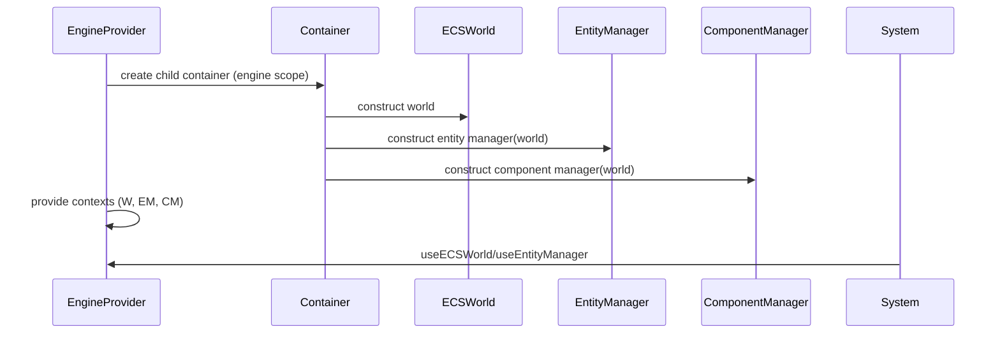

# PRD: Singleton Elimination and DI/Context Architecture

## 1. Overview

- **Context & Goals**

  - Remove singleton patterns (`ECSWorld`, `EntityManager`, `ComponentManager`, `SceneRegistry`, scripting registries) to enable multiple engine instances and robust testing.
  - Introduce a first-class Dependency Injection layer and React Context providers for instance scoping.
  - Decouple hooks and systems from global state; improve composability and testability.
  - Maintain compatibility with existing editor/game flows with a measured migration path.

- **Current Pain Points**
  - `getInstance()` usage couples code to a global world; parallel editors/games cannot coexist.
  - Testing requires global resets and leaks cross-test state.
  - Hooks like `useGameEngine` and scene registry operations implicitly reference singletons.
  - Harder to memoize and avoid re-renders without clean instance boundaries.

## 2. Proposed Solution

- **High‑level Summary**

  - Adopt `Container`-based DI (already present in `@core/lib/di/Container`) to register world-scoped services.
  - Provide React providers for per-engine instances: `ECSWorldProvider`, `EntityManagerProvider`, `ComponentManagerProvider` exposed via hooks.
  - Replace `getInstance()` call-sites with context/DI resolutions; keep a transitional adapter layer.
  - Add factory functions to create isolated engine instances for editor/game/runtime.
  - Update systems and hooks to accept context services via parameters or hooks rather than globals.

- **Architecture & Directory Structure**

```text
src/
  core/
    context/
      ECSWorldContext.tsx
      EntityManagerContext.tsx
      ComponentManagerContext.tsx
      EngineProvider.tsx            # Composes all providers (world + managers + stores)
    lib/
      di/
        Container.ts               # Existing; enhanced with per-instance containers
      ecs/
        factories/
          createEngineInstance.ts  # Creates container + services
        adapters/
          SingletonAdapter.ts      # Temporary bridge: forwards to current context
```

## 3. Implementation Plan

- **Phase 1: Foundations (0.5 day)**

  1. Extend `Container` with a typed child/scope option for per-engine instances.
  2. Create `ECSWorldContext`, `EntityManagerContext`, `ComponentManagerContext` with typed `I` interfaces.
  3. Implement `EngineProvider` composing providers; ensure memoized instance creation.

- **Phase 2: Instance Factories (0.5 day)**

  1. Implement `createEngineInstance(container?: Container)` returning `{ world, entityManager, componentManager }`.
  2. Wire services to the container; declare explicit lifetimes.
  3. Add cleanup/reset API for disposing an instance.

- **Phase 3: Transitional Adapters (0.5 day)**

  1. Add `SingletonAdapter` exporting the old `getInstance()` API but delegating to current context when mounted; falls back to local ephemeral instance in non-React contexts (tests).
  2. Log deprecation warnings and provide codemod hints.

- **Phase 4: Hook/System Migration (1.0 day)**

  1. Update hooks (`useGameEngine`, scene loaders, editor hooks) to use contexts.
  2. Update systems to accept services as params or resolve via context where appropriate.
  3. Ensure `SceneRegistry` and scripting registries can be instance-scoped.

- **Phase 5: Test Pass + Examples (0.5 day)**
  1. Unit tests: providers, factories, adapter behavior.
  2. Integration: run two engines side-by-side without interference.
  3. Update docs and code samples.

## 4. File and Directory Structures

```text
/src/core/context/
├── ComponentManagerContext.tsx
├── ECSWorldContext.tsx
├── EngineProvider.tsx
└── EntityManagerContext.tsx
/src/core/lib/ecs/factories/
└── createEngineInstance.ts
/src/core/lib/ecs/adapters/
└── SingletonAdapter.ts
```

## 5. Technical Details

```ts
// src/core/context/ECSWorldContext.tsx
export interface IECSWorldContext {
  world: object;
}
export const ECSWorldContext = React.createContext<IECSWorldContext | null>(null);
export const useECSWorld = (): IECSWorldContext => {
  const ctx = React.useContext(ECSWorldContext);
  if (!ctx) throw new Error('ECSWorldContext not available');
  return ctx;
};
```

```ts
// src/core/lib/ecs/factories/createEngineInstance.ts
export interface IEngineInstance {
  world: object;
  entityManager: unknown;
  componentManager: unknown;
}
export function createEngineInstance(container?: Container): IEngineInstance {
  /* ... */
}
```

```ts
// src/core/context/EngineProvider.tsx
export interface IEngineProviderProps {
  children: React.ReactNode;
}
export const EngineProvider: React.FC<IEngineProviderProps> = ({ children }) => {
  /* ... */
};
```

```ts
// src/core/lib/ecs/adapters/SingletonAdapter.ts
// Temporary bridge to maintain getInstance() calls during migration
export function getWorldSingleton(): object {
  /* delegate to current context */
}
export function getEntityManagerSingleton(): unknown {
  /* ... */
}
export function getComponentManagerSingleton(): unknown {
  /* ... */
}
```

## 6. Usage Examples

```tsx
// App bootstrap
export const App = () => (
  <EngineProvider>
    <Editor />
  </EngineProvider>
);
```

```ts
// Inside a hook/system
const { world } = useECSWorld();
```

```ts
// Creating two instances (integration test)
const engineA = createEngineInstance();
const engineB = createEngineInstance();
```

## 7. Testing Strategy

- **Unit Tests**

  - Providers render and expose invariant instance references.
  - Factory creates isolated instances; cleanup resets indices/memory.
  - Adapter delegates to current context or creates ephemeral fallbacks in tests.

- **Integration Tests**
  - Two editor views with separate providers: entity creation does not cross-contaminate.
  - Scene loading in one instance does not affect the other.

## 8. Edge Cases

| Edge Case                               | Remediation                                                                 |
| --------------------------------------- | --------------------------------------------------------------------------- |
| No provider mounted                     | Adapter creates ephemeral scoped instance; clear on unmount/tests.          |
| Legacy code still using `getInstance()` | Deprecation logs + codemods; adapter supports until migration completes.    |
| Cross-scope leaks                       | Strict provider boundaries; forbid reading global singletons in lint rules. |

## 9. Sequence Diagram



## 10. Risks & Mitigations

| Risk                    | Mitigation                                                           |
| ----------------------- | -------------------------------------------------------------------- |
| Large refactor surface  | Stage migration with adapter; codemods for imports; incremental PRs. |
| Hidden singleton access | Add ESLint rule to ban `getInstance()` and enforce provider usage.   |
| Performance regression  | Memoize providers; avoid re-instantiation; add tests for frame cost. |

## 11. Timeline

- Total: ~2 days
  - Phase 1: 0.5d
  - Phase 2: 0.5d
  - Phase 3: 0.5d
  - Phase 4: 0.5d
  - Phase 5: 0.5d (overlaps)

## 12. Acceptance Criteria

- No direct usages of `getInstance()` in core hooks/systems except the transitional adapter.
- Two `EngineProvider` instances can run concurrently without state leakage.
- Unit and integration tests cover providers/factory with >85% coverage.
- Documentation updated and examples migrated.

## 13. Conclusion

Transitioning from singletons to DI + Context enables multi-instance runtime, better testability, and clearer boundaries—foundational for scalability and future features.

## 14. Assumptions & Dependencies

- TypeScript path aliases available; Zod available for schema typing.
- React 18+; Zustand remains for local stores but will be scoped per instance.
- Existing `Container` remains the DI backbone; no additional runtime deps required.
