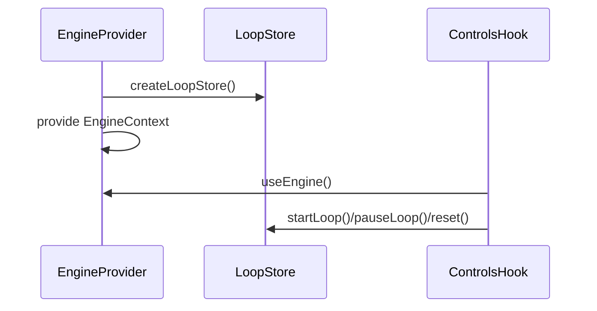

# PRD: Global State → React Context Providers (Engine-Scoped)

## 1. Overview

- **Context & Goals**

  - Replace implicit global engine state (Zustand singletons, ECS singletons) with engine-scoped contexts.
  - Enable multiple engines/editors simultaneously with independent controls and UI.
  - Improve React render performance via memoized providers and stable references.
  - Preserve ergonomics for existing hooks with thin compatibility layers.

- **Current Pain Points**
  - `useGameEngine` and `useGameLoop` control a global loop; cannot isolate per engine.
  - ECS/world access via singletons leads to implicit coupling to a single instance.
  - Hard to SSR/test or mount isolated experiences without hidden global reads.

## 2. Proposed Solution

- **High‑level Summary**

  - Introduce `EngineContext` composing world, managers, and loop stores per instance.
  - Provide scoped `useGameEngineControls` built on a per-instance loop store.
  - Replace global store creation with factory-based store creation per engine.
  - Adapt editor hooks to read from the nearest `EngineContext` instead of globals.

- **Architecture & Directory Structure**

```text
src/
  core/
    context/
      EngineContext.tsx                # Single entry exposing world, managers, loop store
    lib/
      gameLoop/
        createLoopStore.ts             # Factory for scoped Zustand store
    hooks/
      useGameEngineControls.ts         # Instance-aware controls
      useEngine.ts                     # Access all engine services (typed)
```

## 3. Implementation Plan

- **Phase 1: Scoped Loop Store (0.5 day)**

  1. Extract `useGameLoop` into `createLoopStore(maxFPS?: number)` returning a new Zustand store instance.
  2. Ensure start/pause/resume/stop operate only on that store instance.

- **Phase 2: Engine Context (0.5 day)**

  1. Create `EngineContext` exposing `{ world, entityManager, componentManager, loopStore }` with `I`-prefixed interfaces.
  2. Provide `useEngine()` and granular hooks (`useLoopStore()`), memoized values.

- **Phase 3: Hook Migration (0.5 day)**

  1. Replace `useGameEngine` with `useGameEngineControls` using the scoped loop store.
  2. Update editor hooks (`useSceneActions`, creation/selection hooks) to resolve services from context.
  3. Maintain a legacy wrapper that reads the nearest context; warn if missing.

- **Phase 4: Cleanup & Tests (0.5 day)**
  1. Remove direct imports of global `useGameLoop` from call-sites.
  2. Add tests for two providers running concurrently with independent loop states.
  3. Update docs and usage examples.

## 4. File and Directory Structures

```text
/src/core/context/
└── EngineContext.tsx
/src/core/lib/gameLoop/
└── createLoopStore.ts
/src/core/hooks/
├── useEngine.ts
└── useGameEngineControls.ts
```

## 5. Technical Details

```ts
// src/core/lib/gameLoop/createLoopStore.ts
export interface IGameLoopState {
  /* fps, isRunning, controls... */
}
export type IGameLoopStore = ReturnType<typeof create> & { getState: () => IGameLoopState };
export function createLoopStore(options?: { maxFPS?: number }): IGameLoopStore {
  /* ... */
}
```

```ts
// src/core/context/EngineContext.tsx
export interface IEngineContext {
  world: object;
  entityManager: unknown;
  componentManager: unknown;
  loopStore: unknown;
}
export const EngineContext = React.createContext<IEngineContext | null>(null);
export const useEngine = (): IEngineContext => {
  /* ... */
};
```

```ts
// src/core/hooks/useGameEngineControls.ts
export interface IGameEngineControls {
  startEngine: () => void;
  stopEngine: () => void;
  pauseEngine: () => void;
  resumeEngine: () => void;
  resetEngine: () => void;
}
export const useGameEngineControls = (): IGameEngineControls => {
  /* ... */
};
```

## 6. Usage Examples

```tsx
// Compose an engine instance
<EngineProvider>
  <Viewport />
</EngineProvider>
```

```ts
// Controls in a toolbar
const { startEngine, pauseEngine } = useGameEngineControls();
```

```ts
// Two editors with independent engines
<EngineProvider><EditorA /></EngineProvider>
<EngineProvider><EditorB /></EngineProvider>
```

## 7. Testing Strategy

- **Unit Tests**

  - Loop store factory — independent state, timers, and FPS limiting.
  - Hooks resolve nearest `EngineContext` and throw if missing.

- **Integration Tests**
  - Two `EngineProvider` trees: starting A does not affect B; resetting A only resets A.
  - Editor flows still function with context-sourced services.

## 8. Edge Cases

| Edge Case                  | Remediation                                                   |
| -------------------------- | ------------------------------------------------------------- |
| Hook used outside provider | Throw with actionable error; legacy shim warns once in dev.   |
| Reset while not running    | No-ops; idempotent methods.                                   |
| SSR usage                  | Providers only create stores on client; guard with lazy init. |

## 9. Sequence Diagram



## 10. Risks & Mitigations

| Risk                     | Mitigation                                                            |
| ------------------------ | --------------------------------------------------------------------- |
| Increased provider depth | Compose into a single `EngineProvider`; memoize values.               |
| Overhead per instance    | Lazy-init stores; dispose on unmount; pool heavy resources elsewhere. |
| Migration churn          | Provide legacy shim and codemods; migrate by module.                  |

## 11. Timeline

- Total: ~1.5 days
  - Phase 1: 0.5d
  - Phase 2: 0.5d
  - Phase 3: 0.25d
  - Phase 4: 0.25d

## 12. Acceptance Criteria

- Global `useGameLoop` is no longer imported by feature code; replaced by scoped loop store.
- Hooks read from `EngineContext`; two engines operate independently.
- Tests verify isolation and controls behavior.

## 13. Conclusion

Scoping engine state to React Context consolidates instance boundaries, enables parallel experiences, and cleans up implicit globals without sacrificing ergonomics.

## 14. Assumptions & Dependencies

- React 18+, Zustand; TypeScript path aliases.
- DI/Provider work in PRD 4-17 provides world/managers; this PRD focuses on loop/UI controls.
