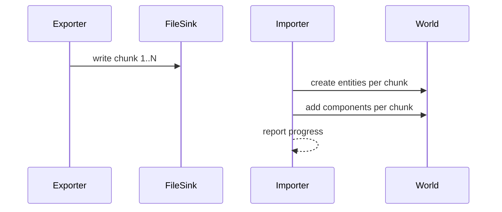

# PRD: Scene Serialization 2.0 (Streaming, Delta, Versioning)

## 1. Overview

- **Context & Goals**

  - Provide scalable scene import/export for large scenes via streaming and chunking.
  - Add delta/overrides serialization integrated with `SceneDiff` for round-trip editing.
  - Establish robust versioning and schema validation using Zod.
  - Reduce memory pressure and improve perceived UX with progress reporting.

- **Current Pain Points**
  - `serializeWorld()` is a placeholder; full world state cannot be exported reliably.
  - Import/export is all-or-nothing; memory spikes and slow operations for large scenes.
  - Incomplete delta serialization; overrides pipeline not fully wired to actual world state.

## 2. Proposed Solution

- **High‑level Summary**

  - Introduce streaming serializers: async iterators for export/import with fixed-size chunks.
  - Define a versioned schema (`v5`) with strong typing for components and entity relations.
  - Implement delta serialization (base scene + overrides) with merge and conflict strategies.
  - Provide progress callbacks and cancellation support for editor UX.

- **Architecture & Directory Structure**

```text
src/
  core/
    lib/
      serialization/
        v5/
          schema.ts                  # Zod schema for v5
          exporter.ts                # exportSceneStream(), exportWorldStream()
          importer.ts                # importSceneStream(), applyToWorld()
          delta.ts                   # computeDelta(), applyDelta()
        adapters/
          sceneIO.ts                 # High-level IO that picks version & streaming
```

## 3. Implementation Plan

- **Phase 1: Schema & Versioning (0.5 day)**

  1. Define v5 `ISerializedSceneV5` with explicit component typing and persistent IDs.
  2. Add version negotiation in `sceneIO.ts` with fallback to v4 importer/exporter.

- **Phase 2: Streaming Export (0.5 day)**

  1. Implement `exportSceneStream(entities, getComponentsForEntity, options)` returning `AsyncIterable<Uint8Array|string>`.
  2. Chunk by N entities, validate per-chunk, support gzip compression option.

- **Phase 3: Streaming Import (0.5 day)**

  1. Implement `importSceneStream(stream, adapters, options)` reading chunks, validating, then creating entities and components incrementally.
  2. Support progress reporting and cancellation.

- **Phase 4: Delta/Overrides (0.5 day)**

  1. Implement `computeDelta(baseScene, currentWorld)` producing patches compatible with `SceneDiff`.
  2. Implement `applyDelta(baseScene, patches, adapters)` with conflict resolution.

- **Phase 5: World Serialization (0.5 day)**

  1. Replace `serializeWorld()` placeholder with real world snapshot using `EntityManager` and `ComponentManager`.
  2. Ensure sparse traversal through indices from PRD 4-16.

- **Phase 6: Integration & Tests (0.5 day)**
  1. Wire editor `useSceneActions` to streaming APIs; add progress UI hooks.
  2. Add unit/integration tests and large-scene benchmarks.

## 4. File and Directory Structures

```text
/src/core/lib/serialization/v5/
├── delta.ts
├── exporter.ts
├── importer.ts
└── schema.ts
/src/core/lib/serialization/adapters/
└── sceneIO.ts
```

## 5. Technical Details

```ts
// src/core/lib/serialization/v5/schema.ts
export interface ISerializedEntityV5 {
  persistentId: string; // UUID/ULID
  name?: string;
  parentPersistentId?: string;
  components: Record<string, unknown>;
}
export interface ISerializedSceneV5 {
  version: 5;
  name?: string;
  timestamp?: string;
  entities: ISerializedEntityV5[];
}
```

```ts
// src/core/lib/serialization/v5/exporter.ts
export async function* exportSceneStream(
  entities: Array<{ id: number; name: string; parentId?: number | null }>,
  getComponentsForEntity: (id: number) => Array<{ type: string; data: unknown }>,
  options?: {
    chunkSize?: number;
    compress?: boolean;
    onProgress?: (done: number, total: number) => void;
  },
): AsyncIterable<Uint8Array | string> {
  /* ... */
}
```

```ts
// src/core/lib/serialization/v5/importer.ts
export async function importSceneStream(
  stream: AsyncIterable<Uint8Array | string>,
  entityManager: {
    clearEntities: () => void;
    createEntity: (name: string, parentId?: number) => { id: number };
  },
  componentManager: { addComponent: (id: number, type: string, data: unknown) => void },
  options?: { onProgress?: (done: number, total?: number) => void; signal?: AbortSignal },
): Promise<void> {
  /* ... */
}
```

```ts
// src/core/lib/serialization/v5/delta.ts
export function computeDelta(base: ISerializedSceneV5, current: ISerializedSceneV5): OverridesFile {
  /* ... */
}
export function applyDelta(base: ISerializedSceneV5, patches: OverridesFile): ISerializedSceneV5 {
  /* ... */
}
```

```ts
// src/core/lib/serialization/adapters/sceneIO.ts
export function exportSceneIO(/* ... */) {
  /* choose v5 with streaming */
}
export function importSceneIO(/* ... */) {
  /* choose importer by version */
}
```

## 6. Usage Examples

```ts
// Export with progress
for await (const chunk of exportSceneStream(entities, getComponentsForEntity, {
  chunkSize: 256,
  onProgress,
})) {
  // write chunk to file/FS API
}
```

````ts
// Import with cancellation
await importSceneStream(stream, entityManager, componentManager, { signal: abortController.signal, onProgress });
``;

```ts
// Delta round-trip
const patches = computeDelta(baseScene, currentScene);
const merged = applyDelta(baseScene, patches);
````

## 7. Testing Strategy

- **Unit Tests**

  - Schema validation for v5 entities and scenes.
  - Exporter chunking correctness; importer chunk ordering and validation.
  - Delta correctness for added/removed/modified entities and components.

- **Integration Tests**
  - Large scene (5k+ entities) import/export under budgeted memory.
  - Editor save/load with progress reporting and cancellation.

## 8. Edge Cases

| Edge Case                | Remediation                                                          |
| ------------------------ | -------------------------------------------------------------------- |
| Missing component schema | Allow unknown data; log warnings; plug into registry for validation. |
| Parent before child      | Buffer unresolved parents; resolve post-pass.                        |
| Version mismatch         | Fallback to v4 importer with converter; warn in dev.                 |
| Aborted import           | Rollback partial entities or leave scene cleared based on option.    |

## 9. Sequence Diagram



## 10. Risks & Mitigations

| Risk                    | Mitigation                                                    |
| ----------------------- | ------------------------------------------------------------- |
| Complexity of streaming | Keep clear boundaries; adapters hide transport details.       |
| Partial failure modes   | Provide idempotent operations and explicit rollback policies. |
| Performance regressions | Benchmarks and CI gates; profiling instrumentation.           |

## 11. Timeline

- Total: ~2 days
  - Phase 1: 0.5d
  - Phase 2: 0.5d
  - Phase 3: 0.5d
  - Phase 4: 0.25d
  - Phase 5: 0.25d

## 12. Acceptance Criteria

- v5 schema and streaming import/export available behind high-level adapters.
- Large scenes (5k entities) export/import within acceptable time/memory budgets.
- Delta/overrides can serialize editor changes and re-apply on base scenes.
- Editor flows expose progress and support cancellation.

## 13. Conclusion

Streaming, delta-aware serialization unlocks fast, reliable scene interchange for large content while keeping validation and versioning front-and-center.

## 14. Assumptions & Dependencies

- Component registry remains the source of schema knowledge.
- Editor integrates progress UI; file handling is available in the environment.
