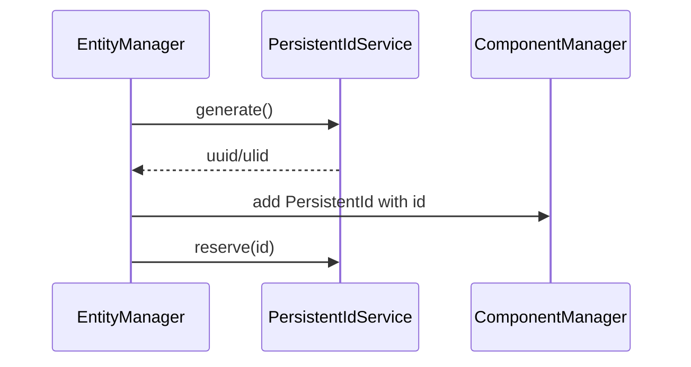

# PRD: Persistent ID Strategy (UUID/ULID, Uniqueness, Migration)

## 1. Overview

- **Context & Goals**

  - Replace ad-hoc ID generation with robust, collision-resistant persistent IDs.
  - Support multi-user and distributed scenarios with deterministic, portable scene IDs.
  - Provide a clean migration from legacy IDs to the new format.

- **Current Pain Points**
  - Existing generator uses date/random with 100-attempt retry; lacks strong guarantees.
  - Schema accepts many string shapes; weak normalization and validation.
  - No central ID service to reserve/release, leading to duplicate handling spread across code.

## 2. Proposed Solution

- **High‑level Summary**

  - Adopt UUIDv4 (default) with optional ULID for lexicographic ordering.
  - Tighten Zod schema to prefer UUIDs; allow ULID via config.
  - Introduce `PersistentIdService` handling generation, reservation, and migration.
  - Maintain `idHash` mapping for BitECS perf but decouple from string identity.

- **Architecture & Directory Structure**

```text
src/
  core/
    lib/
      ecs/
        identity/
          PersistentIdService.ts         # generate(), reserve(), release(), migrate()
          idSchema.ts                     # Zod: uuid() | ulid()
        components/definitions/
          PersistentIdComponent.ts        # updated schema + helpers
```

## 3. Implementation Plan

- **Phase 1: Schema (0.25 day)**

  1. Introduce `idSchema.ts` exporting `PersistentIdSchema` as `uuid()` or `ulid()` based on config.
  2. Update component schema and validation paths to use the new schema exclusively.

- **Phase 2: Service (0.5 day)**

  1. Implement `PersistentIdService` with in-memory `Set<string>` of reserved IDs scoped to engine instance.
  2. Methods: `generate()`, `reserve(id)`, `release(id)`, `isReserved(id)`, `migrateIfLegacy(id)`.

- **Phase 3: Integration (0.5 day)**

  1. Replace `EntityManager.generateUniquePersistentId()` with service usage.
  2. Ensure `Entity` JSX component and scene import path use service for validation/reservation.

- **Phase 4: Migration & Back-compat (0.5 day)**

  1. On import, detect legacy IDs and migrate to UUID/ULID; maintain mapping to old strings in metadata.
  2. Provide one-time world rebuild step to re-issue IDs where necessary.

- **Phase 5: Tests & Docs (0.25 day)**
  1. Unit tests for collision resistance and reservation logic.
  2. Documentation and examples.

## 4. File and Directory Structures

```text
/src/core/lib/ecs/identity/
├── PersistentIdService.ts
└── idSchema.ts
```

## 5. Technical Details

```ts
// src/core/lib/ecs/identity/idSchema.ts
export type IdKind = 'uuid' | 'ulid';
export const PersistentIdSchema = {
  parse: (id: string) => {
    /* validate based on configured kind */
  },
  kind: 'uuid' as IdKind,
};
```

```ts
// src/core/lib/ecs/identity/PersistentIdService.ts
export interface IPersistentIdService {
  generate(): string;
  reserve(id: string): void;
  release(id: string): void;
  isReserved(id: string): boolean;
  migrateIfLegacy(id: string): string;
}
export class PersistentIdService implements IPersistentIdService {
  /* ... */
}
```

```ts
// src/core/lib/ecs/components/definitions/PersistentIdComponent.ts
// Use new schema and map to hash for storage
export const persistentIdComponent = /* ... */;
export function getPersistentIdString(hash: number): string | undefined { /* ... */ }
```

## 6. Usage Examples

```ts
// Generate and reserve
const id = idService.generate();
idService.reserve(id);
```

```ts
// Validate incoming
const valid = PersistentIdSchema.parse(maybeId);
```

```ts
// Migrate legacy strings during import
const finalId = idService.migrateIfLegacy(legacyId);
```

## 7. Testing Strategy

- **Unit Tests**

  - Generation distribution and low collision probability.
  - Reservation prevents duplicates across a session; release frees IDs.
  - Migration converts legacy formats and preserves mapping.

- **Integration Tests**
  - Scene import with mixed legacy/new IDs succeeds; editor round-trips preserve identity.

## 8. Edge Cases

| Edge Case              | Remediation                                                         |
| ---------------------- | ------------------------------------------------------------------- |
| Duplicate on import    | Auto-migrate or append suffix; log remediation; ensure determinism. |
| ID kind switch         | Store `kind` in scene metadata; conversion tool provided.           |
| Distributed generation | Default to UUIDv4; allow ULID; no central coordination required.    |

## 9. Sequence Diagram



## 10. Risks & Mitigations

| Risk                  | Mitigation                                                             |
| --------------------- | ---------------------------------------------------------------------- |
| Migration churn       | Provide one-time mapping and tools; maintain legacy support for read.  |
| Increased string size | Hash mapping retained for storage/perf; strings kept outside hot path. |
| Config drift          | Centralize ID kind config; include in scene metadata for clarity.      |

## 11. Timeline

- Total: ~1.75 days
  - Phase 1: 0.25d
  - Phase 2: 0.5d
  - Phase 3: 0.5d
  - Phase 4: 0.25d
  - Phase 5: 0.25d

## 12. Acceptance Criteria

- UUID/ULID schema enforced for new entities; legacy IDs migrate seamlessly.
- No duplicate persistent IDs within an engine instance.
- Editor and serialization round-trips preserve stable IDs.

## 13. Conclusion

A standardized ID strategy strengthens identity guarantees, simplifies imports, and prepares for distributed/collaborative scenarios without adding heavy infrastructure.

## 14. Assumptions & Dependencies

- Availability of a UUID/ULID implementation; no network dependency.
- Engine instances are scoped via DI/Context to keep reservations isolated.
