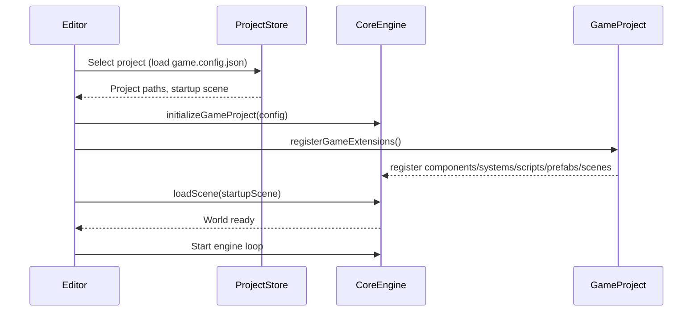

# Core vs Game Project Separation PRD

## 1. Overview

### Context & Goals

- Establish a clean separation between the core engine and game-specific code, mirroring Unity’s project model.
- Enable multiple distinct games to be built on top of the same engine with isolated code, assets, and configuration.
- Provide stable extension points (components, systems, scripts, prefabs, scenes) so projects extend core without forking it.
- Support editor workflows that operate on a selected game project with round‑trip serialization and hot reload.

### Current Pain Points

- Game logic, demo scenes, and sample content live alongside engine code under `src/core` and editor code, blurring boundaries.
- Asset scanning assumes a single `public/assets/` root; not easily project‑scoped or switchable.
- No formal public API boundary for `@core`; game code can deep‑import internals, risking tight coupling.
- Scene registration and script loading are not project‑aware, complicating multi‑project workflows.

## 2. Proposed Solution

### High‑level Summary

- Introduce a first‑class Game Project boundary with a dedicated directory and TS path alias (`@game/*`).
- Define a minimal, stable public API for the engine (`@core/*`) and forbid deep imports from engine internals in game code.
- Add explicit registries and extension points for project‑provided components, systems, scripts, prefabs, and scenes.
- Make assets, scenes, and scripts project‑scoped and discoverable via a project config and editor‑selectable project root.
- Provide a phased migration preserving functionality while progressively isolating responsibilities.

### Architecture & Directory Structure

```text
/ (repo root)
├── src/
│   ├── core/                        # Engine (public API only via @core/*)
│   │   ├── components/
│   │   ├── hooks/
│   │   ├── lib/
│   │   │   └── extension/           # Core extension surface (no barrels)
│   │   ├── systems/
│   │   └── types/
│   ├── game/                        # Game project (editable, user‑owned)
│   │   ├── assets/                  # Optional dev-local assets (editor copies/links to public/assets)
│   │   ├── components/              # Project components (register into core registry)
│   │   ├── systems/                 # Project ECS systems (register into core registry)
│   │   ├── scripts/                 # Unity‑like behaviour scripts
│   │   ├── prefabs/                 # Prefab definitions
│   │   ├── scenes/                  # Scene sources (JSON or JSX)
│   │   └── config/
│   │       └── game.config.json     # Project metadata (paths, startup scene)
│   └── editor/                      # Editor app (operates on selected project)
│
├── public/
│   └── assets/                      # Active project’s asset root (switchable via config)
└── docs/
```

Optional multi‑project support:

```text
projects/
├── sample-game/
│   ├── src/game/...                 # as above
│   └── public/assets/               # per‑project assets
└── another-game/
```

## 3. Implementation Plan

- Phase 0: Public API Boundary (0.5 day)

  1. Create `@core/*` path alias exposing an explicit public surface; forbid deep imports in game/editor.
  2. Add ESLint rule(s) to block non‑public `src/core` imports from `src/game`.
  3. Document allowed imports and stability guarantees.

- Phase 1: Introduce `src/game` and `@game/*` alias (0.5 day)

  1. Create `src/game/` with `components/`, `systems/`, `scripts/`, `prefabs/`, `scenes/`, `config/`.
  2. Move sample/demo scenes from `src/core/lib/scene/scenes/` into `src/game/scenes/`.
  3. Add `game.config.json` (startup scene, asset base, name, version).

- Phase 2: Extension Points & Registries (1.0 day)

  1. Define `GameExtensionPoints` in core: registration APIs for components, systems, scripts, prefabs, scenes.
  2. Validate descriptors with Zod; enforce namespacing to prevent ID collisions.
  3. Provide initialization entrypoint so editor/runtime can call `registerGameExtensions()` from `@game`.

- Phase 3: Project‑Scoped Assets (0.5–1.0 day)

  1. Make asset scanner base path configurable (from `game.config.json`).
  2. Support both `public/assets` and `projects/<name>/public/assets` via editor selection.
  3. Update Asset Loader UI to respect the project base path.

- Phase 4: Scene Loading & Serialization (1.0 day)

  1. Update Scene Registry to load from `@game/scenes` by key.
  2. Ensure importer/exporter read/write to the project scene directory.
  3. Validate scenes with Zod schemas; surface errors clearly in editor.

- Phase 5: Script System Integration (1.0 day)

  1. Implement project script discovery via `@game/scripts` and dynamic import.
  2. Bind script lifecycle to ECS update loop with stable hooks.
  3. Provide script attach/detach in the editor inspector.

- Phase 6: Editor Project Selector & State (0.5 day)

  1. Add `ProjectStore` holding selected project, paths, and config.
  2. Wire editor panels (assets, scenes, hierarchy) to project state.

- Phase 7: CI, Build, and Docs (0.5 day)
  1. Ensure Vite aliases and production build respect project selection.
  2. Add documentation and examples; add smoke tests.

## 4. File and Directory Structures

```text
src/core/lib/extension/
├── GameExtensionPoints.ts            # Core extension surface for game code
└── types.ts                          # Descriptors and Zod schemas (named exports only)

src/game/
├── components/
├── systems/
├── scripts/
├── prefabs/
├── scenes/
└── config/
    └── game.config.json
```

## 5. Technical Details

Core extension types (sketch):

```ts
// src/core/lib/extension/types.ts
export interface IGameProjectConfig {
  name: string;
  version?: string;
  assetBasePath: string; // e.g. "/assets" or "/projects/sample-game/public/assets"
  startupScene: string; // scene ID or path
}

export interface IComponentDescriptor<TData = unknown> {
  id: string; // namespace:component-id (e.g. game.health)
  schema: unknown; // Zod schema
  serialize: (entityId: number) => TData | undefined;
  deserialize: (entityId: number, data: TData) => void;
}

export interface ISystemDescriptor {
  id: string;
  order?: number;
  update: (dt: number) => void;
}

export interface IScriptDescriptor {
  id: string;
  onInit?: (entityId: number) => void;
  onUpdate?: (entityId: number, dt: number) => void;
  onDestroy?: (entityId: number) => void;
}

export interface IPrefabDescriptor {
  id: string;
  create: (params?: Record<string, unknown>) => number; // returns entityId
}

export interface ISceneDescriptor {
  id: string; // e.g. game.main
  load: () => Promise<void>; // populates world
}
```

```ts
// src/core/lib/extension/GameExtensionPoints.ts
export function registerComponent(desc: IComponentDescriptor): void {}
export function registerSystem(desc: ISystemDescriptor): void {}
export function registerScript(desc: IScriptDescriptor): void {}
export function registerPrefab(desc: IPrefabDescriptor): void {}
export function registerScene(desc: ISceneDescriptor): void {}

export function initializeGameProject(config: IGameProjectConfig): void {
  // Set project state (asset base, startup scene)
}
```

Game project bootstrap (sketch):

```ts
// src/game/index.ts
export function registerGameExtensions() {
  // Register components, systems, scripts, prefabs, scenes
}

export const gameConfig: IGameProjectConfig = {
  name: 'My Game',
  assetBasePath: '/assets',
  startupScene: 'game.main',
};
```

Editor/runtime integration:

```ts
// at app boot
initializeGameProject(gameConfig);
registerGameExtensions();
```

## 6. Usage Examples

- Register a component

```ts
registerComponent({
  id: 'game.health',
  schema: {
    /* zod schema */
  },
  serialize: (eid) => {
    /* ... */
  },
  deserialize: (eid, data) => {
    /* ... */
  },
});
```

- Register a system

```ts
registerSystem({
  id: 'game.health-system',
  order: 200,
  update: (dt) => {
    /* iterate entities with health */
  },
});
```

- Add a scene

```ts
registerScene({
  id: 'game.main',
  load: async () => {
    /* spawn camera, player, level */
  },
});
```

## 7. Testing Strategy

- Unit Tests

  - Descriptor validation (IDs, schemas, collisions).
  - Asset base path resolution from `game.config.json`.
  - Scene registration and lookup.
  - Script lifecycle hooks invocation.

- Integration Tests
  - Editor opens a project; asset browser shows project assets.
  - Import/export of scenes writes to `src/game/scenes` (or selected project path).
  - Runtime loads `startupScene` and runs project systems.

## 8. Edge Cases

| Edge Case                            | Remediation                                                |
| ------------------------------------ | ---------------------------------------------------------- |
| Missing `game.config.json`           | Fallback to defaults; block editing with actionable error. |
| Duplicate IDs between core and game  | Enforce namespacing; fail fast with clear errors.          |
| Asset path outside project           | Normalize and block traversal; warn user.                  |
| Scene references missing scripts     | Validate on import; mark entities with errors in editor.   |
| Switching projects while editor open | Prompt to save; hot‑reload registries safely.              |

## 9. Sequence Diagram



## 10. Risks & Mitigations

| Risk                              | Mitigation                                             |
| --------------------------------- | ------------------------------------------------------ |
| API surface too broad or unstable | Define minimal public API; add lint rules; semver.     |
| Migration breaks existing demos   | Migrate demos to `src/game`; provide shims short‑term. |
| Asset path confusion in builds    | Centralize base path in config; e2e test builds.       |
| Editor coupling to internals      | Route project concerns via ProjectStore + registries.  |

## 11. Timeline

- Total: ~4–5 days
  - Phase 0: 0.5d
  - Phase 1: 0.5d
  - Phase 2: 1.0d
  - Phase 3: 0.5–1.0d
  - Phase 4: 1.0d
  - Phase 5: 1.0d
  - Phase 6: 0.5d
  - Phase 7: 0.5d (overlap)

## 12. Acceptance Criteria

- `src/game` exists with `@game/*` alias; editor/runtime boot against it.
- Game code only imports `@core/*` public API (lint‑enforced); no deep imports.
- Extension points allow registering project components, systems, scripts, prefabs, scenes.
- Asset browser and serializer operate under the project’s base path.
- Startup scene loads from project config; switching projects works with clear UX.

## 13. Conclusion

This plan formalizes a Unity‑like boundary: a stable, minimal engine API and a project‑scoped game layer. It enables multiple games, safer iteration, clearer ownership, and a cleaner editor experience without sacrificing current capabilities.

## 14. Assumptions & Dependencies

- Yarn, React, R3F, Vite remain the stack; Tailwind for UI.
- TS path aliases available and enforced in ESLint/TSConfig.
- Zod is used for all descriptors and configs.
- Existing scene serializer and component registry can be extended rather than replaced.
