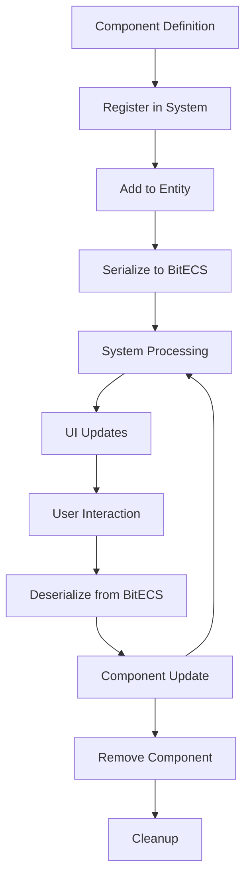

# Adding Components to the ECS System

This guide covers the complete pipeline for adding new components to the Vibe Coder 3D engine, from initial definition to inspector panel visualization.

## 🧠 System Architecture Overview

The component system uses a **scalable component registry** that provides:

- **BitECS integration** for high-performance data storage
- **Zod schema validation** for type safety and runtime validation
- **Automatic serialization/deserialization** between formats
- **Dependency management** and conflict detection
- **Inspector panel integration** with automatic UI generation

## 📁 File Structure

```
src/core/lib/ecs/components/
├── definitions/
│   ├── TransformComponent.ts     # ✅ Core component
│   ├── RigidBodyComponent.ts     # ✅ Physics component
│   ├── CameraComponent.ts        # ✅ Rendering component
│   ├── YourNewComponent.ts       # 🆕 Your component goes here
│   └── index.ts                  # Export aggregator
├── ComponentDefinitions.ts       # Registration logic
└── ...

src/editor/components/
├── inspector/adapters/
│   ├── TransformAdapter.tsx      # ✅ Transform UI adapter
│   ├── RigidBodyAdapter.tsx      # ✅ Physics UI adapter
│   └── YourNewAdapter.tsx        # 🆕 Your UI adapter
├── panels/InspectorPanel/
│   ├── Transform/                # ✅ Transform UI sections
│   ├── RigidBody/               # ✅ Physics UI sections
│   └── YourComponent/           # 🆕 Your UI sections
└── ...
```

## 🔧 Step-by-Step Guide

### Step 1: Define the Component Schema

Create a new file `src/core/lib/ecs/components/definitions/HealthComponent.ts`:

```typescript
/**
 * Health Component Definition
 * Handles entity health, damage, and regeneration
 */

import { Types } from 'bitecs';
import { z } from 'zod';

import { ComponentCategory, ComponentFactory } from '../../ComponentRegistry';
import { EntityId } from '../../types';

// 1. Define Zod schema for validation and TypeScript types
const HealthSchema = z.object({
  current: z.number().min(0),
  maximum: z.number().min(1),
  regenerationRate: z.number().min(0),
  isInvulnerable: z.boolean(),
  lastDamageTime: z.number().optional(),
});

// 2. Create component using ComponentFactory
export const healthComponent = ComponentFactory.create({
  id: 'Health', // Unique identifier
  name: 'Health', // Display name
  category: ComponentCategory.Gameplay, // Category for organization
  schema: HealthSchema, // Zod schema for validation

  // 3. Define BitECS field mappings (performance-optimized storage)
  fields: {
    current: Types.f32,
    maximum: Types.f32,
    regenerationRate: Types.f32,
    isInvulnerable: Types.ui8, // Boolean as uint8
    lastDamageTime: Types.f32,
  },

  // 4. Serialization: BitECS → JavaScript object
  serialize: (eid: EntityId, component: any) => ({
    current: component.current[eid],
    maximum: component.maximum[eid],
    regenerationRate: component.regenerationRate[eid],
    isInvulnerable: Boolean(component.isInvulnerable[eid]),
    lastDamageTime: component.lastDamageTime[eid],
  }),

  // 5. Deserialization: JavaScript object → BitECS
  deserialize: (eid: EntityId, data, component: any) => {
    component.current[eid] = data.current ?? data.maximum ?? 100;
    component.maximum[eid] = data.maximum ?? 100;
    component.regenerationRate[eid] = data.regenerationRate ?? 0;
    component.isInvulnerable[eid] = data.isInvulnerable ? 1 : 0;
    component.lastDamageTime[eid] = data.lastDamageTime ?? 0;
  },

  // 6. Lifecycle hooks (optional)
  onAdd: (eid: EntityId, data) => {
    console.log(`Health component added to entity ${eid} with ${data.current}/${data.maximum} HP`);
  },
  onRemove: (eid: EntityId) => {
    console.log(`Health component removed from entity ${eid}`);
  },

  // 7. Component relationships (optional)
  dependencies: [], // Required components
  conflicts: [], // Incompatible components

  // 8. Metadata (optional)
  metadata: {
    description: 'Health and damage system for gameplay entities',
    version: '1.0.0',
    author: 'Your Name',
    tags: ['gameplay', 'health', 'damage'],
  },
});

// 9. Export TypeScript type
export type HealthData = z.infer<typeof HealthSchema>;
```

### Step 2: Export the Component

Update `src/core/lib/ecs/components/definitions/index.ts`:

```typescript
// Add your new component to the exports
export { healthComponent, type HealthData } from './HealthComponent';

// Existing exports...
export { cameraComponent, type CameraData } from './CameraComponent';
export { meshColliderComponent, type MeshColliderData } from './MeshColliderComponent';
export { meshRendererComponent, type MeshRendererData } from './MeshRendererComponent';
export { rigidBodyComponent, type RigidBodyData } from './RigidBodyComponent';
export { transformComponent, type TransformData } from './TransformComponent';
```

### Step 3: Register the Component

Update `src/core/lib/ecs/components/ComponentDefinitions.ts`:

```typescript
// Import your new component
import {
  healthComponent, // 🆕 Add this
  cameraComponent,
  meshColliderComponent,
  meshRendererComponent,
  rigidBodyComponent,
  transformComponent,
  type HealthData, // 🆕 Add this
  type CameraData,
  // ... other types
} from './definitions';

export function registerCoreComponents(): void {
  componentRegistry.register(transformComponent);
  componentRegistry.register(meshRendererComponent);
  componentRegistry.register(rigidBodyComponent);
  componentRegistry.register(meshColliderComponent);
  componentRegistry.register(cameraComponent);
  componentRegistry.register(healthComponent); // 🆕 Add this

  console.log('Core components registered successfully');
}

// Export the new type
export type { HealthData }; // 🆕 Add this
```

### Step 4: Add Component Type Definition

Update `src/core/lib/ecs/IComponent.ts`:

```typescript
export enum KnownComponentTypes {
  TRANSFORM = 'Transform',
  MESH_RENDERER = 'MeshRenderer',
  RIGID_BODY = 'RigidBody',
  MESH_COLLIDER = 'MeshCollider',
  CAMERA = 'Camera',
  HEALTH = 'Health', // 🆕 Add this
}
```

### Step 5: Create Inspector UI Section

Create `src/editor/components/panels/InspectorPanel/Health/HealthSection.tsx`:

```typescript
import React from 'react';
import { FiHeart } from 'react-icons/fi';

import { KnownComponentTypes } from '@/core/lib/ecs/IComponent';
import { HealthData } from '@/core/lib/ecs/components/definitions/HealthComponent';
import { ComponentField } from '@/editor/components/shared/ComponentField';
import { FieldGroup } from '@/editor/components/shared/FieldGroup';
import { GenericComponentSection } from '@/editor/components/shared/GenericComponentSection';
import { SingleAxisField } from '@/editor/components/shared/SingleAxisField';
import { ToggleField } from '@/editor/components/shared/ToggleField';

export interface IHealthSectionProps {
  healthData: HealthData;
  onUpdate: (data: Partial<HealthData>) => void;
  onRemove?: () => void;
  isPlaying?: boolean;
}

export const HealthSection: React.FC<IHealthSectionProps> = ({
  healthData,
  onUpdate,
  onRemove,
  isPlaying = false,
}) => {
  const handleRemoveHealth = () => {
    onRemove?.();
  };

  const updateHealth = (updates: Partial<HealthData>) => {
    onUpdate({ ...healthData, ...updates });
  };

  // Calculate health percentage for visual feedback
  const healthPercentage = (healthData.current / healthData.maximum) * 100;
  const isLowHealth = healthPercentage < 25;
  const isCriticalHealth = healthPercentage < 10;

  return (
    <GenericComponentSection
      title="Health"
      icon={<FiHeart />}
      headerColor={isCriticalHealth ? 'red' : isLowHealth ? 'orange' : 'green'}
      componentId={KnownComponentTypes.HEALTH}
      onRemove={handleRemoveHealth}
    >
      {/* Health Status Bar */}
      <div className="mb-3">
        <div className="flex justify-between items-center mb-1">
          <span className="text-xs text-gray-300">Health</span>
          <span className="text-xs text-gray-300">
            {healthData.current.toFixed(1)} / {healthData.maximum.toFixed(1)}
          </span>
        </div>
        <div className="w-full bg-gray-700 rounded-full h-2">
          <div
            className={`h-2 rounded-full transition-all duration-300 ${
              isCriticalHealth
                ? 'bg-red-500'
                : isLowHealth
                ? 'bg-orange-500'
                : 'bg-green-500'
            }`}
            style={{ width: `${Math.max(0, healthPercentage)}%` }}
          />
        </div>
      </div>

      <FieldGroup label="Health Values">
        <SingleAxisField
          label="Current Health"
          value={healthData.current}
          onChange={(value: number) => updateHealth({ current: Math.max(0, Math.min(value, healthData.maximum)) })}
          step={1}
          min={0}
          max={healthData.maximum}
          disabled={isPlaying}
        />

        <SingleAxisField
          label="Maximum Health"
          value={healthData.maximum}
          onChange={(value: number) => updateHealth({
            maximum: Math.max(1, value),
            current: Math.min(healthData.current, Math.max(1, value))
          })}
          step={1}
          min={1}
          disabled={isPlaying}
        />

        <SingleAxisField
          label="Regeneration Rate"
          value={healthData.regenerationRate}
          onChange={(value: number) => updateHealth({ regenerationRate: Math.max(0, value) })}
          step={0.1}
          min={0}
          placeholder="HP per second"
        />
      </FieldGroup>

      <FieldGroup label="Status">
        <ToggleField
          label="Invulnerable"
          value={healthData.isInvulnerable}
          onChange={(value: boolean) => updateHealth({ isInvulnerable: value })}
          resetValue={false}
          color="purple"
        />
      </FieldGroup>

      {/* Debug Information */}
      {healthData.lastDamageTime && healthData.lastDamageTime > 0 && (
        <div className="mt-2 p-2 bg-gray-800/50 rounded text-xs text-gray-400">
          Last damage: {new Date(healthData.lastDamageTime).toLocaleTimeString()}
        </div>
      )}
    </GenericComponentSection>
  );
};
```

### Step 6: Create Inspector Adapter

Create `src/editor/components/inspector/adapters/HealthAdapter.tsx`:

```typescript
import React from 'react';

import { KnownComponentTypes } from '@/core/lib/ecs/IComponent';
import { HealthSection } from '@/editor/components/panels/InspectorPanel/Health/HealthSection';

interface IHealthAdapterProps {
  healthComponent: any;
  updateComponent: (type: string, data: any) => boolean;
  removeComponent: (type: string) => boolean;
  isPlaying: boolean;
}

export const HealthAdapter: React.FC<IHealthAdapterProps> = ({
  healthComponent,
  updateComponent,
  removeComponent,
  isPlaying,
}) => {
  const data = healthComponent?.data;

  if (!data) return null;

  // Convert ECS data to the format expected by HealthSection
  const healthData = {
    current: data.current ?? 100,
    maximum: data.maximum ?? 100,
    regenerationRate: data.regenerationRate ?? 0,
    isInvulnerable: data.isInvulnerable ?? false,
    lastDamageTime: data.lastDamageTime ?? 0,
  };

  const handleHealthUpdate = (newData: any) => {
    if (newData === null) {
      // Remove health component
      removeComponent(KnownComponentTypes.HEALTH);
    } else {
      // Update health component
      updateComponent(KnownComponentTypes.HEALTH, newData);
    }
  };

  return (
    <HealthSection
      healthData={healthData}
      onUpdate={handleHealthUpdate}
      onRemove={() => handleHealthUpdate(null)}
      isPlaying={isPlaying}
    />
  );
};
```

### Step 7: Update Inspector Hooks

Update `src/editor/hooks/useEntityComponents.ts`:

```typescript
// Add convenience computed value
const hasHealth = useMemo(
  () => components.some((c) => c.type === KnownComponentTypes.HEALTH),
  [components],
);

// Add getter method
const getHealth = useCallback(() => {
  return getComponent(KnownComponentTypes.HEALTH);
}, [getComponent]);

// Add to return object
return {
  // ... existing properties
  hasHealth, // 🆕 Add this
  getHealth, // 🆕 Add this
  // ... rest of properties
};
```

### Step 8: Update Inspector Data Hook

Update `src/editor/hooks/useInspectorData.ts`:

```typescript
export const useInspectorData = () => {
  const selectedEntity = useEditorStore((s) => s.selectedId);
  const isPlaying = useEditorStore((s) => s.isPlaying);

  const entityComponentsData = useEntityComponents(selectedEntity);

  return {
    selectedEntity,
    isPlaying,
    ...entityComponentsData, // This now includes hasHealth and getHealth
  };
};
```

### Step 9: Update Component List

Update `src/editor/components/inspector/sections/ComponentList.tsx`:

```typescript
// Import new adapter
import { HealthAdapter } from '@/editor/components/inspector/adapters/HealthAdapter';

// Add to interface
interface IComponentListProps {
  // ... existing props
  hasHealth: boolean;          // 🆕 Add this
  getHealth: () => any;        // 🆕 Add this
}

// Add to component props
export const ComponentList: React.FC<IComponentListProps> = ({
  // ... existing props
  hasHealth,                   // 🆕 Add this
  getHealth,                   // 🆕 Add this
}) => {
  return (
    <>
      {/* Existing components... */}

      {/* Health Component */}
      {hasHealth && (
        <HealthAdapter
          healthComponent={getHealth()}
          updateComponent={updateComponent}
          removeComponent={removeComponent}
          isPlaying={isPlaying}
        />
      )}
    </>
  );
};
```

### Step 10: Update Inspector Panel Content

Update `src/editor/components/panels/InspectorPanel/InspectorPanelContent/InspectorPanelContent.tsx`:

```typescript
export const InspectorPanelContent: React.FC = React.memo(() => {
  const {
    selectedEntity,
    isPlaying,
    components,
    hasTransform,
    hasMeshRenderer,
    hasRigidBody,
    hasMeshCollider,
    hasCamera,
    hasHealth,        // 🆕 Add this
    getTransform,
    getMeshRenderer,
    getRigidBody,
    getMeshCollider,
    getCamera,
    getHealth,        // 🆕 Add this
    addComponent,
    updateComponent,
    removeComponent,
  } = useInspectorData();

  // ... rest of component

  return (
    <div className="space-y-2 p-2 pb-4">
      <ComponentList
        selectedEntity={selectedEntity}
        isPlaying={isPlaying}
        hasTransform={hasTransform}
        hasMeshRenderer={hasMeshRenderer}
        hasRigidBody={hasRigidBody}
        hasMeshCollider={hasMeshCollider}
        hasCamera={hasCamera}
        hasHealth={hasHealth}        // 🆕 Add this
        getTransform={getTransform}
        getMeshRenderer={getMeshRenderer}
        getRigidBody={getRigidBody}
        getMeshCollider={getMeshCollider}
        getCamera={getCamera}
        getHealth={getHealth}        // 🆕 Add this
        addComponent={addComponent}
        updateComponent={updateComponent}
        removeComponent={removeComponent}
      />

      <DebugSection selectedEntity={selectedEntity} components={components} />
    </div>
  );
});
```

### Step 11: Add to Add Component Menu

Update `src/editor/components/menus/AddComponentMenu.tsx`:

```typescript
const COMPONENT_DEFINITIONS: IComponentDefinition[] = [
  // ... existing components
  {
    id: KnownComponentTypes.HEALTH,
    name: 'Health',
    description: 'Health and damage system',
    icon: <FiHeart className="w-4 h-4" />,
    category: 'Gameplay',
  },
];
```

## 💻 Creating a System (Recommended)

Systems process component data each frame. Create `src/core/systems/healthSystem.ts`:

```typescript
import { defineQuery } from 'bitecs';

import { componentRegistry } from '@core/lib/ecs/ComponentRegistry';
import { ECSWorld } from '@core/lib/ecs/World';
import { HealthData } from '@core/lib/ecs/components/definitions/HealthComponent';

// Get world instance
const world = ECSWorld.getInstance().getWorld();

// Lazy-initialize the query
let healthQuery: ReturnType<typeof defineQuery> | null = null;

function getHealthQuery() {
  if (!healthQuery) {
    const healthComponent = componentRegistry.getBitECSComponent('Health');
    if (!healthComponent) {
      console.warn('[healthSystem] Health component not yet registered, skipping update');
      return null;
    }
    healthQuery = defineQuery([healthComponent]);
  }
  return healthQuery;
}

/**
 * Health System - Processes health regeneration and status updates
 */
export function healthSystem(deltaTime: number): number {
  const query = getHealthQuery();
  if (!query) return 0;

  const entities = query(world);
  let updatedCount = 0;

  entities.forEach((eid: number) => {
    const healthData = componentRegistry.getComponentData<HealthData>(eid, 'Health');
    if (!healthData) return;

    // Skip if invulnerable or already at max health
    if (healthData.isInvulnerable || healthData.current >= healthData.maximum) {
      return;
    }

    // Apply health regeneration
    if (healthData.regenerationRate > 0) {
      const newHealth = Math.min(
        healthData.maximum,
        healthData.current + healthData.regenerationRate * deltaTime,
      );

      if (newHealth !== healthData.current) {
        componentRegistry.updateComponent(eid, 'Health', { current: newHealth });
        updatedCount++;
      }
    }
  });

  return updatedCount;
}
```

### Integrate System into Engine Loop

Update `src/core/components/EngineLoop.tsx`:

```typescript
// Import your system
import { healthSystem } from '../systems/healthSystem';

// In the useFrame callback, add:
useFrame((state, deltaTime) => {
  // ... existing systems

  // Run health system
  healthSystem(deltaTime);

  // ... rest of systems
});
```

## 🔗 System Integration for Real-time Updates

**IMPORTANT**: The guide above creates component data and UI, but to make changes actually reflect in the viewport/game, you need to create **systems** that read component data and apply it to the rendering/physics/game systems.

### Example: Camera Background System Integration

Here's how the Camera component integrates with the Three.js scene:

#### 1. Create a Hook for System Integration

`src/core/hooks/useCameraBackground.ts`:

```typescript
import { useEffect, useRef } from 'react';
import { useThree } from '@react-three/fiber';
import { Color } from 'three';

export function useCameraBackground(
  clearFlags: string = 'skybox',
  backgroundColor?: { r: number; g: number; b: number; a: number },
) {
  const { scene } = useThree();
  const currentClearFlagsRef = useRef<string | null>(null);
  const currentBgColorRef = useRef<string | null>(null);

  useEffect(() => {
    const bgColorKey = backgroundColor
      ? `${backgroundColor.r}-${backgroundColor.g}-${backgroundColor.b}-${backgroundColor.a}`
      : null;

    // Check if anything has changed
    const clearFlagsChanged = currentClearFlagsRef.current !== clearFlags;
    const bgColorChanged = currentBgColorRef.current !== bgColorKey;

    if (!clearFlagsChanged && !bgColorChanged) return;

    // Apply the appropriate background based on clear flags
    switch (clearFlags) {
      case 'solidColor':
        if (backgroundColor) {
          scene.background = new Color(backgroundColor.r, backgroundColor.g, backgroundColor.b);
        } else {
          scene.background = new Color(0, 0, 0); // Black fallback
        }
        break;

      case 'skybox':
        scene.background = new Color('#87CEEB'); // Sky blue
        break;

      case 'depthOnly':
      case 'dontClear':
        scene.background = null;
        break;
    }

    // Update refs
    currentClearFlagsRef.current = clearFlags;
    currentBgColorRef.current = bgColorKey;
  }, [clearFlags, backgroundColor, scene]);
}
```

#### 2. Create a Manager Component

`src/core/components/cameras/CameraBackgroundManager.tsx`:

```typescript
import React, { useEffect, useState } from 'react';
import { defineQuery } from 'bitecs';

import { componentRegistry } from '@core/lib/ecs/ComponentRegistry';
import { ECSWorld } from '@core/lib/ecs/World';
import { useCameraBackground } from '@core/hooks/useCameraBackground';

export const CameraBackgroundManager: React.FC = () => {
  const [clearFlags, setClearFlags] = useState<string>('skybox');
  const [backgroundColor, setBackgroundColor] = useState<
    { r: number; g: number; b: number; a: number } | undefined
  >();

  const world = ECSWorld.getInstance().getWorld();

  useEffect(() => {
    const updateFromMainCamera = () => {
      const cameraComponent = componentRegistry.getBitECSComponent('Camera');
      if (!cameraComponent) return;

      const query = defineQuery([cameraComponent]);
      const entities = query(world);

      // Find the main camera
      let mainCameraEntity: number | null = null;

      for (const eid of entities) {
        const cameraData = componentRegistry.getComponentData<CameraData>(eid, 'Camera');
        console.log(`Entity ${eid} - Camera data:`, cameraData);

        if (cameraData?.isMain) {
          mainCameraEntity = eid;
          console.log(`Found main camera: entity ${eid}`);
          break;
        }
      }

      if (mainCameraEntity === null && entities.length > 0) {
        mainCameraEntity = entities[0];
        console.log('No main camera found, using first camera:', mainCameraEntity);
      }

      if (mainCameraEntity) {
        const cameraData = componentRegistry.getComponentData(mainCameraEntity, 'Camera');
        if (cameraData) {
          setClearFlags(cameraData.clearFlags);
          setBackgroundColor(cameraData.backgroundColor);
        }
      }
    };

    // Update immediately and then poll for changes
    updateFromMainCamera();
    const interval = setInterval(updateFromMainCamera, 100);

    return () => clearInterval(interval);
  }, [world]);

  // Use the hook to actually apply the changes to the scene
  useCameraBackground(clearFlags, backgroundColor);

  return null; // This component doesn't render anything
};
```

#### 3. Integrate into Viewport

Add the manager to your Canvas in `ViewportPanel.tsx`:

```typescript
import { CameraBackgroundManager } from '@/core/components/cameras/CameraBackgroundManager';

// Inside your Canvas:
<Canvas>
  {/* Other components */}
  <CameraBackgroundManager />
  {/* Rest of your scene */}
</Canvas>
```

### General Pattern for System Integration

For any component that affects the 3D scene or game state:

1. **Create a Hook** (`useComponentName.ts`) that:

   - Takes component data as parameters
   - Uses Three.js hooks (`useThree`, `useFrame`) to apply changes
   - Optimizes with refs to avoid unnecessary updates

2. **Create a Manager Component** (`ComponentNameManager.tsx`) that:

   - Queries ECS for entities with your component
   - Extracts the relevant data
   - Passes it to your hook

3. **Add Manager to Scene** in `ViewportPanel.tsx` or `EngineLoop.tsx`

4. **Remove Hardcoded Values** that might override your component data

This pattern ensures that:

- ✅ UI changes immediately reflect in the viewport
- ✅ Component data drives the actual game/rendering behavior
- ✅ Multiple entities can have the same component type
- ✅ Main/primary entities can be prioritized
- ✅ Performance is optimized with change detection

## 🔗 Using Components in Game Code

### Using the Component Registry Hook

```typescript
import { useComponentRegistry } from '@/core/hooks/useComponentRegistry';

function MyGameComponent() {
  const { addComponent, getComponentData, updateComponent } = useComponentRegistry();

  const handleDamage = (entityId: number, damage: number) => {
    const healthData = getComponentData<HealthData>(entityId, 'Health');
    if (healthData && !healthData.isInvulnerable) {
      const newHealth = Math.max(0, healthData.current - damage);
      updateComponent(entityId, 'Health', {
        current: newHealth,
        lastDamageTime: Date.now()
      });
    }
  };

  return (
    // Your component JSX
  );
}
```

### Using Entity Creation Hook

```typescript
import { useEntityCreation } from '@/editor/hooks/useEntityCreation';
import { useComponentManager } from '@/editor/hooks/useComponentManager';

function CreateEnemyButton() {
  const { createCube } = useEntityCreation();
  const componentManager = useComponentManager();

  const createEnemy = () => {
    // Create cube entity (comes with Transform and MeshRenderer)
    const enemy = createCube('Enemy');

    // Add health component
    componentManager.addComponent(enemy.id, 'Health', {
      current: 100,
      maximum: 100,
      regenerationRate: 1,
      isInvulnerable: false,
    });

    // Add physics components
    componentManager.addComponent(enemy.id, 'RigidBody', {
      enabled: true,
      bodyType: 'dynamic',
      mass: 1,
      gravityScale: 1,
      canSleep: true,
      material: { friction: 0.7, restitution: 0.3, density: 1 }
    });
  };

  return <button onClick={createEnemy}>Create Enemy</button>;
}
```

## 🧪 Testing Your Component

### 1. Runtime Testing

```typescript
// In your game code or tests
import { useComponentRegistry } from '@/core/hooks/useComponentRegistry';

const { addComponent, getComponentData, updateComponent } = useComponentRegistry();

// Add health component to an entity
addComponent(entityId, 'Health', {
  current: 80,
  maximum: 100,
  regenerationRate: 2.5,
  isInvulnerable: false,
});

// Read component data
const healthData = getComponentData(entityId, 'Health');
console.log(healthData); // { current: 80, maximum: 100, ... }

// Update component
updateComponent(entityId, 'Health', { current: 50 });
```

### 2. Inspector Testing

1. Run the editor: `yarn dev`
2. Create an entity in the scene
3. Select the entity in the hierarchy
4. Click "Add Component" in the inspector
5. Choose your new "Health" component
6. Verify the UI renders correctly
7. Test field updates and validation

## 🎯 Best Practices

### Component Design

- **Single Responsibility**: Each component should have one clear purpose
- **Data-Oriented**: Store only data, not behavior (use systems for logic)
- **Immutable Updates**: Always create new objects when updating
- **Validation**: Use Zod schemas for runtime validation

### Performance Considerations

- **BitECS Fields**: Use appropriate data types (`Types.f32` for floats, `Types.ui8` for booleans)
- **Serialization**: Keep serialize/deserialize functions simple and fast
- **Memory**: Avoid storing large objects directly in components

### UI Guidelines

- **Consistent Styling**: Follow existing component UI patterns
- **Responsive Fields**: Use appropriate input types for different data
- **Visual Feedback**: Provide immediate feedback for user interactions
- **Error Handling**: Handle invalid input gracefully

## 🔄 Component Lifecycle



## 📚 Advanced Features

### Component Dependencies

```typescript
export const myComponent = ComponentFactory.create({
  // ... other config
  dependencies: ['Transform', 'MeshRenderer'], // Required components
  conflicts: ['Camera'], // Incompatible components
});
```

### Component Events

```typescript
// Listen for component events
useEvent('component:added', (event) => {
  if (event.componentId === 'Health') {
    console.log(`Health component added to entity ${event.entityId}`);
  }
});
```

### Dynamic Component Loading

```typescript
// Runtime component registration
const dynamicComponent = ComponentFactory.create({
  // ... component definition
});

componentRegistry.register(dynamicComponent);
```

## 🚀 Next Steps

After implementing your component:

1. **Write Tests**: Add unit tests for your component logic
2. **Create Systems**: Build systems that process your component data
3. **Add Documentation**: Document your component's purpose and usage
4. **Performance Profile**: Test with many entities to ensure performance
5. **Share**: Consider contributing useful components back to the core

## 🔗 Related Files

- **Core System**: `src/core/lib/ecs/ComponentRegistry.ts`
- **Component Definitions**: `src/core/lib/ecs/components/definitions/`
- **Inspector System**: `src/editor/components/inspector/`
- **Example Components**: `src/core/lib/ecs/components/ComponentDefinitions.ts`

## ✅ Component Integration Checklist

Use this checklist to ensure you haven't missed any steps:

### Core Component Definition

- [ ] Created component definition file in `src/core/lib/ecs/components/definitions/`
- [ ] Defined Zod schema for validation
- [ ] Used `ComponentFactory.create()` with proper BitECS field mappings
- [ ] Implemented serialize/deserialize functions
- [ ] Added component to `definitions/index.ts` exports
- [ ] Registered component in `ComponentDefinitions.ts`
- [ ] Added component ID to `KnownComponentTypes` enum

### Inspector Integration

- [ ] Created UI section component in `src/editor/components/panels/InspectorPanel/YourComponent/`
- [ ] Created adapter component in `src/editor/components/inspector/adapters/`
- [ ] Added component props to `useEntityComponents` hook
- [ ] Updated `ComponentList.tsx` to render your component
- [ ] Updated inspector panel content to pass component data
- [ ] Added component to `AddComponentMenu.tsx`

### System Integration (Optional)

- [ ] Created system file in `src/core/systems/`
- [ ] Integrated system into `EngineLoop.tsx`
- [ ] Tested system performance with many entities

### Testing & Validation

- [ ] Component appears in Add Component menu
- [ ] Component UI renders correctly in inspector
- [ ] Component data updates correctly
- [ ] Component validation works (try invalid data)
- [ ] Component removal works properly
- [ ] No console errors during normal usage

## 🚨 Common Issues & Troubleshooting

### "Component not found" Errors

```typescript
// Problem: Component not registered
console.error('Component Health not found');

// Solution: Check registration in ComponentDefinitions.ts
export function registerCoreComponents(): void {
  // ... other components
  componentRegistry.register(healthComponent); // Make sure this is present
}
```

### Inspector Not Showing Component

```typescript
// Problem: Missing in ComponentList or useEntityComponents
// Solution: Check these files for your component:

// 1. useEntityComponents.ts - Add computed value
const hasHealth = useMemo(
  () => components.some((c) => c.type === KnownComponentTypes.HEALTH),
  [components],
);

// 2. ComponentList.tsx - Add rendering
{hasHealth && (
  <HealthAdapter
    healthComponent={getHealth()}
    updateComponent={updateComponent}
    removeComponent={removeComponent}
    isPlaying={isPlaying}
  />
)}
```

### Serialization/Deserialization Issues

```typescript
// Problem: Data not persisting correctly
// Solution: Check field mappings match schema

// Schema defines:
const HealthSchema = z.object({
  current: z.number(),
  maximum: z.number(),
});

// Fields must match:
fields: {
  current: Types.f32,  // ✅ Matches
  maximum: Types.f32,  // ✅ Matches
  // missing: Types.f32  // ❌ Would cause issues
}
```

### Performance Issues

```typescript
// Problem: System running too often
// Solution: Add performance optimizations

export function healthSystem(deltaTime: number): number {
  // Use throttling for expensive operations
  const now = performance.now();
  if (now - lastUpdateTime < 16) return 0; // 60fps max

  // Only update entities that need updates
  entities.forEach((eid: number) => {
    if (shouldSkipEntity(eid)) return;
    // ... process entity
  });
}
```

### TypeScript Errors

```typescript
// Problem: Type mismatches
// Solution: Ensure consistent types

// Component definition
export type HealthData = z.infer<typeof HealthSchema>;

// Usage in systems/hooks
const healthData = getComponentData<HealthData>(eid, 'Health');
//                                 ^^^^^^^^^^^ Use the exported type
```

## 🎯 Advanced Patterns

### Component Composition

```typescript
// Create compound components that depend on others
export const characterComponent = ComponentFactory.create({
  dependencies: ['Transform', 'Health', 'MeshRenderer'],
  // ... rest of definition
});
```

### Event-Driven Component Updates

The Vibe Coder 3D engine includes a powerful event system that allows components to react to changes efficiently without polling. This is the **preferred approach** for real-time component synchronization.

#### Available Component Events

```typescript
import { useEvent } from '@/core/hooks/useEvent';

// Component lifecycle events
useEvent('component:added', (event) => {
  console.log(`Component ${event.componentId} added to entity ${event.entityId}`);
  console.log('Component data:', event.data);
});

useEvent('component:updated', (event) => {
  console.log(`Component ${event.componentId} updated on entity ${event.entityId}`);
  console.log('New data:', event.data);
});

useEvent('component:removed', (event) => {
  console.log(`Component ${event.componentId} removed from entity ${event.entityId}`);
});
```

#### Event-Driven Component Manager Pattern

Instead of using polling (`setInterval`), use events for responsive component managers:

```typescript
export const CameraBackgroundManager: React.FC = () => {
  const [clearFlags, setClearFlags] = useState<string>('skybox');
  const [backgroundColor, setBackgroundColor] = useState<any>();

  const world = ECSWorld.getInstance().getWorld();
  const lastUpdateRef = useRef<any>({});

  const updateFromMainCamera = useCallback(() => {
    try {
      const cameraComponent = componentRegistry.getBitECSComponent('Camera');
      if (!cameraComponent) return;

      const query = defineQuery([cameraComponent]);
      const entities = query(world);

      // Find main camera
      let mainCameraEntity: number | null = null;
      for (const eid of entities) {
        const cameraData = componentRegistry.getComponentData<CameraData>(eid, 'Camera');
        if (cameraData?.isMain) {
          mainCameraEntity = eid;
          break;
        }
      }

      if (mainCameraEntity !== null) {
        const cameraData = componentRegistry.getComponentData<CameraData>(
          mainCameraEntity,
          'Camera',
        );

        if (cameraData) {
          const newClearFlags = cameraData.clearFlags || 'skybox';
          const newBackgroundColor = cameraData.backgroundColor;

          // Check for changes to avoid unnecessary updates
          const clearFlagsChanged = lastUpdateRef.current.clearFlags !== newClearFlags;
          const backgroundColorChanged =
            JSON.stringify(lastUpdateRef.current.backgroundColor) !==
            JSON.stringify(newBackgroundColor);

          if (clearFlagsChanged || backgroundColorChanged) {
            console.log('[CameraBackgroundManager] Camera background updated:', {
              clearFlags: newClearFlags,
              backgroundColor: newBackgroundColor,
            });

            setClearFlags(newClearFlags);
            setBackgroundColor(newBackgroundColor);

            // Update ref for next comparison
            lastUpdateRef.current = {
              clearFlags: newClearFlags,
              backgroundColor: newBackgroundColor,
            };
          }
        }
      }
    } catch (error) {
      console.error('[CameraBackgroundManager] Error updating from main camera:', error);
    }
  }, [world]);

  // Initial load
  useEffect(() => {
    updateFromMainCamera();
  }, [updateFromMainCamera]);

  // Event-driven updates (NO POLLING!)
  useEvent('component:updated', (event) => {
    if (event.componentId === 'Camera') {
      updateFromMainCamera();
    }
  });

  useEvent('component:added', (event) => {
    if (event.componentId === 'Camera') {
      updateFromMainCamera();
    }
  });

  useEvent('component:removed', (event) => {
    if (event.componentId === 'Camera') {
      updateFromMainCamera();
    }
  });

  // Apply changes to Three.js scene
  useCameraBackground(clearFlags, backgroundColor);

  return null;
};
```

#### Benefits of Event-Driven Components

✅ **Performance**: No wasted CPU cycles on constant polling  
✅ **Responsiveness**: Immediate updates when data changes  
✅ **Debugging**: Clear event logs for tracking data flow  
✅ **Scalability**: Works efficiently with many components

#### Event-Driven Best Practices

```typescript
// ✅ DO: Use events for real-time synchronization
useEvent('component:updated', (event) => {
  if (event.componentId === 'YourComponent') {
    updateFromECS();
  }
});

// ❌ DON'T: Use excessive polling
useEffect(() => {
  const interval = setInterval(updateFromECS, 100); // Wasteful!
  return () => clearInterval(interval);
}, []);

// ✅ DO: Add change detection to prevent unnecessary updates
const updateFromECS = useCallback(() => {
  const newData = getComponentData();

  // Only update if data actually changed
  if (!isEqual(lastDataRef.current, newData)) {
    setComponentState(newData);
    lastDataRef.current = newData;
  }
}, []);

// ✅ DO: Use setTimeout for event handling to ensure proper timing
useEvent('component:updated', (event) => {
  if (event.componentId === 'YourComponent') {
    // Ensure event processing completes before updating
    setTimeout(() => updateFromECS(), 0);
  }
});
```

#### Multi-Component Event Handling

```typescript
// Listen to multiple component types
const WATCHED_COMPONENTS = ['Transform', 'MeshRenderer', 'Camera'];

useEvent('component:updated', (event) => {
  if (WATCHED_COMPONENTS.includes(event.componentId)) {
    console.log(`Watched component updated: ${event.componentId}`);
    updateRelatedSystems(event);
  }
});

// Batch updates for performance
const pendingUpdates = useRef(new Set<string>());

useEvent('component:updated', (event) => {
  pendingUpdates.current.add(event.componentId);

  // Debounce batch updates
  setTimeout(() => {
    if (pendingUpdates.current.size > 0) {
      processBatchUpdates(Array.from(pendingUpdates.current));
      pendingUpdates.current.clear();
    }
  }, 0);
});
```

#### Event Debugging Tools

```typescript
// Enable comprehensive event logging for debugging
const DEBUG_COMPONENT_EVENTS = true;

if (DEBUG_COMPONENT_EVENTS) {
  useEvent('component:added', (event) => {
    console.log(`[EVENT] ➕ Component added:`, {
      component: event.componentId,
      entity: event.entityId,
      data: event.data,
      timestamp: Date.now(),
    });
  });

  useEvent('component:updated', (event) => {
    console.log(`[EVENT] 🔄 Component updated:`, {
      component: event.componentId,
      entity: event.entityId,
      data: event.data,
      timestamp: Date.now(),
    });
  });

  useEvent('component:removed', (event) => {
    console.log(`[EVENT] ➖ Component removed:`, {
      component: event.componentId,
      entity: event.entityId,
      timestamp: Date.now(),
    });
  });
}
```

### Dynamic Component Loading

```typescript
// Register components at runtime
const dynamicComponent = ComponentFactory.create({
  id: 'DynamicComponent',
  // ... definition
});

componentRegistry.register(dynamicComponent);
```

## 📈 Performance Considerations

### Memory Efficiency

- Use appropriate BitECS types (`Types.ui8` for booleans, not `Types.f32`)
- Avoid storing large objects directly in components
- Use entity IDs to reference other entities instead of storing references

### System Optimization

- Use queries efficiently (cache them, don't recreate each frame)
- Process only entities that need updates
- Consider using different update frequencies for different systems

### UI Performance

- Use `React.memo()` for component UI sections
- Debounce user input for expensive updates
- Only re-render inspector sections when data actually changes

## 🔗 Advanced Integration Patterns

### Component Evolution & Schema Updates

When adding new fields to existing components, follow this pattern:

```typescript
// 1. Update the Zod schema
const ComponentSchema = z.object({
  // ... existing fields
  newField: z.string().optional(), // Always make new fields optional for backward compatibility
  newComplexField: z.object({
    subField1: z.number(),
    subField2: z.boolean(),
  }).optional(),
});

// 2. Update BitECS fields
fields: {
  // ... existing fields
  newField: Types.ui8, // Choose appropriate type
  newComplexSubField1: Types.f32, // Break down complex objects into primitives
  newComplexSubField2: Types.ui8,
},

// 3. Update serialization (BitECS → JS object)
serialize: (eid: EntityId, component: any) => ({
  // ... existing fields
  newField: component.newField[eid] ?? 'defaultValue',
  newComplexField: {
    subField1: component.newComplexSubField1[eid] ?? 0,
    subField2: Boolean(component.newComplexSubField2[eid] ?? 0),
  },
}),

// 4. Update deserialization (JS object → BitECS)
deserialize: (eid: EntityId, data, component: any) => {
  // ... existing fields
  component.newField[eid] = data.newField ?? 'defaultValue';
  component.newComplexSubField1[eid] = data.newComplexField?.subField1 ?? 0;
  component.newComplexSubField2[eid] = data.newComplexField?.subField2 ? 1 : 0;
},
```

### System Integration Manager Pattern

For components that need to affect external systems (Three.js, physics, audio, etc.), use this manager pattern:

```typescript
// 1. Create a system hook that applies component data to the external system
export function useSystemIntegration(
  componentData: ComponentData,
  // Pass specific data, not the entire component
) {
  const { externalSystem } = useExternalSystemContext();
  const lastDataRef = useRef<ComponentData | null>(null);

  useEffect(() => {
    // Change detection to avoid unnecessary updates
    const hasChanged = !isEqual(lastDataRef.current, componentData);
    if (!hasChanged) return;

    console.log('[useSystemIntegration] Applying data to external system:', componentData);

    // Apply data to external system
    externalSystem.updateFromData(componentData);

    // Update ref for next comparison
    lastDataRef.current = componentData;
  }, [componentData, externalSystem]);
}

// 2. Create a manager component that bridges ECS to the system hook
export const SystemIntegrationManager: React.FC = () => {
  const [componentData, setComponentData] = useState<ComponentData | null>(null);
  const world = ECSWorld.getInstance().getWorld();

  const updateFromECS = useCallback(() => {
    try {
      const component = componentRegistry.getBitECSComponent('YourComponent');
      if (!component) {
        console.log('[Manager] Component not registered yet');
        return;
      }

      const query = defineQuery([component]);
      const entities = query(world);

      // Find the target entity (main, active, or first)
      const targetEntity = findTargetEntity(entities);
      if (!targetEntity) {
        setComponentData(null);
        return;
      }

      const data = componentRegistry.getComponentData<ComponentData>(targetEntity, 'YourComponent');
      setComponentData(data || null);
    } catch (error) {
      console.error('[Manager] Error updating from ECS:', error);
    }
  }, [world]);

  // Event-driven updates for real-time synchronization
  useEvent('component:updated', (event) => {
    if (event.componentId === 'YourComponent') {
      setTimeout(() => updateFromECS(), 0);
    }
  });

  useEvent('component:added', (event) => {
    if (event.componentId === 'YourComponent') {
      setTimeout(() => updateFromECS(), 0);
    }
  });

  useEvent('component:removed', (event) => {
    if (event.componentId === 'YourComponent') {
      setTimeout(() => updateFromECS(), 0);
    }
  });

  // Initial update and fallback polling
  useEffect(() => {
    updateFromECS();
    const interval = setInterval(updateFromECS, 2000); // Fallback only
    return () => clearInterval(interval);
  }, [updateFromECS]);

  // Apply data to external system
  useSystemIntegration(componentData);

  return null; // Manager components don't render UI
};

// 3. Add manager to your main scene/viewport
<Canvas>
  <SystemIntegrationManager />
  {/* Rest of scene */}
</Canvas>
```

### Component Update Flags Pattern

For components that need to trigger system updates, use the needsUpdate flag pattern:

```typescript
// 1. Add needsUpdate field to your component
fields: {
  // ... other fields
  needsUpdate: Types.ui8, // Flag to mark when component needs processing
},

// 2. Set flag in deserialize when data changes
deserialize: (eid: EntityId, data, component: any) => {
  // ... set other fields
  component.needsUpdate[eid] = 1; // Mark for update
},

// 3. Add special handling in ComponentRegistry for your component
updateComponent<TData>(entityId: EntityId, componentId: string, data: Partial<TData>): boolean {
  // ... existing update logic

  // Special handling for components that need immediate system updates
  if (componentId === 'YourComponent') {
    const bitECSComponent = this.bitECSComponents.get('YourComponent');
    if (bitECSComponent?.needsUpdate) {
      bitECSComponent.needsUpdate[entityId] = 1;
    }
  }

  // ... rest of update logic
}

// 4. Check and reset flag in your system
export function yourComponentSystem(): number {
  const query = getComponentQuery();
  if (!query) return 0;

  const entities = query(world);
  let updatedCount = 0;

  entities.forEach((eid: number) => {
    const component = componentRegistry.getBitECSComponent('YourComponent');

    // Only process entities that need updates
    if (!component?.needsUpdate?.[eid]) return;

    const data = componentRegistry.getComponentData(eid, 'YourComponent');
    if (!data) return;

    // Process the component data
    processComponentData(eid, data);
    updatedCount++;

    // Reset the needsUpdate flag
    component.needsUpdate[eid] = 0;
  });

  return updatedCount;
}
```

## 🐛 Advanced Troubleshooting Patterns

### Debugging Component Data Flow

When component changes don't reflect in your systems, add comprehensive logging:

```typescript
// 1. In your Manager component
const updateFromECS = useCallback(() => {
  try {
    console.log('[Manager] === Update Cycle Start ===');

    // Log component registration
    const component = componentRegistry.getBitECSComponent('YourComponent');
    if (!component) {
      console.log('[Manager] ❌ Component not registered yet');
      return;
    }
    console.log('[Manager] ✅ Component registered');

    // Log entity query
    const entities = query(world);
    console.log('[Manager] 📊 Found entities:', entities.length);

    // Log target entity selection
    const targetEntity = findTargetEntity(entities);
    if (!targetEntity) {
      console.log('[Manager] ❌ No target entity found');
      return;
    }
    console.log('[Manager] 🎯 Target entity:', targetEntity);

    // Log raw BitECS data (for debugging data issues)
    if (component.someField) {
      const rawValue = component.someField[targetEntity];
      console.log('[Manager] 🔧 Raw BitECS value:', rawValue);
    }

    // Log processed data
    const data = componentRegistry.getComponentData(targetEntity, 'YourComponent');
    console.log('[Manager] 📦 Processed data:', data);

    // Log change detection
    const hasChanged = !isEqual(lastDataRef.current, data);
    console.log('[Manager] 🔄 Data changed:', hasChanged);

    if (hasChanged) {
      setComponentData(data);
      console.log('[Manager] ✅ State updated');
    }

    console.log('[Manager] === Update Cycle End ===');
  } catch (error) {
    console.error('[Manager] ❌ Error in update cycle:', error);
  }
}, [world]);

// 2. In your system hook
export function useSystemIntegration(data: ComponentData) {
  const { externalSystem } = useExternalSystemContext();

  useEffect(() => {
    console.log('[SystemHook] Hook triggered with data:', data);

    if (!data) {
      console.log('[SystemHook] No data, skipping');
      return;
    }

    // Log what's being applied
    console.log('[SystemHook] Applying to external system:', {
      field1: data.field1,
      field2: data.field2,
    });

    try {
      externalSystem.update(data);
      console.log('[SystemHook] ✅ Successfully applied to external system');
    } catch (error) {
      console.error('[SystemHook] ❌ Failed to apply to external system:', error);
    }
  }, [data, externalSystem]);
}
```

### Common Integration Issues & Solutions

| Issue                              | Symptoms                                           | Solution                                                                   |
| ---------------------------------- | -------------------------------------------------- | -------------------------------------------------------------------------- |
| **Manager not finding entities**   | "No entities found" in logs                        | Check component registration timing, ensure component is added to entities |
| **Data not updating**              | Old values persist in system                       | Check event handlers, ensure component:updated events are firing           |
| **External system not responding** | Component data changes but no visual/system effect | Add invalidation calls, check external system API usage                    |
| **Performance issues**             | Excessive logging, frame drops                     | Add change detection, reduce polling frequency, optimize queries           |
| **Event timing issues**            | Inconsistent updates, race conditions              | Use setTimeout(0) for event handling, ensure proper async patterns         |

### Entity Target Selection Patterns

```typescript
// Pattern: Find main/active entity
function findMainEntity(entities: number[]): number | null {
  for (const eid of entities) {
    const data = componentRegistry.getComponentData(eid, 'ComponentName');
    if (data?.isMain || data?.isActive) {
      return eid;
    }
  }
  return entities.length > 0 ? entities[0] : null;
}

// Pattern: Find entity by priority
function findPriorityEntity(entities: number[]): number | null {
  let highestPriority = -1;
  let targetEntity: number | null = null;

  for (const eid of entities) {
    const data = componentRegistry.getComponentData(eid, 'ComponentName');
    const priority = data?.priority ?? 0;

    if (priority > highestPriority) {
      highestPriority = priority;
      targetEntity = eid;
    }
  }

  return targetEntity;
}

// Pattern: Find entity by selection state
function findSelectedEntity(entities: number[], selectedEntityId?: number): number | null {
  if (selectedEntityId && entities.includes(selectedEntityId)) {
    return selectedEntityId;
  }
  return entities.length > 0 ? entities[0] : null;
}
```

### Testing Integration Patterns

```typescript
// 1. Unit test your component data transformations
describe('ComponentDataFlow', () => {
  it('should serialize and deserialize correctly', () => {
    const testData = { field1: 'value', field2: 123 };
    const eid = 1;

    // Simulate deserialize
    component.deserialize(eid, testData);

    // Simulate serialize
    const result = component.serialize(eid);

    expect(result).toEqual(testData);
  });
});

// 2. Integration test your manager
describe('SystemIntegrationManager', () => {
  it('should update external system when component data changes', async () => {
    const mockExternalSystem = jest.fn();

    // Add component data
    componentRegistry.addComponent(1, 'TestComponent', testData);

    // Wait for manager to process
    await waitForNextTick();

    expect(mockExternalSystem).toHaveBeenCalledWith(testData);
  });
});

// 3. Manual testing checklist
/*
□ Component appears in Add Component menu
□ Component data shows correctly in inspector
□ Inspector changes trigger component:updated events
□ Manager receives and processes events
□ External system reflects component changes
□ Performance is acceptable with many entities
*/
```

---

**Happy Component Building!** 🎉

This guide covers the complete end-to-end pipeline from component definition to inspector visualization, including systems integration and practical usage patterns. The modular architecture makes it easy to add new components while maintaining type safety and performance.

### Camera Background Rendering Issues

```typescript
// Problem: Main camera detection logic error
// Original buggy code:
let mainCameraEntity = entities.find((eid) => {
  const cameraData = componentRegistry.getComponentData<CameraData>(eid, 'Camera');
  const isMain = cameraData?.isMain;
  console.log(`Entity ${eid} isMain:`, isMain); // Shows true
  return isMain;
});

if (!mainCameraEntity && entities.length > 0) {
  mainCameraEntity = entities[0];
  console.log('No main camera found, using first camera:', mainCameraEntity);
  // This runs even when isMain is true! Logic bug!
}

// Solution: Proper null checking and explicit iteration
let mainCameraEntity: number | null = null;

for (const eid of entities) {
  const cameraData = componentRegistry.getComponentData<CameraData>(eid, 'Camera');
  console.log(`Entity ${eid} - Camera data:`, cameraData);

  if (cameraData?.isMain) {
    mainCameraEntity = eid;
    console.log(`Found main camera: entity ${eid}`);
    break;
  }
}

if (mainCameraEntity === null && entities.length > 0) {
  mainCameraEntity = entities[0];
  console.log('No main camera found, using first camera:', mainCameraEntity);
}
```

### Component Update Flag Issues

```typescript
// Problem: needsUpdate flag not set for camera components
// Solution: Add special handling in ComponentRegistry.ts

updateComponent<TData>(entityId: EntityId, componentId: string, data: Partial<TData>): boolean {
  // ... existing code ...

  // Special handling for camera components - ensure needsUpdate flag is set
  if (componentId === 'Camera') {
    const bitECSCamera = this.bitECSComponents.get('Camera');
    if (bitECSCamera?.needsUpdate) {
      bitECSCamera.needsUpdate[entityId] = 1;
    }
  }

  // ... rest of code ...
}
```

### System Integration Debugging

```typescript
// Problem: Insufficient logging makes debugging impossible
// Solution: Add comprehensive logging at each step

const updateFromMainCamera = useCallback(() => {
  try {
    // Log component registration
    const cameraComponent = componentRegistry.getBitECSComponent('Camera');
    if (!cameraComponent) {
      console.log('[CameraBackgroundManager] Camera component not registered yet');
      return;
    }

    // Log entity query results
    const entities = query(world);
    console.log('[CameraBackgroundManager] Found camera entities:', entities.length);

    // Log raw BitECS data for debugging
    if (cameraComponent) {
      const rawClearFlags = cameraComponent.clearFlags?.[mainCameraEntity];
      const rawBgR = cameraComponent.backgroundR?.[mainCameraEntity];
      console.log('[CameraBackgroundManager] Raw BitECS data:', {
        clearFlags: rawClearFlags,
        backgroundR: rawBgR,
        // ... other fields
      });
    }

    // Log processed data
    const cameraData = componentRegistry.getComponentData<CameraData>(mainCameraEntity, 'Camera');
    console.log('[CameraBackgroundManager] Retrieved camera data:', cameraData);

    // Log change detection
    console.log('[CameraBackgroundManager] Change detection:', {
      clearFlagsChanged,
      backgroundColorChanged,
      currentClearFlags: lastUpdateRef.current.clearFlags,
      newClearFlags,
    });
  } catch (error) {
    console.error('[CameraBackgroundManager] Error updating from main camera:', error);
  }
}, [world]);
```

### Scene Update Issues

```typescript
// Problem: Three.js scene not updating when background changes
// Solution: Proper scene invalidation in useCameraBackground

export function useCameraBackground(clearFlags: string, backgroundColor?: RGBA) {
  const { scene, invalidate } = useThree();

  useEffect(() => {
    // Log hook calls for debugging
    console.log('[useCameraBackground] Hook called with params:', { clearFlags, backgroundColor });

    // Apply background changes
    switch (clearFlags) {
      case 'solidColor':
        if (backgroundColor) {
          const appliedColor = new Color(backgroundColor.r, backgroundColor.g, backgroundColor.b);
          scene.background = appliedColor;
          console.log('[useCameraBackground] Applied solid color:', appliedColor.getHexString());
        }
        break;
      // ... other cases
    }

    // Critical: Invalidate frame to trigger re-render
    invalidate();
    console.log('[useCameraBackground] Frame invalidated');
  }, [clearFlags, backgroundColor, scene, invalidate]);
}
```

### Event System Synchronization

```typescript
// Problem: Component events fire but data doesn't flow properly
// Solution: Immediate event handling with proper timing

useEvent('component:updated', (event) => {
  if (event.componentId === 'Camera') {
    console.log('[CameraBackgroundManager] Camera component updated for entity:', event.entityId);
    // Use setTimeout to ensure event processing completes first
    setTimeout(() => updateFromMainCamera(), 0);
  }
});
```

### Manager Component Best Practices

```typescript
// Essential pattern for system integration managers:

export const SystemIntegrationManager: React.FC = () => {
  const [systemState, setSystemState] = useState(defaultState);
  const lastUpdateRef = useRef(defaultState);

  const updateFromECS = useCallback(() => {
    try {
      // 1. Check component registration
      const component = componentRegistry.getBitECSComponent('ComponentName');
      if (!component) {
        console.log('[Manager] Component not registered yet');
        return;
      }

      // 2. Query entities
      const entities = query(world);
      console.log('[Manager] Found entities:', entities.length);

      // 3. Process main/priority entity
      const targetEntity = findTargetEntity(entities);
      if (!targetEntity) {
        console.log('[Manager] No target entity found');
        return;
      }

      // 4. Get processed data
      const data = componentRegistry.getComponentData(targetEntity, 'ComponentName');
      console.log('[Manager] Retrieved data:', data);

      // 5. Change detection
      const hasChanges = detectChanges(data, lastUpdateRef.current);
      if (!hasChanges) {
        console.log('[Manager] No changes detected');
        return;
      }

      // 6. Update state
      setSystemState(data);
      lastUpdateRef.current = data;
      console.log('[Manager] State updated');
    } catch (error) {
      console.error('[Manager] Error:', error);
    }
  }, [world]);

  // Event-driven updates
  useEvent('component:updated', (event) => {
    if (event.componentId === 'ComponentName') {
      setTimeout(() => updateFromECS(), 0);
    }
  });

  // Hook integration
  useSystemHook(systemState);

  return null;
};
```
