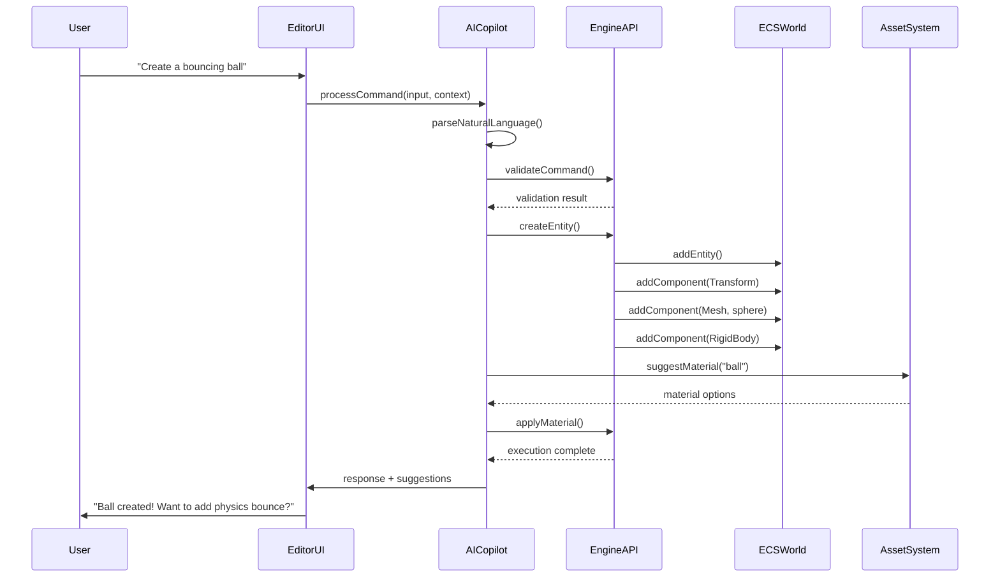

# AI-First Game Engine Implementation Plan

**Vibe Coder 3D: Evolution to AI-Copilot Driven Development**

## Overview

### Context & Goals

- **AI-First Paradigm Shift**: Transform Vibe Coder 3D from a traditional React Three Fiber game engine into an AI-first development platform where developers can describe their intent in natural language and see it realized through intelligent assistance.
- **Preserve Developer Autonomy**: Maintain full manual control and override capabilities while providing intelligent automation and suggestions.
- **Accelerate Development Workflow**: Enable rapid prototyping through conversational interfaces that understand game development patterns and best practices.
- **Bridge Technical Gaps**: Make 3D game development accessible to creators who may not have deep technical expertise in Three.js, physics, or ECS systems.

### Current Pain Points

- **Complex Setup Overhead**: Traditional game engines require extensive technical knowledge to get started with even simple concepts.
- **Manual Asset Integration**: Finding, importing, and configuring 3D models, textures, and audio requires significant time and expertise.
- **Boilerplate Scripting**: Writing repetitive controller scripts, interaction logic, and UI components slows development.
- **Debugging Complexity**: Identifying issues with physics, collisions, performance, or ECS synchronization requires deep system knowledge.

## Proposed Solution

### High-level Summary

- **Conversational Development Interface**: Implement a sophisticated AI Copilot that understands natural language commands and translates them into precise engine operations.
- **Intelligent Asset Management**: AI-powered asset discovery, generation, and optimization that can source or create content based on descriptions.
- **Contextual Code Generation**: Automated script generation for controllers, game logic, UI components, and system integrations.
- **Real-time Collaboration**: AI actively participates in the development process, suggesting improvements, catching issues, and learning from user preferences.
- **Seamless Build Pipeline**: AI-assisted packaging and optimization for multiple deployment targets.

### Architecture & Directory Structure

```
src/
├── ai/                              # AI Copilot Core System
│   ├── core/
│   │   ├── AIService.ts            # Main AI service orchestrator
│   │   ├── CommandParser.ts        # Natural language to command parsing
│   │   ├── ContextManager.ts       # Conversation and project context
│   │   └── ResponseGenerator.ts    # AI response formatting
│   ├── commands/
│   │   ├── SceneCommands.ts        # Scene manipulation commands
│   │   ├── AssetCommands.ts        # Asset management commands
│   │   ├── ScriptCommands.ts       # Code generation commands
│   │   └── DebugCommands.ts        # Debugging and analysis commands
│   ├── integrations/
│   │   ├── LLMProvider.ts          # LLM API integration (OpenAI/Claude/etc)
│   │   ├── AssetGenerationAPI.ts   # Text-to-3D and asset generation
│   │   └── CodeAnalysisAPI.ts      # Code understanding and generation
│   └── hooks/
│       ├── useAICopilot.ts         # Main AI interaction hook
│       ├── useAIAssistant.ts       # UI-specific AI features
│       └── useAIContext.ts         # Context management hook
├── core/                           # Enhanced Core Engine (existing + AI integration)
│   ├── ai-integration/
│   │   ├── EngineAPI.ts            # AI-accessible engine operations
│   │   ├── StateIntrospection.ts   # AI state querying capabilities
│   │   └── ValidationSystem.ts    # AI action validation
│   └── [existing core structure]   # All current core functionality
├── editor/                         # AI-Enhanced Editor
│   ├── components/
│   │   ├── ai/
│   │   │   ├── AICopilotPanel.tsx  # Main AI interaction panel
│   │   │   ├── ChatInterface.tsx   # Conversational UI
│   │   │   ├── SuggestionPanel.tsx # AI suggestions display
│   │   │   └── AIStatusBar.tsx     # AI system status
│   │   └── [existing components]   # Current editor components
│   └── [existing editor structure]
└── [existing game structure]
```

## Implementation Plan

### Phase 1: AI Foundation & Command System (2 weeks)

#### Week 1: Core AI Infrastructure

1. **AI Service Architecture Setup**

   - Design and implement `AIService.ts` as the main orchestrator
   - Create `CommandParser.ts` for natural language processing
   - Set up basic LLM integration with OpenAI/Claude API
   - Implement `ContextManager.ts` for conversation history

2. **Engine API Development**
   - Create `EngineAPI.ts` with standardized methods for AI access
   - Implement safe wrappers around ECS operations
   - Add state introspection capabilities for AI queries
   - Design validation system for AI-generated commands

#### Week 2: Basic Command Processing

3. **Command System Implementation**

   - Develop `SceneCommands.ts` for basic object manipulation
   - Create command validation and execution pipeline
   - Implement basic natural language commands (create, delete, move)
   - Add error handling and user feedback mechanisms

4. **Editor Integration**
   - Create `AICopilotPanel.tsx` with basic chat interface
   - Implement `useAICopilot.ts` hook for component integration
   - Add AI status indicators and loading states
   - Connect command execution to editor state updates

### Phase 2: Advanced Scene Manipulation & Asset Integration (3 weeks)

#### Week 1: Enhanced Scene Operations

1. **Advanced Scene Commands**

   - Implement complex object manipulation (grouping, parenting, copying)
   - Add material and texture modification commands
   - Create lighting and environment control commands
   - Develop physics property manipulation

2. **Context-Aware Suggestions**
   - Implement scene analysis for intelligent suggestions
   - Add pattern recognition for common game objects
   - Create suggestion ranking and relevance scoring
   - Develop user preference learning system

#### Week 2: Asset Management AI

3. **Intelligent Asset Discovery**

   - Implement asset search and recommendation system
   - Create semantic asset categorization
   - Add asset compatibility analysis
   - Develop asset optimization suggestions

4. **Asset Generation Integration**
   - Research and integrate text-to-3D APIs (if available)
   - Implement procedural asset generation
   - Create asset modification and optimization tools
   - Add asset library management with AI curation

#### Week 3: Material & Visual Enhancement

5. **Material AI Assistant**

   - Develop material suggestion system based on descriptions
   - Implement automatic PBR texture application
   - Create material optimization recommendations
   - Add visual style consistency checking

6. **Lighting & Environment AI**
   - Implement automated lighting setup based on mood/style
   - Create environment generation from descriptions
   - Add post-processing effect suggestions
   - Develop performance optimization recommendations

### Phase 3: Code Generation & Scripting Assistant (3 weeks)

#### Week 1: Script Generation Foundation

1. **Code Analysis & Understanding**

   - Implement existing code pattern recognition
   - Create component dependency analysis
   - Add code quality assessment tools
   - Develop refactoring suggestions

2. **Basic Script Generation**
   - Create character controller generation
   - Implement basic interaction script templates
   - Add UI component generation
   - Develop event handler scaffolding

#### Week 2: Advanced Behavior Scripting

3. **Game Logic AI**

   - Implement state machine generation for NPCs
   - Create behavior tree generation and editing
   - Add game mechanics scripting assistance
   - Develop multiplayer code scaffolding

4. **Testing & Debugging AI**
   - Create automated test case generation
   - Implement debugging assistance and diagnostics
   - Add performance profiling insights
   - Develop error explanation and solutions

#### Week 3: Integration & Polish

5. **Script Integration System**

   - Ensure generated scripts integrate with existing ECS
   - Add script modification and versioning
   - Create script sharing and reuse capabilities
   - Implement script performance monitoring

6. **Code Quality & Standards**
   - Add code style consistency enforcement
   - Implement best practice recommendations
   - Create documentation generation for AI scripts
   - Add code review assistance features

### Phase 4: Advanced AI Features & User Experience (2 weeks)

#### Week 1: Enhanced Intelligence

1. **Contextual Learning**

   - Implement user behavior pattern learning
   - Create project-specific AI customization
   - Add collaborative learning from user corrections
   - Develop expertise level adaptation

2. **Multi-modal Interaction**
   - Add voice command support
   - Implement visual selection and manipulation
   - Create drag-and-drop AI assistance
   - Add gesture-based commands

#### Week 2: Collaboration & Sharing

3. **Team Collaboration Features**

   - Implement AI knowledge sharing between team members
   - Create project-specific AI training
   - Add role-based AI assistance (designer vs programmer)
   - Develop collaborative editing with AI mediation

4. **Community Features**
   - Create AI-assisted component sharing marketplace
   - Implement pattern sharing and learning
   - Add community-driven AI improvements
   - Develop template and preset sharing

### Phase 5: Build Pipeline & Optimization (2 weeks)

#### Week 1: AI-Assisted Building

1. **Build Optimization**

   - Implement AI-driven asset optimization
   - Create build configuration recommendations
   - Add deployment target optimization
   - Develop bundle size analysis and suggestions

2. **Performance Intelligence**
   - Create runtime performance monitoring
   - Implement optimization suggestions
   - Add memory usage analysis
   - Develop frame rate optimization recommendations

#### Week 2: Distribution & Maintenance

3. **Deployment Assistance**

   - Create platform-specific build guidance
   - Implement deployment troubleshooting
   - Add version management assistance
   - Develop update and maintenance scheduling

4. **Post-Launch Support**
   - Create usage analytics interpretation
   - Implement crash report analysis
   - Add user feedback interpretation
   - Develop maintenance and update recommendations

## File and Directory Structures

### AI Core System Structure

```
src/ai/
├── core/
│   ├── AIService.ts              # Main orchestrator
│   ├── CommandParser.ts          # NLP processing
│   ├── ContextManager.ts         # Context & history
│   ├── ResponseGenerator.ts      # Response formatting
│   └── ValidationEngine.ts      # Command validation
├── commands/
│   ├── BaseCommand.ts            # Command interface
│   ├── SceneCommands.ts          # Scene manipulation
│   ├── AssetCommands.ts          # Asset management
│   ├── ScriptCommands.ts         # Code generation
│   ├── DebugCommands.ts          # Debugging tools
│   └── BuildCommands.ts          # Build pipeline
├── integrations/
│   ├── providers/
│   │   ├── OpenAIProvider.ts     # OpenAI integration
│   │   ├── ClaudeProvider.ts     # Anthropic Claude
│   │   └── LocalProvider.ts     # Local models
│   ├── AssetGenerationAPI.ts     # Asset generation
│   └── CodeAnalysisAPI.ts       # Code analysis
└── utils/
    ├── PromptTemplates.ts        # Prompt engineering
    ├── ContextAnalyzer.ts        # Context understanding
    └── ResponseParser.ts         # Response processing
```

### Enhanced Editor Structure

```
src/editor/components/ai/
├── AICopilotPanel.tsx            # Main AI interface
├── ChatInterface.tsx             # Conversation UI
├── SuggestionPanel.tsx           # AI suggestions
├── CommandHistory.tsx            # Command history
├── AIStatusBar.tsx               # System status
├── ContextViewer.tsx             # Context inspection
└── preferences/
    ├── AISettings.tsx            # AI configuration
    └── ProviderSettings.tsx      # API settings
```

## Technical Details

### Core AI Service Interface

```typescript
// src/ai/core/AIService.ts
export interface AIService {
  processCommand(input: string, context: ProjectContext): Promise<AIResponse>;
  suggestAction(context: SceneContext): Promise<AISuggestion[]>;
  generateCode(request: CodeRequest): Promise<GeneratedCode>;
  analyzeScene(sceneId: string): Promise<SceneAnalysis>;
  optimizePerformance(metrics: PerformanceMetrics): Promise<OptimizationPlan>;
}

// src/ai/types/Commands.ts
export interface AICommand {
  type: CommandType;
  payload: any;
  validation: ValidationRules;
  execute(context: EngineContext): Promise<CommandResult>;
}

// src/core/ai-integration/EngineAPI.ts
export interface EngineAPI {
  scene: SceneOperations;
  assets: AssetOperations;
  scripts: ScriptOperations;
  physics: PhysicsOperations;
  state: StateOperations;
}
```

### Command Processing Pipeline

```typescript
// src/ai/core/CommandParser.ts
export class CommandParser {
  async parseNaturalLanguage(input: string): Promise<ParsedCommand>;
  async validateCommand(command: ParsedCommand): Promise<ValidationResult>;
  async executeCommand(command: ValidatedCommand): Promise<ExecutionResult>;
}

// src/ai/commands/SceneCommands.ts
export class SceneCommands {
  createObject(description: string, position?: Vector3): Promise<EntityId>;
  modifyObject(entityId: EntityId, modifications: ObjectModifications): Promise<void>;
  deleteObject(entityId: EntityId): Promise<void>;
  groupObjects(entityIds: EntityId[], groupName?: string): Promise<GroupId>;
}
```

## Usage Examples

### Basic Scene Creation

```typescript
// User: "Create a red sphere at the center of the scene"
const aiResponse = await aiService.processCommand(
  'Create a red sphere at the center of the scene',
  currentProjectContext,
);

// AI generates and executes:
const entity = await sceneCommands.createObject('sphere', Vector3.ZERO);
await sceneCommands.modifyObject(entity, {
  material: { color: 'red' },
  transform: { position: [0, 0, 0] },
});
```

### Asset Generation Integration

```typescript
// User: "Add a medieval castle to my scene"
const suggestions = await aiService.suggestAction({
  scene: currentScene,
  query: 'medieval castle',
});

// AI can:
// 1. Search existing asset libraries
// 2. Generate procedural castle
// 3. Suggest composition of existing assets
// 4. Guide user through manual creation
```

### Script Generation

```typescript
// User: "Make the player jump when spacebar is pressed"
const code = await aiService.generateCode({
  type: 'player-controller',
  behavior: 'jump on spacebar',
  target: selectedEntity,
});

// Generates:
// - Input handling hook
// - Physics impulse application
// - Animation triggers
// - Sound effect integration
```

## Testing Strategy

### Unit Tests

- **AI Command Parsing**: Test natural language understanding accuracy
- **Command Validation**: Ensure all AI commands are safe and valid
- **Engine API Integration**: Test all AI-accessible engine operations
- **Response Generation**: Validate AI response formatting and content
- **Context Management**: Test conversation history and project context handling

### Integration Tests

- **End-to-End Workflows**: Complete user stories from command to execution
- **Multi-step Operations**: Complex scene creation and modification sequences
- **Asset Pipeline**: Asset discovery, generation, and integration workflows
- **Code Generation**: Script creation and integration with existing systems
- **Error Handling**: AI response to invalid commands and error states

### Performance Tests

- **Response Latency**: AI command processing and execution speed
- **Memory Usage**: Context management and conversation history overhead
- **Concurrent Operations**: Multiple AI commands and user interactions
- **Large Project Handling**: AI performance with complex scenes and projects

## Edge Cases

| Edge Case                        | Remediation                                                |
| -------------------------------- | ---------------------------------------------------------- |
| Ambiguous user commands          | Request clarification with specific options                |
| Invalid or unsafe AI suggestions | Validation layer blocks execution, suggests alternatives   |
| API rate limits or failures      | Graceful degradation with local fallbacks                  |
| Complex multi-step operations    | Break into smaller, validated steps with user confirmation |
| Conflicting user modifications   | AI learns from user corrections and adapts                 |
| Large asset generation requests  | Progressive loading with user feedback                     |
| Network connectivity issues      | Offline mode with reduced functionality                    |
| Context window limitations       | Intelligent context pruning and summarization              |

## Sequence Diagram



## Risks & Mitigations

| Risk                                            | Mitigation                                                                   |
| ----------------------------------------------- | ---------------------------------------------------------------------------- |
| **AI hallucination or incorrect suggestions**   | Comprehensive validation layer, user confirmation for significant changes    |
| **API dependency and costs**                    | Local model fallbacks, cost monitoring, usage optimization                   |
| **User over-reliance reducing learning**        | Educational tooltips, manual override encouragement, progressive complexity  |
| **Performance impact of AI processing**         | Async processing, caching, intelligent batching                              |
| **Security concerns with code generation**      | Sandboxed execution, code review requirements, permission systems            |
| **Privacy issues with cloud AI**                | Local processing options, data anonymization, clear privacy policies         |
| **AI suggestions inconsistent with user style** | Learning from user corrections, style preference settings                    |
| **Complex debugging when AI is involved**       | Detailed logging, step-by-step command history, manual override capabilities |

## Timeline

**Total Estimated Time: 12 weeks**

- **Phase 1 (Foundation)**: 2 weeks
- **Phase 2 (Scene & Assets)**: 3 weeks
- **Phase 3 (Code Generation)**: 3 weeks
- **Phase 4 (Advanced Features)**: 2 weeks
- **Phase 5 (Build & Optimization)**: 2 weeks

### Weekly Breakdown:

- **Weeks 1-2**: Core AI infrastructure and basic commands
- **Weeks 3-5**: Advanced scene manipulation and asset intelligence
- **Weeks 6-8**: Code generation and scripting assistance
- **Weeks 9-10**: Enhanced UX and collaboration features
- **Weeks 11-12**: Build pipeline optimization and deployment

## Acceptance Criteria

- **Natural Language Understanding**: AI correctly interprets and executes 90%+ of common game development commands
- **Asset Integration**: AI can discover, suggest, and integrate assets from multiple sources within 30 seconds
- **Code Generation**: AI generates syntactically correct, integrated scripts for common game mechanics
- **Context Awareness**: AI maintains and utilizes conversation history and project context effectively
- **Error Recovery**: AI gracefully handles errors and provides helpful suggestions for resolution
- **Performance**: AI responses complete within 5 seconds for simple commands, 30 seconds for complex operations
- **User Control**: Users can always inspect, modify, or reject AI suggestions with full manual override
- **Learning**: AI adapts to user preferences and improves suggestions over time
- **Documentation**: All AI-generated code includes appropriate comments and documentation
- **Integration**: AI features integrate seamlessly with existing editor and engine functionality

## Conclusion

This implementation plan transforms Vibe Coder 3D into a truly AI-first game development platform that maintains the power and flexibility of traditional engines while dramatically reducing the barrier to entry. By providing intelligent assistance at every level—from high-level creative direction to low-level technical implementation—we create a development environment where creators can focus on their vision rather than technical implementation details.

The phased approach ensures that core functionality is established early, with increasingly sophisticated features building upon a solid foundation. The emphasis on user autonomy and manual override capabilities ensures that the AI enhances rather than replaces developer creativity and control.

Success in this implementation will position Vibe Coder 3D as a pioneering platform that demonstrates the future of AI-assisted creative tools, potentially influencing the entire game development industry toward more accessible and intuitive development paradigms.

## Assumptions & Dependencies

- **LLM API Access**: Reliable access to high-quality language models (OpenAI, Claude, or equivalent)
- **Asset Generation Services**: Availability of text-to-3D and asset generation APIs
- **Performance Requirements**: Development hardware capable of running AI processing alongside 3D rendering
- **Network Connectivity**: Stable internet connection for cloud-based AI services
- **Team Expertise**: Development team familiar with AI integration patterns and natural language processing
- **User Base**: Target users willing to adapt to conversational development paradigms
- **Technology Evolution**: Assumption that AI capabilities will continue improving during development
- **Cost Management**: Budget for AI API usage and potential cloud infrastructure
- **Regulatory Compliance**: Adherence to AI usage policies and data privacy regulations
- **Cross-platform Compatibility**: AI features work consistently across target development platforms
