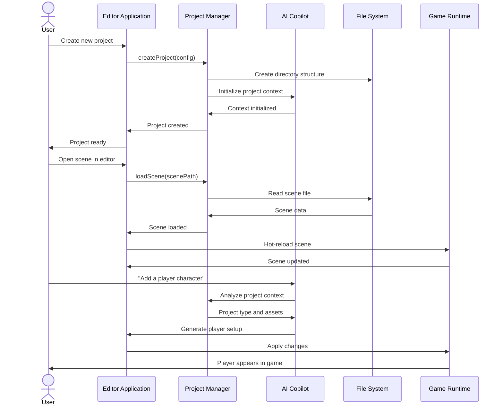

# Editor-Project Relationship Architecture Plan

**Vibe Coder 3D: Unified Development Workspace Design**

## Overview

### Context & Goals

- **Unified Development Experience**: Create a seamless relationship between the editor and game projects where the editor serves as both a standalone development environment and a project-aware workspace, similar to Unity's model but adapted for web-based development.
- **AI-First Project Management**: Enable the AI Copilot to understand project structure, assets, and configurations to provide contextual assistance across project boundaries.
- **Hot-Reload Development**: Support real-time synchronization between editor changes and running game instances, enabling immediate feedback during development.
- **Multi-Project Workflow**: Allow developers to work on multiple projects while maintaining isolated asset pipelines, configurations, and build outputs.

### Current Pain Points

- **Monolithic Architecture**: Current implementation treats editor and game as separate routes without project abstraction, limiting scalability and reusability.
- **No Project Context**: AI Copilot lacks understanding of project boundaries, making it difficult to provide contextual assistance for project-specific assets and configurations.
- **Asset Management Isolation**: Assets and scenes are managed globally rather than per-project, creating confusion when working on multiple games.
- **Build Pipeline Complexity**: No clear separation between editor tooling and game runtime, making deployment and distribution challenging.

## Proposed Solution

### High-level Summary

- **Project-Centric Architecture**: Implement a project workspace system where the editor can create, open, and manage discrete game projects with isolated assets, scenes, and configurations.
- **Workspace Management**: Create a project management system that handles project creation, templates, imports/exports, and versioning.
- **Editor-Runtime Bridge**: Establish a communication layer between the editor and running game instances for real-time synchronization and testing.
- **AI Project Intelligence**: Enable the AI Copilot to understand project structure and provide contextual assistance based on project type, assets, and development patterns.
- **Scalable Asset Pipeline**: Implement per-project asset management with shared core libraries and project-specific customizations.

### Architecture & Directory Structure

```
vibe-coder-3d/                           # Engine Distribution
├── src/
│   ├── core/                            # Core Engine (Shared across projects)
│   │   ├── engine/                      # Core R3F, ECS, Physics systems
│   │   ├── editor/                      # Core editor functionality
│   │   └── workspace/                   # Project management systems
│   │       ├── ProjectManager.ts        # Project lifecycle management
│   │       ├── WorkspaceStore.ts        # Current workspace state
│   │       ├── ProjectTemplate.ts       # Project scaffolding system
│   │       └── AssetPipeline.ts         # Project-aware asset management
│   ├── editor/                          # Editor Application
│   │   ├── app/                         # Editor shell application
│   │   ├── components/                  # Editor UI components
│   │   ├── ai/                          # AI Copilot integration
│   │   └── workspace/                   # Workspace-specific editor features
│   │       ├── ProjectExplorer.tsx      # Project file browser
│   │       ├── ProjectSettings.tsx      # Project configuration UI
│   │       └── TemplateSelector.tsx     # Project creation wizard
│   └── templates/                       # Project templates
│       ├── blank/                       # Empty project template
│       ├── platformer/                  # 2.5D platformer template
│       ├── fps/                         # First-person game template
│       └── puzzle/                      # Puzzle game template

projects/                                # User Projects Directory
├── my-game-project/                     # Individual Game Project
│   ├── .vibe/                          # Project metadata (hidden)
│   │   ├── project.json                # Project configuration
│   │   ├── asset-manifest.json         # Asset registry and dependencies
│   │   ├── build-cache/               # Cached build artifacts
│   │   └── ai-context.json            # AI learning and context data
│   ├── assets/                         # Project-specific assets
│   │   ├── models/                     # 3D models, animations
│   │   ├── textures/                   # Textures, materials
│   │   ├── audio/                      # Sounds, music
│   │   └── scenes/                     # Saved scenes
│   ├── scripts/                        # Project-specific scripts
│   │   ├── components/                 # Custom components
│   │   ├── systems/                    # Custom ECS systems
│   │   └── behaviors/                  # Game logic behaviors
│   ├── config/                         # Project configuration
│   │   ├── game-config.json           # Game settings
│   │   ├── build-config.json          # Build and deployment settings
│   │   └── ai-config.json             # AI assistant preferences
│   ├── scenes/                         # Scene files
│   │   ├── main-menu.scene.json       # Individual scene files
│   │   ├── level-01.scene.json
│   │   └── level-02.scene.json
│   ├── dist/                           # Build output (auto-generated)
│   ├── package.json                    # Project dependencies
│   └── README.md                       # Project documentation
```

## Implementation Plan

### Phase 1: Project Foundation & Workspace Management (2 weeks)

#### Week 1: Core Project System

1. **Project Configuration Schema**

   ```typescript
   interface IProjectConfig {
     name: string;
     version: string;
     engine: {
       version: string;
       features: string[];
     };
     build: {
       target: 'web' | 'desktop' | 'mobile';
       optimization: 'development' | 'production';
     };
     ai: {
       preferences: Record<string, any>;
       context: string[];
     };
   }
   ```

2. **Project Management Core**
   - Implement `ProjectManager.ts` for project lifecycle operations
   - Create `WorkspaceStore.ts` with Zustand for current project state
   - Develop project validation and migration systems
   - Add project template system with scaffolding capabilities

#### Week 2: Editor Integration

3. **Workspace UI Components**

   - Create `ProjectExplorer.tsx` for project file navigation
   - Implement `ProjectSettings.tsx` for configuration management
   - Build `TemplateSelector.tsx` for project creation wizard
   - Add project switching and recent projects functionality

4. **Asset Pipeline Integration**
   - Implement project-scoped asset management
   - Create asset import/export for project boundaries
   - Add asset dependency tracking and resolution
   - Develop shared asset library system

### Phase 2: Editor-Runtime Communication Bridge (2 weeks)

#### Week 1: Communication Architecture

1. **Editor-Runtime Bridge**

   ```typescript
   interface IEditorRuntimeBridge {
     sendCommand(command: string, data: any): Promise<any>;
     subscribeToUpdates(callback: (update: any) => void): void;
     getGameState(): Promise<GameState>;
     hotReload(changes: ProjectChange[]): Promise<void>;
   }
   ```

2. **Hot-Reload System**
   - Implement file watching for project changes
   - Create incremental update system for scene changes
   - Add script hot-reloading for custom components
   - Develop asset hot-swapping capabilities

#### Week 2: Testing & Development Workflow

3. **Development Mode Integration**

   - Create play-in-editor functionality
   - Implement editor-game state synchronization
   - Add debugging tools and real-time inspection
   - Build performance monitoring and profiling tools

4. **Build System Integration**
   - Implement project-specific build configurations
   - Create development vs production build pipelines
   - Add asset optimization and bundling
   - Develop deployment and distribution tools

### Phase 3: AI-Aware Project Intelligence (3 weeks)

#### Week 1: AI Context System

1. **Project-Aware AI Context**

   ```typescript
   interface IAIProjectContext {
     projectType: string;
     assets: AssetManifest;
     dependencies: ProjectDependency[];
     codePatterns: CodePattern[];
     userPreferences: UserPreferences;
   }
   ```

2. **AI Learning Integration**
   - Implement project-specific AI context storage
   - Create AI learning from project patterns
   - Add intelligent asset and component suggestions
   - Develop project-aware code generation

#### Week 2: Intelligent Project Operations

3. **Smart Project Management**

   - AI-assisted project creation and setup
   - Intelligent template selection based on requirements
   - Automated dependency management and updates
   - Smart asset organization and optimization

4. **Contextual Development Assistance**
   - Project-aware debugging and error resolution
   - Intelligent code completion and generation
   - Asset recommendation based on project style
   - Performance optimization suggestions

#### Week 3: Advanced AI Features

5. **Project Analysis & Insights**

   - Automated code quality analysis
   - Performance bottleneck identification
   - Asset usage optimization recommendations
   - Project structure and organization suggestions

6. **Collaborative Features**
   - AI-assisted project sharing and collaboration
   - Intelligent merge conflict resolution
   - Project documentation generation
   - Team workflow optimization

## File and Directory Structures

### Core Engine Structure

```
src/core/workspace/
├── ProjectManager.ts              # Main project lifecycle management
├── WorkspaceStore.ts             # Current workspace state (Zustand)
├── ProjectTemplate.ts            # Template system for project creation
├── AssetPipeline.ts              # Project-aware asset management
├── ProjectValidator.ts           # Project integrity validation
├── ProjectMigration.ts           # Version migration system
└── types/
    ├── ProjectConfig.ts          # Project configuration interfaces
    ├── WorkspaceState.ts         # Workspace state types
    └── ProjectTemplate.ts        # Template definition types
```

### Editor Workspace Integration

```
src/editor/workspace/
├── components/
│   ├── ProjectExplorer.tsx       # File browser and project navigation
│   ├── ProjectSettings.tsx       # Project configuration UI
│   ├── TemplateSelector.tsx      # Project creation wizard
│   ├── ProjectSwitcher.tsx       # Quick project switching
│   └── AssetImporter.tsx         # Asset import/management UI
├── hooks/
│   ├── useProject.ts             # Current project access hook
│   ├── useProjectAssets.ts       # Project asset management
│   ├── useProjectBuild.ts        # Build system integration
│   └── useProjectAI.ts           # AI context for current project
└── stores/
    ├── projectStore.ts           # Project-specific state
    └── workspaceStore.ts         # Workspace-level state
```

### Project Template Structure

```
templates/blank/
├── .vibe/
│   ├── project.json              # Template project configuration
│   └── template-config.json      # Template metadata
├── assets/                       # Default template assets
├── scenes/
│   └── main.scene.json          # Default scene
├── scripts/
│   └── components/              # Template-specific components
├── config/
│   ├── game-config.json         # Default game settings
│   └── build-config.json        # Default build configuration
└── package.json                  # Template dependencies
```

## Technical Details

### Project Configuration Schema

```typescript
// Project configuration interface
interface IProjectConfig {
  name: string;
  description?: string;
  version: string;
  engine: {
    version: string;
    features: EngineFeature[];
  };
  build: {
    target: BuildTarget;
    optimization: OptimizationLevel;
    outputDir: string;
  };
  assets: {
    baseUrl: string;
    cachingStrategy: CachingStrategy;
    optimizations: AssetOptimization[];
  };
  ai: {
    enabled: boolean;
    preferences: AIPreferences;
    contextData: string[];
  };
  dependencies: ProjectDependency[];
  scripts: {
    [key: string]: string;
  };
}

// Workspace state management
interface IWorkspaceState {
  currentProject: string | null;
  recentProjects: string[];
  projectsDirectory: string;
  preferences: WorkspacePreferences;
}

// Editor-Runtime bridge interface
interface IEditorRuntimeBridge {
  connected: boolean;
  sendCommand<T>(command: string, data: any): Promise<T>;
  subscribe(event: string, callback: (data: any) => void): () => void;
  hotReload(changes: ProjectChange[]): Promise<void>;
  getGameState(): Promise<GameState>;
}
```

### Project Manager Core Implementation

```typescript
export class ProjectManager {
  private static instance: ProjectManager;
  private currentProject: IProject | null = null;

  static getInstance(): ProjectManager {
    if (!ProjectManager.instance) {
      ProjectManager.instance = new ProjectManager();
    }
    return ProjectManager.instance;
  }

  async createProject(config: IProjectCreationConfig): Promise<IProject> {
    // Validate project configuration
    // Create project directory structure
    // Initialize from template if specified
    // Set up asset pipeline
    // Configure AI context
    // Return project instance
  }

  async openProject(projectPath: string): Promise<IProject> {
    // Validate project structure
    // Load project configuration
    // Initialize asset pipeline
    // Load AI context
    // Set as current project
    // Return project instance
  }

  async saveProject(): Promise<void> {
    // Save current project state
    // Update asset manifests
    // Persist AI context
    // Update project metadata
  }
}
```

## Usage Examples

### Creating a New Project

```typescript
// Using the AI Copilot
const aiCopilot = useAICopilot();

// User: "Create a new 2D platformer game called 'Super Jump Adventure'"
await aiCopilot.processCommand("Create a new 2D platformer game called 'Super Jump Adventure'");

// AI automatically:
// 1. Selects platformer template
// 2. Sets up project structure
// 3. Configures appropriate assets
// 4. Initializes with platformer-specific components
```

### Opening an Existing Project

```typescript
// Using the Project Manager
const projectManager = useProjectManager();
const project = await projectManager.openProject('/projects/my-game');

// Editor automatically:
// 1. Loads project configuration
// 2. Initializes asset pipeline
// 3. Restores AI context
// 4. Updates workspace state
```

### Hot-Reload Development

```typescript
// Editor-Runtime bridge automatically handles:
const bridge = useEditorRuntimeBridge();

// When files change in the editor:
bridge.hotReload([
  { type: 'scene', path: 'scenes/level-01.scene.json' },
  { type: 'script', path: 'scripts/PlayerController.ts' },
  { type: 'asset', path: 'assets/models/player.glb' },
]);

// Running game immediately reflects changes
```

## Testing Strategy

### Unit Tests

- Project creation and validation logic
- Asset pipeline operations
- Project configuration serialization/deserialization
- Template system functionality
- AI context management
- Editor-runtime bridge communication

### Integration Tests

- End-to-end project creation workflow
- Asset import and management across projects
- Hot-reload functionality with running game instances
- AI Copilot project-aware assistance
- Project switching and state management
- Build system integration

### Edge Cases

| Edge Case                       | Remediation                                       |
| ------------------------------- | ------------------------------------------------- |
| Corrupted project configuration | Validate and repair with backup or defaults       |
| Missing project assets          | Asset recovery system with user guidance          |
| Version incompatibility         | Automatic migration with user confirmation        |
| Editor-runtime connection loss  | Graceful reconnection with state synchronization  |
| Large project performance       | Lazy loading and incremental updates              |
| Concurrent project access       | File locking and conflict resolution              |
| Template corruption             | Fallback to default template with error reporting |
| AI context overflow             | Context pruning and archival system               |

## Sequence Diagram



## Risks & Mitigations

| Risk                                  | Mitigation                                             |
| ------------------------------------- | ------------------------------------------------------ |
| Complex project state management      | Implement robust state validation and recovery systems |
| Performance impact of hot-reload      | Optimize change detection and incremental updates      |
| AI context becoming stale             | Regular context refresh and validation mechanisms      |
| Project corruption during development | Automated backups and version control integration      |
| Editor-runtime synchronization issues | Robust error handling and reconnection logic           |
| Large projects causing memory issues  | Implement lazy loading and resource management         |
| Template system complexity            | Thorough testing and fallback mechanisms               |
| Cross-platform project compatibility  | Standardized project format and validation             |

## Timeline

**Total Estimated Time: 7 weeks**

### Phase 1: Foundation (2 weeks)

- Week 1: Project system core and configuration
- Week 2: Editor integration and UI components

### Phase 2: Communication Bridge (2 weeks)

- Week 3: Editor-runtime bridge and hot-reload
- Week 4: Development workflow and build integration

### Phase 3: AI Intelligence (3 weeks)

- Week 5: AI project context and learning
- Week 6: Intelligent project operations
- Week 7: Advanced AI features and collaboration

## Acceptance Criteria

- ✅ **Project Creation**: Users can create new projects from templates with AI assistance
- ✅ **Project Management**: Users can open, save, and switch between multiple projects
- ✅ **Asset Isolation**: Each project maintains isolated assets and configurations
- ✅ **Hot-Reload Development**: Changes in editor immediately reflect in running game
- ✅ **AI Project Awareness**: AI Copilot provides contextual assistance based on current project
- ✅ **Build Integration**: Projects can be built and deployed independently
- ✅ **Template System**: Users can create and share project templates
- ✅ **Performance**: Large projects load and operate smoothly with minimal latency

## Conclusion

This editor-project relationship architecture transforms Vibe Coder 3D into a professional-grade development environment while maintaining the AI-first principles that make it unique. By implementing project-centric workflows, we enable scalable development processes, better asset management, and more intelligent AI assistance. The hot-reload development experience and seamless editor-runtime integration will significantly accelerate the development workflow, making Vibe Coder 3D a compelling alternative to traditional game engines.

The proposed architecture balances complexity with usability, ensuring that both novice creators and experienced developers can benefit from the enhanced project management capabilities while leveraging the power of AI-assisted development.

## Assumptions & Dependencies

- **File System Access**: Implementation assumes modern browser File System API or Electron-based editor for full project management
- **AI API Availability**: Depends on continued access to LLM APIs (OpenAI, Anthropic) for contextual assistance
- **Browser Capabilities**: Advanced features may require modern browser APIs (File Handling, Origin Private File System)
- **Development Resources**: Assumes dedicated development time for editor enhancements and testing
- **User Adoption**: Success depends on user acceptance of AI-assisted development workflows
- **Performance Requirements**: Large project support requires careful optimization and testing across different hardware configurations

```

```
