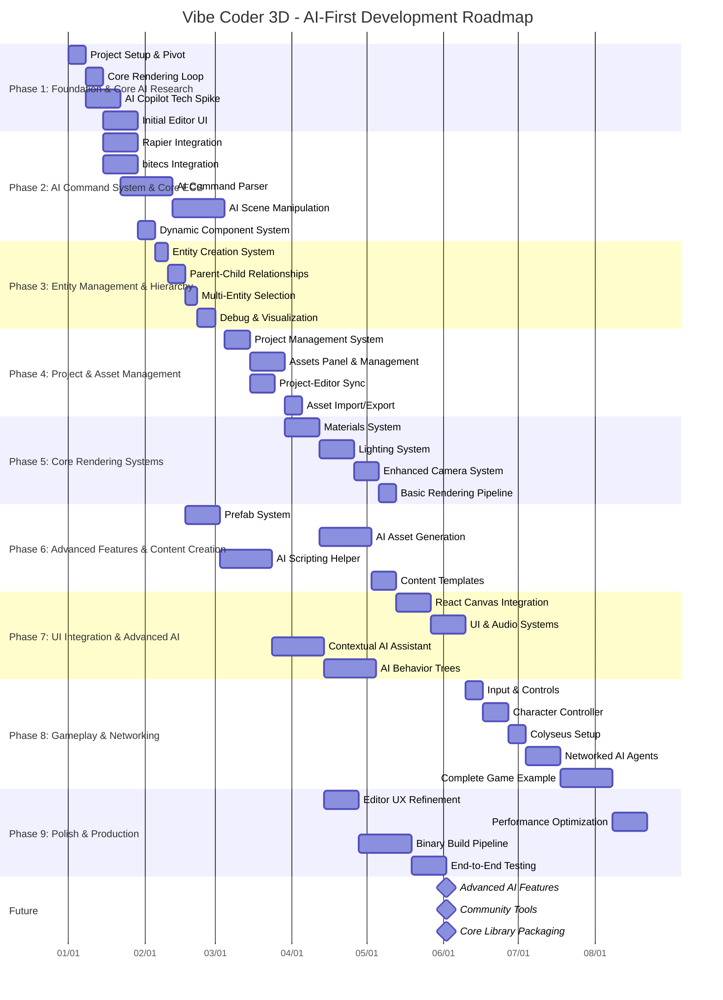

# Project Roadmap: Vibe Coder 3D - AI-First Game Engine

This document outlines the development roadmap for transforming Vibe Coder 3D into the first truly conversational game engine. Our goal is to enable natural language-driven game development while maintaining the power and flexibility of traditional engines.

> **Status Update (December 2024):** Foundation phase complete. Beginning AI Copilot integration with enhanced timeline and objectives.

**Current Focus: Entity Hierarchy & Core Rendering**

Following the completion of Phase 1 and Phase 2, our immediate focus is on completing the foundational systems for scene management and rendering. This involves:

- **Parent-Child Entity Relationships:** Implementing hierarchical entity relationships with transform inheritance
- **Enhanced Lighting System:** Completing the rendering pipeline with comprehensive lighting support
- **Input & Basic Interaction:** Establishing core user interaction patterns

These foundational systems will provide a solid base for content creation and advanced features.

## Timeline Visualization (Mermaid)

## Guiding Principles

- **AI-First, User-Centric:** AI features should enhance, not replace, developer creativity and control.
- **Iterative AI Development:** Build and refine AI capabilities incrementally, based on user feedback and technical feasibility.
- **Core First:** Prioritize the development and stabilization of the `src/core` framework with robust AI integration points.
- **Test Early, Test Often:** Integrate basic testing (unit, integration) from the beginning, including tests for AI interactions.
- **Documentation:** Maintain clear documentation for both engine features and AI Copilot usage.

## Refactored Phase Structure

### Phase 1: Foundation & Core AI Research (Estimated: 2-3 Sprints) ✅ COMPLETE

_Goal: Establish the project structure, tooling, basic rendering, and research core AI technologies for the Copilot._

- **Tasks:**
  - ✅ Update project documentation to reflect the AI-first pivot (Vision, Goals, Audience).
  - ✅ Initialize project using Vite + React + TypeScript template.
  - ✅ Set up repository, CI/CD basics (linting, testing hooks).
  - ✅ Implement the `src/core`, `src/editor`, and `src/game` directory structure.
  - ✅ Configure Vite, TypeScript (`tsconfig.json`), ESLint, Prettier.
  - ✅ Install core dependencies: `three`, `react-three-fiber`, `@react-three/drei`, `zustand`.
  - ✅ Set up basic R3F Canvas and render loop in `src/core`.
  - ✅ **Technical Spike: AI Copilot Integration:**
    - ✅ Research and select core AI model/platform.
    - ✅ Define initial API for communication between the editor and the AI Copilot.
    - ✅ Prototype a simple conversational interface in the editor.
    - ✅ Implement comprehensive chat UI with message history and typing indicators.
  - ✅ Create a minimal "Hello Cube" scene in `src/game` using the core setup.
  - ✅ Implement basic camera controls (`OrbitControls` from `drei`).
  - ✅ Set up basic global state management with Zustand (`src/core/state`).
  - ✅ Develop initial UI for the editor, including a panel for AI Copilot interaction.
  - ✅ Implement comprehensive editor layout with resizable panels (Hierarchy, Inspector, Viewport, Chat).

### Phase 2: AI Command System & Core ECS (Estimated: 3-4 Sprints) ✅ COMPLETE

_Goal: Establish the AI command parsing foundation and core ECS/Physics integration to enable AI-driven scene manipulation._

- **Tasks:**

  - ✅ Install `@react-three/rapier` (for Rapier physics) and `bitecs`.
  - ✅ Set up Rapier physics world within the R3F loop (`src/core/lib/physics.ts`).
  - ✅ Create core R3F components for rigid bodies (`<PhysicsBody>`) that sync with Rapier (`src/core/components/physics/`).
  - ✅ Implement basic physics stepping and synchronization (`PhysicsSyncSystem.ts`).
  - ✅ Set up `bitecs` world and basic component types (`src/core/lib/ecs.ts`, `src/core/types/ecs.ts`).
  - ✅ Define core ECS components (e.g., `Position`, `Velocity`, `Renderable`, `AIControllable`).
  - ✅ Create core ECS systems (`transformSystem`, `VelocitySystem`, `PhysicsSyncSystem`, `AISystem`).

  - ✅ **Dynamic Component System:** Implement a flexible system where entities can have components added on demand, including component registry and runtime management.
  - ✅ Develop core hooks for interacting with physics, ECS (`src/core/hooks`).

### Phase 3: Entity Hierarchy & Scene Management (Estimated: 2-3 Sprints)

_Goal: Build robust entity management with hierarchical relationships and scene organization._

- **Tasks:**
  - ✅ **Entity Creation & Management:**
    - ✅ Create empty entities functionality with command support
    - ✅ Basic entity lifecycle management (create, destroy, clone)
    - ✅ Entity templates and archetype system
  - **Parent-Child Relationship System:**
    - Implement hierarchical entity relationships with transform inheritance
    - Scene graph management with grouping capabilities
    - Parent-child synchronization for transforms, visibility, and components
  - **Multi-Entity Selection System:**
    - Editor support for selecting multiple entities simultaneously
    - Bulk operations on selected entities (transform, component modification)
  - **Debug & Visualization Tools:**
    - Entity hierarchy visualization in editor
    - Debug utilities for physics, ECS state
    - Scene graph inspector with real-time updates

### Phase 4: Core Rendering Systems (Estimated: 2-3 Sprints)

_Goal: Complete the rendering pipeline with materials, lighting, and camera management._

- **Tasks:**
  - ✅ **Materials System:**
    - ✅ PBR material creation and editing interface
    - ✅ Real-time material preview and testing
    - Material presets and template library
    - Material library and sharing system
  - ✅ **Enhanced Lighting System:**
    - ✅ Directional, point, and spot light management
    - ✅ Ambient light support
    - ✅ Shadow configuration and optimization
    - ✅ Dynamic lighting controls with inspector UI
    - ✅ Three.js integration with LightRenderer component
    - ✅ Environment lighting and IBL setup
    - ✅ Light entity creation helpers
  - ✅ **Enhanced Camera System:**
    - ✅ Multiple camera types (perspective, orthographic, cinematic)
    - Camera animation and interpolation systems
    - Camera positioning and framing tools
    - ✅ Camera presets and templates
  - ✅ **Basic Rendering Pipeline:**
    - ✅ Post-processing effects integration
    - ✅ Render target management
    - ✅ Performance monitoring and optimization

### Phase 5: Input & Basic Interaction (Estimated: 1-2 Sprints)

_Goal: Implement comprehensive input handling and basic user interaction systems._

- **Tasks:**
  - ✅ **Input & Controls:**
    - ✅ Core input handling system/hook (`src/core/hooks/useInput.ts`)
    - ✅ Customizable input mapping and configuration
  - **Character Controller:**
    - Enhanced character controller component
    - Movement systems and physics integration
    - Basic character physics and collision response
  - **Interaction Systems:**
    - Object selection and manipulation
    - Basic UI interaction handling
    - Input event management and delegation

### Phase 6: Project & Asset Management (Estimated: 3-4 Sprints)

_Goal: Establish comprehensive project management and asset handling systems._

- **Tasks:**
  - **Project Management System:**
    - Project creation and initialization workflows
    - Project file structure and metadata management
    - Project templates and configurations
    - Save/load project state with version control integration
  - **Assets Panel & Management:**
    - Visual asset browser with drag-and-drop functionality
    - Asset categorization, tagging, and search
    - Asset recommendations and organization
    - Asset preview and metadata display
  - **Project-Editor Synchronization:**
    - Real-time synchronization between project files and editor state
    - Conflict resolution for concurrent modifications
    - Auto-save and recovery mechanisms
  - ⏳ **Asset Import/Export Systems:**
    - ✅ Support for common 3D formats (GLB, GLTF, FBX, OBJ)
    - ✅ Basic texture and material import pipelines
    - Asset optimization and compression
    - Drag-and-drop asset import interface

### Phase 7: Advanced Content Creation (Estimated: 3-4 Sprints)

_Goal: Enable advanced content creation with prefabs and reusable systems._

- **Tasks:**
  - **Prefab System:**
    - Prefab creation from existing entity hierarchies
    - Prefab instantiation with parameter overrides
    - Prefab suggestions and modifications
    - Prefab versioning and update propagation
  - **Content Templates:**
    - Scene templates and starting points
    - Component and system templates
    - Template recommendations and library
  - **UI & Audio Systems:**
    - Integration with `three-mesh-ui` and `howler.js`
    - 3D UI component library
    - ✅ Basic audio system with Howler.js integration
    - Spatial audio management
  - **React Canvas Integration:**
    - System for embedding React components within the 3D scene
    - UI component positioning and interaction in 3D space
    - Integration with existing UI libraries and component systems

### Phase 8: AI Command System & Assistance (Estimated: 4-5 Sprints)

_Goal: Implement comprehensive AI assistance and command processing._

- **Tasks:**
  - **AI Command Parser & Scene Manipulation:**
    - Develop the system to parse natural language commands from the AI Copilot into actionable engine commands
    - Create, delete, and modify basic geometric primitives via AI commands
    - Change properties of existing objects (transform, material, physics properties) through AI
    - Execute batch operations and command sequences
    - AI commands for group selection and manipulation
  - **Contextual AI Assistant:**
    - Conversation history and context awareness
    - Scene selection and project context understanding
    - Proactive suggestions and workflow optimization
  - **AI Asset Generation:**
    - Integration with APIs/models for 3D model generation
    - AI-assisted material/texture generation/selection
    - Procedural content generation with AI guidance
  - **AI Scripting Helper:**
    - System for AI to suggest/scaffold scripts
    - JS/TS snippet generation and visual script nodes
    - Variable passing between editor and runtime scripts
    - Global state management integration with editor

### Phase 9: Networking & Multiplayer (Estimated: 3-4 Sprints)

_Goal: Implement multiplayer capabilities and networked systems._

- **Tasks:**
  - **Colyseus Integration:**
    - Server and client library setup
    - Room management and connection handling
    - Network components and state synchronization
  - **Networked AI Agents:**
    - AI-controlled characters in multiplayer context
    - Synchronized AI behavior and state management
  - **AI Behavior Trees:**
    - System for creating complex AI agent behaviors
    - Visual editor for behavior tree creation
    - Natural language interface for behavior description
  - **Complete Game Example:**
    - Full game showcasing all features
    - End-to-end workflow demonstration

### Phase 10: Polish & Production (Estimated: 3-4 Sprints)

_Goal: Production-ready polish, optimization, and build pipeline._

- **Tasks:**
  - **Editor UX Refinement:**
    - User feedback integration and interface improvements
    - AI Copilot interface optimization
    - Workflow streamlining and usability enhancements
  - **Performance Optimization:**
    - AI model optimization and latency reduction
    - Rendering performance improvements
    - Memory management and asset optimization
  - **Binary Build Pipeline:**
    - Game packaging system (Electron, Tauri, or WebAssembly)
    - Asset bundling and optimization
    - AI configuration handling in builds
  - **End-to-End Testing:**
    - Complete workflow validation
    - Automated testing for AI interactions
    - Performance and reliability testing

### Future Phases

- **Advanced Rendering:** AI-assisted post-processing, shader generation
- **Advanced AI Systems:** Learning agents, procedural content generation
- **Community Tools:** AI model sharing, collaborative features
- **Core Library:** Standalone library packaging with AI hooks
- **Platform Expansion:** Mobile, VR/AR, and console support
