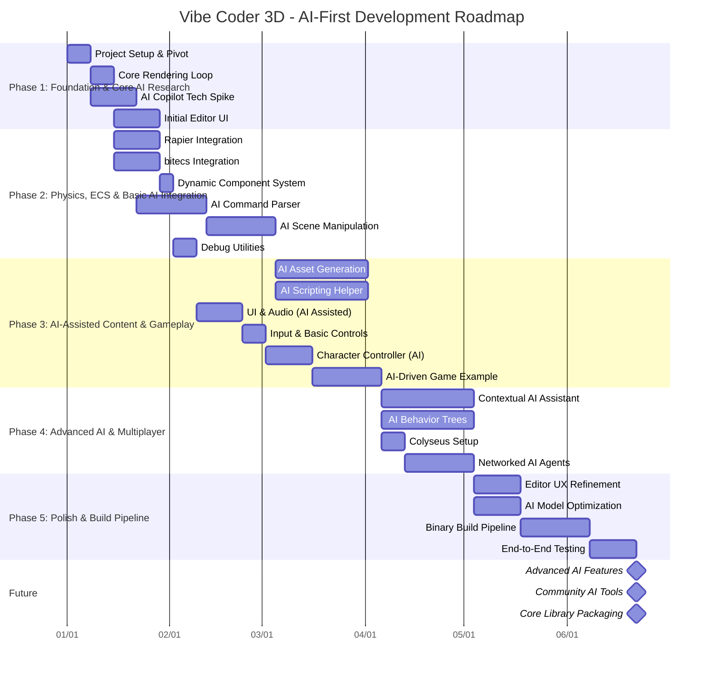

# Project Roadmap: Vibe Coder 3D - AI-First Game Engine

This document outlines the development roadmap for transforming Vibe Coder 3D into the first truly conversational game engine. Our goal is to enable natural language-driven game development while maintaining the power and flexibility of traditional engines.

> **Status Update (December 2024):** Foundation phase complete. Beginning AI Copilot integration with enhanced timeline and objectives.

**Current Focus: Initiating AI Copilot Core Functionality**

Following the completion of Phase 1, our immediate focus is on implementing the core capabilities for the AI Copilot. This involves starting key tasks from Phase 2, specifically:

- 💡 **AI Command Parser:** Developing the system to translate natural language into engine commands.
- 💡 **AI Scene Manipulation:** Enabling the AI to create, modify, and manage scene objects.

These tasks are crucial for bringing the conversational game development experience to life. While Phase 2 also includes Physics and ECS integration, the current priority is to establish the AI command and manipulation pipeline. The "enhanced timeline and objectives" mentioned in the status update should be integrated here as details become available.

## Timeline Visualization (Mermaid)

## Guiding Principles

- **AI-First, User-Centric:** AI features should enhance, not replace, developer creativity and control.
- **Iterative AI Development:** Build and refine AI capabilities incrementally, based on user feedback and technical feasibility.
- **Core First:** Prioritize the development and stabilization of the `src/core` framework with robust AI integration points.
- **Test Early, Test Often:** Integrate basic testing (unit, integration) from the beginning, including tests for AI interactions.
- **Documentation:** Maintain clear documentation for both engine features and AI Copilot usage.

## Proposed Phases

### Phase 1: Foundation & Core AI Research (Estimated: 2-3 Sprints)

_Goal: Establish the project structure, tooling, basic rendering, and research core AI technologies for the Copilot._

- **Tasks:**
  - ✅ Update project documentation to reflect the AI-first pivot (Vision, Goals, Audience).
  - ✅ Initialize project using Vite + React + TypeScript template.
  - ✅ Set up repository, CI/CD basics (linting, testing hooks).
  - ✅ Implement the `src/core`, `src/editor`, and `src/game` directory structure.
  - ✅ Configure Vite, TypeScript (`tsconfig.json`), ESLint, Prettier.
  - ✅ Install core dependencies: `three`, `react-three-fiber`, `@react-three/drei`, `zustand`.
  - ✅ Set up basic R3F Canvas and render loop in `src/core`.
  - ✅ **Technical Spike: AI Copilot Integration:**
    - ✅ Research and select core AI model/platform.
    - ✅ Define initial API for communication between the editor and the AI Copilot.
    - ✅ Prototype a simple conversational interface in the editor.
  - ✅ Create a minimal "Hello Cube" scene in `src/game` using the core setup.
  - ✅ Implement basic camera controls (`OrbitControls` from `drei`).
  - ✅ Set up basic global state management with Zustand (`src/core/state`).
  - ✅ Develop initial UI for the editor, including a panel for AI Copilot interaction.

### Phase 2: Physics, ECS & Basic AI Integration (Estimated: 3-4 Sprints)

_Goal: Integrate Rapier physics, bitecs ECS, and enable basic AI-driven scene manipulation. **Current priority is on AI command parsing and scene manipulation.**_

- **Tasks:**
  - ✅ Install `@react-three/rapier` (for Rapier physics) and `bitecs`.
  - ⏳ Set up Rapier physics world within the R3F loop (`src/core/lib/physics.ts`).
  - ⏳ Create core R3F components for rigid bodies (`<PhysicsBody>`) that sync with Rapier (`src/core/components/physics/`).
  - ⏳ Implement basic physics stepping and synchronization (`PhysicsSyncSystem.ts`).
  - ✅ Set up `bitecs` world and basic component types (`src/core/lib/ecs.ts`, `src/core/types/ecs.ts`).
  - ⏳ Define core ECS components (e.g., `Position`, `Velocity`, `Renderable`). (`AIControllable` or similar might be needed - ⚠️).
  - ⏳ Create core ECS systems (`transformSystem`, `VelocitySystem`, `PhysicsSyncSystem` exist). (⚠️ `AISystem` is a key missing piece for AI control).
  - 💡 **Dynamic Component System:** Implement a flexible system where entities can have components added on demand, rather than all entities supporting all components. This includes component registry, entity archetypes, and runtime component management. **[NEW PRIORITY - 4 days]** - See `docs/architecture/dynamic-component-system.md`
  - 💡 **AI Command Parser:** Develop a system to parse natural language commands from the AI Copilot into actionable engine commands. **[IMMEDIATE NEXT STEP]**
  - 💡 **AI Scene Manipulation:** Implement functionality for the AI to: **[IMMEDIATE NEXT STEP - Editor-side foundations exist, AI-driven part pending Command Parser]**
    - Create, delete, and modify basic geometric primitives.
    - Change properties of existing objects (transform, material, physics properties).
    - Group and parent objects.
  - ✅ Develop core hooks for interacting with physics, ECS (`src/core/hooks`).
  - ❌ Refactor the "Hello Cube" example to be controllable via AI commands (`src/game`). (Blocked by AI Command Parser & Scene Manipulation)
  - ⏳ Add basic debug utilities for physics, ECS state, and AI command execution.

### Phase 3: AI-Assisted Content & Gameplay (Estimated: 4-5 Sprints)

_Goal: Enable AI to assist with content generation (assets, scripts) and build a simple AI-driven game example._

- **Tasks:**
  - **AI Asset Generation (Proof of Concept):**
    - 💡 Integrate with APIs/models for 3D model generation. [AI part PENDING]
    - 💡 Implement AI-assisted material/texture generation/selection. [AI part PENDING]
    - (✅ Foundation for asset definition/handling in `src/core/types/assets.ts` & `hooks/useAsset.ts` is STRONG)
  - **AI Scripting Helper:**
    - 💡 Design system for AI to suggest/scaffold scripts.
    - 💡 Explore generating JS/TS snippets or visual script nodes.
  - ⏳ Define and implement core camera types. (✅ Basic controls exist, 💡 AI assistance PENDING)
  - ⏳ Integrate UI (`three-mesh-ui`) and Audio (`howler.js`). (✅ Foundations exist, 💡 AI assistance PENDING)
  - ✅ Develop core input handling system/hook (`src/core/hooks/useInput.ts`).
  - ⏳ Implement asset loading utilities. (✅ Utilities exist via `useAsset.ts`, 💡 AI classification/suggestion PENDING)
  - ⏳ Create a simple character controller component. (✅ `CharacterController.tsx` exists, 💡 AI tuning/behaviors PENDING)
  - ❌ Build a minimal game example in `src/game` showcasing AI features. (Blocked by preceding AI tasks)

### Phase 4: Advanced AI & Multiplayer (Estimated: 4-5 Sprints)

_Goal: Enhance AI capabilities with contextual understanding, behavior authoring, and explore networked AI._

- **Tasks:**
  - **Contextual AI Assistant:** Improve AI Copilot to understand conversation history, current scene selection, and project context for more relevant suggestions.
  - **AI Behavior Trees/State Machines:** Research and implement a system for creating more complex AI agent behaviors, potentially with a visual editor or natural language interface (e.g., "make this enemy patrol between these points and attack if it sees the player").
  - Set up Colyseus server and client library.
  - Implement basic room management and connection handling (`src/core/lib/network.ts`).
  - Define core network components/state synchronization strategy.
  - **Networked AI Agents:** Create examples of AI-controlled characters or entities in a multiplayer context, synchronizing their state and behavior.

### Phase 5: Polish, Build Pipeline & End-to-End Workflow (Estimated: 3-4 Sprints)

_Goal: Refine the editor UX, optimize AI performance, establish a binary build pipeline, and define the full end-to-end workflow from AI-assisted editing to a playable build._

- **Tasks:**
  - **Editor UX Refinement:** Gather user feedback and iterate on the AI Copilot interface, command clarity, and overall editor usability.
  - **AI Model Optimization:** Investigate techniques to optimize AI model performance, reduce latency, and manage costs (if using cloud-based AI).
  - **Binary Build Pipeline:**
    - Research and implement a process to package the game into a playable binary (e.g., using Electron, Tauri, or similar technologies for web-based games, or exploring WebAssembly for native-like performance).
    - Ensure assets, scripts, and AI-generated content are correctly bundled.
    - Define how AI configurations or runtime dependencies are handled in the build.
  - **End-to-End Workflow Definition & Testing:**
    - Document and test the complete process: User describes a game concept to AI -> AI assists in scene creation, asset sourcing, scripting -> User refines and tests in editor -> User initiates build process -> Playable game binary is produced.
    - Conduct thorough testing of the entire pipeline.

### Future Phases

- Advanced Rendering (AI-assisted post-processing, shader generation)
- Advanced AI Systems (Learning agents, procedural content generation beyond simple assets)
- Community AI Tools & Model Sharing
- More Sophisticated Game Examples & Templates
- Performance Optimization Pass for AI and Engine
- Packaging `src/core` as a standalone library with AI hooks
