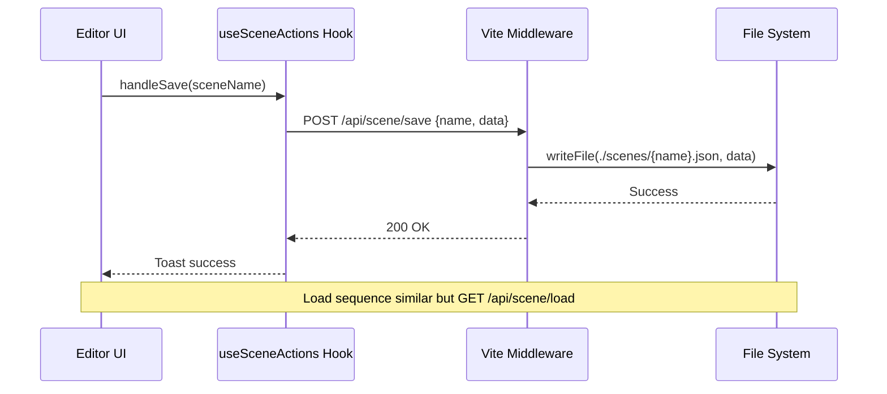

# Scene JSON File Persistence Plan

🧠 Planning documents standards rule loaded!

## 1. Overview

### Context & Goals
- Current scene persistence relies on browser localStorage, limiting scene size to 5-10MB and making external editing difficult.
- Replace with file-based JSON storage to enable larger scenes, version control integration, and manual editing in text editors.
- Introduce Vite dev server middleware to handle save/load requests, writing/reading JSON files to a local directory.
- Maintain backward compatibility with existing JSON serialization while decoupling from browser storage.

### Current Pain Points
- localStorage quota limits scene complexity in browser environments.
- Scenes are not easily shareable or versioned as files; require manual export.
- No server-side handling for multi-user or persistent storage beyond browser.
- Editing JSON directly requires export/import workflow, prone to errors.

## 2. Proposed Solution

### High-level Summary
- Modify useSceneActions hook to send HTTP requests to Vite middleware instead of using localStorage.
- Implement Vite plugin with custom middleware endpoints (/api/scene/save, /api/scene/load) for file I/O operations.
- Serialize scenes to JSON format as before, but store in ./scenes/ directory with timestamp or user-provided names.
- Update UI to allow file naming on save and browse/load from local files via API.

### Architecture & Directory Structure
```
docs/
└── plans/
    └── scene-json-file-persistence.md

src/
├── core/
│   └── lib/
│       └── serialization/
│           ├── sceneSerializer.ts      # Enhanced export/import functions
│           └── jsonValidator.ts        # Zod schema for scene validation
├── editor/
│   └── hooks/
│       ├── useSceneActions.ts          # Updated to use API calls
│       └── useScenePersistence.ts      # New hook for API interactions
└── vite.config.ts                      # Add custom server middleware

scenes/                                 # New dir for persisted scenes
└── example-scene-2025-09-25.json       # Timestamped JSON files
```

## 3. Implementation Plan

### Phase 1: Core Serialization Enhancements (0.5 day)
1. Extract exportScene and importScene from useSceneActions to src/core/lib/serialization/sceneSerializer.ts.
2. Add Zod schema in jsonValidator.ts for validating serialized scene structure.
3. Update serializer to include additional metadata (e.g., scene name, version, timestamp).

### Phase 2: Vite Middleware Setup (1 day)
1. Create vite-plugin-scene-api.ts with configureServer hook adding Express-like middleware for /api/scene/*.
2. Implement save endpoint: receive JSON, validate, write to ./scenes/ with filename or timestamp.
3. Implement load endpoint: list files in ./scenes/, or load specific file by name.
4. Add error handling and CORS if needed.

### Phase 3: Hook and UI Integration (1 day)
1. Update useSceneActions.ts to use fetch API for save/load instead of localStorage.
2. Create useScenePersistence.ts for handling API state (loading, errors).
3. Modify editor UI (e.g., save button) to prompt for scene name and trigger API call.
4. Ensure file load supports browsing via API or file input fallback.

### Phase 4: Testing and Polish (0.5 day)
1. Add unit tests for serializer and validator.
2. Integration tests for API endpoints and hook behavior.
3. Handle edge cases like invalid JSON, quota issues (now irrelevant).

## 4. File and Directory Structures

```
scenes/
├── scene-2025-09-25T10-00-00.json
├── my-project.json
└── backup-001.json

src/core/lib/serialization/
├── sceneSerializer.ts
└── jsonValidator.ts
```

## 5. Technical Details

### src/core/lib/serialization/sceneSerializer.ts
```typescript
import { z } from 'zod';

export const SceneSchema = z.object({
  version: z.number(),
  name: z.string().optional(),
  timestamp: z.string().optional(),
  entities: z.array(z.object({ /* entity structure */ })),
});

export interface ISerializedScene extends z.infer<typeof SceneSchema> {}

export const exportScene = (entities: any[]): ISerializedScene => {
  // serialization logic
  return { version: 4, entities: serializedEntities };
};

export const importScene = async (scene: ISerializedScene): Promise<void> => {
  // deserialization logic
};
```

### vite.config.ts Update
```typescript
import { Plugin } from 'vite';

export default defineConfig({
  plugins: [
    // existing plugins
    sceneApiMiddleware(),
  ],
});

function sceneApiMiddleware(): Plugin {
  return {
    name: 'scene-api',
    configureServer(server) {
      server.middlewares.use('/api/scene', (req, res) => {
        // handle routes
      });
    },
  };
}
```

### src/editor/hooks/useSceneActions.ts Update
```typescript
const handleSave = async (sceneName: string) => {
  const scene = exportScene(entities);
  const response = await fetch('/api/scene/save', {
    method: 'POST',
    headers: { 'Content-Type': 'application/json' },
    body: JSON.stringify({ name: sceneName, data: scene }),
  });
  // handle response
};
```

## 6. Usage Examples

### Saving a Scene
```typescript
const { handleSave } = useSceneActions();
await handleSave('my-new-scene');  // Saves to scenes/my-new-scene.json
```

### Loading a Scene
```typescript
const { handleLoad } = useSceneActions();
await handleLoad('my-new-scene');  // Loads from scenes/my-new-scene.json
```

### Listing Scenes
```typescript
const scenes = await fetch('/api/scene/list').then(r => r.json());
// Returns [{ name: 'my-new-scene.json', modified: '2025-09-25' }, ...]
```

## 7. Testing Strategy

### Unit Tests
- Validate SceneSchema with valid/invalid data.
- Serialize/deserialize round-trip for sample entities.
- Edge cases: empty scene, large entities.

### Integration Tests
- Save via API, verify file created with correct content.
- Load via API, confirm entities imported correctly.
- List endpoint returns accurate file list.
- Error handling for invalid filenames or JSON.

## 8. Edge Cases

| Edge Case | Remediation |
|-----------|-------------|
| Invalid JSON on load | Return error toast; fallback to empty scene. |
| File write permission denied | Log error; suggest checking directory permissions. |
| Concurrent saves | Use file locks or timestamps to avoid overwrites. |
| Large file (>100MB) | Implement streaming or chunked upload; warn user. |
| Special characters in filename | Sanitize name; replace with underscores. |

## 9. Sequence Diagram



## 10. Risks & Mitigations

| Risk | Mitigation |
|------|------------|
| Dev server restart loses middleware state | Persistence via files; middleware stateless. |
| Security: arbitrary file writes | Restrict to ./scenes/ dir; validate input. |
| Performance on large saves | Async operations; progress indicators. |
| Browser compatibility for fetch | Polyfill if needed; fallback to file download. |

## 11. Timeline
- Total estimated time: 3 days
- Phase 1: 0.5 day
- Phase 2: 1 day
- Phase 3: 1 day
- Phase 4: 0.5 day

## 12. Acceptance Criteria
- Save button prompts for name and creates JSON file in ./scenes/.
- Load lists available scenes or loads by name via API.
- Imported scenes match exported entities exactly.
- No localStorage usage in production code.
- Tests pass; no lint/type errors.
- Manual edit of JSON file loads correctly.

## 13. Conclusion
This plan transitions scene persistence from ephemeral browser storage to durable, editable files, enhancing collaboration and debugging. Next steps: implement Phase 1 serialization, then integrate middleware.

## 14. Assumptions & Dependencies
- Vite dev server running on localhost:5173.
- Node.js file system access in dev mode.
- Zod library already in dependencies.
- No production build changes; dev-only feature.
- User runs dev server; no need for built-in server.
