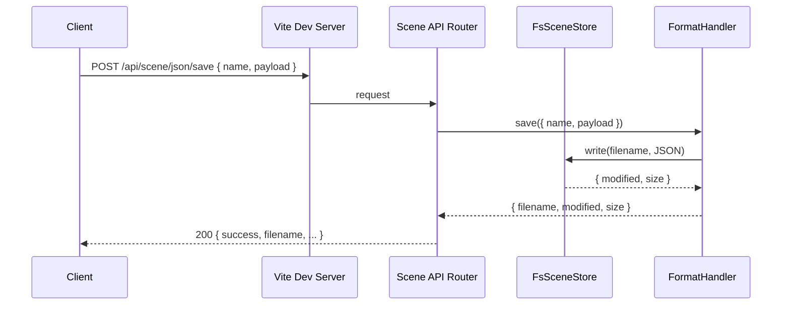

# Vite Scene API Refactor Plan

## 1. Overview

- **Context & Goals**

  - Unify scene persistence endpoints with reusable, typed abstractions to serve JSON, TSX, and streaming formats.
  - Eliminate duplicate validation and ad‑hoc parsing by centralizing schemas and serializers with Zod.
  - Improve scalability for large scenes via streaming, chunking, and non‑blocking processing.
  - Make the scene API configurable and portable for other storage backends beyond local FS.

- **Current Pain Points**
  - Validation duplicated in `src/plugins/vite-plugin-scene-api.ts` and serializers; drift risk and inconsistent errors.
  - TSX parsing is regex‑based and brittle; JSON vs TSX logic is scattered.
  - FS ops, naming sanitization, CORS headers, and error handling are embedded in route handlers.
  - Hardcoded `SCENES_DIR` and unstructured endpoints make reuse and extension harder.

## 2. Proposed Solution

- **High‑level Summary**

  - Extract a reusable Scene API core: format handlers, scene store, validation, and HTTP helpers.
  - Standardize format interfaces: `json`, `tsx`, `stream` (future: `gltf`, `yaml`).
  - Centralize validation with Zod using existing schemas and serializers.
  - Add a configurable Vite middleware factory with options (paths, formats, CORS, limits, auth hook).
  - Implement streaming endpoints and progressive feedback hooks where applicable.

- **Architecture & Directory Structure**

```
/src
├── core
│   └── lib
│       └── serialization
│           ├── SceneSerializer.ts
│           ├── SceneDeserializer.ts
│           ├── StreamingSceneSerializer.ts
│           ├── tsxSerializer.ts
│           └── common
│               ├── ISceneStore.ts
│               ├── FsSceneStore.ts
│               ├── SceneValidation.ts
│               ├── NameUtils.ts
│               ├── HttpUtils.ts
│               └── Result.ts
├── plugins
│   └── scene-api
│       ├── createSceneApi.ts
│       ├── formats
│       │   ├── JsonFormatHandler.ts
│       │   ├── TsxFormatHandler.ts
│       │   └── StreamFormatHandler.ts
│       └── vite-plugin-scene-api.ts
└── game
    └── scenes
```

- No barrel `index.ts`. Named exports only. Use TS path aliases per `tsconfig`.

## 3. Implementation Plan

- **Phase 1: Core Extraction (0.5 day)**

  1. Create `ISceneStore` and `FsSceneStore` to encapsulate file IO (read/write/list) with path safety.
  2. Extract `validateSceneData` into `SceneValidation.ts` powered by the Zod schemas already present.
  3. Extract and unify `sanitizeComponentName` into `NameUtils.ts` and reuse across TSX.
  4. Add `HttpUtils.ts` for CORS, error, JSON body parsing (with size limits), and ETag/Last‑Modified helpers.
  5. Add a `Result<T>` utility type (ok/error) for consistent error handling.

- **Phase 2: Format Interfaces (0.5 day)**

  1. Define `ISceneFormatHandler` interface with `save`, `load`, `list` and `contentType`.
  2. Implement `JsonFormatHandler` using `SceneSerializer`/`SceneDeserializer` + `SceneValidation`.
  3. Implement `TsxFormatHandler` using `tsxSerializer` for save and safer extraction for load.
  4. Implement `StreamFormatHandler` delegating to `StreamingSceneSerializer` for large scenes.

- **Phase 3: Scene API Middleware (0.5 day)**

  1. Introduce `createSceneApi` factory that wires routes to handlers and store.
  2. Add options: `scenesDir`, `formats`, `maxRequestSize`, `cors`, `logger`, `auth` (optional hook).
  3. Provide route map: `/api/scene/:format/save|load|list` with back‑compat aliases.
  4. Adopt ETag/If‑None‑Match and Last‑Modified/If‑Modified‑Since for `load` and `list`.

- **Phase 4: Performance & Streaming (0.5 day)**

  1. Support non‑blocking chunked processing for stream endpoints; leverage existing streaming serializer.
  2. Optional SSE endpoint `/api/scene/stream/progress` for long‑running operations.
  3. Add request size limits and early rejections; path traversal hardening.

- **Phase 5: Tests, Migration, Docs (0.5 day)**
  1. Unit tests for handlers, store, and validation. Integration tests for middleware routes.
  2. Migrate `src/plugins/vite-plugin-scene-api.ts` to call `createSceneApi` with configured handlers.
  3. Update docs with examples and deprecation notes for old endpoints.

## 4. File and Directory Structures

```
/src/core/lib/serialization/common/
├── ISceneStore.ts
├── FsSceneStore.ts
├── SceneValidation.ts
├── NameUtils.ts
├── HttpUtils.ts
└── Result.ts

/src/plugins/scene-api/
├── createSceneApi.ts
├── formats/
│   ├── JsonFormatHandler.ts
│   ├── TsxFormatHandler.ts
│   └── StreamFormatHandler.ts
└── vite-plugin-scene-api.ts
```

## 5. Technical Details

- **`ISceneStore.ts`**

```ts
export interface ISceneFileInfo {
  name: string;
  modified: string;
  size: number;
  type?: string;
}

export interface ISceneStore {
  read(name: string): Promise<{ content: string; modified: string; size: number }>;
  write(name: string, content: string): Promise<{ modified: string; size: number }>;
  list(): Promise<ISceneFileInfo[]>;
  exists(name: string): Promise<boolean>;
  sanitizeFilename(name: string, ext: '.json' | '.tsx'): string;
}
```

- **`FsSceneStore.ts`**

```ts
import { promises as fs } from 'fs';
import path from 'path';
import type { ISceneStore, ISceneFileInfo } from './ISceneStore';

export class FsSceneStore implements ISceneStore {
  constructor(private readonly baseDir: string) {}

  sanitizeFilename(name: string, ext: '.json' | '.tsx'): string {
    const safe = name.replace(/[^a-zA-Z0-9\-_]/g, '_');
    return safe.endsWith(ext) ? safe : `${safe}${ext}`;
  }

  async read(name: string) {
    const filepath = path.join(this.baseDir, name);
    const content = await fs.readFile(filepath, 'utf-8');
    const stats = await fs.stat(filepath);
    return { content, modified: stats.mtime.toISOString(), size: stats.size };
  }

  async write(name: string, content: string) {
    const filepath = path.join(this.baseDir, name);
    await fs.mkdir(this.baseDir, { recursive: true });
    await fs.writeFile(filepath, content, 'utf-8');
    const stats = await fs.stat(filepath);
    return { modified: stats.mtime.toISOString(), size: stats.size };
  }

  async list(): Promise<ISceneFileInfo[]> {
    const files = await fs.readdir(this.baseDir);
    const infos: ISceneFileInfo[] = [];
    for (const file of files) {
      const filepath = path.join(this.baseDir, file);
      const stats = await fs.stat(filepath);
      infos.push({ name: file, modified: stats.mtime.toISOString(), size: stats.size });
    }
    return infos.sort((a, b) => new Date(b.modified).getTime() - new Date(a.modified).getTime());
  }

  async exists(name: string) {
    try {
      await fs.access(path.join(this.baseDir, name));
      return true;
    } catch {
      return false;
    }
  }
}
```

- **`SceneValidation.ts`** (wrap Zod schemas from existing `SceneSerializer`/`SceneDeserializer`/`StreamingSceneSerializer`)

```ts
export interface IValidationResult {
  isValid: boolean;
  error?: string;
}

export const validateJsonScene = (data: unknown): IValidationResult => {
  // delegates to SceneDataSchema
  try {
    /* SceneDataSchema.parse(data) */ return { isValid: true };
  } catch (e) {
    return { isValid: false, error: (e as Error).message };
  }
};

export const validateStreamingScene = (data: unknown): IValidationResult => {
  try {
    /* StreamingSceneSchema.parse(data) */ return { isValid: true };
  } catch (e) {
    return { isValid: false, error: (e as Error).message };
  }
};
```

- **`NameUtils.ts`**

```ts
export const sanitizeComponentName = (name: string): string =>
  name
    .replace(/[^a-zA-Z0-9]/g, '')
    .replace(/^\d+/, '')
    .replace(/^./, (c) => c.toUpperCase()) || 'Scene';
```

- **`HttpUtils.ts`**

```ts
import type { IncomingMessage, ServerResponse } from 'http';

export const applyCors = (res: ServerResponse, origin = '*'): void => {
  res.setHeader('Access-Control-Allow-Origin', origin);
  res.setHeader('Access-Control-Allow-Methods', 'GET, POST, OPTIONS');
  res.setHeader('Access-Control-Allow-Headers', 'Content-Type');
};

export const readJsonBody = async <T>(req: IncomingMessage, limitBytes = 5_000_000): Promise<T> => {
  let body = '';
  let size = 0;
  await new Promise<void>((resolve, reject) => {
    req.on('data', (chunk: Buffer) => {
      size += chunk.length;
      if (size > limitBytes) reject(new Error('Payload too large'));
      body += chunk;
    });
    req.on('end', () => resolve());
    req.on('error', reject);
  });
  return JSON.parse(body) as T;
};
```

- **`ISceneFormatHandler`**

```ts
export interface ISaveArgs {
  name: string;
  payload: unknown;
}
export interface ILoadArgs {
  name: string;
}
export interface IListArgs {}

export interface ISceneFormatHandler {
  readonly format: 'json' | 'tsx' | 'stream';
  readonly contentType: string;
  save(
    args: ISaveArgs,
  ): Promise<{ filename: string; modified: string; size: number; extra?: Record<string, unknown> }>;
  load(
    args: ILoadArgs,
  ): Promise<{
    filename: string;
    data: unknown;
    modified?: string;
    extra?: Record<string, unknown>;
  }>;
  list(
    _args?: IListArgs,
  ): Promise<
    Array<{ name: string; filename: string; modified: string; size: number; type: string }>
  >;
}
```

- **`JsonFormatHandler.ts`** (skeleton)

```ts
export class JsonFormatHandler implements ISceneFormatHandler {
  readonly format = 'json' as const;
  readonly contentType = 'application/json';
  constructor(private readonly store: ISceneStore) {}
  async save({ name, payload }: ISaveArgs) {
    // validate with SceneValidation
    const filename = this.store.sanitizeFilename(name, '.json');
    const content = JSON.stringify(payload, null, 2);
    const { modified, size } = await this.store.write(filename, content);
    return { filename, modified, size };
  }
  async load({ name }: ILoadArgs) {
    const filename = name.endsWith('.json') ? name : `${name}.json`;
    const { content, modified } = await this.store.read(filename);
    const data = JSON.parse(content);
    return { filename, data, modified };
  }
  async list() {
    const items = await this.store.list();
    return items
      .filter((f) => f.name.endsWith('.json'))
      .map((i) => ({
        name: i.name,
        filename: i.name,
        modified: i.modified,
        size: i.size,
        type: 'json',
      }));
  }
}
```

- **`TsxFormatHandler.ts`** (skeleton)

```ts
export class TsxFormatHandler implements ISceneFormatHandler {
  readonly format = 'tsx' as const;
  readonly contentType = 'application/json';
  constructor(private readonly store: ISceneStore) {}
  async save({ name, payload }: ISaveArgs) {
    // payload: { entities, materials, prefabs, inputAssets, description, author }
    // generate TSX via generateTsxScene
    const componentName = sanitizeComponentName(name);
    const filename = `${componentName}.tsx`;
    const tsx = generateTsxScene(/* extract arrays & metadata from payload */);
    const { modified, size } = await this.store.write(filename, tsx);
    return { filename, modified, size, extra: { componentName } };
  }
  async load({ name }: ILoadArgs) {
    // support both raw name and sanitized component name
    const primary = name.endsWith('.tsx') ? name : `${name}.tsx`;
    const alt = `${sanitizeComponentName(name.replace(/\.tsx$/, ''))}.tsx`;
    const target = (await this.store.exists(primary)) ? primary : alt;
    const { content } = await this.store.read(target);
    // Extract defineScene payload reliably (prefer AST later; keep regex fallback)
    const data = extractDefineSceneData(content);
    return { filename: target, data };
  }
  async list() {
    const items = await this.store.list();
    return items
      .filter((f) => f.name.endsWith('.tsx'))
      .map((i) => ({
        name: i.name.replace(/\.tsx$/, ''),
        filename: i.name,
        modified: i.modified,
        size: i.size,
        type: 'tsx',
      }));
  }
}
```

- **`StreamFormatHandler.ts`** (skeleton)

```ts
export class StreamFormatHandler implements ISceneFormatHandler {
  readonly format = 'stream' as const;
  readonly contentType = 'application/json';
  constructor(private readonly store: ISceneStore) {}
  async save({ name, payload }: ISaveArgs) {
    const filename = this.store.sanitizeFilename(name, '.json');
    // payload should already be in streaming scene shape
    const content = JSON.stringify(payload, null, 2);
    const { modified, size } = await this.store.write(filename, content);
    return { filename, modified, size };
  }
  async load({ name }: ILoadArgs) {
    const filename = name.endsWith('.json') ? name : `${name}.json`;
    const { content, modified } = await this.store.read(filename);
    const data = JSON.parse(content);
    return { filename, data, modified };
  }
  async list() {
    /* similar to json with type 'stream' */ return [];
  }
}
```

- **`createSceneApi.ts`**

```ts
import type { Plugin } from 'vite';
import type { IncomingMessage, ServerResponse } from 'http';

export interface ISceneApiOptions {
  scenesDir: string;
  handlers: ISceneFormatHandler[]; // e.g., [new JsonFormatHandler(store), new TsxFormatHandler(store)]
  maxRequestSize?: number;
  corsOrigin?: string;
  logger?: { info: Function; error: Function };
  auth?: (req: IncomingMessage) => Promise<boolean> | boolean;
}

export const createSceneApi = (options: ISceneApiOptions): Plugin => ({
  name: 'scene-api',
  configureServer(server) {
    const { handlers, scenesDir, corsOrigin = '*', maxRequestSize = 5_000_000 } = options;
    const store = new FsSceneStore(scenesDir);
    const byFormat = new Map(handlers.map((h) => [h.format, h] as const));

    server.middlewares.use('/api/scene', async (req, res) => {
      applyCors(res, corsOrigin);
      if (req.method === 'OPTIONS') {
        res.statusCode = 200;
        res.end();
        return;
      }

      try {
        const url = new URL(req.url!, `http://${req.headers.host}`);
        const [, , format, action] = url.pathname.split('/'); // /api/scene/:format/:action
        const handler = byFormat.get(format as any);
        if (!handler) {
          res.statusCode = 404;
          res.end(JSON.stringify({ error: 'Unknown format' }));
          return;
        }

        if (action === 'save' && req.method === 'POST') {
          const body = await readJsonBody<{ name: string; payload: unknown }>(req, maxRequestSize);
          const result = await handler.save({ name: body.name, payload: body.payload });
          res.setHeader('Content-Type', 'application/json');
          res.end(JSON.stringify({ success: true, ...result }));
          return;
        }
        if (action === 'load' && req.method === 'GET') {
          const name = url.searchParams.get('name');
          if (!name) {
            res.statusCode = 400;
            res.end(JSON.stringify({ error: 'name required' }));
            return;
          }
          const result = await handler.load({ name });
          res.setHeader('Content-Type', 'application/json');
          res.end(JSON.stringify({ success: true, ...result }));
          return;
        }
        if (action === 'list' && req.method === 'GET') {
          const result = await handler.list({});
          res.setHeader('Content-Type', 'application/json');
          res.end(JSON.stringify({ success: true, scenes: result }));
          return;
        }

        res.statusCode = 404;
        res.end(JSON.stringify({ error: 'Unknown action' }));
      } catch (error) {
        res.statusCode = 500;
        res.setHeader('Content-Type', 'application/json');
        res.end(
          JSON.stringify({ error: 'Internal server error', message: (error as Error).message }),
        );
      }
    });
  },
});
```

- **`vite-plugin-scene-api.ts`**
  - Becomes a thin wrapper that calls `createSceneApi` with `FsSceneStore` and the selected handlers for JSON/TSX/stream.
  - Maintain back‑compat aliases for existing endpoints by adding extra `server.middlewares.use` routes that forward to the new handler paths.

## 6. Usage Examples

- **Vite config**

```ts
import { defineConfig } from 'vite';
import react from '@vitejs/plugin-react';
import { createSceneApi } from '@/plugins/scene-api/createSceneApi';
import { FsSceneStore } from '@/core/lib/serialization/common/FsSceneStore';
import { JsonFormatHandler } from '@/plugins/scene-api/formats/JsonFormatHandler';
import { TsxFormatHandler } from '@/plugins/scene-api/formats/TsxFormatHandler';

export default defineConfig({
  plugins: [
    react(),
    createSceneApi({
      scenesDir: './src/game/scenes',
      handlers: [
        new JsonFormatHandler(new FsSceneStore('./src/game/scenes')),
        new TsxFormatHandler(new FsSceneStore('./src/game/scenes')),
      ],
      maxRequestSize: 10_000_000,
    }),
  ],
});
```

- **Save JSON request body**

```json
{
  "name": "My Scene",
  "payload": {
    "metadata": { "name": "My Scene", "version": 1, "timestamp": "..." },
    "entities": [],
    "materials": [],
    "prefabs": []
  }
}
```

- **Save TSX request body**

```json
{
  "name": "My Scene",
  "payload": {
    "entities": [],
    "materials": [],
    "prefabs": [],
    "inputAssets": [],
    "description": "...",
    "author": "..."
  }
}
```

## 7. Testing Strategy

- **Unit Tests**

  - `FsSceneStore`: sanitize, read/write/list, sort order.
  - `JsonFormatHandler`: validation pass/fail; load/save parity.
  - `TsxFormatHandler`: generate TSX; load extraction fallback works; sanitize name.
  - `createSceneApi`: route parsing, CORS, error responses, limits.

- **Integration Tests**
  - `POST /api/scene/json/save`, `GET /api/scene/json/load`, `GET /api/scene/json/list`.
  - Same suite for `tsx` and `stream` formats.
  - Large file handling and streaming progress callbacks (where supported).

## 8. Edge Cases

| Edge Case                      | Remediation                                                      |
| ------------------------------ | ---------------------------------------------------------------- |
| Path traversal in `name`       | `sanitizeFilename` and `path.join` root confinement; reject `..` |
| Very large payloads            | `readJsonBody` byte limit + 413 error; streaming endpoints       |
| TSX file without `defineScene` | Return 400 with debug; add AST fallback later                    |
| Missing camera/light           | Warn (as today), not fatal; keep validation extensible           |
| Duplicate scene names          | Overwrite or versioned names configurable; return metadata       |
| Concurrent writes              | Serialize per‑file writes; optional lock file or in‑memory mutex |

## 9. Sequence Diagram



## 10. Risks & Mitigations

| Risk                        | Mitigation                                                         |
| --------------------------- | ------------------------------------------------------------------ |
| Breaking existing endpoints | Keep `/save`, `/load`, `/list` aliases forwarding to new routes    |
| TSX parsing fragility       | Keep current regex with better guards; plan AST fallback phase     |
| Performance regressions     | Add benchmarks for large scenes; stream serializer for big exports |
| Increased complexity        | Small, focused modules; named exports; no barrels                  |

## 11. Timeline

- Total: ~2.5 days
  - Phase 1: 0.5 day
  - Phase 2: 0.5 day
  - Phase 3: 0.5 day
  - Phase 4: 0.5 day
  - Phase 5: 0.5 day

## 12. Acceptance Criteria

- New `createSceneApi` middleware in place; plugin uses it.
- JSON, TSX, and (optional) stream formats supported behind unified routes.
- Validation centralized with Zod; duplicate logic removed from handlers.
- Back‑compat endpoints continue to work.
- Tests passing: unit + integration for all routes and handlers.
- No linter errors; named exports only; path aliases used.

## 13. Conclusion

This refactor modularizes the scene API, enabling reuse across formats and future storage backends. It reduces duplication, improves scalability for large scenes via streaming, and makes the system more testable and maintainable.

## 14. Assumptions & Dependencies

- Node 18+, Vite dev server context.
- Existing Zod schemas and serializers remain the source of truth.
- Yarn; TypeScript path aliases as configured in `tsconfig.json`.
- No barrels; named exports only; prefer Zod for validation.
