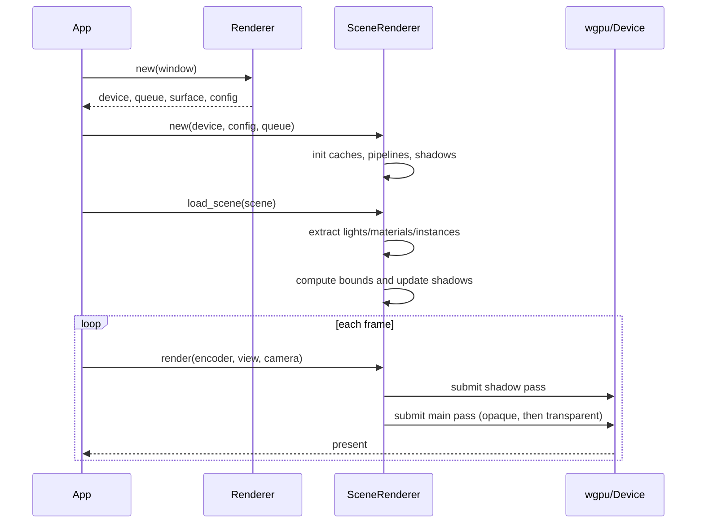

# Rust Engine Refactoring Report

## Overview

- **Context & Goals**: Improve scalability, performance, and maintainability of the Rust engine by aligning folder boundaries to domain modules, eliminating duplication, and correcting lifecycle hooks. Strengthen render/physics/data flow and reduce GPU resource churn.
- **Context & Goals**: Ensure all extracted submodules are actually used by the runtime; remove dead code and fragile panics; introduce caching where per‑frame allocations exist.
- **Context & Goals**: Keep the refactor incremental and low‑risk while preserving current behavior and feature flags.
- **Context & Goals**: Produce a clear migration path and acceptance criteria for completion.

## Current Pain Points

- **Duplication**: Logic in `render/scene_renderer.rs` duplicates helpers in `render/scene_renderer/*` (sorting, shadows); helpers aren’t fully hooked.
- **Per‑frame allocations**: Bind groups and uniform buffers for materials/textures are created inside the render pass loop every frame → GPU object churn.
- **Fallback bug**: Scene‑graph build failure returns early from load, preventing fallback processing.
- **Redundant module**: Local `src/assets` stub conflicts with `crates/assets`; `mod assets;` in the binary crate adds confusion.
- **Physics sync complexity**: O(n^2) pattern using map nth-iteration; mismatched counts and ordering.
- **Runtime panic**: `expect()` on shadow map at init; should validate and degrade gracefully.
- **Minor legacy**: `Renderer::render()` not used by `App` loop (kept as sample but can confuse).

## Proposed Solution

- **High‑level Summary**:
  - Hook extracted `scene_renderer` submodules (sorting, shadows, textures/materials/instances) directly in the render path and remove duplicated implementations.
  - Add persistent caches for material bind groups, texture bind groups, and per‑entity uniform buffers to avoid per‑frame GPU resource creation.
  - Fix scene loading fallback to handle scene graph build failures without aborting the remainder of the load.
  - Remove the local `src/assets` module and its `mod assets;` declaration; rely exclusively on the `vibe-assets` crate.
  - Replace O(n^2) physics sync iteration with a single pass over the entity‑to‑body map.
  - Convert fragile `expect()` in runtime to safe initialization checks with actionable errors.

### Architecture & Directory Structure

Current (relevant subset):

```
rust/engine/
├── Cargo.toml (workspace root)
├── crates/
│   ├── assets/
│   ├── ecs-bridge/
│   ├── physics/
│   ├── scene/
│   ├── scene-graph/
│   └── wasm-bridge/
└── src/
    ├── app.rs
    ├── assets/            (stub; redundant with crates/assets)
    ├── ecs/
    ├── io/
    ├── render/
    │   ├── scene_renderer/
    │   │   ├── instances.rs
    │   │   ├── lights.rs
    │   │   ├── materials.rs
    │   │   ├── shadows.rs
    │   │   ├── sorting.rs
    │   │   └── textures.rs
    │   ├── pipeline/
    │   └── ...
    ├── util/
    └── main.rs
```

Proposed (incremental; preserves workspace):

```
rust/engine/
├── crates/
│   ├── assets/
│   ├── ecs-bridge/
│   ├── physics/
│   ├── scene/
│   ├── scene-graph/
│   └── wasm-bridge/
└── src/
    ├── app.rs
    ├── ecs/
    ├── io/
    ├── render/
    │   ├── scene_renderer/
    │   │   ├── instances.rs        (hooked and used)
    │   │   ├── lights.rs           (hooked and used)
    │   │   ├── materials.rs        (hooked and used)
    │   │   ├── shadows.rs          (hooked and used)
    │   │   ├── sorting.rs          (hooked and used)
    │   │   └── textures.rs         (hooked and used)
    │   ├── pipeline/
    │   └── ...
    ├── util/
    └── main.rs
```

Notes:

- Remove `src/assets` entirely; drop `mod assets;` in `main.rs`.
- Keep the `render` module inside the binary crate for now; consider a future `crates/render` if/when API surfaces stabilize and cross‑crate reuse becomes needed.

## Implementation Plan

### Phase 1: Hook helpers + remove duplicate logic (0.5 day)

1. Replace inline alpha sorting in `scene_renderer.rs` with `scene_renderer/sorting::DrawSorter`.
2. Replace inline scene bounds/shadow update with `scene_renderer/shadows::ShadowBinder`.
3. Ensure `materials.rs`, `textures.rs`, `instances.rs`, `lights.rs` expose minimal pure fns and are called from `SceneRenderer`.

### Phase 2: Introduce GPU resource caching (1.0 day)

1. Add `BindGroupCache` keyed by material/texture tuple; reuse across frames.
2. Store per‑entity `MaterialUniform` buffers; update via `queue.write_buffer` when dirty.
3. Only rebuild `instance_buffer` when transforms/materials changed.

### Phase 3: Fix scene graph fallback and init validations (0.5 day)

1. Replace the early `return` after failed scene‑graph build with a flat‑hierarchy fallback.
2. Validate shadow map availability at init; replace `expect()` with a guarded branch and log.

### Phase 4: Physics sync iteration optimization (0.25 day)

1. Iterate `entity_to_body` directly; remove `nth(i)` pattern and dependency on counts.

### Phase 5: Remove dead/redundant code (0.25 day)

1. Delete `src/assets` and its `mod assets;` declaration.
2. Remove or clearly comment `Renderer::render()` if not used by `App`.

### Phase 6: Tests and perf validation (0.5 day)

1. Unit tests for sorter/shadows bindings and caching invalidation.
2. Integration test: render a scene for N frames and assert no bind‑group churn (via counters/hooks).

## File and Directory Structures

New/updated files (high level):

```
rust/engine/src/render/scene_renderer/
├── sorting.rs          (used by SceneRenderer)
├── shadows.rs          (used by SceneRenderer)
├── materials.rs        (used by SceneRenderer; cache helpers)
├── textures.rs         (used by SceneRenderer; cache helpers)
├── instances.rs        (used by SceneRenderer; instance build helpers)
└── lights.rs           (used by SceneRenderer; light uniform helpers)
```

Removed:

```
rust/engine/src/assets/ (entire directory)
```

## Technical Details

- **Sorting integration**:
  - Replace manual alpha sort in the render pass with: `let (opaque, transparent) = DrawSorter::bucket_and_sort(&alpha_modes, &entities, camera_pos);`
- **Shadow uniform integration**:
  - Use `ShadowBinder::compute_scene_bounds(&entities)` and `ShadowBinder::update_directional(...)` instead of manual duplication.
- **GPU resource caching**:
  - Introduce a cache struct with stable keys:

```rust
pub struct Bind_group_key {
    pub albedo: Option<String>,
    pub normal: Option<String>,
    pub metallic: Option<String>,
    pub roughness: Option<String>,
    pub emissive: Option<String>,
    pub occlusion: Option<String>,
    pub flags: u32,
}

pub struct Bind_group_cache {
    pub by_key: hashbrown::HashMap<Bind_group_key, wgpu::BindGroup>,
}
```

- Maintain `Vec<MaterialResource>` alongside entities; update only when material id or texture set changes.
- **Scene graph fallback**:

```rust
// On SceneGraph::build failure, continue with flat transforms
// and still populate entities/materials/lights and shadow uniforms.
```

- **Physics sync optimization**:

```rust
for (entity_id, _) in physics_world.entity_to_body.iter() {
    if let Some((pos, rot)) = physics_world.get_entity_transform(*entity_id) {
        if scene_renderer.update_entity_transform(*entity_id, pos, rot) { dirty = true; }
    }
}
```

- **Init validations**:

```rust
if let Some(dir_map) = scene_renderer.shadow_resources.get_directional_map(0) {
    // create bind group
} else {
    log::warn!("No directional shadow maps configured; disabling shadows");
}
```

## Usage Examples

- **Using sorter and caching in the render loop**:

```rust
let (opaque, transparent) = Draw_sorter::bucket_and_sort(&alpha_modes, &entities, camera.position);
bind_group_cache.ensure_for_entity(/* ... */);
```

- **Updating shadows after scene load**:

```rust
let (center, radius) = Shadow_binder::compute_scene_bounds(&entities);
let uniform = Shadow_binder::update_directional(light_dir, center, radius, enabled, bias, radius_px);
pipeline.update_shadows(&queue, &uniform);
```

- **Iterating physics sync efficiently**:

```rust
for (entity_id, _) in physics_world.entity_to_body.iter() {
    if let Some((pos, rot)) = physics_world.get_entity_transform(*entity_id) {
        if scene_renderer.update_entity_transform(*entity_id, pos, rot) { dirty = true; }
    }
}
```

## Testing Strategy

- **Unit Tests**:
  - Sorting buckets and order for mixed alpha modes.
  - Shadow bounds for empty/single/multiple entities.
  - Bind group cache: hit/miss behavior; invalidation when material changes.
- **Integration Tests**:
  - Scene load fallback when scene‑graph build fails (still renders primitives).
  - Multi‑frame render: no growth of bind group/buffer creation counts after warm‑up.
  - Physics sync correctness after N fixed steps.

## Edge Cases

| Edge Case                             | Remediation                                                                                      |
| ------------------------------------- | ------------------------------------------------------------------------------------------------ |
| No directional shadow maps            | Disable shadow sampling and log; keep pipelines valid.                                           |
| Scene‑graph build fails               | Use flat transform fallback; still extract renderables and lights.                               |
| Material missing textures             | Fallback to default white/normal/black/gray textures as today; cache keys handle None.           |
| Large scenes (>50k instances)         | Instance buffer growth strategy; chunked updates; consider storage buffers and multi‑draw later. |
| GLTF feature disabled at compile time | Log clear warning; skip GLTF path; render primitives.                                            |
| Window resize during frame            | Recreate depth texture and resize HUD safely (already in place).                                 |

## Sequence Diagram



## Risks & Mitigations

| Risk                                     | Mitigation                                                          |
| ---------------------------------------- | ------------------------------------------------------------------- |
| Bind group cache invalidation bugs       | Centralize cache ownership; add tests for material/texture changes. |
| Behavior drift due to hooking helpers    | Keep functions pure; add snapshot tests for same inputs/outputs.    |
| GPU memory growth                        | Track counts and sizes; add debug counters and CI guard.            |
| Fallback logic masking real graph issues | Log error prominently; expose a flag to fail hard in CI.            |

## Timeline

- **Phase 1**: 0.5 day
- **Phase 2**: 1.0 day
- **Phase 3**: 0.5 day
- **Phase 4**: 0.25 day
- **Phase 5**: 0.25 day
- **Phase 6**: 0.5 day
- **Total**: ~3.0 days

## Acceptance Criteria

- Sorting and shadow helpers are called from `SceneRenderer`; duplicated logic removed.
- No per‑frame creation of material buffers or bind groups on steady frames.
- Flat‑hierarchy fallback works when scene‑graph build fails; scene still renders.
- Physics sync iterates map once; no O(n^2) path.
- No `mod assets;` in the binary crate; no local `src/assets` directory.
- No panics in runtime paths due to missing shadow resources; graceful degrade.

## Conclusion

This plan focuses on hooking existing modular helpers, removing duplication, introducing GPU resource caching, and fixing correctness/performance pitfalls. The refactor is incremental, lowers risk, and prepares the renderer for larger scenes and future modularization without changing external behavior.

## Assumptions & Dependencies

- Continue using `wgpu 0.19`, `winit 0.29`, `glam 0.27`.
- Feature flag `gltf-support` remains default; GLTF path stays optional at compile time.
- No changes to `crates/*` public APIs required beyond cache hooks inside the binary crate.
- CI has GPU tests disabled or headless compatible; integration tests rely on counters and logic, not pixels.
