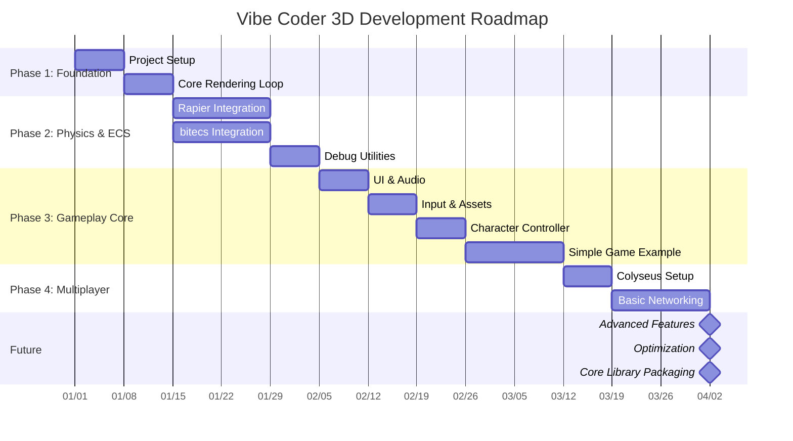

# Project Roadmap: Vibe Coder 3D

This document outlines the proposed development roadmap for Vibe Coder 3D, focusing on establishing the core framework and enabling initial game development.

## Timeline Visualization (Mermaid)

## Guiding Principles

- **Iterative Development:** Build the core incrementally, focusing on essential features first.
- **Core First:** Prioritize the development and stabilization of the `src/core` framework.
- **Test Early, Test Often:** Integrate basic testing (unit, integration) from the beginning.
- **Documentation:** Maintain documentation alongside development (as we are doing!).

## Proposed Phases

### Phase 1: Foundation & Core Setup (Estimated: 1-2 Sprints)

_Goal: Establish the project structure, tooling, and basic rendering loop._

- **Tasks:**
  - Initialize project using Vite + React + TypeScript template.
  - Set up repository, CI/CD basics (linting, testing hooks).
  - Implement the `src/core` and `src/game` directory structure (`docs/architecture/project-structure.md`).
  - Configure Vite, TypeScript (`tsconfig.json`), ESLint, Prettier.
  - Install core dependencies: `three`, `react-three-fiber`, `@react-three/drei`, `zustand`.
  - Set up basic R3F Canvas and render loop in `src/core`.
  - Create a minimal "Hello Cube" scene in `src/game` using the core setup.
  - Implement basic camera controls (`OrbitControls` from `drei`).
  - Set up basic global state management with Zustand (`src/core/state`).

### Phase 2: Physics & ECS Integration (Estimated: 2-3 Sprints)

_Goal: Integrate Rapier physics and bitecs ECS into the core framework._

- **Tasks:**
  - Install `rapier3d-compat` and `@dimforge/rapier3d-compat`.
  - Install `bitecs`.
  - Set up Rapier physics world within the R3F loop (`src/core/lib/physics.ts`).
  - Create core R3F components for rigid bodies (`<PhysicsBody>`) that sync with Rapier (`src/core/components`).
  - Implement basic physics stepping and synchronization.
  - Set up `bitecs` world and basic component types (`src/core/lib/ecs.ts`, `src/core/types`).
  - Define core ECS components (e.g., `Position`, `Velocity`, `Renderable`).
  - Create core ECS systems (e.g., `MovementSystem`, `PhysicsSyncSystem`) (`src/core/systems`).
  - Develop core hooks for interacting with physics and ECS (`src/core/hooks`).
  - Refactor the "Hello Cube" example to use physics and ECS (`src/game`).
  - Add basic debug utilities for physics and ECS state.

### Phase 3: Core Gameplay Features & Game Example (Estimated: 3-4 Sprints)

_Goal: Implement foundational gameplay mechanics in the core and build a simple playable example._

- **Tasks:**
  - Integrate `three-mesh-ui` for basic in-world UI elements (`src/core/components/ui`).
  - Integrate `howler.js` for basic audio playback (`src/core/lib/audio.ts`).
  - Develop core input handling system/hook (`src/core/hooks/useInput.ts`).
  - Implement asset loading utilities (GLTF models, textures) using `drei` helpers (`src/core/lib/assets.ts`).
  - Create a simple character controller component (`src/core/components/CharacterController.tsx`).
  - Build a minimal game example in `src/game` (e.g., platformer, collect-a-thon) showcasing:
    - Player movement (using core controller).
    - Basic interactions (collecting items, simple triggers).
    - Basic game state management (score, lives) using Zustand (`src/game/state`).
    - Simple game UI (using React DOM or `three-mesh-ui`).
    - Loading game-specific assets.

### Phase 4: Multiplayer Foundation (Optional / Parallel Track)

_Goal: Integrate Colyseus for basic multiplayer capabilities._

- **Tasks:**
  - Set up Colyseus server.
  - Install Colyseus client library.
  - Implement basic room management and connection handling (`src/core/lib/network.ts`).
  - Define core network components/state synchronization strategy (e.g., entity state replication).
  - Create basic networked entities example.

### Future Phases

- Advanced Rendering (Post-processing, Shaders)
- Editor Integration (Rogue Engine workflow)
- Advanced AI Systems
- Inventory & Skill Systems
- More Sophisticated Game Examples
- Performance Optimization Pass
- Packaging `src/core` as a standalone library
