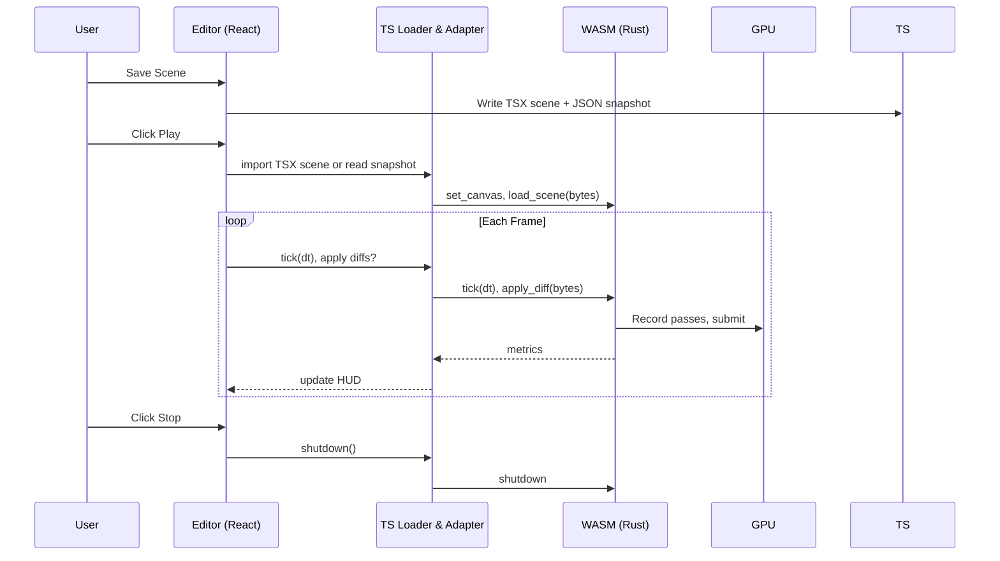

# Native Rust 3D Renderer Plan

🧠 Planning documents standards rule loaded!

## 1. Overview

- **Context & Goals**

  - Keep the GUI/editor in React + three.js/r3f for authoring and previews.
  - Create a **native desktop runtime** using Rust/wgpu for maximum performance (Vulkan/Metal/DX12).
  - Treat saved TSX scene files in `src/game/scenes/*` (e.g., `exampleMultiFile.tsx`) as source of truth; native runtime loads the same scene data via file import.
  - Generate a neutral runtime artifact on Save: human‑readable JSON snapshot (dev) and optional compact binary (perf).

- **Current Pain Points**
  - JS rendering (r3f) performance is inadequate for complex scenes; GC/allocations create stuttering.
  - Need **native performance** with direct hardware access (Vulkan/Metal/DX12).
  - Limited GPU instrumentation and frame pacing controls in web-based rendering.

## 2. Proposed Solution

- **High‑level Summary**

  - Build a **native desktop application** using Rust/wgpu with Vulkan/Metal/DX12 backends for maximum performance.
  - Use **bevy ECS** for high-performance entity management in the runtime.
  - Keep TS/BitECS authoritative for authoring. On Save, write `*.scene.json` snapshot (and optional `.postcard` binary). Native runtime loads scene files directly.
  - **Two separate applications**: React editor (r3f) for authoring + native Rust runtime for play.
  - File-based communication: editor exports scenes, native runtime imports and renders them.

- **Architecture & Directory Structure**

```
/ (repo root)
├── docs/
│   └── rust-renderer-integration.md   # this plan
├── rust/
│   ├── Cargo.toml                     # native desktop app
│   └── src/
│       ├── main.rs                     # native app entry point + windowing
│       ├── renderer/
│       │   ├── mod.rs
│       │   ├── wgpu.rs                # native wgpu renderer
│       │   └── pipelines.rs
│       ├── scene/
│       │   ├── mod.rs
│       │   ├── loader.rs              # load JSON/binary snapshots
│       │   └── types.rs               # serde scene data structures
│       └── ecs/
│           └── mod.rs                  # bevy ECS integration (optional)
└── src/
    └── core/
        └── lib/
            ├── rendering/
            │   └── rust/
            │       ├── SceneExporter.ts      # export TSX scenes to JSON snapshots
            │       ├── types.ts              # zod schemas for scene data
            │       └── fileWatcher.ts       # watch for scene file changes
            └── serialization/               # existing SceneSerializer (reuse)
```

## 3. Implementation Plan

- **Phase 1: Native App Foundation (1 day)**

  1. Create native Rust application with `winit` for cross-platform windowing and event handling.
  2. Set up `wgpu` with native backends (Vulkan/Metal/DX12) for maximum performance.
  3. Implement basic window creation, surface setup, and render loop with `winit` + `wgpu`.

- **Phase 2: Scene Data Pipeline (1 day)**

  1. Implement TS `SceneExporter.ts` to export TSX scenes to `*.scene.json` snapshots on Save.
  2. Create Rust scene loader with `serde` to deserialize JSON/binary scene files.
  3. Set up file watching for hot-reload during development (optional).

- **Phase 3: bevy ECS Integration (1 day)**

  1. Integrate `bevy` ECS for high-performance entity management in the runtime.
  2. Map TS/BitECS components to bevy components with zero-copy where possible.
  3. Implement ECS systems for transform updates, physics, and rendering.

- **Phase 4: Native Renderer Core (2 days)**

  1. Implement `wgpu` render pipelines: PBR, shadows, post-processing with native performance.
  2. Resource management: meshes, materials, textures with GPU residency and culling.
  3. Camera system with smooth interpolation and multiple viewport support.
  4. Frame pacing and vsync control for consistent 60+ FPS.

- **Phase 5: Editor Integration (1 day)**

  1. Set up file-based communication: editor exports scenes, native app imports and renders.
  2. Implement scene hot-reload for development workflow.
  3. Add command-line arguments for scene selection and rendering options.

- **Phase 6: Performance & Polish (1 day)**

  1. Integrate `tracing` for performance profiling and debugging.
  2. Add GPU timing queries and performance metrics display.
  3. Optimize resource loading and memory management for large scenes.

## 4. File and Directory Structures

```markdown
/rust/
├── Cargo.toml # Native desktop application
└── src/
├── main.rs # Application entry point + windowing
├── renderer/
│ ├── mod.rs
│ ├── wgpu.rs # Native wgpu renderer
│ └── pipelines.rs # Render pipelines
├── scene/
│ ├── mod.rs
│ ├── loader.rs # Load JSON/binary snapshots
│ └── types.rs # Serde scene data structures
└── ecs/
└── mod.rs # bevy ECS integration (optional)

/src/core/lib/rendering/rust/
├── SceneExporter.ts # Export TSX scenes to JSON snapshots
├── types.ts # Zod schemas for scene data
└── fileWatcher.ts # Watch for scene file changes
```

## 5. Technical Details

### Rust Crates & Dependencies (SOTA)

```toml
# rust/Cargo.toml (native desktop application)
[package]
name = "vibe-coder-3d"
version = "0.1.0"
edition = "2021"

[dependencies]
# Windowing and event handling
winit = { version = "0.29", features = ["rwh_05"] }

# Graphics - native backends (Vulkan/Metal/DX12)
wgpu = "0.20"

# Math library with SIMD optimization
glam = "0.27"

# Serialization
serde = { version = "1", features = ["derive"] }
serde_json = "1"
postcard = { version = "1", features = ["use-std"] }

# ECS for runtime (high performance)
bevy = { version = "0.13", default-features = false, features = [
    "bevy_core_pipeline",
    "bevy_pbr",
    "bevy_sprite",
    "bevy_text",
    "bevy_ui",
    "bevy_winit",
    "bevy_gltf",
    "bevy_scene",
    "tonemapping_luts",
    "default_font",
] }

# Error handling
thiserror = "1"
anyhow = "1"

# Logging and profiling
tracing = "0.1"
tracing-subscriber = { version = "0.3", features = ["env-filter"] }

# File watching for hot reload
notify = { version = "6", default-features = false, features = ["macos_kqueue"] }

# Utility crates
bytemuck = { version = "1", features = ["derive"] }

[profile.release]
opt-level = 3
debug = false
strip = true
lto = true
codegen-units = 1
panic = "abort"
```

### WASM FFI Surface (Rust)

```rust
// rust/crates/vibe_wasm/src/lib.rs
use wasm_bindgen::prelude::*;
use web_sys::HtmlCanvasElement;
use vibe_renderer::Renderer;
use vibe_scene::{SceneSnapshot, SceneDiff};

static mut RENDERER: Option<Renderer> = None;

#[wasm_bindgen]
pub fn init() {
    console_error_panic_hook::set_once();
    tracing_wasm::set_as_global_default();
}

#[wasm_bindgen]
pub fn set_canvas(canvas: HtmlCanvasElement) -> Result<(), JsValue> {
    let renderer = Renderer::from_canvas(canvas).map_err(|e| JsValue::from_str(&format!("{e}")))?;
    unsafe { RENDERER = Some(renderer); }
    Ok(())
}

#[wasm_bindgen]
pub fn resize(width: u32, height: u32) {
    unsafe { if let Some(r) = RENDERER.as_mut() { r.resize(width, height); } }
}

#[wasm_bindgen]
pub fn load_scene(bytes: &[u8]) -> Result<(), JsValue> {
    let snapshot: SceneSnapshot = postcard::from_bytes(bytes)
        .map_err(|e| JsValue::from_str(&format!("decode: {e}")))?;
    unsafe { if let Some(r) = RENDERER.as_mut() { r.load_snapshot(snapshot).map_err(to_js)?; } }
    Ok(())
}

#[wasm_bindgen]
pub fn apply_diff(bytes: &[u8]) -> Result<(), JsValue> {
    let diff: SceneDiff = postcard::from_bytes(bytes)
        .map_err(|e| JsValue::from_str(&format!("decode: {e}")))?;
    unsafe { if let Some(r) = RENDERER.as_mut() { r.apply_diff(diff).map_err(to_js)?; } }
    Ok(())
}

#[wasm_bindgen]
pub fn update_input(_bytes: &[u8]) { /* optional: input state */ }

#[wasm_bindgen]
pub fn tick(dt_seconds: f32) { unsafe { if let Some(r) = RENDERER.as_mut() { r.tick(dt_seconds); } } }

#[wasm_bindgen]
pub fn read_metrics() -> JsValue { JsValue::from_str("{\"fps\":0}") }

#[wasm_bindgen]
pub fn shutdown() { unsafe { RENDERER = None; } }

fn to_js<E: std::fmt::Display>(e: E) -> JsValue { JsValue::from_str(&format!("{e}")) }
```

### TS Adapter, Scene Loader & Types

```ts
// src/core/lib/rendering/rust/types.ts
import { z } from 'zod';

export const RenderEntitySchema = z.object({
  id: z.number(),
  meshId: z.string(),
  materialId: z.string(),
  transform: z.object({ m: z.array(z.number()).length(16) }),
});

export const SceneSnapshotSchema = z.object({
  entities: z.array(RenderEntitySchema),
  materials: z.array(z.any()),
  textures: z.array(z.any()).optional(),
  lights: z.array(z.any()).optional(),
  camera: z.object({ view: z.array(z.number()).length(16), proj: z.array(z.number()).length(16) }),
});

export type ISceneSnapshot = z.infer<typeof SceneSnapshotSchema>;
```

```ts
// src/core/lib/rendering/rust/sceneLoader.ts
import { z } from 'zod';

export const SceneModuleSchema = z.object({ default: z.any().optional() }).passthrough();
export async function loadSceneModule(path: string): Promise<any> {
  // Dynamic import of TSX scene (e.g., '@/game/scenes/exampleMultiFile')
  const mod = await import(/* @vite-ignore */ path);
  return SceneModuleSchema.parse(mod);
}
```

```ts
// src/core/lib/rendering/rust/ecsBridge.ts
import { type ISceneSnapshot } from './types';
import { serializeWorld } from '@/core/lib/serialization/SceneSerializer';

export function makeRenderSnapshotFromWorld(): ISceneSnapshot {
  const scene = serializeWorld({ compressionEnabled: true });
  return {
    entities: scene.entities.map((e) => ({
      id: e.id,
      meshId: e.components.MeshRenderer?.meshId ?? 'missing',
      materialId: e.components.MeshRenderer?.materialId ?? 'default',
      transform: { m: (e.components.Transform?.matrix as number[]) ?? new Array(16).fill(0) },
    })),
    materials: scene.materials,
    textures: [],
    lights: [],
    camera: { view: new Array(16).fill(0), proj: new Array(16).fill(0) },
  } as ISceneSnapshot;
}
```

```ts
// src/core/lib/rendering/rust/wasmLoader.ts
let modPromise: Promise<any> | null = null;
export const loadWasm = (): Promise<any> => {
  if (!modPromise) modPromise = import('vibe_wasm'); // via vite-plugin-rsw
  return modPromise;
};
```

```ts
// src/core/lib/rendering/rust/RustRenderer.ts
import { loadWasm } from './wasmLoader';
import { SceneSnapshotSchema, type ISceneSnapshot } from './types';

async function encodePostcard(_snapshot: ISceneSnapshot): Promise<Uint8Array> {
  // Placeholder: encode snapshot to binary; implement via wasm helper or TS encoder
  return new Uint8Array();
}

export const RustRenderer = {
  module: null as any,
  canvas: null as HTMLCanvasElement | null,

  async init(canvas: HTMLCanvasElement) {
    this.module = await loadWasm();
    this.module.init();
    this.canvas = canvas;
    await this.module.set_canvas(canvas);
  },

  async loadSnapshot(snapshot: ISceneSnapshot) {
    const valid = SceneSnapshotSchema.parse(snapshot);
    const bytes = await encodePostcard(valid);
    await this.module.load_scene(bytes);
  },

  async applyDiff(diffBytes: Uint8Array) {
    await this.module.apply_diff(diffBytes);
  },
  resize(width: number, height: number) {
    this.module?.resize(width, height);
  },
  tick(dt: number) {
    this.module?.tick(dt);
  },
  shutdown() {
    this.module?.shutdown();
  },
};
```

### Vite Integration

```ts
// vite.config.ts (snippet)
import rsw from 'vite-plugin-rsw';

export default defineConfig({ plugins: [rsw()] });
```

## 6. Usage Examples

- **Start Rust renderer on Play**

```ts
import { RustRenderer } from '@/core/lib/rendering/rust/RustRenderer';
import { makeRenderSnapshotFromWorld } from '@/core/lib/rendering/rust/ecsBridge';

async function onPlay(canvas: HTMLCanvasElement) {
  await RustRenderer.init(canvas);
  const snapshot = makeRenderSnapshotFromWorld();
  await RustRenderer.loadSnapshot(snapshot);
}
```

- **Handoff between r3f and Rust**

```tsx
{
  isPlaying ? (
    <canvas id="play-canvas" className="absolute inset-0" />
  ) : (
    <Canvas>{/* editor view */}</Canvas>
  );
}
```

- **Load saved TSX scene (same source as editor)**

```ts
import { loadSceneModule } from '@/core/lib/rendering/rust/sceneLoader';

const mod = await loadSceneModule('@/game/scenes/exampleMultiFile');
// Convert to snapshot via existing serializers or direct normalization, then load into Rust.
```

## 7. Testing Strategy

- **Unit Tests (Rust)**: postcard decoding; resource cache add/update/remove; culling math with `glam`.
- **WASM Tests**: `wasm-bindgen-test` for `init`, `set_canvas`, `load_scene`, `tick`, `shutdown`.
- **Integration (TS)**: Play/Pause/Stop toggle; TSX scene import to snapshot; diff streaming minimality.

## 8. Edge Cases

| Edge Case             | Remediation                                                        |
| --------------------- | ------------------------------------------------------------------ |
| WebGPU not available  | Fallback to r3f; show compatibility banner already present.        |
| Very large scenes     | Instance batching; BVH/frustum culling; streamed resource uploads. |
| Canvas resize / HiDPI | Observe resize; update surface config; devicePixelRatio aware.     |
| Assets not yet loaded | Defer entity until handle valid; use proxy placeholder.            |
| Background tabs       | Reduce tick rate; respect rAF cadence.                             |
| Input focus conflicts | Route input only to active renderer; disable editor binds in Play. |
| Memory pressure       | Drop caches on Stop; recycle buffers; avoid leaks.                 |

## 9. Sequence Diagram



## 10. Risks & Mitigations

| Risk                             | Mitigation                                                 |
| -------------------------------- | ---------------------------------------------------------- |
| Browser API/platform differences | Pin `wgpu`; feature‑gate; maintain r3f fallback.           |
| Payload overhead                 | Compact binary (postcard); diff streaming; stable handles. |
| Shader maintenance               | Centralize WGSL; start with PBR‑lite; add shader tests.    |
| Build/CI complexity              | Use `vite-plugin-rsw`; cache toolchains; document steps.   |
| Input routing conflicts          | Single focus source; disable editor shortcuts in Play.     |

## 11. Timeline

- Total: ~7 days
  - Phase 1: 0.5 day
  - Phase 2: 0.5 day
  - Phase 3: 1.0 day
  - Phase 4: 1.0 day
  - Phase 5: 2.0 days
  - Phase 6: 1.0 day
  - Phase 7: 1.0 day

## 12. Acceptance Criteria

- On Save, TSX scenes produce JSON snapshots under `src/game/scenes/.snapshots/`; on Play, Rust reads the same content via TS loader or direct JSON.
- Play toggles Rust canvas in the viewport; r3f is hidden and restored on Stop.
- Scene snapshot parity with editor’s last frame (camera/materials) within tolerance.
- Smooth 60 FPS on WebGPU devices; metrics visible in the editor.
- Clean fallback to r3f when WebGPU is unavailable.

## 13. Conclusion

The Rust/WASM renderer reads the same TSX scene definitions used by the editor, while a generated JSON snapshot provides a stable, debuggable runtime contract (with an optional binary for performance). This preserves the authoring flow and unlocks modern GPU features and diagnostics.

## 14. Assumptions & Dependencies

- TSX scene modules under `src/game/scenes/*` are canonical on Save.
- TS remains the authoritative ECS for gameplay; Rust manages render resources only.
- Libraries/Tools: `wgpu`, `glam`, `serde`, `serde_json`, `postcard`, `wasm-bindgen`, `web-sys`, `tracing`, `tracing-wasm`, `bytemuck`, `vite-plugin-rsw`, optional `bevy_ecs`.
- Gitignore guidance: ignore `src/game/scenes/.snapshots/*.scene.json` and `*.scene.postcard` by default; publish via CI artifacts if needed.
