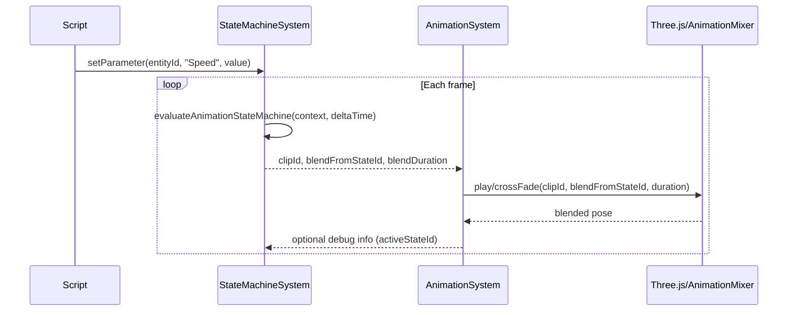

## Animation State Machine & Graph Editor – Phase 1 (2 days)

## 1. Overview

### 1.1 Context & Goals

- **Engine-level animation state machine**: Introduce a reusable, JSON-serializable animation state machine that replaces ad-hoc script-based state logic (as seen in `Time API` examples) with a first-class engine feature.
- **Visual graph editor**: Provide a graph-based editor (panel) for authoring animation state machines with states, transitions, and parameters, aligned with the existing `TimelinePanel` UX and design language.
- **Runtime integration**: Connect the state machine runtime to the existing `AnimationSystem` so animation clips and blends are driven by state transitions instead of hard-coded script logic.
- **Foundation for future phases**: Lay groundwork that can be extended by later phases (blending, layers, IK, etc.) and by the broader Animator Controller system without rework.

### 1.2 Current Pain Points

- **No built-in state machine**: The animation stack lacks a graph-based state machine; transitions are either manual script logic (`time-api` example) or not available at all (`animation-timeline-80-percent-coverage-prd.md` explicitly calls out “No State Machine”).
- **Poor authoring UX**: Designers cannot see or edit animation logic as a graph—there is no equivalent to Unity’s Animator window; only the timeline and script code exist.
- **No shared asset model**: There is no standardized, Zod-validated schema for animation states, transitions, and parameters that can be serialized, versioned, and reused across entities and scenes.
- **Difficult debugging**: Without a runtime-aware graph, debugging state transitions and deadlocks requires reading scripts and logs instead of inspecting a visual diagram.

## 2. Proposed Solution

### 2.1 High‑level Summary

- **State machine data model**: Define Zod schemas and TypeScript interfaces (`IAnimationStateMachine`, `IAnimationState`, `IStateTransition`, `IAnimationParameter`) for animation state machines, stored as part of the animation component/asset layer.
- **State machine runtime system**: Implement an `AnimationStateMachineSystem` that evaluates transitions each frame, tracks active state per entity, and outputs target clip IDs and cross-fade metadata to the existing `AnimationSystem`.
- **Graph editor panel**: Add an `AnimatorPanel` editor panel with a visual graph (states as nodes, transitions as edges) plus a parameter panel, following the existing panel architecture and theming (similar to `TimelinePanel`).
- **Scene & asset integration**: Serialize state machines into scene JSON / animation assets, load them into runtime components, and expose minimal script API hooks (e.g. `setAnimationParameter`) for gameplay code.
- **Rust parity stub**: Add a thin `state_machine.rs` module that mirrors the core evaluation algorithm so a Rust runtime can be implemented incrementally without blocking the TS editor/runtime work.

### 2.2 Architecture & Directory Structure

```text
/src/core/components/animation/
  AnimationComponent.ts                  # Existing clip/timeline data (unchanged in Phase 1)
  StateMachineComponent.ts               # NEW: Zod schema + component data for animation state machines

/src/core/lib/animation/
  StateMachineSchema.ts                  # NEW: Zod schemas + TS interfaces for state machines
  StateMachineRuntime.ts                 # NEW: Pure logic for state evaluation & transition resolution

/src/core/systems/
  AnimationSystem.ts                     # Existing animation playback system
  AnimationStateMachineSystem.ts         # NEW: ECS system driving AnimationSystem based on state machine

/src/editor/store/
  animatorStateMachineStore.ts           # NEW: Zustand store for editor-side graph/parameter editing state

/src/editor/components/panels/AnimatorPanel/
  AnimatorPanel.tsx                      # NEW: Main animation state machine graph editor panel
  components/
    StateNode.tsx                        # NEW: Visual representation of a state node
    TransitionEdge.tsx                   # NEW: SVG/canvas edge between states with condition labels
    ParameterPanel.tsx                   # NEW: List/edit animation parameters used by the state machine
  hooks/
    useStateMachineGraph.ts              # NEW: Graph manipulation (add/remove/move nodes, edges)
    useStateMachineSelection.ts          # NEW: Selection + inspector wiring

/rust/engine/animation/
  state_machine.rs                       # NEW: Rust equivalent of StateMachineRuntime (MVP parity)
```

## 3. Implementation Plan

### Phase 1.A: Data Model & Schemas (0.25 day)

1. **Define core schemas** in `StateMachineSchema.ts` using Zod:
   - `IAnimationParameter` (name, type: float/int/bool/trigger, defaultValue).
   - `IStateTransition` (id, fromStateId, toStateId, conditions, duration, hasExitTime, exitTime).
   - `IAnimationState` (id, name, type: `clip | empty`, clipId, graph position, playback settings).
   - `IAnimationStateMachine` (id, name, parameters, states, transitions, defaultStateId).
2. **Component-level wrapper** in `StateMachineComponent.ts`:
   - `IAnimationStateMachineComponent` with a reference to a state machine asset or inline state machine data.
   - Register the component with the existing component registry and ensure it participates in serialization.
3. **Validation & ergonomics**:
   - Add helper functions: `createEmptyStateMachine`, `createState`, `createTransition`, `createParameter`.
   - Ensure schema defaults prevent invalid graphs (e.g. empty arrays default to `[]`).

### Phase 1.B: State Machine Runtime (0.5 day)

1. Implement `StateMachineRuntime.ts` as a pure, framework-free module:
   - `evaluateAnimationStateMachine(context)` that:
     - Resolves the current state (or default).
     - Evaluates transitions in deterministic order based on parameter values and exit times.
     - Computes the next active state and cross-fade metadata (duration, source/target states).
   - Support float/int comparisons (`>`, `<`, `==`, `!=`) and bool/trigger conditions.
2. Add parameter management helpers:
   - `setAnimationParameter(machine, name, value)` that updates `parameters` and can be reused by script API and editor previews.
3. Model output for the `AnimationSystem`:
   - Return `clipId`, `normalizedTime`, and `blendWeight` information suitable for mapping into `AnimationSystem`’s existing playback API.

### Phase 1.C: ECS System Integration (0.25 day)

1. Implement `AnimationStateMachineSystem.ts`:
   - Query entities that have both `AnimationComponent` and `StateMachineComponent`.
   - For each entity, build an evaluation context and call `evaluateAnimationStateMachine`.
   - Apply returned clip and blend instructions via `AnimationSystem` (e.g. `playClip`, `crossFadeClip`).
2. Integrate into the game loop:
   - Register the system in the main systems pipeline (after input, before rendering).
   - Ensure execution runs in play mode and respects existing `isPlaying` flags.
3. Add a minimal script-facing API surface:
   - Extend the script context with an `animationState` API exposing `setParameter`, `getParameter`, and `getCurrentStateId`.

### Phase 1.D: Graph Editor Panel (1.0 day)

1. Create `AnimatorPanel.tsx` under `src/editor/components/panels/AnimatorPanel`:
   - Panel shell reusing layout patterns from `TimelinePanel` (header, toolbar region, scrollable content).
   - Toggle visibility via an editor menu action or animation component context menu.
2. Implement graph drawing:
   - Use a minimal graph implementation (optionally React Flow, or a lightweight custom SVG/canvas) to render nodes and edges.
   - Support basic operations: add state, delete state, add transition, delete transition, drag to reposition nodes.
3. Parameter panel:
   - Display a list of parameters with type badges and default value editors.
   - Validate uniqueness of parameter names and surface conflicts used in transitions.
4. Selection and inspector wiring:
   - Allow selecting a state or transition to edit its properties (name, clip binding, transition duration, conditions).
   - Mirror selection state in the Zustand store so other editor components (e.g. inspector) can hook in later.

### Phase 1.E: Serialization, Testing & Polish (0.0–0.25 day)

1. **Scene and asset wiring**:
   - Ensure state machines serialize into scene JSON alongside other animation data and reload correctly.
   - Add CLI/editor commands or menu options to create/clone/delete state machines.
2. **Diagnostics**:
   - Log warnings for invalid graphs at load-time (no default state, unreachable states, missing clips).
   - Highlight load-time issues in the editor using non-blocking toasts or status badges.
3. **Smoke tests**:
   - Validate a simple locomotion graph (Idle → Walk → Run) works end-to-end via the panel and runtime.

> **Total estimated time:** ~2.0 days (0.25 + 0.5 + 0.25 + 1.0 + light buffer).

## 4. File and Directory Structures

```text
/src/core/components/animation/
  AnimationComponent.ts
  StateMachineComponent.ts

/src/core/lib/animation/
  StateMachineSchema.ts
  StateMachineRuntime.ts

/src/core/systems/
  AnimationSystem.ts
  AnimationStateMachineSystem.ts

/src/editor/store/
  animatorStateMachineStore.ts

/src/editor/components/panels/AnimatorPanel/
  AnimatorPanel.tsx
  components/
    StateNode.tsx
    TransitionEdge.tsx
    ParameterPanel.tsx
  hooks/
    useStateMachineGraph.ts
    useStateMachineSelection.ts

/rust/engine/animation/
  state_machine.rs
```

## 5. Technical Details

### 5.1 Core Schemas (`StateMachineSchema.ts`)

```ts
import { z } from 'zod';

export const AnimationParameterTypeSchema = z.enum(['float', 'int', 'bool', 'trigger']);
export type IAnimationParameterType = z.infer<typeof AnimationParameterTypeSchema>;

export const AnimationParameterSchema = z.object({
  id: z.string(),
  name: z.string(),
  type: AnimationParameterTypeSchema,
  defaultFloat: z.number().optional(),
  defaultInt: z.number().int().optional(),
  defaultBool: z.boolean().optional(),
});
export type IAnimationParameter = z.infer<typeof AnimationParameterSchema>;

export const StateTransitionConditionSchema = z.object({
  id: z.string(),
  parameterName: z.string(),
  operator: z.enum(['>', '<', '==', '!=', '>=', '<=', 'isTrue', 'isFalse']),
  valueFloat: z.number().optional(),
  valueInt: z.number().int().optional(),
});
export type IStateTransitionCondition = z.infer<typeof StateTransitionConditionSchema>;

export const StateTransitionSchema = z.object({
  id: z.string(),
  fromStateId: z.string(),
  toStateId: z.string(),
  duration: z.number().nonnegative().default(0.25),
  hasExitTime: z.boolean().default(false),
  exitTime: z.number().min(0).max(1).optional(),
  conditions: z.array(StateTransitionConditionSchema).default([]),
});
export type IStateTransition = z.infer<typeof StateTransitionSchema>;

export const AnimationStateSchema = z.object({
  id: z.string(),
  name: z.string(),
  type: z.enum(['clip', 'empty']),
  clipId: z.string().optional(),
  position: z.tuple([z.number(), z.number()]).default([0, 0]),
  speed: z.number().positive().default(1),
  loop: z.boolean().default(true),
});
export type IAnimationState = z.infer<typeof AnimationStateSchema>;

export const AnimationStateMachineSchema = z.object({
  id: z.string(),
  name: z.string(),
  parameters: z.array(AnimationParameterSchema).default([]),
  states: z.array(AnimationStateSchema),
  transitions: z.array(StateTransitionSchema),
  defaultStateId: z.string(),
});
export type IAnimationStateMachine = z.infer<typeof AnimationStateMachineSchema>;
```

### 5.2 Component Wrapper (`StateMachineComponent.ts`)

```ts
import { z } from 'zod';
import type { IAnimationStateMachine } from '@core/lib/animation/StateMachineSchema';

export const AnimationStateMachineComponentSchema = z.object({
  stateMachineId: z.string().optional(), // Reference to shared asset
  stateMachine: AnimationStateMachineSchema.optional(), // Inline definition (editor-time)
  activeStateId: z.string().optional(),
  normalizedTime: z.number().min(0).max(1).default(0),
});

export type IAnimationStateMachineComponentData = z.infer<
  typeof AnimationStateMachineComponentSchema
>;

export interface IAnimationStateMachineComponent {
  type: 'ANIMATION_STATE_MACHINE';
  data: IAnimationStateMachineComponentData;
}
```

### 5.3 Runtime Evaluation (`StateMachineRuntime.ts`)

```ts
import type {
  IAnimationStateMachine,
  IAnimationState,
  IStateTransition,
} from './StateMachineSchema';

export interface IStateMachineParameters {
  floats: Record<string, number>;
  ints: Record<string, number>;
  bools: Record<string, boolean>;
}

export interface IStateMachineContext {
  stateMachine: IAnimationStateMachine;
  activeStateId?: string;
  timeInState: number;
  parameters: IStateMachineParameters;
}

export interface IStateMachineEvaluationResult {
  activeState: IAnimationState | null;
  nextState: IAnimationState | null;
  clipId: string | null;
  blendFromStateId?: string;
  blendDuration?: number;
}

export const evaluateAnimationStateMachine = (
  context: IStateMachineContext,
  deltaTime: number,
): IStateMachineEvaluationResult => {
  // 1) Resolve active state (or default)
  // 2) Evaluate conditions for outgoing transitions
  // 3) Select first valid transition based on priority
  // 4) Return next state + clip info + blending metadata
  return {
    activeState: null,
    nextState: null,
    clipId: null,
  };
};
```

### 5.4 ECS System (`AnimationStateMachineSystem.ts`)

```ts
export const updateAnimationStateMachineSystem = (deltaTime: number, isPlaying: boolean): void => {
  if (!isPlaying) {
    return;
  }

  // 1) Query entities with AnimationComponent + StateMachineComponent
  // 2) Build IStateMachineContext per entity
  // 3) Call evaluateAnimationStateMachine
  // 4) Drive AnimationSystem with returned clipId + blending data
};
```

### 5.5 Graph Editor Panel (`AnimatorPanel.tsx`)

```tsx
import React from 'react';
import { useAnimatorStateMachineStore } from '@editor/store/animatorStateMachineStore';
import { StateNode } from './components/StateNode';
import { TransitionEdge } from './components/TransitionEdge';
import { ParameterPanel } from './components/ParameterPanel';

export const AnimatorPanel: React.FC = () => {
  const { graph, selectedId } = useAnimatorStateMachineStore();

  return (
    <div className="flex h-full bg-[#1B1C1F]">
      <div className="w-64 border-r border-cyan-900/30">
        <ParameterPanel />
      </div>
      <div className="flex-1 relative overflow-hidden">
        {/* Graph canvas */}
        <svg className="w-full h-full">
          {/* Render transitions first */}
          {graph.transitions.map((transition) => (
            <TransitionEdge key={transition.id} transition={transition} />
          ))}
          {/* Render states on top */}
          {graph.states.map((state) => (
            <StateNode key={state.id} state={state} isSelected={state.id === selectedId} />
          ))}
        </svg>
      </div>
    </div>
  );
};
```

### 5.6 Rust Runtime Stub (`state_machine.rs`)

```rust
pub struct AnimationStateMachineContext {
    pub state_machine_id: String,
    pub active_state_id: Option<String>,
    pub time_in_state: f32,
    // Parameter maps will be added in later phases
}

pub struct AnimationStateMachineResult {
    pub active_state_id: Option<String>,
    pub next_state_id: Option<String>,
    pub clip_id: Option<String>,
}

pub fn evaluate_animation_state_machine(
    context: &AnimationStateMachineContext,
    delta_time: f32,
) -> AnimationStateMachineResult {
    // Mirror core transition logic from TS implementation (phase 1 parity)
    AnimationStateMachineResult {
        active_state_id: context.active_state_id.clone(),
        next_state_id: None,
        clip_id: None,
    }
}
```

### 5.7 UI Integration

- **Editor panel registration**:
  - Register `AnimatorPanel` within the existing editor panel registry so it appears alongside `TimelinePanel`, `HierarchyPanel`, etc.
  - Add a menu entry and/or hotkey to open the Animator panel when an entity with an animation component is selected.
- **Inspector integration**:
  - From the `AnimationComponent` inspector, provide a “Edit State Machine” button that opens the `AnimatorPanel` focused on the relevant state machine.
  - Display current state machine name and a summary of state count/transition count.
- **Runtime preview**:
  - Optionally, highlight the active state node in the graph during play mode by subscribing to debug data from `AnimationStateMachineSystem`.

## 6. Usage Examples

### 6.1 Defining a Simple Locomotion State Machine

```ts
const playerLocomotionStateMachine: IAnimationStateMachine = {
  id: 'player-locomotion',
  name: 'Player Locomotion',
  parameters: [
    { id: 'speed', name: 'Speed', type: 'float', defaultFloat: 0 },
    { id: 'jump', name: 'Jump', type: 'trigger', defaultBool: false },
  ],
  states: [
    { id: 'idle', name: 'Idle', type: 'clip', clipId: 'idle', position: [0, 0] },
    { id: 'walk', name: 'Walk', type: 'clip', clipId: 'walk', position: [240, 0] },
    { id: 'run', name: 'Run', type: 'clip', clipId: 'run', position: [480, 0] },
  ],
  transitions: [
    {
      id: 'idle-to-walk',
      fromStateId: 'idle',
      toStateId: 'walk',
      duration: 0.2,
      hasExitTime: false,
      conditions: [{ id: 'c1', parameterName: 'Speed', operator: '>', valueFloat: 0.1 }],
    },
    {
      id: 'walk-to-run',
      fromStateId: 'walk',
      toStateId: 'run',
      duration: 0.15,
      hasExitTime: false,
      conditions: [{ id: 'c2', parameterName: 'Speed', operator: '>', valueFloat: 5 }],
    },
  ],
  defaultStateId: 'idle',
};
```

### 6.2 Hooking Up an Entity

```ts
// During scene setup or inspector save
animationStateMachineComponent.data.stateMachine = playerLocomotionStateMachine;

// At runtime, the AnimationStateMachineSystem evaluates transitions
// and calls into AnimationSystem to play the appropriate clips.
```

### 6.3 Driving Parameters from Script

```ts
// Script on player entity
const maxSpeed = 1.0;
let currentSpeed = 0;

function onUpdate(deltaTime: number): void {
  const moveInput = input.getActionValue('Gameplay', 'Move');
  const magnitude = Array.isArray(moveInput) ? Math.hypot(moveInput[0], moveInput[1]) : 0;

  // Accelerate/decelerate
  const targetSpeed = magnitude * maxSpeed;
  const accel = 4.0;
  currentSpeed += (targetSpeed - currentSpeed) * Math.min(1, accel * deltaTime);

  animationState.setParameter('Speed', currentSpeed);
}
```

## 7. Testing Strategy

### 7.1 Unit Tests

- **Schema validation**:
  - `AnimationStateMachineSchema` rejects invalid graphs (missing default state, transitions to unknown states) and accepts valid ones.
  - Parameter definitions with conflicting names are rejected or normalized.
- **Runtime logic**:
  - Transition conditions evaluate correctly for float, int, and bool types.
  - Default state selection works when no active state is provided.
  - Deadlock scenarios (no valid transitions) keep the current state stable.

### 7.2 Integration Tests

- **System integration**:
  - With a simple Idle/Walk/Run graph, confirm that adjusting `Speed` results in correct state transitions and clip changes in `AnimationSystem`.
  - Verify cross-fade durations are respected by the playback system when transitioning between states.
- **Serialization**:
  - Save a state machine via the editor, reload the scene, and confirm the graph structure and parameters match the original asset.
- **Editor interactions**:
  - Ensure creating/deleting states and transitions in `AnimatorPanel` updates the underlying state machine data and passes schema validation.

## 8. Edge Cases

| Edge Case                                   | Remediation                                                                |
| ------------------------------------------- | -------------------------------------------------------------------------- |
| No default state defined                    | Treat the first state as default on load; show a warning badge in editor   |
| Transition references missing state         | Ignore such transitions at runtime; highlight them as errors in the editor |
| Multiple transitions valid at the same time | Use explicit priority ordering; editor UI exposes “priority” field         |
| Parameter referenced but not defined        | Transition is skipped; inspector highlights missing parameter              |
| Empty state machine (no states)             | Runtime becomes a no-op; editor blocks saving until at least one state     |
| Graph with isolated/unreachable states      | Report in diagnostics; optional “Find unreachable states” tool             |
| Trigger parameters never reset              | Automatically reset trigger after single evaluation cycle                  |
| Extremely large graphs (100+ states)        | Warn about complexity; recommend splitting into sub-machines in future     |

## 9. Sequence Diagram



## 10. Risks & Mitigations

| Risk                                                   | Mitigation                                                                             |
| ------------------------------------------------------ | -------------------------------------------------------------------------------------- |
| Overly complex editor UI delays Phase 1                | Start with minimal node/edge editing; defer advanced features (layers, blend trees)    |
| Performance impact when evaluating many state machines | Keep runtime pure and allocation-free; cache lookups; measure in profiler early        |
| Divergence between TS and Rust state machine behaviors | Treat TS as source of truth; add parity tests comparing TS and Rust evaluation results |
| Confusing parameter semantics for users                | Provide clear naming guidelines and tooltips; default templates for common patterns    |
| Graph corruption via invalid edits or partial saves    | Always validate with Zod before save; prevent commit when validation fails             |

## 11. Timeline

- **Phase 1.A (Schemas)**: 0.25 day
- **Phase 1.B (Runtime)**: 0.5 day
- **Phase 1.C (ECS System)**: 0.25 day
- **Phase 1.D (Graph Editor Panel)**: 1.0 day
- **Phase 1.E (Serialization & Polish)**: included as buffer within above tasks

**Total:** ~2.0 days.

## 12. Acceptance Criteria

- **Data model**
  - Animation state machines are defined via Zod schemas and can be created, validated, and serialized.
  - State machines are attached to entities via `StateMachineComponent` and persist in scene JSON.
- **Runtime behavior**
  - A 3-state locomotion graph (Idle/Walk/Run) transitions correctly based on a `Speed` parameter.
  - Cross-fade durations are respected and produce smooth visual results in the viewport.
- **Editor UX**
  - Users can create, edit, and delete states, transitions, and parameters using the `AnimatorPanel`.
  - Graph layout (node positions) persists across save/load.
- **Script integration**
  - Scripts can set and read animation parameters via a dedicated API and see state changes reflected at runtime.
- **Stability**
  - Invalid graphs are rejected at save time with clear error messages; runtime does not crash on malformed data.

## 13. Conclusion

This Phase 1 plan introduces a first-class animation state machine with a visual graph editor, bridging the gap between low-level timeline clips and higher-level gameplay animation logic. By combining a strongly-typed data model, a deterministic runtime system, and an editor-friendly graph interface, it enables designers and programmers to collaborate around reusable animation graphs while laying a solid foundation for future blending, layering, and advanced animation features.

## 14. Assumptions & Dependencies

- **Existing animation stack**: `AnimationSystem` and `AnimationComponent` already exist and expose APIs for playing clips and managing blends, as described in the animation PRDs.
- **ECS & game loop**: The ECS world and game loop (as described in `2-4-ecs-system.md` and `2-16-game-loop.md`) can accommodate a new system step without architectural changes.
- **Editor framework**: The React/RTF editor (panels, Zustand stores, Tailwind-based theming) continues to be the canonical way to add new tooling like `AnimatorPanel`.
- **Zod & path aliases**: Zod remains the preferred schema library, and TypeScript path aliases like `@core/*` and `@editor/*` stay stable.
- **Rust parity**: Rust engine modules under `rust/engine/animation/` will eventually mirror the TS implementation; Phase 1 only introduces a stubbed `state_machine.rs` with minimal logic.
