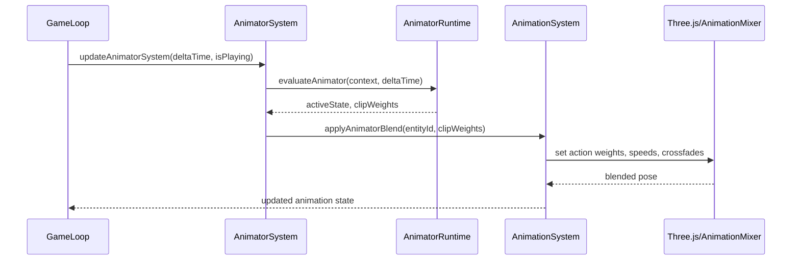

## Animator Controller & 1D Blend Tree System

### Overview

- **Context & Goals**

  - Introduce a Unity-style animator controller for VibeCoder3D that drives character animation via a **parameterized state machine** and **1D blend trees**, layered on top of the core `AnimationSystem` and `AnimationComponent` described in `docs/PRDs/editor/4-15-animation-system-timeline-editor-prd.md`.
  - Provide a **JSON-serializable animator asset** with Zod-validated schemas so animator graphs can be saved, versioned, and shared across scenes and projects.
  - Enable **runtime control via scripts and editor tooling**, exposing a simple API (`setFloat`, `setBool`, `play(stateName)`) while keeping engine integration deterministic and ECS-friendly.
  - Deliver a **three-panel Animator Modal UI** in the editor (Parameters / Graph / Inspector) that mirrors Unity’s ergonomics while respecting VibeCoder3D’s React/Tailwind/RTF architecture.

- **Current Pain Points**
  - No dedicated animator controller; animation is limited to ad-hoc clip control (`useAnimations`) or low-level clip playback, with no reusable state machines or parameter-driven blending.
  - No standardized data model for animator parameters, states, transitions, or blend trees; impossible to serialize locomotion graphs or share locomotion setups between entities.
  - Scripts have no first-class way to drive animation via semantic parameters (e.g. `Speed`, `IsWalking`), forcing direct clip calls and brittle logic.
  - Editor tooling lacks an animator window and 1D blend tree visualization, making complex movement sets (idle/walk/run) difficult to author and preview.

### Proposed Solution

- **High‑level Summary**

  - Add an **AnimatorController asset** (JSON + Zod schema) that defines parameters, states, 1D blend trees, and transitions, decoupled from any specific entity.
  - Introduce an **AnimatorComponent** and **AnimatorSystem** in the ECS layer that evaluate animator graphs each frame and drive the existing `AnimationSystem` through its `IAnimationApi` surface (which internally controls Three.js `AnimationMixer` and timeline clips).
  - Implement a **1D Blend Tree evaluator** that computes per-clip weights from a float parameter and thresholds, supporting nested blend trees and per-motion speed/mirror options.
  - Expose a **script-facing Animator API** (`animator.setFloat`, `animator.setBool`, `animator.play`) integrated into `ScriptAPI` and `script-api.d.ts` so gameplay code can drive animations declaratively.
  - Build a **VibeAnimator Modal UI** (three-panel layout) for editing animator controllers: parameter table on the left, state/graph view in the center, and context-sensitive inspector on the right.

- **Architecture & Directory Structure**

```text
/src/core/
  ├── components/
  │   └── animation/
  │       ├── AnimatorComponent.ts          # ECS component data & Zod schema (on top of AnimationComponent)
  │       └── AnimationBindings.ts          # Helpers to connect animator outputs to AnimationSystem IAnimationApi
  ├── lib/
  │   └── animation/
  │       ├── AnimatorTypes.ts              # Core interfaces & Zod schemas (controller, states, params, transitions)
  │       ├── AnimatorControllerAsset.ts    # Load/save, JSON serialization, versioning
  │       ├── AnimatorRuntime.ts            # Pure functions for state machine + blend tree evaluation
  │       ├── AnimatorStateMachine.ts       # High-level evaluation orchestrator per-entity
  │       ├── BlendTree1D.ts                # 1D blend tree weight calculation, threshold tools
  │       └── AnimatorIntegration.ts        # Bridge to AnimationSystem/AnimationMixer
  └── systems/
      └── AnimatorSystem.ts                 # ECS system updating animator components each frame

/src/editor/
  ├── store/
  │   └── animatorStore.ts                  # Zustand store for animator assets & editor state
  └── components/
      └── animator/
          ├── AnimatorModal.tsx             # Main animator modal (three-panel layout)
          ├── ParametersPanel.tsx           # Left panel: parameters list & values
          ├── GraphView/
          │   ├── AnimatorGraphView.tsx     # Canvas/SVG state machine view
          │   ├── StateNode.tsx             # Idle/Walk/Blend Tree nodes
          │   ├── TransitionCurve.tsx       # Bezier links + labels
          │   └── BlendTreeGraph.tsx        # 1D threshold graph visualization
          ├── InspectorPanel/
          │   ├── StateInspector.tsx        # State properties (clip, speed, loop, etc.)
          │   ├── TransitionInspector.tsx   # Transition conditions & settings
          │   └── BlendTreeInspector.tsx    # Motions, thresholds, speed tools
          └── hooks/
              ├── useAnimatorControllerStore.ts # Editor-facing hooks for reading/writing controllers
              └── useAnimatorPreview.ts         # Live preview integration with viewport
```

### Implementation Plan

#### Phase 0: Prerequisites (Animation System) (dependency)

- Implement (or have implemented) **Phase 1–2** of `4-15-animation-system-timeline-editor-prd.md`:
  - `AnimationComponent` schema and runtime data model (`ClipSchema`, tracks, curves).
  - `AnimationSystem` wired into the game loop, exposing an `IAnimationApi` capable of:
    - Playing clips with cross-fade.
    - Setting clip time, weight, and speed per entity.
  - Basic inspector/editor wiring for `AnimationComponent`.

#### Phase 1: Data Model & Schemas (0.5 day)

1. Create `/src/core/lib/animation/AnimatorTypes.ts` with Zod schemas and interfaces for:
   - Parameters (`Float`, `Bool`, `Int`, `Trigger`).
   - States (clip states, blend tree states, default state flag).
   - 1D Blend Trees (motions, thresholds, nested trees).
   - Transitions (conditions, durations, offsets, exit time flag).
   - AnimatorController root object and versioning.
2. Add `/src/core/components/animation/AnimatorComponent.ts` with `IAnimatorComponent` schema referencing a controller asset and holding current parameter values/state.
3. Extend `KnownComponentTypes` with `'ANIMATOR'` and register the new component in the component registry.

#### Phase 2: Runtime Core (AnimatorRuntime & BlendTree1D) (1.0 day)

1. Implement `/src/core/lib/animation/BlendTree1D.ts` with:
   - Utility to normalize and sort thresholds for a given parameter.
   - Core weight calculation for arbitrary parameter values and N motions (including extrapolation at ends).
   - Helpers for auto-threshold distribution and time-scale tools (reset/homogeneous speed).
2. Implement `/src/core/lib/animation/AnimatorStateMachine.ts` and `/src/core/lib/animation/AnimatorRuntime.ts`:
   - Pure functions to evaluate transitions given current state, parameters, and elapsed time.
   - State entry/exit bookkeeping (for future events) and current/next state tracking.
   - Per-frame evaluation returning **target clip set** (one clip for clip states, multiple for blend trees) with weights and playback speeds.
3. Add `/src/core/lib/animation/AnimatorIntegration.ts` to translate animator outputs into `IAnimationApi` calls on the `AnimationSystem` (no direct `AnimationMixer` access from the animator layer).

#### Phase 3: AnimatorSystem & Engine Loop Integration (0.75 day)

1. Add `/src/core/systems/AnimatorSystem.ts`:
   - Define a BitECS query for entities with `AnimatorComponent` (and optionally an `AnimationComponent` once available).
   - For each entity in the query:
     - Fetch controller and component state.
     - Evaluate the state machine and blend trees for the current frame.
     - Apply resulting clip weights/speeds via `AnimatorIntegration` using the game loop’s `deltaTime`.
2. Wire `AnimatorSystem` into the game loop (similar to `ScriptSystem`) so it runs in play mode and optionally in editor preview mode.
3. Expose minimal stats getters (`getAnimatorSystemStats`) mirroring `getScriptSystemStats` for profiling and debugging.

#### Phase 4: Animator Asset Store & Serialization (0.5 day)

1. Implement `/src/core/lib/animation/AnimatorControllerAsset.ts`:
   - `loadAnimatorController(json: unknown): IAnimatorController` using Zod.
   - `serializeAnimatorController(controller: IAnimatorController): unknown` with version stamps.
2. Add `/src/editor/store/animatorStore.ts`:
   - Track a list of animator assets by name/ID and current selection.
   - Provide CRUD operations (create, clone, delete, rename) with undo/redo integration hooks.
3. Integrate animator controllers into existing scene/asset persistence so scenes can reference animator assets by ID or path.

#### Phase 5: Animator Modal UI (Parameters / Graph / Inspector) (1.0 day)

1. Implement `AnimatorModal.tsx` as a fullscreen (or large) modal modeled on `InputSettingsModal`, with:
   - Header (title, description, close).
   - Three-panel body: Parameters (left), Graph View (center), Inspector (right).
   - Footer with current asset name and basic actions (Save/Close).
2. Implement `ParametersPanel.tsx`:
   - Parameter list with type badges, default values, and inline editors (float/int inputs, toggle for bool, button for trigger).
   - Context menu for creating/renaming/deleting parameters with conflict warnings if referenced in conditions or blend trees.
3. Implement `AnimatorGraphView.tsx` and supporting components:
   - Canvas/SVG-based state nodes (default, clip, blend tree) with draggable positions.
   - Transitions drawn as Bezier curves with condition labels.
   - Double-click to enter blend tree sub-graph; breadcrumb to navigate back.
4. Implement `BlendTreeGraph.tsx`:
   - 1D visual graph with thresholds as draggable markers and a live parameter position line.
   - Motion list with per-motion clip picker, threshold, speed, mirror toggles.
5. Implement Inspector components:
   - `StateInspector.tsx` for clip/blend tree states (name, motion, speed, loop, cycle offset, transitions list).
   - `TransitionInspector.tsx` for conditions and transition settings (duration, offset, has exit time).
   - `BlendTreeInspector.tsx` for 1D blend tree configuration (parameter dropdown, automate thresholds, compute thresholds mode, reset/homogeneous speed).

#### Phase 6: Scripting API & Preview Hooks (0.5 day)

1. Extend `ScriptAPI` and `script-api.d.ts` with an `IAnimatorAPI`:
   - `setFloat`, `setBool`, `setInt`, `setTrigger`, `getFloat`, `getBool`, `getInt`.
   - `play(stateName: string)`, `getCurrentState(): string | null`.
2. Implement an adapter in the script context factory to route script calls to `AnimatorComponent` mutations and `AnimatorSystem`.
3. Implement `useAnimatorPreview.ts` in the editor:
   - Connect the Animator Modal’s parameter slider to the runtime animator for preview when in play mode or editor preview mode.

#### Phase 7: Testing, Diagnostics & Polish (0.75 day)

1. Add unit tests for `BlendTree1D`, `AnimatorRuntime`, and Zod schemas.
2. Add integration tests (where feasible) for:
   - A simple idle ↔ move state machine driven by a `Speed` parameter.
   - Blend tree mixing correctness for 2–3 motions and nested trees.
3. Implement basic diagnostics:
   - Highlight active state and transitions in the graph during playback.
   - Show per-motion weights in the blend tree inspector/graph.
4. Performance tuning:
   - Avoid allocations in hot paths; memoize thresholds and parameter lookups per controller.
   - Ensure animator evaluation stays within target frame budget (e.g. \< 0.1 ms per entity for typical graphs).

### File and Directory Structures

```text
/src/core/components/animation/
  AnimatorComponent.ts
  AnimationBindings.ts

/src/core/lib/animation/
  AnimatorTypes.ts
  AnimatorControllerAsset.ts
  AnimatorRuntime.ts
  AnimatorStateMachine.ts
  BlendTree1D.ts
  AnimatorIntegration.ts

/src/core/systems/
  AnimatorSystem.ts

/src/editor/store/
  animatorStore.ts

/src/editor/components/animator/
  AnimatorModal.tsx
  ParametersPanel.tsx
  GraphView/
    AnimatorGraphView.tsx
    StateNode.tsx
    TransitionCurve.tsx
    BlendTreeGraph.tsx
  InspectorPanel/
    StateInspector.tsx
    TransitionInspector.tsx
    BlendTreeInspector.tsx
  hooks/
    useAnimatorControllerStore.ts
    useAnimatorPreview.ts
```

### Technical Details

#### Core Types & Schemas (`AnimatorTypes.ts`)

```ts
import { z } from 'zod';

export const AnimatorParameterTypeSchema = z.enum(['Float', 'Bool', 'Int', 'Trigger']);
export type IAnimatorParameterType = z.infer<typeof AnimatorParameterTypeSchema>;

export const AnimatorParameterSchema = z.object({
  id: z.string(),
  name: z.string(),
  type: AnimatorParameterTypeSchema,
  defaultFloat: z.number().optional(),
  defaultBool: z.boolean().optional(),
  defaultInt: z.number().int().optional(),
});
export type IAnimatorParameter = z.infer<typeof AnimatorParameterSchema>;

export const AnimatorConditionOperatorSchema = z.enum([
  'Greater',
  'Less',
  'Equals',
  'NotEquals',
  'IsTrue',
  'IsFalse',
]);
export type IAnimatorConditionOperator = z.infer<typeof AnimatorConditionOperatorSchema>;

export const AnimatorConditionSchema = z.object({
  id: z.string(),
  parameterName: z.string(),
  operator: AnimatorConditionOperatorSchema,
  threshold: z.number().optional(), // used for float/int comparisons
});
export type IAnimatorCondition = z.infer<typeof AnimatorConditionSchema>;

export const BlendTreeMotionSchema = z.object({
  id: z.string(),
  clipId: z.string().optional(), // reference into AnimationComponent clips or GLTF action name
  childBlendTreeId: z.string().optional(), // for nested blend trees
  threshold: z.number(),
  speed: z.number().default(1),
  mirror: z.boolean().default(false),
});
export type IBlendTreeMotion = z.infer<typeof BlendTreeMotionSchema>;

export const BlendTree1DSchema = z.object({
  id: z.string(),
  parameterName: z.string(),
  motions: z.array(BlendTreeMotionSchema),
  automateThresholds: z.boolean().default(true),
  computeThresholdsMode: z
    .enum(['Manual', 'Speed', 'VelocityX', 'VelocityY', 'VelocityZ', 'AngularSpeed'])
    .default('Manual'),
});
export type IBlendTree1D = z.infer<typeof BlendTree1DSchema>;

export const AnimatorStateTypeSchema = z.enum(['Clip', 'BlendTree1D']);
export type IAnimatorStateType = z.infer<typeof AnimatorStateTypeSchema>;

export const AnimatorStateSchema = z.object({
  id: z.string(),
  name: z.string(),
  type: AnimatorStateTypeSchema,
  clipId: z.string().optional(), // for Clip states
  blendTreeId: z.string().optional(), // for BlendTree1D states
  speed: z.number().default(1),
  loopTime: z.boolean().default(true),
  loopPose: z.boolean().default(true),
  cycleOffset: z.number().min(0).max(1).default(0),
  isDefault: z.boolean().default(false),
});
export type IAnimatorState = z.infer<typeof AnimatorStateSchema>;

export const AnimatorTransitionSchema = z.object({
  id: z.string(),
  fromStateId: z.string(),
  toStateId: z.string(),
  hasExitTime: z.boolean().default(false),
  exitTime: z.number().min(0).max(1).default(0.75),
  duration: z.number().nonnegative().default(0.25),
  offset: z.number().min(0).max(1).default(0),
  conditions: z.array(AnimatorConditionSchema).default([]),
});
export type IAnimatorTransition = z.infer<typeof AnimatorTransitionSchema>;

export const AnimatorControllerSchema = z.object({
  id: z.string(),
  name: z.string(),
  parameters: z.array(AnimatorParameterSchema).default([]),
  states: z.array(AnimatorStateSchema).default([]),
  transitions: z.array(AnimatorTransitionSchema).default([]),
  blendTrees1D: z.array(BlendTree1DSchema).default([]),
  version: z.literal(1).default(1),
});
export type IAnimatorController = z.infer<typeof AnimatorControllerSchema>;
```

#### Animator Component (`AnimatorComponent.ts`)

```ts
import { z } from 'zod';
import { AnimatorControllerSchema } from '@core/lib/animation/AnimatorTypes';
import type { EntityId } from '@core/lib/ecs/types';

export const AnimatorComponentSchema = z.object({
  controllerId: z.string(), // asset id/path
  // Runtime parameter overrides; fall back to controller defaults when undefined
  floatParameters: z.record(z.string(), z.number()).default({}),
  boolParameters: z.record(z.string(), z.boolean()).default({}),
  intParameters: z.record(z.string(), z.number().int()).default({}),
  // State tracking
  activeStateId: z.string().optional(),
  nextStateId: z.string().optional(),
  normalizedTime: z.number().min(0).max(1).default(0),
  transitionStartTime: z.number().nonnegative().default(0),
  transitionDuration: z.number().nonnegative().default(0),
});
export type IAnimatorComponentData = z.infer<typeof AnimatorComponentSchema>;

export interface IAnimatorComponent {
  entityId: EntityId;
  type: 'ANIMATOR';
  data: IAnimatorComponentData;
}
```

#### Blend Tree Evaluation (`BlendTree1D.ts`)

```ts
import type { IBlendTree1D, IBlendTreeMotion } from './AnimatorTypes';

export interface IBlendResult {
  motions: Array<{ motion: IBlendTreeMotion; weight: number }>;
}

export const evaluateBlendTree1D = (tree: IBlendTree1D, parameterValue: number): IBlendResult => {
  if (tree.motions.length === 0) {
    return { motions: [] };
  }

  const sorted = [...tree.motions].sort((a, b) => a.threshold - b.threshold);

  if (sorted.length === 1) {
    return { motions: [{ motion: sorted[0], weight: 1 }] };
  }

  // Before first threshold: clamp to first motion
  if (parameterValue <= sorted[0].threshold) {
    return { motions: [{ motion: sorted[0], weight: 1 }] };
  }

  // After last threshold: clamp to last motion
  const last = sorted[sorted.length - 1];
  if (parameterValue >= last.threshold) {
    return { motions: [{ motion: last, weight: 1 }] };
  }

  // Find interval [i, i+1] where T[i] <= P <= T[i+1]
  for (let i = 0; i < sorted.length - 1; i += 1) {
    const a = sorted[i];
    const b = sorted[i + 1];
    if (parameterValue >= a.threshold && parameterValue <= b.threshold) {
      const range = b.threshold - a.threshold || 1;
      const t = (parameterValue - a.threshold) / range;
      const weightA = 1 - t;
      const weightB = t;
      return {
        motions: [
          { motion: a, weight: weightA },
          { motion: b, weight: weightB },
        ],
      };
    }
  }

  // Fallback (should not be reached)
  return { motions: [{ motion: last, weight: 1 }] };
};
```

#### Animator Runtime (`AnimatorRuntime.ts`)

```ts
import type { IAnimatorController, IAnimatorState, IAnimatorTransition } from './AnimatorTypes';
import { evaluateBlendTree1D } from './BlendTree1D';

export interface IAnimatorEvaluationContext {
  controller: IAnimatorController;
  activeStateId: string | undefined;
  timeInState: number;
  parameters: {
    floats: Record<string, number>;
    bools: Record<string, boolean>;
    ints: Record<string, number>;
  };
}

export interface IAnimatorEvaluationResult {
  activeState: IAnimatorState | null;
  nextState: IAnimatorState | null;
  clipWeights: Array<{
    clipId: string;
    weight: number;
    speed: number;
    mirror: boolean;
  }>;
}

export const evaluateAnimator = (
  ctx: IAnimatorEvaluationContext,
  deltaTime: number,
): IAnimatorEvaluationResult => {
  const { controller } = ctx;
  const statesById = new Map(controller.states.map((s) => [s.id, s]));
  const transitionsByFrom = new Map<string, IAnimatorTransition[]>();

  controller.transitions.forEach((t) => {
    const list = transitionsByFrom.get(t.fromStateId) || [];
    list.push(t);
    transitionsByFrom.set(t.fromStateId, list);
  });

  const currentState =
    (ctx.activeStateId && statesById.get(ctx.activeStateId)) ||
    controller.states.find((s) => s.isDefault) ||
    null;

  if (!currentState) {
    return { activeState: null, nextState: null, clipWeights: [] };
  }

  const timeInState = ctx.timeInState + deltaTime;
  const outgoing = transitionsByFrom.get(currentState.id) || [];

  // 1) Check transitions in priority order
  const triggered = outgoing.find((transition) =>
    transition.conditions.every((condition) => evaluateCondition(condition, ctx.parameters)),
  );

  const targetState = (triggered && statesById.get(triggered.toStateId)) || currentState;

  // 2) Compute clip weights for the active state (Clip or BlendTree1D)
  const clipWeights =
    targetState.type === 'Clip'
      ? [
          {
            clipId: targetState.clipId || '',
            weight: 1,
            speed: targetState.speed,
            mirror: false,
          },
        ]
      : evaluateBlendTreeState(controller, targetState, ctx.parameters);

  return {
    activeState: targetState,
    nextState: targetState === currentState ? null : targetState,
    clipWeights,
  };
};

const evaluateCondition = (
  condition: IAnimatorTransition['conditions'][number],
  params: IAnimatorEvaluationContext['parameters'],
): boolean => {
  const { parameterName, operator, threshold } = condition;
  const floatVal = params.floats[parameterName];
  const boolVal = params.bools[parameterName];
  const intVal = params.ints[parameterName];

  switch (operator) {
    case 'Greater':
      return (floatVal ?? intVal ?? 0) > (threshold ?? 0);
    case 'Less':
      return (floatVal ?? intVal ?? 0) < (threshold ?? 0);
    case 'Equals':
      return (floatVal ?? intVal ?? 0) === (threshold ?? 0);
    case 'NotEquals':
      return (floatVal ?? intVal ?? 0) !== (threshold ?? 0);
    case 'IsTrue':
      return !!boolVal;
    case 'IsFalse':
      return !boolVal;
    default:
      return false;
  }
};

const evaluateBlendTreeState = (
  controller: IAnimatorController,
  state: IAnimatorState,
  params: IAnimatorEvaluationContext['parameters'],
): Array<{ clipId: string; weight: number; speed: number; mirror: boolean }> => {
  const tree = controller.blendTrees1D.find((t) => t.id === state.blendTreeId);
  if (!tree) {
    return [];
  }
  const paramValue = params.floats[tree.parameterName] ?? 0;
  const result = evaluateBlendTree1D(tree, paramValue);

  return result.motions
    .filter((entry) => entry.motion.clipId)
    .map((entry) => ({
      clipId: entry.motion.clipId as string,
      weight: entry.weight,
      speed: entry.motion.speed,
      mirror: entry.motion.mirror,
    }));
};
```

#### Animator Script API (conceptual)

```ts
export interface IAnimatorAPI {
  setFloat(parameterName: string, value: number): void;
  setBool(parameterName: string, value: boolean): void;
  setInt(parameterName: string, value: number): void;
  setTrigger(parameterName: string): void;

  getFloat(parameterName: string): number;
  getBool(parameterName: string): boolean;
  getInt(parameterName: string): number;

  play(stateName: string): void;
  getCurrentState(): string | null;
}
```

### Usage Examples

#### Runtime: Speed-Based Locomotion Blend Tree

```ts
// Script: drive Speed parameter based on input/actions
const maxSpeed = 1.0;
const accel = 2.0;
const decel = 3.0;

let speed = 0;

function onUpdate(deltaTime: number): void {
  const isMoving = input.isActionActive('Gameplay', 'MoveForward');

  if (isMoving) {
    speed += deltaTime * accel;
    if (speed > maxSpeed) speed = maxSpeed;
  } else {
    speed -= deltaTime * decel;
    if (speed < 0) speed = 0;
  }

  animator.setFloat('Speed', speed);
}
```

#### Runtime: Idle ↔ Locomotion State Machine

```ts
// When Speed crosses threshold, AnimatorSystem transitions states
function onUpdate(deltaTime: number): void {
  const moveInput = input.getActionValue('Gameplay', 'Move');
  const magnitude = Array.isArray(moveInput) ? Math.hypot(moveInput[0], moveInput[1]) : 0;

  animator.setFloat('Speed', magnitude);
  // AnimatorController transitions:
  // Idle -> LocomotionBlend when Speed > 0.05
  // LocomotionBlend -> Idle when Speed < 0.02
}
```

#### Editor: Creating a 1D Blend Tree (conceptual logic)

```ts
// Pseudocode inside AnimatorModal
const addBlendTreeState = () => {
  const blendTree = createEmptyBlendTree1D('Speed');
  controller.blendTrees1D.push(blendTree);

  controller.states.push({
    id: createId(),
    name: 'Locomotion',
    type: 'BlendTree1D',
    blendTreeId: blendTree.id,
    speed: 1,
    loopTime: true,
    loopPose: true,
    cycleOffset: 0,
    isDefault: false,
  });
};
```

### Testing Strategy

- **Unit Tests**
  - Validate `AnimatorControllerSchema` rejects invalid graphs (missing states, cycles without conditions, duplicate parameter names) and accepts valid ones.
  - Verify `evaluateBlendTree1D`:
    - Returns 100% weight on the nearest motion at extremes.
    - Produces correct linear interpolation between thresholds for arbitrary parameter values.
    - Handles unsorted thresholds and single-motion trees gracefully.
  - Verify `evaluateAnimator`:
    - Chooses default state when no active state is set.
    - Triggers transitions correctly for float and bool conditions.
    - Produces expected clip weight sets for clip vs blend tree states.
- **Integration Tests**
  - Hook `AnimatorSystem` and a minimal `AnimationSystem` stub:
    - Attach an `AnimatorComponent` and `AnimationComponent` to an entity and confirm that changing `Speed` produces expected clip weight patterns (e.g. idle/walk/run blending).
    - Confirm Idle ↔ Locomotion transitions occur at specified thresholds and respect blend durations.
  - Editor tests (where practical):
    - Ensure creating, renaming, and deleting parameters updates all referencing conditions and blend trees.
    - Ensure blend tree graph updates when thresholds are edited or dragged.

### Edge Cases

| Edge Case                                      | Remediation                                                                 |
| ---------------------------------------------- | --------------------------------------------------------------------------- |
| No default state defined                       | Treat first state as default; surface warning in editor and diagnostics     |
| Parameter referenced in transition not defined | Transition is ignored at runtime; editor highlights condition as invalid    |
| 1D blend tree with 0 motions                   | Evaluate as no-op (no clip weights); editor prompts user to add motions     |
| 1D blend tree with 1 motion                    | Always return that motion at 100% weight regardless of parameter            |
| Duplicate thresholds for different motions     | Collapse or perturb thresholds slightly; editor shows conflict warning      |
| Parameter value outside min/max thresholds     | Clamp to first/last motion (0%/100% at extremes)                            |
| Missing clip for a motion                      | Skip that motion at runtime; surface error in inspector and console         |
| Rapidly toggling parameters causing thrashing  | Add minimum transition duration or hysteresis guidelines in authoring tools |
| Large graphs with many states and transitions  | Use memoized lookups and avoid allocations; consider graph partitioning     |

### Sequence Diagram



### Risks & Mitigations

| Risk                                                 | Mitigation                                                                      |
| ---------------------------------------------------- | ------------------------------------------------------------------------------- |
| Animator complexity leads to difficult debugging     | Provide graph visualization, active state highlighting, and parameter overlays  |
| Divergence between Animator and AnimationSystem APIs | Define a clear integration surface (`applyAnimatorBlend`) and keep it minimal   |
| Performance issues with many animators per frame     | Use pure, allocation-free evaluation; cache thresholds and param lookups        |
| Serialization/versioning issues for controller JSON  | Use Zod schemas with explicit `version` and migration utilities in asset loader |
| Editor graph re-render storms                        | Use Zustand selectors and memoized React components; throttle drag updates      |
| Hard-to-debug transition conditions                  | Provide per-transition condition preview in inspector and optional logging flag |

### Timeline

- **Total Estimated Time: ~4.0 days**
  - Phase 1: Data Model & Schemas – **0.5 day**
  - Phase 2: Runtime Core – **1.0 day**
  - Phase 3: AnimatorSystem & Integration – **0.75 day**
  - Phase 4: Animator Asset Store & Serialization – **0.5 day**
  - Phase 5: Animator Modal UI – **1.0 day**
  - Phase 6–7: Scripting API, Testing & Polish – **0.25 day**

### Acceptance Criteria

- **Animator Controller Asset**
  - Controllers can be created, edited, and saved as JSON assets with validated schemas (parameters, states, transitions, blend trees).
  - Controllers can be attached to entities via `AnimatorComponent` and loaded at runtime without schema errors.
- **1D Blend Tree Behavior**
  - A 1D blend tree with two motions (`Walk`, `Run`) and thresholds `0.0` and `1.0` produces a 50/50 blend at parameter `0.5`.
  - Parameters outside the threshold range clamp to pure `Walk` or pure `Run` weights.
- **State Machine Transitions**
  - Configuring transitions `Idle -> Locomotion` (`Speed > 0.05`) and `Locomotion -> Idle` (`Speed < 0.02`) results in correct state changes under script-driven `Speed` updates.
  - Transition durations produce smooth crossfades between states in the viewport.
- **Editor UX**
  - The Animator Modal shows a parameter list, a state/transition graph, and a context-sensitive inspector.
  - Users can create blend tree states, add motions, adjust thresholds via list or graph, and see a live parameter slider in play/preview mode.
- **Integration & Performance**
  - Animator evaluation integrates with `AnimatorSystem` and `AnimationSystem`, driving Three.js animations via clip weights and speeds.
  - Evaluation overhead stays within the budget (\< 0.1 ms per frame for a typical controller with up to 5 motions in a blend tree).

### Conclusion

This plan introduces a robust, Unity-inspired animator controller for VibeCoder3D that unifies parameter-driven state machines, 1D blend trees, and Three.js animation playback under a clean ECS and asset model. By combining a strongly typed runtime with a dedicated editor modal and script APIs, it enables reusable locomotion graphs, clearer gameplay code, and high-fidelity animation blending while fitting naturally into the existing animation and scripting architecture.

### Assumptions & Dependencies

- The `AnimationSystem` and `AnimationComponent` described in the existing Animation System & Timeline Editor PRD will be available (or implemented alongside this work) as the primary integration target.
- Three.js `AnimationMixer` and `@react-three/drei/useAnimations` remain the underlying animation mechanisms on the TypeScript side.
- Zod is the standard for new schemas, and path aliases (e.g. `@core/*`, `@editor/*`) remain as configured in `tsconfig.json`.
- The editor environment supports large modals and canvas/SVG rendering for graphs, reusing existing modal and layout primitives.
- Scene and asset serialization infrastructure is available to persist animator assets and link them to entities in a stable, versioned manner.
