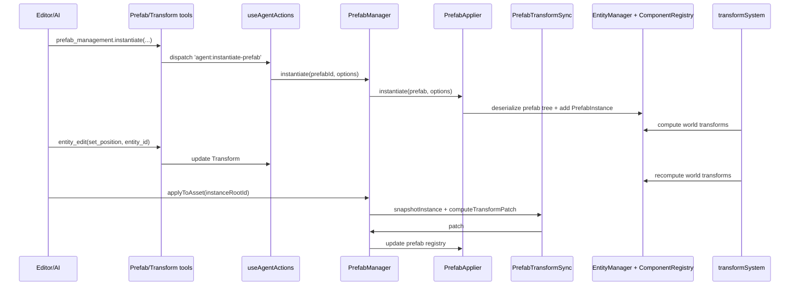

## Prefab Root & Child Transform Sync PRD

### 1. Overview

- **Context & Goals**
  - Guarantee that prefab roots and their children never drift apart by enforcing canonical transform ownership and propagation rules.
  - Align editor, AI, and runtime tooling with the industry-standard model: the prefab root handles world placement while children store local offsets.
  - Enable a consistent mental model for humans and the copilot: “move the prefab root → the entire hierarchy moves; edit a child → adjust only that local offset.”
  - Prevent ad-hoc delta propagation logic from creeping back in by centralizing transform sync invariants.
- **Current Pain Points**
  - Legacy prefab creation paths occasionally emit roots without `Transform`, leaving children world-positioned and desynchronized when the instance moves.
  - `applyToAsset` / `revertInstance` / `updateToVersion` flows manipulate transforms inconsistently, letting children jump between world and local references.
  - AI/editor tooling lacks a shared helper that promotes child edits up to the nearest prefab root, so intent is often ambiguous.
  - There is no living documentation or guardrail that keeps the prefab transform semantics unified across TypeScript and Rust layers.

### 2. Proposed Solution

- **High-level Summary**
  - Define a `PrefabTransformSync` layer that captures transform invariants, snapshots current instance transforms, and computes transform-only override patches.
  - Normalize prefab asset creation (selection-based and primitives) so every root entity gets a `Transform` and children are authored in local space.
  - Update instantiation, apply/revert, and version-update flows to preserve root placement while keeping child offsets local.
  - Teach AI/editor tools to prefer the prefab root for “move whole prefab” operations via a helper that walks up to the nearest `PrefabInstance`.
  - Back the invariant with tests and documentation so future changes cannot reintroduce drift.
- **Architecture & Directory Structure**

```text
docs/
  systems/
    prefab-transform-instance-prd.md        # Reference doc (existing)
    prefab-transform-sync-prd.md            # This document

src/core/
  prefabs/
    Prefab.types.ts                         # Prefab schema + instantiate options
    PrefabSerializer.ts                     # Serialize/deserialize prefab trees
    PrefabApplier.ts                        # Instantiate & lifecycle helpers
    PrefabOverrides.ts                      # Patch utilities
    PrefabTransformSync.ts                  # NEW: transform invariants + sync helpers

src/editor/hooks/
  useAgentActions.ts                        # Orchestration hook (existing)
  agent-actions/
    prefabHandlers.ts                       # Prefab create/instantiate/unpack handlers
    prefabFromPrimitivesHandler.ts          # Primitive prefab creation flow
    transformHandlers.ts                    # Transform component updates

src/editor/services/agent/tools/
  PrefabManagementTool.ts                   # prefab_management tool contract
  EntityEditTool.ts                         # entity_edit tool contract

rust/engine/crates/ecs-bridge/
  docs/PREFAB_SYSTEM_DESIGN.md              # Rust-side prefab semantics
```

### 3. Implementation Plan

#### Phase 1: Define Transform Sync Invariants (0.25 day)

1. Craft `PrefabTransformSync.ts` describing:
   - Prefab root must carry `Transform` + `PrefabInstance`.
   - Children store local transforms relative to their parent.
   - Asset root transforms represent model-space offsets.
2. Add runtime assertions in `PrefabApplier.instantiate` and `PrefabSerializer.createPrefabFromEntity` to detect missing root transforms (dev builds only).

#### Phase 2: Normalize Prefab Asset Authoring (0.75 day)

1. Ensure `prefabHandlers.ts` / `useAgentActions.ts`:
   - Default temporary containers to a `Transform` when selecting multiple entities.
   - Parent children before setting transforms so they remain local offsets.
2. Strengthen `prefabFromPrimitivesHandler.ts` to log or assert that every container has `Transform`.
3. Confirm `PrefabSerializer.serialize` writes child transforms as local data (no manual “world to local” conversions needed).

#### Phase 3: Improve Instance Apply/Revert Semantics (1.0 day)

1. Extend `PrefabApplier.applyToAsset` to:
   - Snapshot instance transforms via `PrefabTransformSync`.
   - Compute a transform-only override patch and merge it into the prefab definition.
   - Clear instance override metadata once the patch bakes into the asset.
2. Update `revertInstance` and `updateToVersion` to preserve root position/rotation/scale (not just position).
3. Document how transform patches interact with `PrefabOverrides` so future contributors avoid structural changes.

#### Phase 4: Editor & AI Tooling (0.5 day)

1. Add helper `findPrefabRoot(entityId: number)` that walks the parent chain to locate the closest `PrefabInstance`.
2. Update docs/prompts in `PrefabManagementTool.ts` and `EntityEditTool.ts` to emphasize moving prefab roots versus editing children.
3. Teach AI/autocompletion helpers to prefer root IDs for “move entire prefab” commands.

#### Phase 5: Testing & Validation (0.75 day)

1. Implement unit tests (`PrefabTransformSync.test.ts`) verifying patch computation and application for nested hierarchies.
2. Extend integration tests so that child edits + `applyToAsset` produce consistent behavior across new instances.
3. Add a shared JSON prefab test that ensures TypeScript and Rust instantiations yield matching root/child world positions.

### 4. File and Directory Structures

```text
/docs/systems/
  prefab-transform-instance-prd.md
  prefab-transform-sync-prd.md

/src/core/prefabs/
  Prefab.types.ts
  PrefabSerializer.ts
  PrefabApplier.ts
  PrefabOverrides.ts
  PrefabTransformSync.ts
  __tests__/
    PrefabTransformSync.test.ts

/src/editor/hooks/agent-actions/
  prefabHandlers.ts
  prefabFromPrimitivesHandler.ts
  transformHandlers.ts

/src/editor/services/agent/tools/
  PrefabManagementTool.ts
  EntityEditTool.ts

/rust/engine/crates/ecs-bridge/docs/
  PREFAB_SYSTEM_DESIGN.md
```

### 5. Technical Details

- **Transform Sync Invariants**

```ts
export interface IPrefabTransformSnapshot {
  rootId: number;
  prefabId: string;
  transforms: Record<
    number,
    {
      position: [number, number, number];
      rotation: [number, number, number];
      scale: [number, number, number];
    }
  >;
}
```

- **`PrefabTransformSync` helpers**

```ts
export const PrefabTransformSync = {
  snapshotInstance(instanceId: number): IPrefabTransformSnapshot {
    /* ... */
  },
  computeTransformPatch(
    basePrefab: IPrefabDefinition,
    snapshot: IPrefabTransformSnapshot,
  ): unknown {
    /* ... */
  },
  applyTransformPatch(prefab: IPrefabDefinition, patch: unknown): IPrefabDefinition {
    /* ... */
  },
};
```

- **Instance apply/revert flow**

  - `PrefabApplier.applyToAsset` snapshots current transforms, computes a patch via `PrefabTransformSync`, merges it using `PrefabOverrides.applyOverridePatch`, updates the registry, and clears override metadata.
  - `revertInstance`/`updateToVersion` keep `position`, `rotation`, and `scale` from the destroyed instance, reapplying them to the new root so the prefab does not jump in the scene.

#### 5.1 UI/API Integration

- **Prefab instantiation pipeline**

  1. `prefab_management.instantiate` → `agent:instantiate-prefab`.
  2. Hook builds `IInstantiateOptions` and calls `PrefabManager.instantiate`.
  3. `PrefabApplier.instantiate` ensures the root has a `Transform`, applies optional overrides, adds `PrefabInstance`.
  4. `transformSystem` continues to drive world transforms.

- **Prefab editing API**
  - `EntityEditTool` and `transformHandlers` update the `Transform` component via `entity_edit`.
  - `findPrefabRoot` helps callers choose the right entity ID when the intent is to move the entire prefab.
  - `PrefabTransformSync` drives patch generation when `applyToAsset` is triggered so that assets and instances stay aligned.

### 6. Usage Examples

1. **Moving a prefab instance**

```ts
await prefab_management({
  action: 'instantiate',
  prefab_id: 'tree',
  position: { x: 0, y: 0, z: 0 },
});

await entity_edit({
  entity_id: treeInstanceId, // prefab root discovered via findPrefabRoot
  action: 'set_position',
  position: { x: 10, y: 0, z: 0 },
});
```

2. **Editing a child local offset**

```ts
await entity_edit({
  entity_id: leavesEntityId,
  action: 'set_rotation',
  rotation: { x: 0, y: 15, z: 0 },
});

prefabManager.applyToAsset(treeInstanceRootId);
```

3. **Updating instance while keeping placement**

```ts
prefabManager.updateToVersion(buildingInstanceId);
```

### 7. Testing Strategy

- **Unit Tests**

  - `PrefabTransformSync` computes patches only for changed transforms.
  - Applying patches leaves hierarchy structure intact (no child removals/additions).

- **Integration Tests**
  - Prefab creation from selection/primitives always yields a root `Transform`.
  - Moving prefab roots updates all child world positions via `transformSystem`.
  - `applyToAsset` + instantiation produces consistent child offsets in new instances.
  - Rust and TypeScript instantiations of the same JSON prefab result in matching world positions within tolerance.

### 8. Edge Cases

| Edge Case                                                   | Remediation                                                                       |
| ----------------------------------------------------------- | --------------------------------------------------------------------------------- |
| Prefab root lacks `Transform` in legacy asset               | Patch on instantiate, log warning, and add migration guidance to docs             |
| Child transforms loaded as world space from saved scenes    | Normalize by re-saving assets via `PrefabTransformSync.applyTransformPatch`       |
| Instance edited before `PrefabInstance` component attached  | Guard `applyToAsset` to skip patching when no `PrefabInstance` exists             |
| Structural prefab change (children added/removed/reordered) | Skip transform patching when structure delta is detected; require manual review   |
| Nested prefab references (future feature)                   | Limit `PrefabTransformSync` to single prefab tree and document current constraint |

### 9. Sequence Diagram



### 10. Risks & Mitigations

| Risk                                                 | Mitigation                                                        |
| ---------------------------------------------------- | ----------------------------------------------------------------- |
| Transform patch introduces structural edits          | Limit patches to `Transform` properties; validate with Zod/guards |
| Override patch growth causes performance issues      | Keep patches minimal and snapshot only during apply/revert flows  |
| AI/editor move commands target child instead of root | Provide `findPrefabRoot`, train prompts to promote root IDs       |
| Rust and TypeScript semantics drift apart            | Share JSON tests + docs to keep both sides aligned                |

### 11. Timeline

- Phase 1 (Invariants): 0.25 day
- Phase 2 (Prefab authoring normalization): 0.75 day
- Phase 3 (Apply/revert semantics): 1.0 day
- Phase 4 (Editor/AI tooling): 0.5 day
- Phase 5 (Testing & validation): 0.75 day  
  **Total:** ~3.25 days

### 12. Acceptance Criteria

- Prefab roots always have `Transform` + `PrefabInstance`.
- Moving a prefab root always displaces children via `transformSystem`.
- Transform edits on children can be applied to assets without world/ local mismatches.
- `revertInstance`/`updateToVersion` preserve placement while staying consistent with prefab definition.
- Tests cover transform patches, integration flows, and cross-language parity.

### 13. Conclusion

Enforcing transform invariants through `PrefabTransformSync`, normalizing prefab creation, and tightening apply/revert semantics guarantees that prefab roots and children stay aligned, making prefab movement predictable for both humans and the copilot. This plan centers transform behavior in a single reusable layer, eliminating ad-hoc delta code and harmonizing TypeScript and Rust execution paths.

### 14. Assumptions & Dependencies

- `transformSystem.ts` remains the single source of truth for world transforms.
- `PrefabOverrides.ts` continues to provide JSON patch helpers.
- AI tools (`entity_edit`, `prefab_management`) stay as the primary automation surface and can accommodate minor prompt updates.
- Rust prefab instantiation will keep following the schema in `PREFAB_SYSTEM_DESIGN.md`, enabling shared validation tests.
