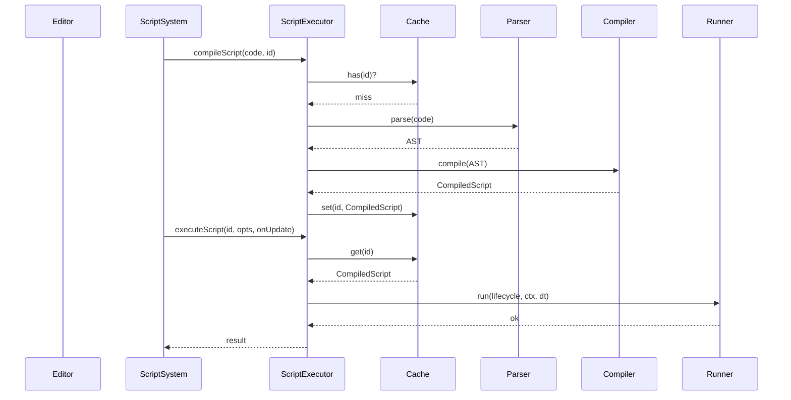

# Script Executor Refactor PRD

## Overview

- **Context & Goals**: Modernize the scripting pipeline to be secure, deterministic, and high‑performance without `eval`/`Function`. Improve developer ergonomics and observability. Ensure scalability across many entities.
- **Current Pain Points**: Brittle regex parsing, monolithic class violating SRP, noisy logging, limited performance due to repeated string matching per frame.

## Proposed Solution

- **High‑level Summary**:
  - Split responsibilities into Parser, Compiler, Runner, Cache, and ContextFactory (SRP/KISS).
  - Replace brittle regex with a token‑based lightweight parser to extract lifecycle blocks safely.
  - Precompile lifecycle bodies into optimized instruction lists to avoid per‑frame regex scans (perf/DRY).
  - Add pluggable operations registry (e.g., `entity.transform.setPosition`) to map to safe op codes.
  - Introduce bounded LRU cache with TTL for compiled scripts and contexts.
- **Architecture & Directory Structure**:
  ```
  src/core/lib/scripting/
  ├── parser/
  │   ├── IScriptAST.ts
  │   ├── LifecycleParser.ts
  │   └── Tokenizer.ts
  ├── compiler/
  │   ├── Opcode.ts
  │   ├── Instruction.ts
  │   └── ScriptCompiler.ts
  ├── runtime/
  │   ├── InstructionRunner.ts
  │   ├── OperationsRegistry.ts
  │   └── TimeMath.ts
  ├── cache/
  │   └── ScriptCache.ts
  ├── ScriptContextFactory.ts
  ├── ScriptExecutor.ts (facade)
  └── README.md
  ```

## Implementation Plan

- **Phase 1: Foundations (0.5 day)**
  1. Add directories and empty modules per above tree.
  2. Define interfaces for Parser, Compiler, Runner, Cache.
  3. Add debug flag via env/config.
- **Phase 2: Parser (0.75 day)**
  1. Implement `Tokenizer` (strings, parens, braces, comments).
  2. Implement `LifecycleParser` to extract `onStart/onUpdate/onDestroy/onEnable/onDisable` bodies.
  3. Output `IScriptAST` with lifecycle nodes and raw text.
- **Phase 3: Compiler (0.75 day)**
  1. Define opcodes for transform, rotation, translate, timers, logging, three.material color, simple math/time ops.
  2. Compile lifecycle raw text to `Instruction[]` using patterns mapped via registry (no `eval`).
  3. Include numeric expression pre‑eval helpers (deltaTime, constants).
- **Phase 4: Runner (0.5 day)**
  1. Implement `InstructionRunner` to execute instructions against `IScriptContext`.
  2. Ensure time/delta support only where applicable (onUpdate).
- **Phase 5: Cache & Facade (0.5 day)**
  1. Implement LRU with TTL and size bound.
  2. Refactor `ScriptExecutor` to use components, preserve public API.
- **Phase 6: Observability & Limits (0.25 day)**
  1. Structured logs gated by debug flag.
  2. Counters: compiled count, hit/miss, oldest age; optional perf hooks.
- **Phase 7: Migrations & Cleanup (0.25 day)**
  1. Remove direct regex scans from runtime.
  2. Keep legacy compatibility shims for `entity.position.x = ...`.

## File and Directory Structures

```
/src/core/lib/scripting/
├── parser/
│   ├── IScriptAST.ts
│   ├── LifecycleParser.ts
│   └── Tokenizer.ts
├── compiler/
│   ├── Opcode.ts
│   ├── Instruction.ts
│   └── ScriptCompiler.ts
├── runtime/
│   ├── InstructionRunner.ts
│   ├── OperationsRegistry.ts
│   └── TimeMath.ts
├── cache/
│   └── ScriptCache.ts
├── ScriptContextFactory.ts
├── ScriptExecutor.ts
└── README.md
```

## Technical Details

- `IScriptAST.ts`

```ts
export interface ILifecycleNode {
  name: 'onStart' | 'onUpdate' | 'onDestroy' | 'onEnable' | 'onDisable';
  body: string;
}
export interface IScriptAST {
  lifecycles: ILifecycleNode[];
}
```

- `Opcode.ts`

```ts
export enum Opcode {
  Log,
  SetPosition,
  SetRotation,
  Translate,
  Rotate,
  LegacySetPos,
  LegacyRotOp,
  SinusoidalAxis,
  DeltaRotAxis,
  SetMaterialColor,
}
```

- `Instruction.ts`

```ts
export interface IInstruction {
  op: Opcode;
  args: unknown[];
}
export interface ICompiledLifecycle {
  name: ILifecycleNode['name'];
  instructions: IInstruction[];
}
export interface ICompiledScript {
  lifecycles: Record<string, ICompiledLifecycle | undefined>;
}
```

- `ScriptCompiler.ts`

```ts
export interface IScriptCompiler {
  compile(ast: IScriptAST): ICompiledScript;
}
```

- `InstructionRunner.ts`

```ts
export interface IInstructionRunner {
  run(lifecycle: ICompiledLifecycle, ctx: IScriptContext, dt?: number): void;
}
```

- `ScriptCache.ts`

```ts
export interface IScriptCache {
  get(id: string): ICompiledScript | undefined;
  set(id: string, compiled: ICompiledScript): void;
  has(id: string): boolean;
  stats(): { size: number; oldestMs: number };
  clear(): void;
}
```

- `ScriptExecutor.ts` facade keeps API:

```ts
export interface IScriptExecutionResult {
  success: boolean;
  error?: string;
  executionTime: number;
  output?: unknown;
}
export interface IScriptExecutionOptions {
  entityId: EntityId;
  parameters?: Record<string, unknown>;
  timeInfo: ITimeAPI;
  inputInfo: IInputAPI;
  meshRef?: () => THREE.Object3D | null;
  sceneRef?: () => THREE.Scene | null;
  maxExecutionTime?: number;
}
```

## Usage Examples

- Compile then run onStart:

```ts
scriptExecutor.compileScript(userCode, scriptId);
scriptExecutor.executeScript(scriptId, opts, 'onStart');
```

- Per‑frame onUpdate:

```ts
scriptExecutor.executeScript(scriptId, { ...opts, timeInfo }, 'onUpdate');
```

- Clear on hot reload:

```ts
scriptExecutor.clearAll();
```

## Testing Strategy

- **Unit Tests**:
  - Parser extracts all lifecycle bodies with nested braces and comments.
  - Compiler maps known patterns to opcodes; ignores unknown safely.
  - Runner executes opcodes and updates transform/material state.
  - Cache hit/miss behavior and TTL eviction.
- **Integration Tests**:
  - `ScriptSystem` flow: compile on add, run onStart and onUpdate.
  - Error propagation to ECS component fields; metrics updated.

## Edge Cases

| Edge Case                 | Remediation                                          |
| ------------------------- | ---------------------------------------------------- |
| Empty script              | Compile to no‑op lifecycles                          |
| Unknown API call          | Ignore during compile; log debug once                |
| Malformed braces/comments | Parser fails gracefully; result.invalid with message |
| Very large scripts        | Bound compile time; limit instructions per lifecycle |
| deltaTime = 0             | Guard div; skip delta‑based ops if unsafe            |

## Sequence Diagram



## Risks & Mitigations

| Risk              | Mitigation                                      |
| ----------------- | ----------------------------------------------- |
| Parser complexity | Keep tokenizer minimal; lifecycle‑only scope    |
| Perf regressions  | Precompile to opcodes; LRU cache; batch compile |
| API breakage      | Preserve facade signature; add shims            |
| Debug noise       | Debug flag gates logs; structured logging       |

## Timeline

- Total: ~3.0 days
  - Phase 1: 0.5
  - Phase 2: 0.75
  - Phase 3: 0.75
  - Phase 4: 0.5
  - Phase 5: 0.5
  - Phase 6–7: 0.25

## Acceptance Criteria

- Public `ScriptExecutor` API unchanged for callers.
- Parser handles lifecycle extraction reliably without brittle regex.
- Per‑frame execution avoids regex scans; uses compiled instructions.
- Cache bounded by size and TTL with stats available.
- Legacy patterns still work via opcodes.
- Logs are quiet by default; verbose with debug flag.

## Conclusion

This refactor isolates concerns, improves reliability and performance, and enables future extensibility via opcodes/registry—meeting SRP/DRY/KISS while preserving the existing integration points.

## Assumptions & Dependencies

- Uses existing `IScriptContext` and Three.js bindings.
- No dynamic code execution (`eval`, `new Function`).
- TypeScript path aliases remain (named exports only).
- Zod remains preferred for any new schemas.
