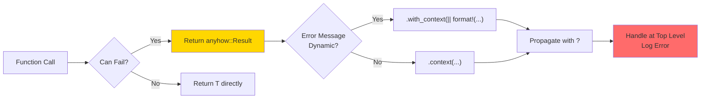
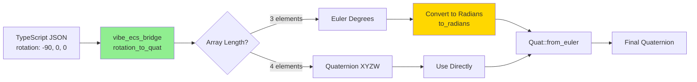
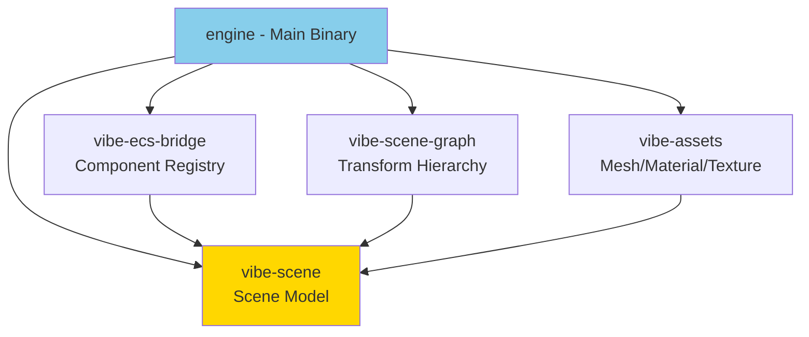
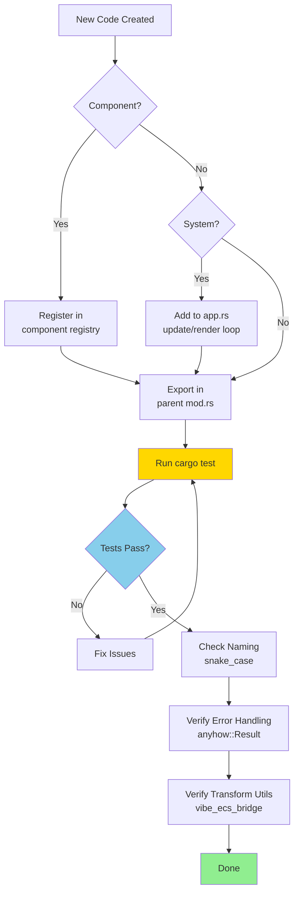

# Rust Engine Development Guidelines

## Overview

Native Rust engine that renders 3D scenes using three-d lib. This is NOT a read-only viewer - it replicates ALL functionality from the TypeScript/Three.js editor including full CRUD operations on entities, components, physics, and scene state.

## Design Goals

- **Full-Featured 3D**: Complete 3D rendering capabilities with PBR materials, lighting, shadows, and post-processing
- **Complete Editor Parity**: All TypeScript editor functionality (create, update, delete entities/components)
- **Approachable Yet Powerful**: Clean API for beginners, deep customization for advanced users
- **ECS Architecture**: Data-oriented design with Entity Component System for performance and flexibility
- **Composable Modules**: Use what you need, replace what you don't - workspace crates allow selective dependencies
- **Performance First**: Fast execution with parallel processing where possible, minimal allocations in hot paths
- **Fast Iteration**: Quick compile times via modular crates, incremental builds, and minimal dependencies

## Critical Rules

- Avoid dumping all code on threed_renderer.rs! Remember SRP principle!
- **snake_case** for variables/functions, **PascalCase** for types, **SCREAMING_SNAKE_CASE** for constants
- **ALWAYS use `vibe_ecs_bridge::transform_utils`** for rotation conversions - TypeScript stores rotations in DEGREES, Rust expects RADIANS
- No `console.*` - use structured logging via `log::*` macros
- No `unwrap()` in production - use `anyhow::Result` with `.context()`
- Document discoveries in nested folder CLAUDE.md files
- Run `cargo fmt` and `cargo clippy` before committing

## ⚠️ CRITICAL: Pre-Commit Verification

**ALWAYS run these checks before considering work complete:**

```bash
# 1. Verify compilation (must pass without errors)
cargo build --bin vibe-engine

# 2. Run all tests (must pass)
cargo test --lib

# 3. Format and lint
cargo fmt && cargo clippy
```

**Why this matters**: Borrow checker errors, type mismatches, and logic bugs only surface at compile/test time. Catching them early prevents wasted time and broken builds. No work is complete until these checks pass.

## Code Organization (SRP, DRY, KISS, YAGNI)

**Single Responsibility**: One clear responsibility per module/struct/function

- Keep files under 500 lines, functions under 50 lines
- Extract helpers when complexity grows
- Use composition over inheritance

**Don't Repeat Yourself**: Extract common patterns

- Create utility modules for repeated patterns (coordinate conversion, transform utils)
- Use `const` for magic numbers
- Refactor instead of copy-paste

**Keep It Simple**: Clear solutions over clever ones

- Prefer clear delegation over deep nesting (max 3-4 levels)
- Break complex functions into named helpers
- Clear variable names > comments explaining unclear names

**You Aren't Gonna Need It**: Implement when needed, not "just in case"

- Add features when required, not for hypothetical use cases
- Trust that refactoring is easier than maintaining unused code

## Project Structure

```
rust/
├── engine/              # Main rendering engine (binary crate)
│   ├── src/
│   │   ├── main.rs      # CLI entrypoint
│   │   ├── app.rs       # Application lifecycle
│   │   ├── renderer/    # Modular rendering (material_manager, mesh_loader, etc.)
│   │   └── ...
│   └── crates/          # Workspace crates
│       ├── scene/       # Core scene model (EntityId, Scene, Entity)
│       ├── ecs-bridge/  # Component registry & TS integration
│       ├── scene-graph/ # Parent/child transform hierarchy
│       ├── scripting/   # Lua scripting runtime & APIs
│       └── assets/      # Mesh/material/texture caches & GLTF
└── game/
    ├── scenes/          # JSON scene files
    ├── scripts/         # Production Lua scripts (attached to entities)
    │   └── tests/       # Test/example scripts (NOT for production scenes)
    └── schema/          # TypeScript → Rust schema exports
```

## Script Organization

**IMPORTANT**: Separate test scripts from production scripts:

- **`rust/game/scripts/`** - Production scripts attached to entities in scenes

  - Example: `player-controller.lua`, `enemy-ai.lua`, `door-trigger.lua`

- **`rust/game/scripts/tests/`** - Test and example scripts for API validation
  - Example: `input_test.lua`, `cube_mover.lua`, `action_system_test.lua`
  - These demonstrate API usage but aren't meant for production scenes

**Rule**: When creating test scripts to validate new APIs or features, ALWAYS place them in `scripts/tests/` to keep the production script directory clean.

## Error Handling



```rust
use anyhow::{Context, Result};

fn load_scene(path: &Path) -> Result<SceneData> {
    let json = std::fs::read_to_string(path)
        .with_context(|| format!("Failed to read scene: {}", path.display()))?;
    serde_json::from_str(&json).context("Failed to parse scene JSON")
}
```

**Rules:**

- Use `anyhow::Result<T>` for public functions
- Use `.context()` for static messages, `.with_context(|| format!(...))` for dynamic
- Log errors at point they're handled, not where created

## Transform Coordinate System - CRITICAL

### The Degrees vs Radians Bug

TypeScript stores rotation as Euler angles in **DEGREES**, Rust math libraries expect **RADIANS**.



**ALWAYS use standardized utilities from `vibe_ecs_bridge::transform_utils`:**

```rust
use vibe_ecs_bridge::{rotation_to_quat_opt, position_to_vec3_opt, scale_to_vec3_opt};

// ✅ CORRECT
let position = position_to_vec3_opt(transform.position.as_ref());
let rotation = rotation_to_quat_opt(transform.rotation.as_ref()); // Handles degrees → radians
let scale = scale_to_vec3_opt(transform.scale.as_ref());

// ❌ WRONG - manual conversion causes bugs
let rotation = Quat::from_euler(glam::EulerRot::XYZ, -90.0, 0.0, 0.0); // Treats as radians!
```

**Why This Matters**: A plane with rotation `[-90, 0, 0]` degrees:

- ✅ Correct: `-90°` → `-π/2 radians` → horizontal floor
- ❌ Wrong: `-90` as radians → `-5156°` rotation → slanted ramp (physics objects slide!)

**Coordinate System:**

- Right-handed, Y-up, +Z forward, +X right (matches Three.js)
- XYZ Euler order by default

## TypeScript Integration

### JSON Schema Compatibility

Match TypeScript naming exactly - use camelCase for JSON fields:

```rust
#[derive(Deserialize)]
pub struct MeshRenderer {
    #[serde(default)]
    pub meshId: Option<String>,    // matches TS: meshId?: string
    #[serde(default)]
    pub materialId: Option<String>,
}
```

### Vec3/Vec2 Format Handling

TypeScript may export vectors as arrays OR objects. Use custom deserializers:

```rust
// Handles both: [0, 5, -10] and {"x": 0, "y": 5, "z": -10}
fn deserialize_optional_vec3<'de, D>(deserializer: D) -> Result<Option<[f32; 3]>, D::Error>
where D: Deserializer<'de> {
    #[derive(Deserialize)]
    #[serde(untagged)]
    enum Vec3Format {
        Array([f32; 3]),
        Object(Vec3Object),
    }
    // ... implementation
}
```

### Scene Validation

```bash
yarn validate:scene rust/game/scenes/testphysics.json
```

Validates rotation format, camera fields, component structure, material references.

## Testing

**Requirements:**

- EVERY public function must have tests
- Use descriptive names: `test_camera_fov_affects_projection` not `test1`
- Test edge cases and error paths

**File Organization:**

- Tests in separate files: `module_name_test.rs` (NOT inline with `#[cfg(test)]` in the same file)
- Test files use `#[cfg(test)] mod tests { use super::super::module_name::*; }`
- Place test files alongside their implementation files

Example structure:

```
src/apis/
├── math_api.rs         # Implementation only
└── math_api_test.rs    # Tests only
```

**Test File Template:**

```rust
// math_api_test.rs
#[cfg(test)]
mod tests {
    use super::super::math_api::*;  // Import from parent's sibling module

    #[test]
    fn test_transform_degrees_to_radians() {
        let rotation = rotation_to_quat(&[90.0, 0.0, 0.0]);
        let expected = Quat::from_euler(glam::EulerRot::XYZ, 90.0_f32.to_radians(), 0.0, 0.0);
        assert!((rotation.x - expected.x).abs() < 0.001);
    }
}
```

## Performance Guidelines

- **Prefer borrowing over cloning**: Use `&T` when you don't need ownership
- **Batch allocations**: Pre-allocate `Vec` capacity when size known
- **Reuse GPU buffers**: Don't recreate every frame
- **Cache resources**: Store uploaded meshes, don't re-upload
- **Batch draw calls**: Group by mesh/material to minimize state changes

## Architecture Patterns

### Components are Data-Only

```rust
#[derive(Debug, Deserialize, Clone)]
pub struct Transform {
    #[serde(default)]
    pub position: Option<[f32; 3]>,
    #[serde(default)]
    pub rotation: Option<Vec<f32>>,  // 3-elem (Euler degrees) or 4-elem (quat)
    #[serde(default)]
    pub scale: Option<[f32; 3]>,
}
```

### Always Implement Default

```rust
impl Default for MeshCache {
    fn default() -> Self {
        Self::new()
    }
}
```

## Workspace Crates



- **vibe-scene**: Core scene model (EntityId, Scene, Entity, ComponentKindId)
- **vibe-ecs-bridge**: Component registry & decoders for Three.js ECS integration
- **vibe-scene-graph**: Parent/child transform hierarchy & world transform propagation
- **vibe-assets**: Mesh/material/texture caches & GLTF loading

**Principles:**

- Single responsibility per crate
- Minimal dependencies, acyclic dependency graph
- Feature flags for optional dependencies (e.g., `gltf-support`)
- Comprehensive tests for all public functions

## Debugging

```bash
# Show logs and backtrace
RUST_BACKTRACE=1 RUST_LOG=debug cargo run -- --scene Test

# Run specific tests
cargo test transform_utils

# GPU validation (catches GPU errors)
# Set in code: wgpu::InstanceFlags::DEBUG | wgpu::InstanceFlags::VALIDATION
```

## Post-Implementation Verification



After creating new code, verify:

- [ ] New components registered in component registry?
- [ ] New systems called in app.rs update/render loop?
- [ ] New modules exported in parent mod.rs?
- [ ] All tests passing? (`cargo test`)
- [ ] Code follows snake_case naming?
- [ ] Error handling uses anyhow::Result with context?
- [ ] Transform conversions use `vibe_ecs_bridge::transform_utils`?

## Common Gotchas

- **Surface must outlive device**: Create surface before device
- **Arrays vs Tuples**: `[f32; 3]` requires array in JSON `[1, 2, 3]`
- **glam uses column-major matrices**: Matches GLSL/WGSL
- **Quaternions are XYZW**: Match the JSON format

## Resources

- [Rust API Guidelines](https://rust-lang.github.io/api-guidelines/)
- Check `README.md` for quickstart
- Check `INTEGRATION_AUDIT.md` for TS ↔ Rust integration status
- Check `ECS_PARITY_GUIDELINES.md` for component parity standards
