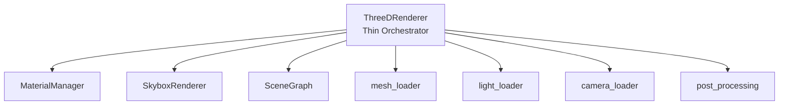
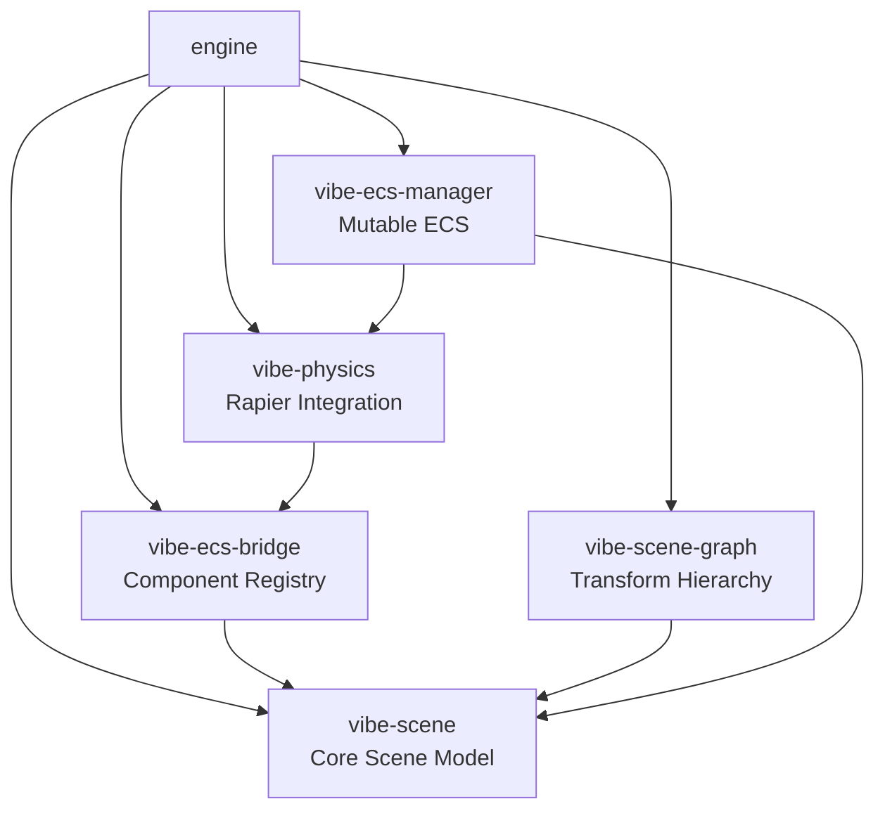

# Vibe Coder Engine Architecture

Native Rust renderer bridging TypeScript editor with GPU via three-d.

## Renderer Architecture - SRP Enforcement



**Rule**: `threed_renderer.rs` must ONLY orchestrate. New logic → extract to module.

### Refactoring Checklist

Before adding to `threed_renderer.rs`:

- [ ] Is this pure orchestration? (just calling other modules)
- [ ] Could this be a function in an existing module?
- [ ] Would this add >20 lines?

If ANY is NO → **Extract to module!**

**Hard Limits**:

- File: 700 lines max
- Method: 50 lines max
- New state fields: Create manager struct instead

## Mutable ECS - Command Buffer Pattern

Runtime entity CRUD via `vibe-ecs-manager`:

```rust
// Queue commands (returns EntityId immediately)
let id = manager.create_entity()
    .with_name("Enemy")
    .with_position([0.0, 5.0, 0.0])
    .with_component("RigidBody", json!({...}))
    .build();

// Apply at frame end (atomic)
manager.apply_pending_commands()?;
```

Lua API: `GameObject.create()`, `.destroy()`, `.setPosition()`, etc.

**See**: `/rust/engine/crates/ecs-manager/CLAUDE.md`

## Workspace Crates



**Principle**: Acyclic dependencies, minimal cross-crate coupling, stable APIs.

## Critical: Transform Conventions

**TypeScript stores rotation in DEGREES, Rust expects RADIANS.**

✅ **ALWAYS** use `vibe_ecs_bridge::transform_utils`:

```rust
use vibe_ecs_bridge::{rotation_to_quat_opt, position_to_vec3_opt, scale_to_vec3_opt};
let rotation = rotation_to_quat_opt(transform.rotation.as_ref());
```

❌ **NEVER** manually convert - easy to forget and causes physics bugs.

**See**: `/rust/engine/crates/ecs-bridge/CLAUDE.md`

## Testing Requirements

All modules need `*_test.rs` files (separate, not inline `#[cfg(test)]`).

```bash
cargo test --lib  # Must pass before commit
```

## Related Docs

- `/rust/CLAUDE.md` - General Rust guidelines
- `/rust/engine/INTEGRATION_AUDIT.md` - TS/Rust parity
- Nested `CLAUDE.md` in each folder - Module-specific notes
