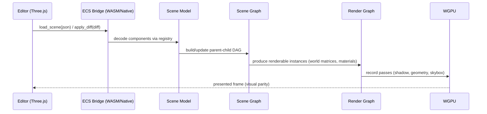

# Rust Engine ↔ Three.js ECS Integration Architecture Plan

## Overview

- **Context & Goals**

  - Align the Rust renderer with the editor’s Three.js ECS so scenes render identically and changes are easy to port.
  - Provide a stable, extensible architecture to add features (GLTF, textures, shadows, hierarchy, physics) with minimal cross-cutting changes.
  - Support both offline scene loading (JSON) and future live-sync (diffs) via WASM/native bridges.
  - Establish strong test guarantees so refactors are safe and parity with Three.js is maintained.

- **Current Pain Points**
  - Rendering and scene loading are tightly coupled; feature additions cross module boundaries.
  - Component parsing relies on ad-hoc JSON `Value` and type lookups, complicating evolution.
  - No explicit scene graph/hierarchy; transform propagation is manual/missing.
  - No standardized bridge for live updates from the editor; only batch JSON loading.

## Proposed Solution

- **High‑level Summary**

  - Introduce clear layering: Scene Model → Bridge (offline/live) → Scene Graph → Render Graph → Passes.
  - Create a component registry with typed decoders and capability flags to map Three.js ECS to Rust types.
  - Add a dedicated scene graph builder for parent/child transforms and stable entity indices.
  - Refactor rendering into a simple render graph with nodes (geometry, skybox, shadows, post) and resource bindings.
  - Provide a live bridge (WASM/native) that applies ECS diffs to the runtime scene safely.

- **Architecture & Directory Structure**

```
rust/
└── engine/                      # Binary crate (runtime host)
    ├── src/
    │   ├── app.rs               # Window + event loop (winit)
    │   ├── io/loader.rs         # Offline scene loader (JSON)
    │   ├── ecs/                 # (Keep) component types + scene serde
    │   └── render/              # (Keep) wgpu pipeline + passes
    └── crates/                  # New internal workspace crates (incremental extraction)
        ├── scene/               # Typed scene model (serde), stable IDs, queries
        ├── scene-graph/         # Parent/child DAG, transform propagation, queries
        ├── ecs-bridge/          # Component registry, decoders, diff/apply, versioning
        ├── assets/              # Mesh/Texture/Material caches, async loaders (GLTF, images)
        ├── render-core/         # Device, swapchain, common GPU resources
        ├── render-graph/        # Pass graph, resources, scheduling (shadows, skybox, main)
        ├── passes/              # Geometry, Shadow, Skybox, PostFX passes (wgpu pipelines)
        ├── wasm-bridge/         # wasm_bindgen API for live edits (optional)
        └── test-scenes/         # Golden JSON scenes + utilities for integration tests
```

## Implementation Plan

1. Phase 1: Foundations (0.5 day)

   1. Create cargo workspace under `rust/engine/crates` and add `scene`, `ecs-bridge` skeletons.
   2. Move `ecs/scene.rs` types into `crates/scene` (preserve serde format). Re-export in engine for compatibility.
   3. Introduce stable `EntityId` and `ComponentKindId` types.

2. Phase 2: Component Registry (0.5 day)

   1. Add `IComponentDecoder` trait with `can_decode(kind)`, `decode(value)`, `capabilities()`.
   2. Implement decoders for Transform, Camera, Light, MeshRenderer, Material refs.
   3. Replace ad-hoc `get_component<T>` calls with registry-backed typed extraction.

3. Phase 3: Scene Graph (1 day)

   1. Add `scene-graph` crate with DAG builder from `parentPersistentId`.
   2. Implement transform propagation (local → world) with lazy invalidation.
   3. Provide queries for renderable instances (mesh + material + world matrix).

4. Phase 4: Render Graph (1 day)

   1. Introduce `render-graph` crate with nodes and resources (color, depth, shadow maps).
   2. Extract current pipeline into `passes/geometry` node using instance buffer + materials.
   3. Add `render-core` abstractions for device, bind layouts, common uniforms.

5. Phase 5: Assets (1 day)

   1. Move `MaterialCache`, `MeshCache` to `crates/assets`; add `TextureCache`.
   2. Add GLTF loader (meshes) and image loading (albedo initially) with caching.
   3. Uniformly address assets via URIs; async preload with fallbacks.

6. Phase 6: Live Bridge (WASM/native) (1 day)

   1. Add `wasm-bridge` crate with `apply_diff(json)` and `load_scene(json)` functions.
   2. Define `SceneDiff` format (add/update/remove components/entities) and integrate with registry.
   3. Provide native IPC (file/socket) adapter for non-WASM live preview.

7. Phase 7: Lighting & Shadows (1 day)

   1. Add spot lights to uniforms/shader; extend registry mappings.
   2. Implement shadow map pass node; respect `castShadows`/`receiveShadows`.
   3. Wire light uniforms via `render-graph` resources.

8. Phase 8: Textures & Materials (1 day)

   1. Support albedo textures; extend to normal/metallic/roughness/emissive.
   2. Update materials to prefer textures over scalar properties when provided.
   3. Expand shaders and bind groups; retain PBR structure.

9. Phase 9: Testing & Tooling (0.5 day)
   1. Create `test-scenes` harness and golden scenes from editor exports.
   2. Add parity tests for matrices, lights, materials, and instance extraction.
   3. Document extension points and component capability table.

## File and Directory Structures

```markdown
/rust/engine/
├── Cargo.toml
├── src/
│ ├── app.rs
│ ├── io/loader.rs
│ ├── ecs/ (legacy; migrate gradually)
│ └── render/
└── crates/
├── scene/
│ ├── src/lib.rs
│ └── Cargo.toml
├── scene-graph/
│ ├── src/lib.rs
│ └── Cargo.toml
├── ecs-bridge/
│ ├── src/lib.rs
│ └── Cargo.toml
├── assets/
│ ├── src/{mesh_cache.rs,material.rs,texture.rs,loader.rs}
│ └── Cargo.toml
├── render-core/
│ ├── src/{device.rs,buffers.rs,uniforms.rs}
│ └── Cargo.toml
├── render-graph/
│ ├── src/{graph.rs,resources.rs}
│ └── Cargo.toml
├── passes/
│ ├── src/{geometry.rs,shadow.rs,skybox.rs,post.rs}
│ └── Cargo.toml
├── wasm-bridge/ (optional)
│ ├── src/lib.rs
│ └── Cargo.toml
└── test-scenes/
├── src/lib.rs
├── scenes/\*.json
└── Cargo.toml
```

## Technical Details

- `ecs-bridge` interfaces

```rust
pub struct ComponentCapabilities {
    pub affects_rendering: bool,
    pub requires_pass: &'static str, // e.g., "shadow", "geometry"
    pub stable: bool,                // compatibility guarantee level
}

pub trait IComponentDecoder {
    fn can_decode(&self, kind: &str) -> bool;
    fn decode(&self, value: &serde_json::Value) -> anyhow::Result<Box<dyn std::any::Any>>;
    fn capabilities(&self) -> ComponentCapabilities;
}

pub struct ComponentRegistry {
    decoders: Vec<Box<dyn IComponentDecoder + Send + Sync>>,
}

impl ComponentRegistry {
    pub fn register<D: IComponentDecoder + Send + Sync + 'static>(&mut self, d: D) { /* ... */ }
    pub fn decode(&self, kind: &str, v: &serde_json::Value) -> anyhow::Result<Box<dyn std::any::Any>> { /* ... */ }
}
```

- `scene` types (stable IDs)

```rust
#[derive(Clone, Copy, Debug, PartialEq, Eq, Hash)]
pub struct EntityId(u64);

#[derive(Clone, Debug)]
pub struct Scene {
    pub entities: Vec<Entity>,
    // materials, assets, metadata...
}
```

- `scene-graph` world transforms

```rust
pub struct SceneGraph {
    pub parent_of: Vec<Option<EntityId>>, // index by EntityId
    pub world_matrix: Vec<glam::Mat4>,
}

impl SceneGraph {
    pub fn build(scene: &scene::Scene) -> Self { /* ... */ }
    pub fn update_transform(&mut self, id: EntityId, local: glam::Mat4) { /* lazy invalidate */ }
}
```

- `render-graph` nodes

```rust
pub trait RenderNode {
    fn inputs(&self) -> &[&'static str];
    fn outputs(&self) -> &[&'static str];
    fn execute(&mut self, ctx: &mut GraphContext) -> anyhow::Result<()>;
}

pub struct GraphContext {/* device, queues, resources, frame data */}
```

- `wasm-bridge` API

```rust
// #[wasm_bindgen]
pub fn load_scene(json: &str) -> Result<(), JsValue> { /* ... */ }

// #[wasm_bindgen]
pub fn apply_diff(diff_json: &str) -> Result<(), JsValue> { /* ... */ }
```

## Usage Examples

- Registering component decoders

```rust
let mut registry = ComponentRegistry { decoders: vec![] };
registry.register(TransformDecoder::new());
registry.register(MeshRendererDecoder::new());
registry.register(CameraDecoder::new());
registry.register(LightDecoder::new());
```

- Building scene graph and extracting instances

```rust
let scene = scene_loader.load_from_json(json_str)?;
let mut graph = SceneGraph::build(&scene);
let instances = graph.iter_renderables(&scene)?; // (world_matrix, mesh_ref, material_ref)
```

- Executing render graph

```rust
let mut graph = RenderGraph::new()
    .add_node(SkyboxPass::default())
    .add_node(ShadowPass::default())
    .add_node(GeometryPass::default());

graph.execute(&mut ctx)?;
```

## Testing Strategy

- **Unit Tests**

  - Component decoders: field mapping, defaults, error cases.
  - Scene graph: parent/child propagation, updates, cycles rejection.
  - Materials: color conversion, texture overrides.

- **Integration Tests**
  - Golden scenes: camera matrices, lights, instance extraction identical to reference JSON.
  - Render graph resource wiring: depth, color, shadow maps created and consumed.
  - Live diffs: add/remove component, transform updates applied without panics.

## Edge Cases

| Edge Case                    | Remediation                                                            |
| ---------------------------- | ---------------------------------------------------------------------- |
| Missing component fields     | Apply defaults via decoder; emit structured warning.                   |
| Unknown component types      | Registry ignores with telemetry; mark unsupported capability.          |
| Hierarchy cycles             | Detect in builder; reject and log error linking to entities.           |
| Asset not found              | Use placeholder mesh/texture; enqueue async load; retry on next frame. |
| Large scenes (10k+)          | Batch instance buffer updates; streaming uploads; per-mesh batching.   |
| Diff conflicts (stale order) | Version diffs and apply via sequence numbers; skip stale.              |

## Sequence Diagram



## Risks & Mitigations

| Risk                          | Mitigation                                                             |
| ----------------------------- | ---------------------------------------------------------------------- |
| Over‑engineering render graph | Start minimal (linear nodes), evolve to DAG if needed.                 |
| Decoder churn with TS changes | Generate JSON schema from Zod; verify in CI; version capability table. |
| Performance regressions       | Keep per-frame allocs zero; reuse buffers; add benches.                |
| WASM interop complexity       | Keep bridge optional; provide native file/socket mode first.           |
| Shadow map complexity         | Isolate in pass; gate behind feature flag until stable.                |

## Timeline

- Total: ~6.5–7.5 days
  - Phase 1–2: 1 day
  - Phase 3: 1 day
  - Phase 4: 1 day
  - Phase 5: 1 day
  - Phase 6: 1 day
  - Phase 7: 1 day
  - Phase 8–9: 0.5–1.5 days (overlap with feature work)

## Acceptance Criteria

- Scene loads via registry with typed decoders; unknown components do not crash.
- Scene graph builds parent/child transforms; world matrices verified by tests.
- Render graph executes geometry pass using instance buffer; depth test enabled.
- GLTF loading works for `modelPath`; textures (albedo) render correctly.
- Live diffs can add/update/remove components without restart (in WASM/native).
- Parity tests pass for camera, lights, materials, and transforms.

## Conclusion

This architecture modularizes scene ingestion, transformation, and rendering to make parity work and future reimplementations straightforward. Decoders and graph layers isolate concerns, while the render graph provides clear extension points for shadows, skybox, and post‑processing.

## Assumptions & Dependencies

- Uses `wgpu` for rendering; `gltf` crate for models; `image` or `wgpu_texture` for textures.
- Optional `wasm_bindgen` for live bridge; native adapter via file/socket for desktop.
- Editor exports validated via Zod; JSON schema versioned; CI checks schema compatibility.
- Follow workspace rules: SRP/DRY/KISS; small components; logic in hooks (TS); favor Zod; interfaces prefixed with `I` on the TS side.
