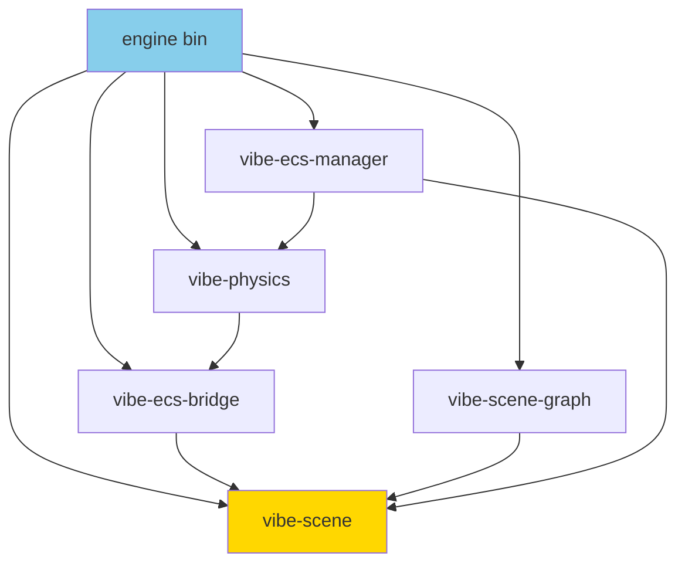

# Engine Crates

Internal workspace crates for modular architecture.

## Crate Dependency Graph



## Implemented

- **vibe-scene** - Core types: EntityId, Scene, Entity, ComponentKindId
- **vibe-ecs-bridge** - Component registry, decoders, **transform_utils** (degrees→radians)
- **vibe-scene-graph** - Parent/child DAG, transform propagation, renderable extraction
- **vibe-physics** - Rapier integration, scene population
- **vibe-ecs-manager** - Command buffer pattern for runtime entity CRUD

## Planned

- **vibe-assets** - Mesh/texture/material caches, GLTF
- **render-core** - Device, buffers, GPU resources
- **render-graph** - Pass graph, resource scheduling

## Principles

- **Single Responsibility** per crate
- **Acyclic Dependencies** (scene has no deps, ecs-bridge depends only on scene, etc.)
- **Stable APIs** - minimize breaking changes
- **Test Coverage** - all public functions

**Usage**: Add to `engine/Cargo.toml`:

```toml
vibe-scene = { path = "crates/scene" }
```
